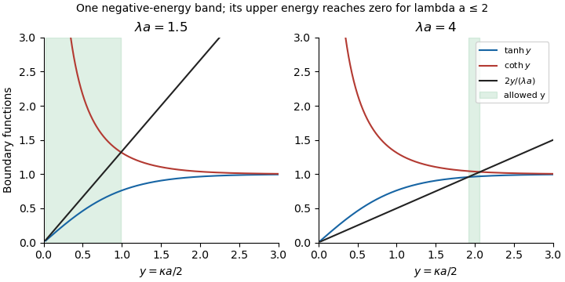

<h1 id="32a/solution">Solution</h1>

↑ **Parent:** [32A](../32a.md)

Use the state vector $(\psi,\psi')^T$ immediately to the right of a delta well. Free propagation to the next well and the derivative jump there are

$$
P=\begin{pmatrix}\cosh\kappa a&\sinh\kappa a/\kappa\\\kappa\sinh\kappa a&\cosh\kappa a\end{pmatrix},\qquad D=\begin{pmatrix}1&0\\-2\lambda&1\end{pmatrix}.
$$

Thus **the Floquet matrix in this convention is**

$$
\boxed{M=DP=\begin{pmatrix}C&S/\kappa\\\kappa S-2\lambda C&C-2\lambda S/\kappa\end{pmatrix},\quad C=\cosh\kappa a,\ S=\sinh\kappa a.}
$$

Choosing the state on the other side of each well conjugates the matrix and leaves its eigenvalues unchanged.

The [Bloch theorem](../../../../../bloch-s-theorem.md) requires a real quasimomentum $q$ with a Floquet eigenvalue $e^{iqa}$. Since $\det M=1$, this occurs exactly when

$$
\left|\frac12\operatorname{tr}M\right|=\left|\cosh\kappa a-\frac\lambda\kappa\sinh\kappa a\right|\leq1.
$$

Dividing the two inequalities by the positive $\sinh\kappa a$ gives

$$
\boxed{\tanh y\leq\frac{2y}{\lambda a}\leq\coth y,\qquad y=\kappa a/2.}
$$

The upper boundary in $y$ is the unique intersection of the increasing line with the strictly decreasing $\coth y$, which runs from infinity to $1$. Call it $y_-$. The concave function $\tanh y$ starts with slope $1$ and approaches $1$. If $\lambda a\leq2$, the line has slope at least $1$ and stays above it for every $y>0$, so allowed $y$ run from $0$ to $y_-$. If $\lambda a>2$, there is exactly one positive crossing $y_+$ with $\tanh y$; below it the line is inadmissible, and above it the line stays above $\tanh y$. Because $\coth y>\tanh y$, $y_+<y_-$. This establishes the [negative-energy band of an attractive delta comb](../../../../../negative-energy-band-of-an-attractive-delta-comb.md): **there is exactly one negative-energy band**:

$$
\boxed{\begin{cases}E_-\leq E<0,&0<\lambda a\leq2,\\E_-\leq E\leq E_+<0,&\lambda a>2,\end{cases}}
$$

where $E_\pm=-\hbar^2(2y_\pm/a)^2/(2m)$, without needing to evaluate the roots.

**[Figure 2](#32a/image-negative-energy-band-boundaries-from-tanh-and-coth-intersections-below-and-above-lambda-a-equal-to-two). Negative-energy band boundaries from tanh and coth intersections, below and above lambda a equal to two**.

As $a\to\infty$ with $\lambda$ fixed, both positive boundary values of $\kappa$ tend to $\lambda$. The band collapses to the isolated delta-well bound state **$\boxed{E=-\hbar^2\lambda^2/(2m)}$**, as tunnelling between widely separated wells disappears.

## ↑ Ancestors (10)

1. [32A](../32a.md)
2. [Paper 3](../../paper-3-split.md)
3. [Ii](../../split.md)
4. [2015](../../../split.md)
5. [Past exam of the mathematics course of the University of Cambridge](../../../../split.md)
6. [Mathematics course of the University of Cambridge](../../../../../mathematics-course-of-the-university-of-cambridge.md)
7. [Course of the University of Cambridge](../../../../../course-of-the-university-of-cambridge.md)
8. [University of Cambridge](../../../../../university-of-cambridge-split.md)
9. [List of universities](../../../../../list-of-universities.md)
10. [Codex Wiki](../../../../../split.md)
