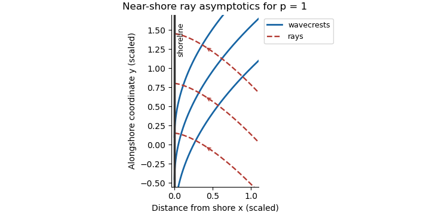

<h1 id="37b/solution">Solution</h1>

↑ **Parent:** [37B](../37b.md)

For the local phase $S$, define $k_i=\partial_iS$ and $\omega=-\partial_tS$. The [dispersion relation](../../../../../dispersion-relation.md) is the [Hamilton-Jacobi equation](../../../../../hamilton-jacobi-equation.md) $S_t+\Omega(\nabla S,\mathbf x,t)=0$. Differentiate it in space and follow a ray with [group velocity](../../../../../group-velocity.md) $\dot x_i=\Omega_{k_i}$; symmetry of the phase Hessian cancels the terms involving $\partial_i k_j$. Thus **the ray-tracing equations are**

$$
\boxed{\frac{dx_i}{dt}=\Omega_{k_i},\qquad\frac{dk_i}{dt}=-\Omega_{x_i},\qquad\frac{d\omega}{dt}=\Omega_t.}
$$

Here $d/dt=\partial_t+\dot{\mathbf x}\cdot\nabla$ means differentiation along the moving ray; subscripts on $\Omega$ mean partial derivatives holding its other independent arguments fixed.

The depth is stationary and independent of $y$, so $\omega=\omega_\infty$ and $l$ are constant. Choose the incident direction with positive $l$; the other sign reflects the picture. In the far deep water,

$$
\kappa_\infty=\omega_\infty^2/g,\qquad l=\kappa_\infty\sin\theta_\infty,\qquad k_\infty=-\kappa_\infty\cos\theta_\infty.
$$

Since $\Omega$ depends isotropically on the horizontal wavevector, the group-velocity ratio is $l/k$. Therefore **the ray equation is**

$$
\boxed{\frac{dy}{dx}=\frac lk,\qquad k=-\sqrt{\kappa(x)^2-l^2},\qquad \omega_\infty^2=g\kappa\tanh(\kappa\alpha x^p).}
$$

Near shore, $\kappa h\to0$, so the [shallow-water dispersion relation](../../../../../shallow-water-dispersion-relation.md) gives $\kappa\sim\omega_\infty/(\sqrt{g\alpha}\,x^{p/2})$ and $k\sim-\kappa$. Integrating the ray slope yields

$$
\boxed{q=1+\frac p2,\qquad A=-\frac{l\sqrt{g\alpha}}{\omega_\infty(1+p/2)}=-\frac{\omega_\infty\sqrt{\alpha/g}\sin\theta_\infty}{1+p/2}.}
$$

For $p<2$, the near-shore phase is $S\sim ly-\omega_\infty t-\omega_\infty x^{1-p/2}/[\sqrt{g\alpha}(1-p/2)]$. A constant-phase [wave crest](../../../../../wave-crest.md) thus has

$$
y-y_c\sim\frac{\omega_\infty}{l\sqrt{g\alpha}(1-p/2)}x^{1-p/2}.
$$

Its tangent becomes parallel to the shoreline, while rays approach perpendicular to it. The exponent is between zero and one, giving the curved crests sketched below for $p=1$.

**[Figure 3](#37b/image-near-shore-wavecrests-bending-parallel-to-the-beach-and-rays-approaching-normally-for-a-depth-proportional-to-x). Near-shore wavecrests bending parallel to the beach and rays approaching normally, for a depth proportional to x**.

These are the formal [geometrical optics](../../../../../geometrical-optics.md) asymptotics. For fixed $\alpha$ and $p<2$, $\kappa x\to0$ arbitrarily close to the shore, so the slowly varying wave approximation eventually fails there; the sketch describes the ray-theory regime before that final inner region.

## ↑ Ancestors (10)

1. [37B](../37b.md)
2. [Paper 3](../../paper-3-split.md)
3. [Ii](../../split.md)
4. [2015](../../../split.md)
5. [Past exam of the mathematics course of the University of Cambridge](../../../../split.md)
6. [Mathematics course of the University of Cambridge](../../../../../mathematics-course-of-the-university-of-cambridge.md)
7. [Course of the University of Cambridge](../../../../../course-of-the-university-of-cambridge.md)
8. [University of Cambridge](../../../../../university-of-cambridge-split.md)
9. [List of universities](../../../../../list-of-universities.md)
10. [Codex Wiki](../../../../../split.md)
