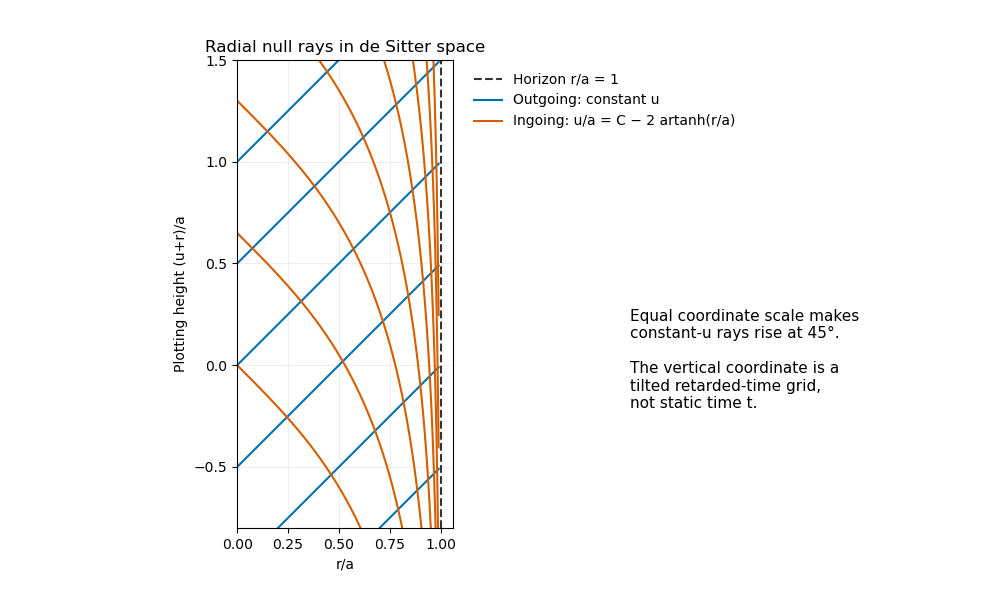

<h1 id="34d/c/solution">Solution</h1>

↑ **Parent:** [C](../c.md)

Radial null curves obey $-f\,du^2-2\,du\,dr=0$. For their unparameterized paths,

$$
\boxed{\frac{du}{dr}=0\quad\text{or}\quad\frac{du}{dr}=-\frac2f.}
$$

Inside the horizon, the first family satisfies $dt/dr=1/f$, so $dr/dt=f>0$ and is outgoing. The second satisfies $dt/dr=-1/f$ and is ingoing. Integrating gives $u=u_0$ for outgoing rays and $u=C-2a\operatorname{artanh}(r/a)$ for ingoing rays. The null paths are geodesics after suitable reparameterization; for example in the two-dimensional radial metric each null direction has covariant acceleration proportional to itself.

To show constant-$u$ rays at the requested angle, the diagram uses vertical plotting coordinate $u+r$ and horizontal $r$, with equal scale. This is the stated tilted $u$ grid: constant $u$ becomes a line of slope one. The ingoing curves bend to decreasing $u+r$ as $r$ approaches the horizon.

**[Figure 1](#34d/c/image-outgoing-and-ingoing-radial-null-rays-in-de-sitter-space-on-a-tilted-retarded-time-grid). Outgoing and ingoing radial null rays in de Sitter space on a tilted retarded-time grid**.

## ↑ Ancestors (11)

1. [C](../c.md)
2. [34D](../../34d.md)
3. [Paper 4](../../../paper-4-split.md)
4. [Ii](../../../split.md)
5. [2015](../../../../split.md)
6. [Past exam of the mathematics course of the University of Cambridge](../../../../../split.md)
7. [Mathematics course of the University of Cambridge](../../../../../../mathematics-course-of-the-university-of-cambridge.md)
8. [Course of the University of Cambridge](../../../../../../course-of-the-university-of-cambridge.md)
9. [University of Cambridge](../../../../../../university-of-cambridge-split.md)
10. [List of universities](../../../../../../list-of-universities.md)
11. [Codex Wiki](../../../../../../split.md)
