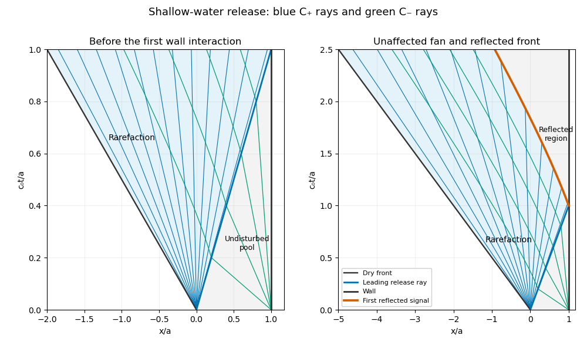

<h1 id="36b/ii/solution">Solution</h1>

↑ **Parent:** [Ii](../ii.md)

The release produces a [rarefaction wave](../../../../../../rarefaction-wave.md) expanding into the dry region. Every incoming $C_-$ characteristic connects to the undisturbed pool, where $J_-=0$, so throughout the simple wave $u=2(c-c_0)$. The outgoing $C_+$ rays emanate from $(0,0)$ and have $x/t=u+c=3c-2c_0$. Solving gives

$$
\boxed{c=\frac13(x/t+2c_0),\qquad u=\frac23(x/t-c_0),\qquad -2c_0t\leq x\leq c_0t.}
$$

The depth is $h=c^2/g$. At the right edge these formulas match the stationary pool; at the left edge $c=0$ and the fluid front travels at $-2c_0$. Beyond it the bed is dry, so a fluid velocity need not be assigned. Values at $t=0$ are understood as one-sided limits of the fan.

The first wall interaction occurs at $t_0=a/c_0$. The leftmost reflected signal follows a $C_-$ ray through $(a,t_0)$. Until a point has encountered this signal it remains in the original fan. In that fan its speed is $u-c=x/(3t)-4c_0/3$. Thus

$$
\dot x-\frac{x}{3t}=-\frac{4c_0}{3},\qquad x(t)=Ct^{1/3}-2c_0t.
$$

Matching at $(a,t_0)$ gives the reflected front

$$
\boxed{x_f(t)=3a(c_0t/a)^{1/3}-2c_0t.}
$$

Consequently the same rarefaction formula remains valid for $-2c_0t\leq x\leq x_f(t)$ when $t\geq t_0$. Between $x_f(t)$ and the wall, information from the wall changes $J_-$ and the simple-wave relation no longer holds. In particular continuing the old formula to $x=a$ would give a negative velocity for $t>t_0$, violating the no-penetration condition $u(a,t)=0$. The reflected region must accommodate both characteristic families; it is not another untouched part of the original fan.

**[Figure 2](#36b/ii/image-shallow-water-dam-release-characteristics-and-the-first-signal-reflected-from-the-wall). Shallow-water dam release characteristics and the first signal reflected from the wall**.

## ↑ Ancestors (11)

1. [Ii](../ii.md)
2. [36B](../../36b.md)
3. [Paper 4](../../../paper-4-split.md)
4. [Ii](../../../split.md)
5. [2015](../../../../split.md)
6. [Past exam of the mathematics course of the University of Cambridge](../../../../../split.md)
7. [Mathematics course of the University of Cambridge](../../../../../../mathematics-course-of-the-university-of-cambridge.md)
8. [Course of the University of Cambridge](../../../../../../course-of-the-university-of-cambridge.md)
9. [University of Cambridge](../../../../../../university-of-cambridge-split.md)
10. [List of universities](../../../../../../list-of-universities.md)
11. [Codex Wiki](../../../../../../split.md)
