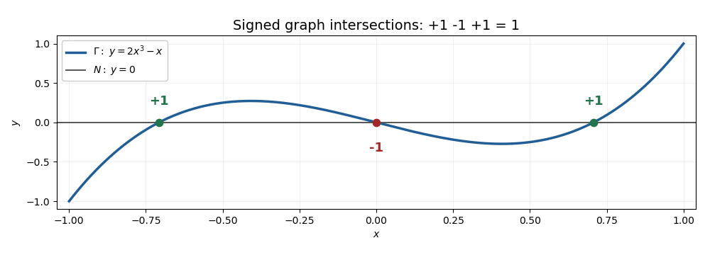

<h1 id="1/solution">Solution</h1>

↑ **Parent:** [1](../1.md)

**The degree and its local signs.** Orient $S^n$ and let $[S^n]$ generate its top [reduced homology](../../../../../reduced-homology.md) $\widetilde H_n(S^n;\mathbb Z)\cong\mathbb Z$. The [mapping degree](../../../../../degree-of-a-continuous-mapping.md) is the integer characterized by

$$
\boxed{f_*[S^n]=(\deg f)[S^n].}
$$

For $n\geq1$ this is the usual top [homology](../../../../../homology-split.md) definition using the [fundamental class](../../../../../fundamental-class.md); using [reduced homology](../../../../../reduced-homology.md) also covers $S^0$.

Suppose $f$ is smooth and $p$ is a [regular value](../../../../../regular-value.md). Each $x\in f^{-1}(p)$ has invertible tangent map $Df_x$, so the [inverse function theorem](../../../../../inverse-function-theorem.md) makes $f^{-1}(p)$ discrete. It is also closed in the compact [sphere](../../../../../sphere.md), hence finite. Choose disjoint small neighborhoods of these points on which $f$ is a [local diffeomorphism](../../../../../local-diffeomorphism.md). The [Excision theorem](../../../../../excision-theorem.md) identifies the source local [homology](../../../../../homology-split.md) with the direct sum of one copy of $\mathbb Z$ for each inverse image. The induced local map is multiplication by $+1$ or $-1$ according as $Df_x$ preserves or reverses orientation. The map from the global [fundamental class](../../../../../fundamental-class.md) to these local orientation classes therefore proves the [degree as a sum of local degrees](../../../../../degree-as-a-sum-of-local-degrees.md) formula:

$$
\boxed{\deg f=\sum_{x\in f^{-1}(p)}\epsilon_x,\qquad
\epsilon_x=\operatorname{sgn}\det Df_x.}
$$

Here the [determinant](../../../../../determinant.md) is computed in positively oriented tangent bases. Thus the [mapping degree](../../../../../degree-of-a-continuous-mapping.md) counts inverse images with signs, rather than just their cardinality.

**The quotient map.** Put $m=n+1$ and write $f=F|_{S^{m-1}}$. Give $D^m$ its standard orientation and its boundary the induced orientation. The [connecting homomorphism](../../../../../connecting-homomorphism.md)

$$
\partial:H_m(D^m,S^{m-1};\mathbb Z)\longrightarrow
\widetilde H_{m-1}(S^{m-1};\mathbb Z)
$$

is an isomorphism: the disk has zero positive [reduced homology](../../../../../reduced-homology.md). It sends the relative [fundamental class](../../../../../fundamental-class.md) $[D^m,S^{m-1}]$ to $[S^{m-1}]$. If the map on [relative homology](../../../../../relative-homology.md) induced by $F$ multiplies this class by $d$, naturality gives

$$
f_*[S^{m-1}]=f_*\partial[D^m,S^{m-1}]
=\partial F_*[D^m,S^{m-1}]=d[S^{m-1}].
$$

Thus $d=\deg f$. Collapsing the boundary gives a [sphere](../../../../../sphere.md) $D^m/S^{m-1}\cong S^m$, and the quotient map identifies its top [reduced homology](../../../../../reduced-homology.md) with the top [relative homology](../../../../../relative-homology.md) of the disk pair. Give this quotient [sphere](../../../../../sphere.md) the orientation determined by that identification. The relation $qF=\widetilde Fq$ now shows

$$
\boxed{\deg\widetilde F=\deg(F|_{S^n}).}
$$

This is the [quotient-sphere degree identity](../../../../../quotient-sphere-degree-identity.md).

**The graph intersection.** Orient $D^m\times D^m$ by the product orientation, orient $N=D^m\times\{0\}$ by its first factor, and orient the [graph of a function](../../../../../graph-of-a-function.md) $\Gamma$ by $x\mapsto(x,F(x))$. An intersection is precisely a zero of $F$, and no such zero lies on the boundary because $F(S^{m-1})\subset S^{m-1}$. At an intersection, [transverse intersection](../../../../../transverse-intersection.md) means that $DF_x$ is surjective, hence invertible. The zeros are consequently isolated and finite.

For the [smooth intersection number](../../../../../smooth-intersection-number.md) use the ordered tangent spaces $T_xN$ first and $T_{(x,F(x))}\Gamma$ second. Relative to the product basis their concatenated basis has matrix

$$
\begin{pmatrix}I&I\\0&DF_x\end{pmatrix}.
$$

Its [determinant](../../../../../determinant.md) is $\det DF_x$, so the intersection sign is $\epsilon_x=\operatorname{sgn}\det DF_x$. By the same local [Excision theorem](../../../../../excision-theorem.md) argument, now in [relative homology](../../../../../relative-homology.md) at the interior point $0$, the sum of these signs equals the multiplier of $F_*$ on $H_m(D^m,S^{m-1};\mathbb Z)$. Therefore the [graph intersection formula for mapping degree](../../../../../graph-intersection-formula-for-mapping-degree.md) is

$$
\boxed{\deg(F|_{S^n})=N\cdot\Gamma
=\sum_{x:F(x)=0}\operatorname{sgn}\det DF_x.}
$$

If the tangent spaces are ordered $\Gamma$ first and $N$ second, every sign changes by $(-1)^m$; the order above specifies the appropriate convention.

**[Figure 1](#1/image-three-transverse-graph-intersections-with-signs-plus-minus-plus-and-total-degree-one). Three transverse graph intersections with signs plus, minus, plus and total degree one**.

The one-dimensional model $F(x)=2x^3-x$ on $[-1,1]$ illustrates the [graph intersection formula for mapping degree](../../../../../graph-intersection-formula-for-mapping-degree.md): its three zeros have signs $+1,-1,+1$, and its endpoint map has [mapping degree](../../../../../degree-of-a-continuous-mapping.md) $1$ on [reduced homology](../../../../../reduced-homology.md).

## ↑ Ancestors (10)

1. [1](../1.md)
2. [Paper 15](../../paper-15-split.md)
3. [Iii](../../split.md)
4. [2015](../../../split.md)
5. [Past exam of the mathematics course of the University of Cambridge](../../../../split.md)
6. [Mathematics course of the University of Cambridge](../../../../../mathematics-course-of-the-university-of-cambridge.md)
7. [Course of the University of Cambridge](../../../../../course-of-the-university-of-cambridge.md)
8. [University of Cambridge](../../../../../university-of-cambridge-split.md)
9. [List of universities](../../../../../list-of-universities.md)
10. [Codex Wiki](../../../../../split.md)
