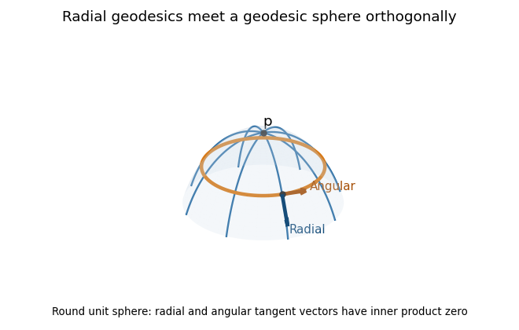

<h1 id="4/solution">Solution</h1>

↑ **Parent:** [4](../4.md)

Write $D$ for the [Levi-Civita connection](../../../../../levi-civita-connection.md) and define its [Christoffel symbols](../../../../../christoffel-symbol.md) by $D_{\partial_j}\partial_k=\Gamma^i_{jk}\partial_i$. For the [Riemannian metric](../../../../../riemannian-metric.md) matrix $(g_{jk})$ and its inverse $(g^{jk})$,

$$
\Gamma^i_{jk}=\frac12g^{i\ell}(\partial_jg_{k\ell}+\partial_kg_{j\ell}-\partial_\ell g_{jk}).
$$

A curve $x(t)$ with affine parameter is a [geodesic](../../../../../geodesic.md) when $D_{\dot x}\dot x=0$, equivalently

$$
\boxed{\ddot x^i+\sum_{j,k=1}^n\Gamma^i_{jk}(x(t))\dot x^j\dot x^k=0\quad(i=1,\ldots,n).}
$$

The connection is metric compatible and torsion free; in particular $\Gamma^i_{jk}=\Gamma^i_{kj}$. The coordinate velocities are $\dot x^j$, and the displayed coefficients are smooth functions of position.

For $v\in T_pM$ whose initial-value [geodesic](../../../../../geodesic.md) $\gamma_v$ exists through time $1$, with $\gamma_v(0)=p$ and $\dot\gamma_v(0)=v$, define $\exp_p(v)=\gamma_v(1)$. The domain is open and contains a neighborhood of zero. Indeed the [geodesic equation](../../../../../geodesic-equation.md) is a smooth first-order ODE in $(x,\dot x)$; the constant solution with initial velocity zero exists through time $1$, and existence on a compact time interval and smooth dependence persist for nearby initial data. Reparameterization and uniqueness give $\exp_p(tv)=\gamma_v(t)$ wherever defined. Consequently the [differential of the exponential map at zero](../../../../../differential-of-the-exponential-map-at-zero.md) is

$$
\boxed{(d\exp_p)_0(v)=\left.\frac d{dt}\right|_{0}\exp_p(tv)=v.}
$$

The [inverse function theorem](../../../../../inverse-function-theorem.md) gives a neighborhood $V$ of zero on which $\exp_p$ is a [diffeomorphism](../../../../../diffeomorphism.md) onto a neighborhood $U$ of $p$. Shrink $V$ to a ball in $T_pM$ and choose an orthonormal basis there. Its linear coordinate functions composed with $\exp_p^{-1}$ are the [geodesic normal coordinates](../../../../../geodesic-normal-coordinates.md) on $U$. This establishes well-defined local coordinates without assuming geodesic completeness.

In these [geodesic normal coordinates](../../../../../geodesic-normal-coordinates.md), every radial [geodesic](../../../../../geodesic.md) has coordinate expression $x(t)=tv$. Its equation at $t=0$ reads $\Gamma^i_{jk}(p)v^jv^k=0$ for every $v$. The coefficients are symmetric in $j,k$ by the [torsion-free connection](../../../../../torsion-free-connection.md) property. Evaluating at the coordinate unit vectors and their pairwise sums, or using the [polarization identity](../../../../../polarization-identity.md), therefore gives

$$
\boxed{\Gamma^i_{jk}(p)=0\quad\text{for every }i,j,k.}
$$

This is the fact that [Christoffel symbols vanish at the center of normal coordinates](../../../../../christoffel-symbols-vanish-at-the-center-of-normal-coordinates.md). Also $g_{ij}(p)=\delta_{ij}$, since $(d\exp_p)_0$ is the identity in an orthonormal basis.

For sufficiently small $r>0$, the [geodesic sphere](../../../../../geodesic-sphere.md) is $S_r(p)=\exp_p\{v:|v|_{g_p}=r\}$. It is a smooth hypersurface because $\exp_p$ is a [diffeomorphism](../../../../../diffeomorphism.md) on the ball. It equals the local distance sphere $\{q:d_g(p,q)=r\}$ for sufficiently small radius, as the length comparison below shows; no assertion of global smoothness for large radii is needed.

The full [Gauss lemma](../../../../../gauss-s-lemma-riemannian-geometry.md) is

$$
\boxed{g_{\exp_p(v)}\bigl((d\exp_p)_v v,(d\exp_p)_v w\bigr)=g_p(v,w)}
$$

for $v$ in a star-shaped domain of $\exp_p$ and $w\in T_pM$. To prove it, set $F(t,s)=\exp_p(t(v+sw))$, $T=\partial_tF$ and $S=\partial_sF$, for $s$ near zero. Every $t$-curve is a [geodesic](../../../../../geodesic.md) and has squared speed $|v+sw|_{g_p}^2$. The [torsion-free connection](../../../../../torsion-free-connection.md) property and the commuting parameter fields give $D_tS=D_sT$; metric compatibility and $D_tT=0$ then give

$$
\partial_t g(T,S)=g(T,D_tS)=g(T,D_sT)=\tfrac12\partial_s g(T,T)=g_p(v+sw,w).
$$

At $t=0$, $F(0,s)=p$, so $S=0$. Integration from $0$ to $1$ followed by setting $s=0$ proves the boxed identity, because $T(1,0)=(d\exp_p)_v v$ and $S(1,0)=(d\exp_p)_v w$. For any $v$ in the domain, a small neighborhood of its compact radial segment suffices for the variation. The zero vector is covered directly.

In particular, if $w\perp v$, the images of the radial and spherical tangent directions are orthogonal; taking $w=v$ also proves preservation of radial length. Thus in [geodesic polar coordinates](../../../../../geodesic-polar-coordinates.md) the [Riemannian metric](../../../../../riemannian-metric.md) has radial part $dr^2$ and no mixed radial-angular term. Every curve in a small normal ball from its center to radial coordinate $r$ has length at least $r$, by integrating the absolute radial derivative; the radial [geodesic](../../../../../geodesic.md) realizes this length. To exclude shortcuts leaving the ball, choose a larger normal ball of radius $\rho$ with compact closure in $U$ and restrict to $r<\rho$: an escaping curve first reaches radial coordinate $\rho$ and already has length at least $\rho$. This proves the asserted small-radius distance interpretation and **orthogonality of radial geodesics to geodesic spheres**.

**[Figure 1](#4/image-radial-geodesics-and-a-geodesic-sphere-on-the-round-unit-sphere-with-orthogonal-radial-and-angular-tangent-vectors). Radial geodesics and a geodesic sphere on the round unit sphere, with orthogonal radial and angular tangent vectors**.

## ↑ Ancestors (10)

1. [4](../4.md)
2. [Paper 17](../../paper-17-split.md)
3. [Iii](../../split.md)
4. [2015](../../../split.md)
5. [Past exam of the mathematics course of the University of Cambridge](../../../../split.md)
6. [Mathematics course of the University of Cambridge](../../../../../mathematics-course-of-the-university-of-cambridge.md)
7. [Course of the University of Cambridge](../../../../../course-of-the-university-of-cambridge.md)
8. [University of Cambridge](../../../../../university-of-cambridge-split.md)
9. [List of universities](../../../../../list-of-universities.md)
10. [Codex Wiki](../../../../../split.md)
