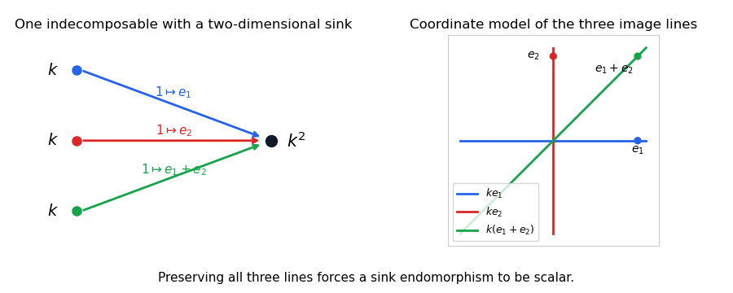

<h1 id="2/c/solution">Solution</h1>

↑ **Parent:** [C](../c.md)

First split off the kernel of each source-to-sink arrow. Each kernel contributes copies of the simple representation supported at that source. The remaining arrows are injective, so identify the three source spaces with subspaces $U_1,U_2,U_3$ of the sink space $V$. We now give an elementary [three-subspace decomposition](../../../../../../three-subspace-decomposition.md).

Split off the common intersection $U_1\cap U_2\cap U_3$: any projection onto it preserves all three subspaces. Next split off each pairwise intersection. For example, once the triple intersection has gone, $W=U_1\cap U_2$ is disjoint from $U_3$; a projection onto $W$ that kills $U_3$ preserves $U_1,U_2,U_3$. This extracts blocks whose membership is exactly $\{1,2\}$. Repeating for the other pairs leaves pairwise disjoint subspaces.

For each $i$, choose a complement $W_i$ to $U_i\cap(U_j+U_\ell)$ in $U_i$. A projection onto $W_i$ killing $U_j+U_\ell$ preserves the triple, so these complements split off as blocks of membership exactly $\{i\}$. In the remaining triple, every $U_i$ lies in the sum of the other two and all pairwise intersections are zero. Thus the sum is $U_1\oplus U_2$, and both projections of $U_3$ onto $U_1,U_2$ are isomorphisms. Hence $U_3$ is the graph of an isomorphism $T:U_1\to U_2$. Choose a basis $u_a$ of $U_1$ and the basis $Tu_a$ of $U_2$; this graph decomposes into two-dimensional blocks with three distinct lines. A complement to $U_1+U_2+U_3$ in $V$ contributes sink-only simple blocks.

The complete list of indecomposable blocks is therefore:

- **Three source simples**, with zero sink space.
- **Eight blocks with one-dimensional sink**, one for each subset $S\subseteq\{1,2,3\}$: the source space is $k$ for $i\in S$ and zero otherwise, and every nonzero arrow is the identity.
- **One exceptional block**, with all three source spaces $k$, sink $k^2$, and arrows $1\mapsto e_1$, $1\mapsto e_2$, $1\mapsto e_1+e_2$.

Each of the first eleven blocks has [endomorphism ring](../../../../../../endomorphism-ring.md) $k$. For the [exceptional indecomposable of the three-subspace quiver](../../../../../../exceptional-indecomposable-of-the-three-subspace-quiver.md), an endomorphism of $k^2$ preserving the first two lines is diagonal; preserving the third makes its two diagonal entries equal. Its [endomorphism ring](../../../../../../endomorphism-ring.md) is also $k$, so all twelve are indecomposable. Their [dimension vectors of quiver representations](../../../../../../dimension-vector-of-a-quiver-representation.md) distinguish them. The decomposition argument proves completeness, and hence **there are exactly $12$ isomorphism classes**. No general classification theorem is needed.

**[Figure 1](#2/c/image-exceptional-three-subspace-representation-with-a-two-dimensional-sink-and-three-distinct-image-lines). Exceptional three-subspace representation with a two-dimensional sink and three distinct image lines**.

## ↑ Ancestors (11)

1. [C](../c.md)
2. [2](../../2.md)
3. [Paper 3](../../../paper-3-split.md)
4. [Iii](../../../split.md)
5. [2015](../../../../split.md)
6. [Past exam of the mathematics course of the University of Cambridge](../../../../../split.md)
7. [Mathematics course of the University of Cambridge](../../../../../../mathematics-course-of-the-university-of-cambridge.md)
8. [Course of the University of Cambridge](../../../../../../course-of-the-university-of-cambridge.md)
9. [University of Cambridge](../../../../../../university-of-cambridge-split.md)
10. [List of universities](../../../../../../list-of-universities.md)
11. [Codex Wiki](../../../../../../split.md)
