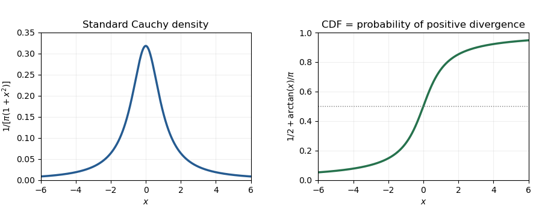

<h1 id="5/c/solution">Solution</h1>

↑ **Parent:** [C](../c.md)

The [strong law for Brownian motion](../../../../../../strong-law-for-brownian-motion.md) says $W_s/s\to0$ almost surely. For sufficiently large $s$, therefore $2W_s-s\leq-s/2$, giving

$$
V_\infty:=\int_0^\infty e^{2W_s-s}\,ds<\infty
\quad\text{almost surely}.
$$

Thus $J_t=\int_0^t e^{W_s-s/2}\,dB_s$ has finite terminal [quadratic variation](../../../../../../quadratic-variation.md). Stopping when its bracket reaches each integer makes it an $L^2$-bounded [martingale](../../../../../../martingale-split.md), which converges by the [martingale convergence theorem](../../../../../../martingale-convergence-theorem.md). Patching these limits shows that

$$
\boxed{J_\infty=\int_0^\infty e^{W_s-s/2}\,dB_s}
$$

is a well-defined finite almost sure limit. This construction uses local square integrability; a global $L^2$ bound is not required.

Conditional on the entire $W$ path, the independent [Brownian motion](../../../../../../brownian-motion-split.md) $B$ still supplies a centered Gaussian [stochastic integral](../../../../../../stochastic-integral.md), with variance $V_\infty\in(0,\infty)$. The [conditionally Gaussian stochastic integral with an independent integrator](../../../../../../conditionally-gaussian-stochastic-integral-with-an-independent-integrator.md) therefore has no atoms, even after averaging over $W$.

Also $e^{-W_t+t/2}\to\infty$ almost surely. For each fixed $x$, the relation $X_t=e^{-W_t+t/2}(x-J_t)$ then gives, outside the null event $J_\infty=x$,

$$
X_t\to+\infty\iff J_\infty<x,\qquad
X_t\to-\infty\iff J_\infty>x.
$$

Part (b) identifies the cumulative distribution:

$$
\boxed{\mathbb P(J_\infty\leq x)=\frac12+\frac{\arctan x}{\pi},
\qquad f_{J_\infty}(x)=\frac1{\pi(1+x^2)}.}
$$

Hence $J_\infty$ has the [Standard Cauchy distribution](../../../../../../standard-cauchy-distribution.md). This establishes the [Cauchy law of an infinite-horizon Brownian exponential integral](../../../../../../cauchy-law-of-an-infinite-horizon-brownian-exponential-integral.md).

**[Figure 1](#5/c/image-standard-cauchy-density-and-cumulative-distribution-with-the-latter-equal-to-the-positive-divergence-probability). Standard Cauchy density and cumulative distribution, with the latter equal to the positive-divergence probability**.

## ↑ Ancestors (11)

1. [C](../c.md)
2. [5](../../5.md)
3. [Paper 30](../../../paper-30-split.md)
4. [Iii](../../../split.md)
5. [2015](../../../../split.md)
6. [Past exam of the mathematics course of the University of Cambridge](../../../../../split.md)
7. [Mathematics course of the University of Cambridge](../../../../../../mathematics-course-of-the-university-of-cambridge.md)
8. [Course of the University of Cambridge](../../../../../../course-of-the-university-of-cambridge.md)
9. [University of Cambridge](../../../../../../university-of-cambridge-split.md)
10. [List of universities](../../../../../../list-of-universities.md)
11. [Codex Wiki](../../../../../../split.md)
