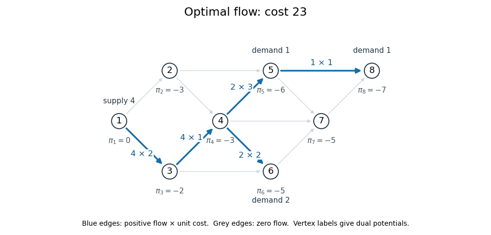

<h1 id="3/b/solution">Solution</h1>

↑ **Parent:** [B](../b.md)

On the dashed [spanning tree](../../../../../../spanning-tree.md), the nonzero flows are

$$
f_{12}=f_{13}=f_{25}=f_{34}=f_{46}=2,\qquad f_{58}=1,
$$

with $f_{78}=0$ and all non-tree flows zero. The tree balances give supply four at vertex $1$, demands one at $5$ and $8$, and demand two at $6$. Its cost is $25$.

Choose $\pi_1=0$ and make the tree [network reduced costs](../../../../../../network-reduced-cost.md) zero. The resulting [network dual potentials](../../../../../../network-dual-potential.md) are

$$
\pi=(0,-3,-2,-3,-7,-5,-6,-8).
$$

For the non-tree edges, in the order $(2,4),(3,6),(4,5),(4,7),(5,7),(6,7)$, the [network reduced costs](../../../../../../network-reduced-cost.md) are

$$
(1,0,-1,0,2,1).
$$

Only $(4,5)$ has negative [network reduced cost](../../../../../../network-reduced-cost.md), so it enters the basis.

Adding this edge to the tree creates the [graph cycle](../../../../../../cycle-in-a-graph.md) $4\to5\to2\to1\to3\to4$. Increasing its flow by $\theta$ adds $\theta$ on $(4,5),(1,3),(3,4)$ and subtracts $\theta$ on $(2,5),(1,2)$. These signed changes preserve every [flow balance](../../../../../../flow-balance.md). The [simplex ratio test](../../../../../../simplex-ratio-test.md) allows $\theta\leq\min(f_{25},f_{12})=2$, and the objective decreases by $\theta$ because the cycle's signed cost is $-1$.

Take $\theta=2$ and remove $(2,5)$ from the basis. The other tied edge $(1,2)$ remains a zero-flow basic edge; this is a legitimate degenerate tree basis and requires no extra pivot. The new flow is

$$
\boxed{f_{13}=f_{34}=4,\qquad f_{45}=f_{46}=2,\qquad f_{58}=1,\qquad\text{all other flows }0.}
$$

Its cost is $8+4+6+4+1=23$. For the new tree, choose

$$
\pi=(0,-3,-2,-3,-6,-5,-5,-7).
$$

Every [network reduced cost](../../../../../../network-reduced-cost.md) is nonnegative: the new non-tree costs for $(2,4),(2,5),(3,6),(4,7),(5,7),(6,7)$ are $(1,1,0,1,2,2)$. All positive-flow edges have zero [network reduced cost](../../../../../../network-reduced-cost.md), and the dual objective is $\pi^Tb=6+10+7=23$. Thus [complementary slackness](../../../../../../complementary-slackness.md) gives

$$
\boxed{\text{minimum cost}=23,\quad\text{reached in one network simplex pivot}.}
$$

**[Figure 1](#3/b/image-optimal-network-flow-of-cost-23-with-vertex-dual-potentials). Optimal network flow of cost 23, with vertex dual potentials**.

## ↑ Ancestors (11)

1. [B](../b.md)
2. [3](../../3.md)
3. [Paper 38](../../../paper-38-split.md)
4. [Iii](../../../split.md)
5. [2015](../../../../split.md)
6. [Past exam of the mathematics course of the University of Cambridge](../../../../../split.md)
7. [Mathematics course of the University of Cambridge](../../../../../../mathematics-course-of-the-university-of-cambridge.md)
8. [Course of the University of Cambridge](../../../../../../course-of-the-university-of-cambridge.md)
9. [University of Cambridge](../../../../../../university-of-cambridge-split.md)
10. [List of universities](../../../../../../list-of-universities.md)
11. [Codex Wiki](../../../../../../split.md)
