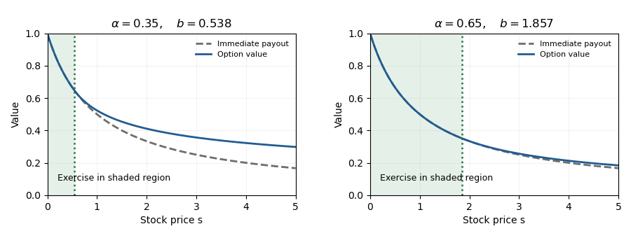

<h1 id="1/b/solution">Solution</h1>

↑ **Parent:** [B](../b.md)

Write $\alpha=2r/\sigma^2\in(0,1)$. In a continuation interval, the [Euler differential equation](../../../../../../cauchy-euler-equation.md) has power solutions $s$ and $s^{-\alpha}$: substitution of $s^\beta$ gives $(\beta-1)(\beta+\alpha)=0$. A decreasing bounded value uses the second solution.

Let $b$ be the exercise boundary. Value matching and [smooth fit](../../../../../../smooth-pasting.md) require $Ab^{-\alpha}=(1+b)^{-1}$ and $-\alpha Ab^{-\alpha-1}=-(1+b)^{-2}$. Dividing gives $b/(1+b)=\alpha$. Consequently

$$
\boxed{b=\frac\alpha{1-\alpha},\qquad
V(s)=\begin{cases}
(1+s)^{-1},&0<s\leq b,\\
\displaystyle\frac1{1+b}\left(\frac{s}{b}\right)^{-\alpha},&s>b.
\end{cases}}
$$

This is a [perpetual reciprocal-payoff American option](../../../../../../perpetual-reciprocal-payoff-american-option.md).

To verify the obstacle inequality, observe that $s^\alpha/(1+s)$ increases up to $b$ and decreases afterwards, because its logarithmic derivative is $\alpha/s-1/(1+s)$. Therefore $V(s)\geq(1+s)^{-1}$ for $s>b$. In the continuation region $(\mathcal L_r-r)V=0$. In the exercise region,

$$
(\mathcal L_r-r)g(s)
=\frac{\sigma^2}{(1+s)^3}
\left((1-\alpha)s^2-\frac{3\alpha}2s-\frac\alpha2\right).
$$

The quadratic is convex. At the two endpoints of $[0,b]$ it equals $-\alpha/2$ and $-\alpha/[2(1-\alpha)]$, respectively, so it is negative throughout that interval. Thus the [obstacle problem](../../../../../../obstacle-problem.md) is satisfied on both regions, with value matching and [smooth fit](../../../../../../smooth-pasting.md) at $b$. The second derivative has a jump at $b$; the equation is understood piecewise and in the generalized Itô sense described in part (a).

For optimality, use the [Risk-neutral measure for the Black-Scholes model](../../../../../../risk-neutral-measure-for-the-black-scholes-model.md), under which $dS_t=rS_tdt+\sigma S_tdW_t^{\mathbb Q}$. The [Itô formula](../../../../../../ito-s-lemma.md) makes $e^{-rt}V(S_t)$ a nonnegative [supermartingale](../../../../../../supermartingale.md), so every exercise time $\tau$ satisfies

$$
\mathbb E_{\mathbb Q}[e^{-r\tau}g(S_\tau)1_{\{\tau<\infty\}}]\leq V(S_0).
$$

Before hitting the exercise region, its drift vanishes. Since $0\leq V\leq1$, the stopped process is a bounded [martingale](../../../../../../martingale-split.md). Apply the [optional sampling theorem](../../../../../../optional-sampling-theorem-for-a-supermartingale.md) at $\tau_*\wedge T$ and let $T\to\infty$. The contribution from $\{\tau_*>T\}$ is at most $e^{-rT}$, while the boundary value equals the payoff. Hence equality holds for

$$
\boxed{\tau_*=\inf\{t\geq0:S_t\leq b\}.}
$$

If $S_0\leq b$, exercise immediately; otherwise wait for the first down-crossing. If that time is infinite, the discounted payout is zero. This proves both the value and the [optimal stopping](../../../../../../optimal-stopping.md) policy, and part (a) supplies its [superhedge](../../../../../../superhedging.md).

**[Figure 1](#1/b/image-perpetual-reciprocal-payoff-option-value-and-exercise-boundary-for-two-interest-to-variance-ratios). Perpetual reciprocal-payoff option value and exercise boundary for two interest-to-variance ratios**.

## ↑ Ancestors (11)

1. [B](../b.md)
2. [1](../../1.md)
3. [Paper 40](../../../paper-40-split.md)
4. [Iii](../../../split.md)
5. [2015](../../../../split.md)
6. [Past exam of the mathematics course of the University of Cambridge](../../../../../split.md)
7. [Mathematics course of the University of Cambridge](../../../../../../mathematics-course-of-the-university-of-cambridge.md)
8. [Course of the University of Cambridge](../../../../../../course-of-the-university-of-cambridge.md)
9. [University of Cambridge](../../../../../../university-of-cambridge-split.md)
10. [List of universities](../../../../../../list-of-universities.md)
11. [Codex Wiki](../../../../../../split.md)
