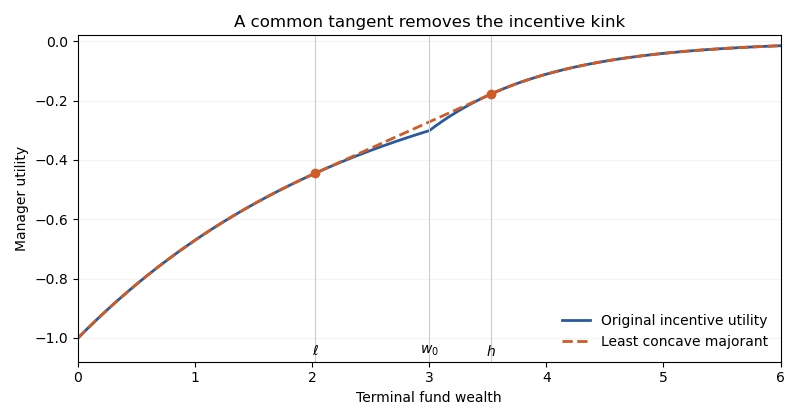

<h1 id="2/ii/solution">Solution</h1>

↑ **Parent:** [Ii](../ii.md)

Let $F(y)$ be the manager's [utility function](../../../../../../utility-function-split.md) as a function of nonnegative terminal fund wealth. Write

$$
a=\gamma\varepsilon,\qquad b=\gamma(\varepsilon+\alpha)>a.
$$

Then

$$
F(y)=
\begin{cases}
-e^{-ay},&0\leq y\leq w_0,\\
-e^{\gamma\alpha w_0-by},&y\geq w_0.
\end{cases}
$$

Both pieces are increasing and strictly [concave functions](../../../../../../concave-function.md). However, the derivative jumps upward from $ae^{-aw_0}$ to $be^{-aw_0}$ at $w_0$. **The payoff utility is increasing but not concave.** A [concave function](../../../../../../concave-function.md) must have nonincreasing one-sided slopes.

For [concavification of incentive utility](../../../../../../concavification-of-incentive-utility.md), the [common tangent for exponential incentive utility](../../../../../../common-tangent-for-exponential-incentive-utility.md) replaces the upward kink by its common tangent. There are contact points $\ell<w_0<h$ and a common slope $s>0$ satisfying

$$
F'(\ell)=F'(h)=s,\qquad
F(h)-F(\ell)=s(h-\ell).
$$

Since $F(\ell)=-s/a$ and $F(h)=-s/b$, the chord condition gives $h-\ell=1/a-1/b$. Solving the derivative matching yields **the contact points**

$$
\boxed{\ell=w_0-\frac{b/a-1-\log(b/a)}{b-a},\quad
h=w_0+\frac{\log(b/a)-1+a/b}{b-a},\quad
s=ae^{-a\ell}.}
$$

The assumption that $w_0$ is large enough means, explicitly, that

$$
w_0>\frac{b/a-1-\log(b/a)}{b-a},
$$

so $\ell>0$. The inequalities $\ell<w_0<h$ follow from $\log q<q-1$ and $\log q>1-1/q$ for $q>1$.

The least [concave majorant](../../../../../../concave-majorant.md) on $[0,\infty)$ is

$$
\boxed{\bar U(y)=
\begin{cases}
F(y),&0\leq y\leq\ell,\\
F(\ell)+s(y-\ell),&\ell\leq y\leq h,\\
F(y),&y\geq h.
\end{cases}}
$$

It is increasing and [concave](../../../../../../concave-function.md): the derivative is decreasing outside the interval and equals $s$ inside. The tangent line lies above each original branch. Any [concave majorant](../../../../../../concave-majorant.md) must lie above the chord joining the two contacts, so this one is the least.

**[Figure 1](#2/ii/image-common-tangent-replacing-the-incentive-kink-in-terminal-wealth-utility). Common tangent replacing the incentive kink in terminal-wealth utility**.

The [state-price budget constraint](../../../../../../state-price-budget-constraint.md) now reduces the problem to pointwise maximization of $\bar U(y)-qy$, where $q=\eta\zeta_T$ and $\eta>0$ is chosen so that $\mathbb E[\zeta_TY^*]=w_0$. Because $\bar U'(0)=a$ is finite, the nonnegative wealth constraint must be included. **The optimal terminal wealth is**

$$
\boxed{Y^*(q)=
\begin{cases}
0,&q\geq a,\\
a^{-1}\log(a/q),&s<q<a,\\
b^{-1}[\gamma\alpha w_0+\log(b/q)],&0<q<s.
\end{cases}}
$$

At $q=s$, any point of $[\ell,h]$ maximizes the concavified objective. If $\kappa\ne0$, the [state-price density](../../../../../../state-price-density.md) has a continuous [log-normal distribution](../../../../../../log-normal-distribution.md), so this event has probability zero. The optimizer then avoids $(\ell,h)$ almost surely and satisfies $\bar U(Y^*)=F(Y^*)$. The supporting-line proof from part (i), with supergradients at the contacts, proves optimality for the concavified problem; the pointwise equality proves **the same optimizer and value solve the original manager's problem**. Nonnegative replication is available in the [complete market](../../../../../../complete-market.md).

If $\kappa=0$, the [state-price density](../../../../../../state-price-density.md) is deterministic. If the required deterministic mean terminal wealth lies in the linear segment, randomize between $\ell$ and $h$ at the common slope instead of choosing an interior wealth. This maintains the budget and attains the same concavified value. The Brownian market can replicate that bounded lottery even when its [market price of risk](../../../../../../market-price-of-risk.md) is zero.

In the special case $r=\mu=0$, $\zeta_T=1$ and the fund has a fair-game wealth process. Since $\ell<w_0<h$, **the manager uses [fair-game gambling induced by an incentive fee](../../../../../../fair-game-gambling-induced-by-an-incentive-fee.md)**:

$$
\boxed{\mathbb P(Y^*=h)=\frac{w_0-\ell}{h-\ell},\qquad
\mathbb P(Y^*=\ell)=\frac{h-w_0}{h-\ell}.}
$$

For example choose a threshold event in $W_T$ with the displayed probability and replicate its payoff. Then $w_t=\mathbb E[Y^*\mid\mathcal F_t]$ remains between $\ell$ and $h$, so the strategy respects nonnegative wealth. It earns no risk premium but raises expected incentive [utility function](../../../../../../utility-function-split.md) above the value at the unrandomized $w_0$, because the common tangent lies strictly above the kink.

## ↑ Ancestors (11)

1. [Ii](../ii.md)
2. [2](../../2.md)
3. [Paper 41](../../../paper-41-split.md)
4. [Iii](../../../split.md)
5. [2015](../../../../split.md)
6. [Past exam of the mathematics course of the University of Cambridge](../../../../../split.md)
7. [Mathematics course of the University of Cambridge](../../../../../../mathematics-course-of-the-university-of-cambridge.md)
8. [Course of the University of Cambridge](../../../../../../course-of-the-university-of-cambridge.md)
9. [University of Cambridge](../../../../../../university-of-cambridge-split.md)
10. [List of universities](../../../../../../list-of-universities.md)
11. [Codex Wiki](../../../../../../split.md)
