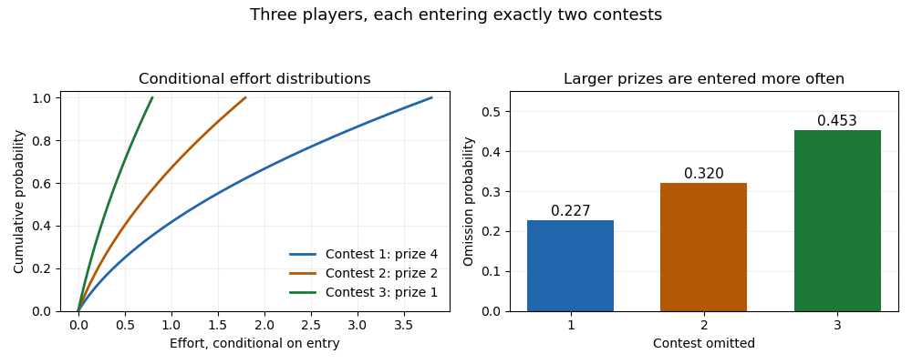

# Paper 42

↑ **Parent:** [Iii](../iii.md)

[https://www.maths.cam.ac.uk/postgrad/part-iii/files/pastpapers/2015/paper_42.pdf](https://www.maths.cam.ac.uk/postgrad/part-iii/files/pastpapers/2015/paper_42.pdf)

**Table of contents**

- [1](#1)
  - [Solution](#1/solution)
- [2](#2)
  - [Solution](#2/solution)
- [3](#3)
  - [Solution](#3/solution)
- [4](#4)
  - [Solution](#4/solution)
- [5](#5)
  - [Solution](#5/solution)

## 1

↑ **Parent:** [Paper 42](paper-42.md)

<h3 id="1/solution">Solution</h3>

↑ **Parent:** [1](#1)

Use the usual [independent private values model](../../../game-theory.md#independent-private-values-model), [quasilinear utility](../../../utility-function.md#quasilinear-utility), and voluntary participation with zero outside utility. These assumptions matter: without [individual rationality](../../../game-theory.md#individual-rationality), arbitrary type-independent entry charges make revenue unbounded, and correlated types cannot in general be described by their marginal priors alone.

The [revelation principle](../../../game-theory.md#revelation-principle) lets us optimize over [direct revelation mechanisms](../../../game-theory.md#direct-revelation-mechanism) satisfying [Bayesian incentive compatibility](../../../game-theory.md#bayesian-incentive-compatibility). Write $x(v)\in[0,1]$ for the common project allocation, $X_i(t)=\mathbb E_{V_{-i}}x(t,V_{-i})$ for player $i$'s interim allocation, and $P_i(t)$ for its interim payment. The [interim payment identity](../../../game-theory.md#interim-payment-identity) gives

$$
P_i(t)=tX_i(t)-\int_{\underline v_i}^tX_i(s)ds-U_i(\underline v_i).
$$

Since [interim individual rationality](../../../game-theory.md#interim-individual-rationality) requires $U_i(\underline v_i)\geq0$, the [virtual-surplus revenue identity](../../../game-theory.md#virtual-surplus-revenue-identity) bounds expected revenue by

$$
\mathbb E\sum_iP_i(V_i)\leq\mathbb E\left[x(V)\sum_i\phi_i(V_i)\right],
\qquad\phi_i(t)=t-\frac{1-F_i(t)}{f_i(t)}.
$$

The best feasible common allocation at each valuation profile therefore provides the project when total [virtual surplus](../../../game-theory.md#virtual-surplus) is nonnegative:

$$
\boxed{x^*(v)=\mathbf1_{\{\sum_i\phi_i(v_i)\geq0\}}.}
$$

Because each [regular prior](../../../game-theory.md#regular-distribution-economics) has a nondecreasing [virtual valuation](../../../game-theory.md#virtual-valuation), this allocation is a [nondecreasing function](../../../calculus.md#nondecreasing-function) of each player's report. Hold $v_{-i}$ fixed and charge the [critical-value payment](../../../game-theory.md#critical-value-payment)

$$
p_i^*(v)=v_i x^*(v)-\int_{\underline v_i}^{v_i}x^*(t,v_{-i})dt.
$$

This is the winning threshold when it lies in the support, the lowest allowed value if every type wins, and zero if the player loses. A truthful winner never pays more than its value; a losing type cannot profit by crossing the threshold. Thus the mechanism has [dominant-strategy incentive compatibility](../../../game-theory.md#dominant-strategy-incentive-compatibility) and [ex post individual rationality](../../../game-theory.md#ex-post-individual-rationality), with zero utility at every lowest type. It attains the revenue bound, proving optimality even among mechanisms requiring only [Bayesian incentive compatibility](../../../game-theory.md#bayesian-incentive-compatibility). At a zero-virtual-surplus tie, choose any fixed rule that preserves monotonicity.

For independent [uniform distributions](../../../continuous-probability-distribution.md#continuous-uniform-distribution) on $[0,1]$, the [virtual valuations](../../../game-theory.md#virtual-valuation) are $\phi_i(v_i)=2v_i-1$. The [revenue-optimal public-project auction](../../../game-theory.md#revenue-optimal-public-project-auction) becomes

$$
\boxed{\text{Provide the project exactly when }\sum_i v_i\geq\frac n2.}
$$

When it is provided, player $i$ pays

$$
\boxed{p_i^*(v)=\max\left\{0,\frac n2-\sum_{j\ne i}v_j\right\};}
$$

otherwise every payment is zero. If the displayed threshold exceeds one, player $i$ cannot induce provision within its allowed support; if it is negative, provision is independent of its own report and its payment is zero. For $n=1$, this specializes to a reserve value and payment of $1/2$.

## 2

↑ **Parent:** [Paper 42](paper-42.md)

<h3 id="2/solution">Solution</h3>

↑ **Parent:** [2](#2)

Assume the usual continuous nonnegative valuation distribution, so ties occur only on [zero-probability events](../../../probability-theory.md#zero-probability-event). Put $t=F(v)$. In a monotone symmetric [Bayesian Nash equilibrium](../../../game-theory.md#bayesian-nash-equilibrium), a type $v$ is first with probability $t^{n-1}$ and second with probability $(n-1)(1-t)t^{n-2}$. Its [rank-order expected prize allocation](../../../game-theory.md#rank-order-expected-prize-allocation) in $G_1$ is therefore

$$
a_1(v)=2t^{n-1}+(n-1)(1-t)t^{n-2}.
$$

The [all-pay effort identity](../../../game-theory.md#all-pay-effort-identity) gives $b_1(v)=\int_{\underline v}^v s a_1'(s)ds$. It also verifies equilibrium directly: a type $v$ imitating type $z$ has utility $v a_1(z)-b_1(z)$, whose derivative is $(v-z)a_1'(z)$, so the true type is a [best response](../../../game-theory.md#best-response).

In the first version of $G_2$, the two contests have expected allocations

$$
a_{21}(v)=t^{n-1},\qquad
a_{22}(v)=t^{n-1}+(n-1)(1-t)t^{n-2}.
$$

There is no common effort budget, and [quasilinear utility](../../../utility-function.md#quasilinear-utility) makes the two effort choices separable. Since $a_{21}+a_{22}=a_1$, adding their [all-pay effort identities](../../../game-theory.md#all-pay-effort-identity) yields

$$
\boxed{b_{21}(v)+b_{22}(v)=b_1(v),\qquad
\mathbb E[\text{total effort in }G_2]=\mathbb E[\text{total effort in }G_1].}
$$

The equality holds type by type for aggregate effort, rather than only after taking expectations. The within-player correlation of the two efforts does not enter these additive expected payoffs.

For the second version of $G_2$, let $V_{[1]}\geq\cdots\geq V_{[n]}$ denote [descending order statistics](../../../probability-theory.md#descending-order-statistics). The [expected effort in a rank-order contest](../../../game-theory.md#expected-effort-in-a-rank-order-contest) with prize vector $(2,1,0,\ldots)$ is

$$
\mathbb E E_1=\mathbb E V_{[2]}+2\mathbb E V_{[3]}.
$$

Equivalently, decompose the allocation into a unit award to the best player and a unit award to each of the best two players, then use [revenue equivalence](../../../game-theory.md#revenue-equivalence): the corresponding total auction payments are $V_{[2]}$ and $2V_{[3]}$. Two separate first-place contests with prize values one and two instead generate

$$
\mathbb E E_2=3\mathbb E V_{[2]}.
$$

Consequently

$$
\boxed{\mathbb E E_2-\mathbb E E_1
=2\mathbb E[V_{[2]}-V_{[3]}]\geq0.}
$$

For a nondegenerate continuous distribution, the inequality is strict. No regularity of [virtual valuations](../../../game-theory.md#virtual-valuation) is needed for this comparison. With a [uniform distribution](../../../continuous-probability-distribution.md#continuous-uniform-distribution) on $[0,1]$, the two totals are $(3n-5)/(n+1)$ and $3(n-1)/(n+1)$, giving a difference of $4/(n+1)$.

## 3

↑ **Parent:** [Paper 42](paper-42.md)

<h3 id="3/solution">Solution</h3>

↑ **Parent:** [3](#3)

Interpret the contests as standard [all-pay auctions](../../../game-theory.md#all-pay-auction): the highest effort among entrants wins, ties are shared uniformly, and an unentered contest awards no prize. The printed question does not specify a [prize allocation rule](../../../game-theory.md#prize-allocation-rule); the highest-effort convention is the one used for standard all-pay contests in [the course author's 2014 lecture slides](https://www.slideshare.net/slideshow/crowdsourding-and-allpay-contests/41832099). Under this convention, we can characterize the unique symmetric participation probabilities and bid marginals. Uniqueness of the entire joint [mixed strategy](../../../game-theory.md#mixed-strategy) requires a further restriction on dependence, as explained below.

Let $q_j$ be the probability that a player omits contest $j$. Since every player enters exactly two contests, $q_1+q_2+q_3=1$. Let $G_j(b)$ be the probability that a rival is absent from contest $j$ or enters it with effort at most $b$. Rivals' strategy draws are independent between players. For a positive bid $b$ outside a [measure atom](../../../measure-theory.md#atom-measure-theory), the expected payoff from this contest is

$$
w_jG_j(b)^{n-1}-b.
$$

An [all-pay auction](../../../game-theory.md#all-pay-auction) cannot have a positive-effort [measure atom](../../../measure-theory.md#atom-measure-theory) in a symmetric equilibrium: slightly overbidding that [measure atom](../../../measure-theory.md#atom-measure-theory) gives a positive discrete increase in the [winning probability](../../../game-theory.md#winning-probability) at an arbitrarily small extra cost. Nor can active bids have a [measure atom](../../../measure-theory.md#atom-measure-theory) at zero when entry has positive probability, because a small positive bid beats tied zero bids. Gaps inside the active [effort support](../../../probability-theory.md#effort-support) are impossible: moving a bid from the top of a gap to just above its bottom preserves its winning probability and lowers its cost. The [effort support](../../../probability-theory.md#effort-support) starts at zero, because lowering its positive lower endpoint would preserve the chance that every rival is absent.

The [all-pay indifference equation with random entry](../../../game-theory.md#all-pay-indifference-equation-with-random-entry) consequently gives the maximal per-contest payoff

$$
u_j=w_jq_j^{n-1},\qquad
G_j(b)=\left(\frac{b+u_j}{w_j}\right)^{1/(n-1)},
\quad0\leq b\leq w_j-u_j.
$$

Every $q_j$ lies strictly between zero and one. First, if $q_j=1$, the other two contests have certain entry and zero per-contest payoff, while deviating into the unused contest wins a positive prize. This contradicts equilibrium. Next, if $q_j=0$, the remaining omission probabilities sum to one and neither can equal one, so both are positive. Contest $j$ has zero per-contest payoff, whereas both other contests have strictly positive payoffs. Every pair containing $j$ is then worse than omitting it and entering the other two, contradicting certain entry in $j$.

Every omission therefore occurs with positive probability. The three entered pairs must give the same maximal payoff, which forces $u_1=u_2=u_3=u>0$. Normalizing the omission probabilities gives the [two-of-three all-pay participation equilibrium](../../../game-theory.md#two-of-three-all-pay-participation-equilibrium):

$$
\boxed{u=\left(\sum_{\ell=1}^3w_\ell^{-1/(n-1)}\right)^{-(n-1)},\qquad
q_j=\left(\frac u{w_j}\right)^{1/(n-1)}
=\frac{w_j^{-1/(n-1)}}{\sum_{\ell=1}^3w_\ell^{-1/(n-1)}}.}
$$

Conditional on entering contest $j$, the effort has [distribution function](../../../probability-theory.md#cumulative-distribution-function)

$$
\boxed{H_j(b)=\frac{((b+u)/w_j)^{1/(n-1)}-q_j}{1-q_j},
\quad0\leq b\leq w_j-u,}
$$

extended by zero below this interval and one above it. The inequalities $q_1\leq q_2\leq q_3$ show that the larger prizes are entered more often.

To construct an equilibrium, omit $j$ with probability $q_j$, then draw the two active efforts independently with their respective [conditional distributions](../../../probability-theory.md#conditional-distribution) $H_k$. Every bid in a contest's [effort support](../../../probability-theory.md#effort-support) earns $u$; a bid above $w_j-u$ earns at most $w_j-b<u$. Thus no effort deviation or choice of a different pair improves on total payoff $2u$. This proves existence and verifies the [Nash equilibrium](../../../game-theory.md#nash-equilibrium) without relying only on the indifference equations. The arguments above also prove uniqueness of the omission probabilities and the per-contest [marginal distributions](../../../probability-theory.md#marginal-distribution).

**[Figure 1](#3/image-equilibrium-omission-probabilities-and-conditional-effort-distributions-for-three-all-pay-contests). Equilibrium omission probabilities and conditional effort distributions for three all-pay contests**.

For the full joint strategy law, however, the printed uniqueness claim is too strong. Given an entered pair $k,\ell$, either use two independent [uniform random variables](../../../continuous-probability-distribution.md#uniform-random-variable) $U,V$ and bids $(H_k^{-1}(U),H_\ell^{-1}(V))$, or use a single uniform $U$ and bids $(H_k^{-1}(U),H_\ell^{-1}(U))$. These are different [copulas](../../../probability-theory.md#copula-probability-theory) with the same conditional marginals. A fixed deviation's expected additive payoff only uses the rivals' per-contest [marginal distributions](../../../probability-theory.md#marginal-distribution), so both constructions remain [Nash equilibria](../../../game-theory.md#nash-equilibrium). This is the [marginal-equivalent equilibria in additive contests](../../../game-theory.md#marginal-equivalent-equilibria-in-additive-contests) phenomenon. **The participation probabilities and bid marginals are unique; the full joint mixed strategy is not unique unless a dependence convention is imposed.** Independent conditional sampling gives one canonical representative.

## 4

↑ **Parent:** [Paper 42](paper-42.md)

<h3 id="4/solution">Solution</h3>

↑ **Parent:** [4](#4)

First exclude boundary profiles. At $(0,0)$, player $i$ can replace its payoff $v_i/2$ by $v_i-\varepsilon^2>v_i/2$ using a sufficiently small positive effort. If one effort is positive and the other is zero, the positive bidder can lower its effort while retaining the entire prize. Thus a pure [Nash equilibrium](../../../game-theory.md#nash-equilibrium) of this [proportional allocation contest](../../../game-theory.md#proportional-allocation-contest) must have both efforts positive.

Against $b_j>0$, player $i$'s payoff is a [strictly concave function](../../../real-analysis.md#strictly-concave-function) of $b_i\geq0$, since

$$
\frac{\partial^2 s_i}{\partial b_i^2}
=-\frac{2v_i b_j}{(b_i+b_j)^3}-2<0.
$$

Its derivative at zero is positive and its payoff tends to negative infinity as its own effort tends to infinity. Hence its unique [best response](../../../game-theory.md#best-response) is the positive solution of the [first-order condition](../../../mathematical-optimization.md#first-order-optimality-condition). At an equilibrium, writing $B=b_1+b_2$, these conditions are

$$
\frac{v_1b_2}{B^2}=2b_1,\qquad
\frac{v_2b_1}{B^2}=2b_2.
$$

Dividing them gives $b_1/b_2=\sqrt{v_1/v_2}$, and multiplying them gives $B^4=v_1v_2/4$. Therefore the [quadratic-cost two-player proportional contest](../../../game-theory.md#quadratic-cost-two-player-proportional-contest) has

$$
\boxed{B=\frac{(v_1v_2)^{1/4}}{\sqrt2},\qquad
b_i^*=\frac{\sqrt{v_i}}{\sqrt{v_1}+\sqrt{v_2}}\,
\frac{(v_1v_2)^{1/4}}{\sqrt2}.}
$$

Both efforts are positive, and [strict concavity](../../../real-analysis.md#strict-concavity) makes them global [best responses](../../../game-theory.md#best-response). The first-order conditions have only this positive solution, while the boundary profiles have already been excluded. This proves both existence and uniqueness. The resulting [winning probabilities](../../../game-theory.md#winning-probability) are $x_i^*=\sqrt{v_i}/(\sqrt{v_1}+\sqrt{v_2})$; for equal values $v$, each effort is $\sqrt{v/8}$.

## 5

↑ **Parent:** [Paper 42](paper-42.md)

<h3 id="5/solution">Solution</h3>

↑ **Parent:** [5](#5)

Use positive ability parameters in the [Bradley-Terry model](../../../statistical-modelling.md#bradley-terry-model), so $\mathbb P(i\text{ beats }j)=\theta_i/(\theta_i+\theta_j)$. If the course instead denotes log abilities by $\theta_i$, apply the following calculation to their exponentials; the ordering is unchanged. Up to a factor independent of the abilities, the [likelihood function](../../../statistical-modelling.md#likelihood-function) is

$$
L(\theta)=\frac{\theta_1}{\theta_1+\theta_2}
\frac{\theta_3}{\theta_1+\theta_3}
\left(\frac{\theta_2}{\theta_2+\theta_3}\right)^k.
$$

The observed wins form a directed cycle, so a finite maximum exists. The [Bradley-Terry likelihood Hessian](../../../statistical-modelling.md#bradley-terry-likelihood-hessian) is negative definite on contrasts of log abilities, giving uniqueness up to common scaling. We can therefore find the [maximum-likelihood estimate](../../../statistical-modelling.md#maximum-likelihood-estimator) through the [Bradley-Terry score equations](../../../statistical-modelling.md#bradley-terry-score-equation).

Player 1 has one observed win in two comparisons. Its score equation is

$$
1=\frac{\theta_1}{\theta_1+\theta_2}
+\frac{\theta_1}{\theta_1+\theta_3},
$$

which simplifies to $\theta_1^2=\theta_2\theta_3$. By the model's scale invariance, set $\theta_2=1$ and write $\theta_1=r$, $\theta_3=r^2$, with $r>0$. Player 2's score equation becomes

$$
k=\frac1{1+r}+\frac{k}{1+r^2},
\qquad kr^3+(k-1)r^2=1.
$$

The left side of the polynomial equation is strictly increasing on $r>0$, starts at zero, and tends to infinity. For $k=1$, its unique solution is $r=1$. For $k>1$, its value at one is $2k-1>1$, so its solution satisfies $0<r<1$. The [Three-player Bradley-Terry comparison cycle](../../../statistical-modelling.md#three-player-bradley-terry-comparison-cycle) consequently gives

$$
\boxed{k=1:\quad\widehat\theta_1=\widehat\theta_2=\widehat\theta_3;
\qquad k>1:\quad\widehat\theta_2>\widehat\theta_1>\widehat\theta_3.}
$$

Thus there is a complete tie when each directed edge is observed once, and otherwise the decreasing ranking is **2, 1, 3**.

## ↑ Ancestors (8)

1. [Iii](../iii.md)
2. [2015](../../2015.md)
3. [Past exam of the mathematics course of the University of Cambridge](../../../past-exam-of-the-mathematics-course-of-the-university-of-cambridge.md)
4. [Mathematics course of the University of Cambridge](../../../university-of-cambridge.md#mathematics-course-of-the-university-of-cambridge)
5. [Course of the University of Cambridge](../../../university-of-cambridge.md#course-of-the-university-of-cambridge)
6. [University of Cambridge](../../../university-of-cambridge.md)
7. [List of universities](../../../README.md#list-of-universities)
8. [Codex Wiki](../../../README.md)
