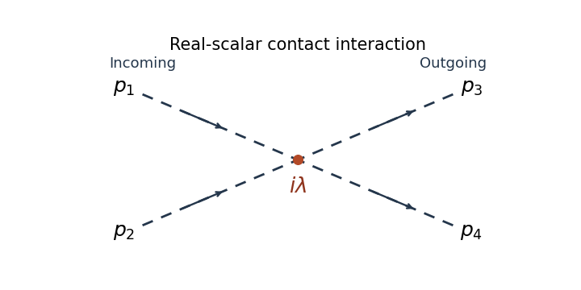

# Paper 43

↑ **Parent:** [Iii](../iii.md)

[https://www.maths.cam.ac.uk/postgrad/part-iii/files/pastpapers/2015/paper_43.pdf](https://www.maths.cam.ac.uk/postgrad/part-iii/files/pastpapers/2015/paper_43.pdf)

**Table of contents**

- [1](#1)
  - [Solution](#1/solution)
- [2](#2)
  - [Solution](#2/solution)
- [3](#3)
  - [Solution](#3/solution)
- [4](#4)
  - [Solution](#4/solution)

## 1

↑ **Parent:** [Paper 43](paper-43.md)

<h3 id="1/solution">Solution</h3>

↑ **Parent:** [1](#1)

Use [natural units](../../../physics.md#natural-units) and the [Minkowski metric](../../../special-relativity.md#minkowski-metric) $\eta=\operatorname{diag}(1,-1,-1,-1)$. A [real scalar field](../../../scalar-field-theory.md#real-scalar-field) assigns a real variable $\phi(t,\mathbf x)$ to each spatial point. Its [Lagrangian density](../../../quantum-field-theory.md#lagrangian-density) can be taken to be

$$
\mathcal L=\frac12\partial_\mu\phi\,\partial^\mu\phi-V(\phi)=\frac12\dot\phi^2-\frac12|\nabla\phi|^2-V(\phi),\qquad S[\phi]=\int d^4x\,\mathcal L.
$$

The [principle of stationary action](../../../classical-mechanics.md#principle-of-stationary-action) gives the [Euler-Lagrange equation](../../../analysis.md#euler-lagrange-equation) $\Box\phi+V'(\phi)=0$. With $V(\phi)=m^2\phi^2/2$, this is the [Klein-Gordon equation](../../../wave-equation.md#klein-gordon-equation). An additional nonlinear part of $V$ describes interactions.

The [canonical momentum](../../../classical-mechanics.md#canonical-momentum) is $\pi=\partial\mathcal L/\partial\dot\phi=\dot\phi$. The [Legendre transform in mechanics](../../../classical-mechanics.md#legendre-transform-in-mechanics) gives the [canonical Hamiltonian density of a real scalar field](../../../quantum-field-theory.md#canonical-hamiltonian-density-of-a-real-scalar-field)

$$
\mathcal H=\pi\dot\phi-\mathcal L=\frac12\pi^2+\frac12|\nabla\phi|^2+V(\phi),\qquad H=\int d^3x\,\mathcal H.
$$

The [Hamiltonian](../../../classical-mechanics.md#hamiltonian) equations $\dot\phi=\pi$ and $\dot\pi=\nabla^2\phi-V'(\phi)$ recover the same field equation. In [canonical quantization](../../../quantum-mechanics.md#canonical-quantization), the fields become operators satisfying the equal-time [canonical commutation relations](../../../quantum-mechanics.md#canonical-commutation-relation)

$$
[\widehat\phi(t,\mathbf x),\widehat\pi(t,\mathbf y)]=i\delta^3(\mathbf x-\mathbf y),\qquad[\widehat\phi,\widehat\phi]=[\widehat\pi,\widehat\pi]=0.
$$

A spatial lattice makes the analogy with many coupled quantum-mechanical coordinates precise. Each lattice field value is a coordinate, with its own [conjugate momentum](../../../classical-mechanics.md#canonical-momentum). The [path integral](../../../quantum-field-theory.md#path-integral) is another representation of the same quantum evolution.

To see its origin, first consider one coordinate with $H=p^2/(2M)+V(q)$. Split a time interval into $N$ steps of length $\varepsilon$ and insert position and momentum resolutions of the identity. The short-time kernel is

$$
\langle q_{j+1}|e^{-i\varepsilon\widehat H}|q_j\rangle=\int\frac{dp_j}{2\pi}\exp\left\{ip_j(q_{j+1}-q_j)-i\varepsilon\left[\frac{p_j^2}{2M}+V(q_j)\right]\right\}+O(\varepsilon^2).
$$

Multiplying the kernels and integrating over intermediate positions gives the [phase-space path integral](../../../quantum-field-theory.md#phase-space-path-integral)

$$
K(q_f,t_f;q_i,t_i)=\int\mathcal Dq\,\mathcal Dp\,\exp\left[i\int_{t_i}^{t_f}(p\dot q-H(p,q))\,dt\right].
$$

The endpoints of $q$ are fixed. The momentum integrals are [Gaussian integrals](../../../calculus.md#gaussian-integral); completing the square produces the [configuration-space path integral](../../../quantum-field-theory.md#configuration-space-path-integral)

$$
\boxed{K(q_f,t_f;q_i,t_i)=\int_{q_i}^{q_f}\mathcal Dq\,e^{iS[q]},\qquad S[q]=\int_{t_i}^{t_f}\left(\frac M2\dot q^2-V(q)\right)dt.}
$$

At finite slicing its normalization contains $(M/(2\pi i\varepsilon))^{N/2}\prod_{j=1}^{N-1}dq_j$. This fixes the composition law and the initial delta-function kernel. One sums over all paths, not merely solutions of the classical equation. Restoring $\hbar$ replaces the weight by $e^{iS/\hbar}$; stationary phase explains the emergence of classical trajectories.

For the field, use [scalar field configuration eigenstates](../../../scalar-field-theory.md#scalar-field-configuration-eigenstate) $|\varphi\rangle$, satisfying $\widehat\phi(\mathbf x)|\varphi\rangle=\varphi(\mathbf x)|\varphi\rangle$. Insert their completeness relations on every time slice. This gives

$$
\langle\varphi_f|e^{-i\widehat H(t_f-t_i)}|\varphi_i\rangle=\int\mathcal D\phi\,\mathcal D\pi\,\exp\left[i\int d^4x\,(\pi\dot\phi-\mathcal H)\right].
$$

The endpoint field configurations are fixed. Integrating the Gaussian momentum variables leaves the [scalar field path integral](../../../quantum-field-theory.md#scalar-field-path-integral) $\mathcal N\int\mathcal D\phi\,e^{iS[\phi]}$. The [functional measure](../../../quantum-field-theory.md#functional-measure) means a regulated product over the field variables. A spacetime lattice or another [ultraviolet cutoff](../../../quantum-field-theory.md#ultraviolet-cutoff) makes this product finite before the continuum limit; interacting continuum calculations may require [renormalization](../../../perturbative-quantum-field-theory.md#renormalization). The oscillatory Minkowski weight is an amplitude, not a positive [probability density](../../../quantum-mechanics.md#probability-density).

For [vacuum expectation values](../../../quantum-field-theory.md#vacuum-expectation-value), the boundaries must select the vacuum rather than arbitrary field configurations. Long imaginary-time evolution suppresses excited states: $e^{-TH}|n\rangle=e^{-TE_n}|n\rangle$, so after normalization only the lowest-energy component remains as $T\to\infty$. This is [vacuum projection by imaginary time](../../../quantum-field-theory.md#vacuum-projection-by-imaginary-time). The corresponding [Feynman i-epsilon prescription](../../../quantum-field-theory.md#feynman-i-epsilon-prescription) in the real-time integral specifies the vacuum boundary conditions and the poles of the propagator. With $t=-i\tau$, the [Euclidean path integral](../../../quantum-field-theory.md#euclidean-path-integral) has the weight $e^{-S_E}$, where

$$
S_E=\int d\tau\,d^3x\left[\frac12(\partial_\tau\phi)^2+\frac12|\nabla\phi|^2+V(\phi)\right].
$$

It is often a useful regulated starting point; analytic continuation returns the vacuum time-ordered quantities.

Introduce a classical source $J(x)$ and define the [normalized vacuum generating functional](../../../perturbative-quantum-field-theory.md#normalized-vacuum-generating-functional)

$$
Z[J]=\frac{\int\mathcal D\phi\,\exp i\left(S[\phi]+\int d^4x\,J(x)\phi(x)\right)}{\int\mathcal D\phi\,e^{iS[\phi]}},\qquad Z[0]=1,
$$

with the same vacuum prescription in numerator and denominator. A [functional derivative](../../../calculus-of-variations.md#functional-derivative) brings down $i\phi(x)$. The order of the time slices makes the operator insertion time-ordered. Thus [source differentiation inserts time-ordered field operators](../../../perturbative-quantum-field-theory.md#source-differentiation-inserts-time-ordered-field-operators):

$$
\boxed{\langle\Omega|T\{\widehat\phi(x_1)\cdots\widehat\phi(x_r)\}|\Omega\rangle=\left.\frac1{i^r}\frac{\delta^rZ[J]}{\delta J(x_1)\cdots\delta J(x_r)}\right|_{J=0}.}
$$

The denominator removes vacuum diagrams and gives normalized expectation values. It is essential that these are [time-ordered products](../../../perturbative-quantum-field-theory.md#time-ordered-product); differentiating this vacuum functional does not directly give every possible operator ordering.

The free theory illustrates the method. Its quadratic kernel is $K=-\Box-m^2$ with the vacuum pole prescription, and completing the square gives the [Gaussian evaluation of a free scalar generating functional](../../../quantum-field-theory.md#gaussian-evaluation-of-a-free-scalar-generating-functional)

$$
Z_0[J]=\exp\left[-\frac12\int d^4x\,d^4y\,J(x)\Delta_F(x-y)J(y)\right],\qquad \Delta_F(x-y)=\int\frac{d^4p}{(2\pi)^4}\frac{i\,e^{-ip\cdot(x-y)}}{p^2-m^2+i0}.
$$

Two source derivatives give $\Delta_F=\langle\Omega|T\{\widehat\phi(x)\widehat\phi(y)\}|\Omega\rangle$. Higher derivatives give all pairings, the content of [Wick theorem](../../../perturbative-quantum-field-theory.md#wick-s-theorem). For an interaction $S_{\rm int}$, one may use [path-integral perturbation by source derivatives](../../../quantum-field-theory.md#path-integral-perturbation-by-source-derivatives):

$$
Z[J]=\frac{\exp\left(iS_{\rm int}\left[\frac1i\frac\delta{\delta J}\right]\right)Z_0[J]}{\left.\exp\left(iS_{\rm int}\left[\frac1i\frac\delta{\delta J}\right]\right)Z_0[J]\right|_{J=0}}.
$$

Expanding this expression generates [Feynman diagrams](../../../perturbative-quantum-field-theory.md#feynman-diagram) and their [Wick contractions](../../../perturbative-quantum-field-theory.md#wick-contraction). The [connected generating functional](../../../perturbative-quantum-field-theory.md#connected-generating-functional) $W[J]=-i\log Z[J]$ retains connected contributions; in particular $\delta W/\delta J=\langle\phi\rangle_J$. These functionals turn the computation of field-operator expectations into source differentiation of an ordinary regulated integral.

## 2

↑ **Parent:** [Paper 43](paper-43.md)

<h3 id="2/solution">Solution</h3>

↑ **Parent:** [2](#2)

Use the momentum-space [Feynman rules](../../../perturbative-quantum-field-theory.md#feynman-rule) with the scalar [Feynman propagator](../../../quantum-field-theory.md#feynman-propagator) $i/(p^2-m^2+i0)$. The [four-leg vertex of a factorial-normalized scalar interaction](../../../perturbative-quantum-field-theory.md#four-leg-vertex-of-a-factorial-normalized-scalar-interaction) has weight **$i\lambda$** for the positive interaction sign printed here. There are $4!$ [Wick contractions](../../../perturbative-quantum-field-theory.md#wick-contraction) assigning four external legs to its four fields, cancelling the factorial in its coefficient. A negative interaction sign would give $-i\lambda$; its squared tree amplitude is the same.

At each vertex include $(2\pi)^4\delta^4(\sum p)$ with all incident momenta taken incoming. Assign an internal momentum to each line and integrate each independent loop with $\int d^4\ell/(2\pi)^4$. Divide a graph by its [Feynman-diagram symmetry factor](../../../perturbative-quantum-field-theory.md#feynman-diagram-symmetry-factor), sum the graphs at the chosen order, and omit disconnected vacuum graphs from normalized amplitudes. For an [S-matrix](../../../quantum-mechanics.md#s-matrix) element, amputate external propagators and put the external momenta on shell as in the [LSZ reduction formula](../../../perturbative-quantum-field-theory.md#lsz-reduction-formula); the external one-particle residues are one at tree level.

Define the invariant amplitude by the relativistically normalized matrix element

$$
\langle p_3p_4|S-1|p_1p_2\rangle=i(2\pi)^4\delta^4(p_1+p_2-p_3-p_4)\,\mathcal M,
$$

with $\langle p|p'\rangle=2E_{\mathbf p}(2\pi)^3\delta^3(\mathbf p-\mathbf p')$. The lowest-order connected four-point graph is one contact vertex:

$$
\boxed{\mathcal M=\lambda+O(\lambda^2),\qquad |\mathcal M|^2=\lambda^2+O(\lambda^3).}
$$

There is no exchange graph at this order because there is no three-field interaction.

**[Figure 1](#2/image-tree-level-contact-diagram-for-two-incoming-and-two-outgoing-real-scalar-particles). Tree-level contact diagram for two incoming and two outgoing real scalar particles**.

For the [elastic scattering from a quartic scalar contact interaction](../../../quantum-mechanics.md#elastic-scattering-from-a-quartic-scalar-contact-interaction), write $\sqrt s$ for the total centre-of-mass energy and $E_p=\sqrt s/2$ for the energy of each incoming particle. The incoming and outgoing spatial momentum magnitudes both equal $k=\sqrt{E_p^2-m^2}$, with $E_p>m$. The invariant incident flux is

$$
F=4\sqrt{(p_1\cdot p_2)^2-m^4}=8E_pk=4k\sqrt s.
$$

The [Lorentz-invariant phase-space measure](../../../quantum-mechanics.md#lorentz-invariant-phase-space-measure) for two outgoing particles is

$$
d\Phi_2=(2\pi)^4\delta^4(p_1+p_2-p_3-p_4)\prod_{j=3}^4\frac{d^3p_j}{(2\pi)^3\,2E_j}.
$$

In the centre-of-mass frame, the spatial delta function sets $\mathbf p_4=-\mathbf p_3$, while the energy delta function has radial derivative $2k/E_p$. Therefore the [relativistic two-body phase space](../../../quantum-mechanics.md#relativistic-two-body-phase-space) satisfies

$$
\frac{d\Phi_2}{d\Omega}=\frac{k}{16\pi^2\sqrt s}.
$$

The two outgoing real-scalar particles are identical. Integrating over the full solid angle counts each unordered pair twice, so include the [identical final-state symmetry factor](../../../quantum-mechanics.md#identical-particle-factor-in-a-final-state-phase-space-integral) $1/2!$. This gives

$$
\boxed{\frac{d\sigma_{\rm event}}{d\Omega}=\frac1{2!}\frac{|\mathcal M|^2}{64\pi^2s}=\frac{\lambda^2}{128\pi^2s}+O(\lambda^3).}
$$

This is isotropic. When $E$ denotes each particle's energy, $s=4E^2$ and the full-sphere event density is **$\lambda^2/(512\pi^2E^2)$**. If $E$ denotes the total energy of the pair, $s=E^2$ and it is **$\lambda^2/(128\pi^2E^2)$**. Stating the answer in $s$ removes that energy-label ambiguity.

An equally valid angular convention selects one outgoing particle in a hemisphere, so each event is represented once. In that convention omit $1/2!$ and use $d\sigma/d\Omega=\lambda^2/(64\pi^2s)$ on the hemisphere, or $\lambda^2/(256\pi^2E_p^2)$. Both conventions give $\sigma_{\rm event}=\lambda^2/(32\pi s)$ at this order. The identical-state factor concerns counting final states and is separate from the vertex factorial.

## 3

↑ **Parent:** [Paper 43](paper-43.md)

<h3 id="3/solution">Solution</h3>

↑ **Parent:** [3](#3)

Use signature $(+---)$ and take the covariant spatial components $A_i$ as canonical coordinates. The [canonical quantization of the electromagnetic field](../../../quantum-mechanics.md#canonical-quantization-of-the-electromagnetic-field) begins with the canonical momenta

$$
\Pi^\mu=\frac{\partial\mathcal L}{\partial(\partial_0A_\mu)}=-F^{0\mu},\qquad\Pi^0=0,\qquad\Pi^i=F_{0i}=\dot A_i-\partial_iA_0.
$$

Thus the [primary momentum constraint of the electromagnetic potential](../../../quantum-mechanics.md#primary-momentum-constraint-of-the-electromagnetic-potential) is $\Pi^0=0$: $A_0$ has no independent velocity. The [Hamiltonian](../../../classical-mechanics.md#hamiltonian) obtained by the [Legendre transform in mechanics](../../../classical-mechanics.md#legendre-transform-in-mechanics), up to a boundary term, is

$$
H=\int d^3x\left[\frac12\Pi^i\Pi^i+\frac14F_{ij}F_{ij}-A_0\partial_i\Pi^i\right].
$$

Preserving the primary constraint requires the [Gauss law constraint in gauge theory](../../../relativistic-quantum-field.md#gauss-law-constraint-in-gauge-theory), $\partial_i\Pi^i=0$. It also follows by varying $A_0$. These are two [first-class constraints](../../../classical-mechanics.md#first-class-constraint); they generate the gauge freedom and remove two [canonical pairs](../../../classical-mechanics.md#canonical-pair) from the four potential components. The reduced phase space has four dimensions per spatial mode, hence **two propagating [photon](../../../quantum-mechanics.md#photon) degrees of freedom**.

Impose [Coulomb gauge](../../../electromagnetism.md#coulomb-gauge), $\partial_iA_i=0$. With no charges, [Gauss's law](../../../electromagnetism.md#gauss-s-law) then gives $\nabla^2A_0=0$; vanishing boundary conditions set $A_0=0$. This is [radiation gauge](../../../electromagnetism.md#radiation-gauge). The remaining components are transverse and obey the massless [wave equation](../../../wave-equation.md). Let $\epsilon_i^{(r)}(\mathbf k)$, $r=1,2$, be orthonormal transverse [polarization vectors](../../../relativistic-quantum-field.md#polarization-vector). Their [photon polarization completeness relation](../../../relativistic-quantum-field.md#photon-polarization-completeness-relation) is

$$
k_i\epsilon_i^{(r)}=0,\qquad\sum_{r=1}^2\epsilon_i^{(r)}\epsilon_j^{(r)*}=P^T_{ij}(\mathbf k):=\delta_{ij}-\frac{k_ik_j}{|\mathbf k|^2}.
$$

The [canonical transverse photon field](../../../quantum-mechanics.md#canonical-transverse-photon-field) is the Hermitian operator

$$
A_i^T(x)=\sum_{r=1}^2\int\frac{d^3k}{(2\pi)^3\sqrt{2\omega_{\mathbf k}}}\left[\epsilon_i^{(r)}a_r(\mathbf k)e^{-ik\cdot x}+\epsilon_i^{(r)*}a_r^\dagger(\mathbf k)e^{ik\cdot x}\right],\qquad\omega_{\mathbf k}=|\mathbf k|,
$$

where

$$
[a_r(\mathbf k),a_s^\dagger(\mathbf k')]=(2\pi)^3\delta_{rs}\delta^3(\mathbf k-\mathbf k'),\qquad[a_r,a_s]=[a_r^\dagger,a_s^\dagger]=0.
$$

The field and its [conjugate momentum](../../../classical-mechanics.md#canonical-momentum) have the [transverse equal-time commutator](../../../quantum-mechanics.md#transverse-equal-time-commutator)

$$
[A_i^T(t,\mathbf x),\Pi^{Tj}(t,\mathbf y)]=i\delta^T_{ij}(\mathbf x-\mathbf y),\qquad\delta^T_{ij}(\mathbf x)=\int\frac{d^3k}{(2\pi)^3}P^T_{ij}(\mathbf k)e^{i\mathbf k\cdot\mathbf x}.
$$

This is the quantized reduced bracket, or equivalently the [Dirac bracket](../../../classical-mechanics.md#dirac-bracket) after imposing the constraints and gauge conditions. The normal-ordered [Hamiltonian](../../../classical-mechanics.md#hamiltonian) is $\sum_r\int d^3k\,\omega_{\mathbf k}a_r^\dagger a_r/(2\pi)^3$. Its excitations are [photons](../../../quantum-mechanics.md#photon); circular combinations of the two transverse polarizations have [helicity](../../../special-relativity.md#helicity) $+1$ and $-1$. The scalar and longitudinal potential components do not create additional physical [photons](../../../quantum-mechanics.md#photon).

The [Feynman propagator](../../../quantum-field-theory.md#feynman-propagator) is the vacuum expectation of a [time-ordered product](../../../perturbative-quantum-field-theory.md#time-ordered-product). The mode expansion directly gives the [radiation-gauge photon propagator](../../../quantum-field-theory.md#radiation-gauge-photon-propagator), with $z=x-y$:

$$
\begin{aligned}
D^F_{ij}(z)&=\int\frac{d^3k}{(2\pi)^3}\frac{P^T_{ij}(\mathbf k)}{2\omega_{\mathbf k}}e^{i\mathbf k\cdot\mathbf z}\left[\theta(z^0)e^{-i\omega_{\mathbf k}z^0}+\theta(-z^0)e^{i\omega_{\mathbf k}z^0}\right]\\
&=\int\frac{d^4k}{(2\pi)^4}\frac{iP^T_{ij}(\mathbf k)}{k^2+i0}e^{-ik\cdot z}.
\end{aligned}
$$

The first expression comes from the creation-annihilation commutator; the second is its contour-integral representation. The positive-energy pole lies below the real axis and the negative-energy pole above it. In this reduced free-field description, the temporal operator is zero. A [photon propagator](../../../quantum-field-theory.md#photon-propagator) must specify its gauge; the spatial transverse propagator is not the same tensor as the covariant four-potential propagator.

For the commonly used covariant form, add the [gauge fixing](../../../relativistic-quantum-field.md#gauge-fixing) term $-(\partial_\mu A^\mu)^2/(2\xi)$. The resulting Fourier-space kinetic operator is

$$
K^{\mu\nu}(k)=-k^2\eta^{\mu\nu}+(1-\xi^{-1})k^\mu k^\nu.
$$

The [inversion of the gauge-fixed Maxwell kinetic operator](../../../relativistic-quantum-field.md#inversion-of-the-gauge-fixed-maxwell-kinetic-operator) gives $K^{\mu\nu}D^F_{\nu\rho}=i\delta^\mu{}_{\rho}$. In [Feynman gauge](../../../relativistic-quantum-field.md#feynman-gauge), $\xi=1$, the [photon propagator](../../../quantum-field-theory.md#photon-propagator) is

$$
\boxed{D^F_{\mu\nu}(x-y)=\int\frac{d^4k}{(2\pi)^4}\frac{-i\eta_{\mu\nu}}{k^2+i0}e^{-ik\cdot(x-y)}.}
$$

Equivalently, $\Box D^F_{\mu\nu}=i\eta_{\mu\nu}\delta^4(x-y)$ with the vacuum pole prescription. For general $\xi$, the momentum-space numerator is $\eta_{\mu\nu}-(1-\xi)k_\mu k_\nu/(k^2+i0)$.

A covariant canonical realization uses four polarization oscillators with $[a_r,a_s^\dagger]=-(2\pi)^3\eta_{rs}\delta^3(\mathbf k-\mathbf k')$. The resulting indefinite [inner product](../../../linear-algebra.md#inner-product) is auxiliary. In [Gupta-Bleuler quantization](../../../relativistic-quantum-field.md#gupta-bleuler-formalism), impose $(\partial_\mu A^\mu)^{(+)}|\mathrm{phys}\rangle=0$ and take the [Gupta-Bleuler null-state quotient](../../../relativistic-quantum-field.md#gupta-bleuler-null-state-quotient). The scalar-longitudinal combination is thereby removed from the physical state space, leaving the same two transverse [photon](../../../quantum-mechanics.md#photon) states. Thus the four-component Feynman-gauge numerator does not imply four physical polarization states.

## 4

↑ **Parent:** [Paper 43](paper-43.md)

<h3 id="4/solution">Solution</h3>

↑ **Parent:** [4](#4)

Use [gamma matrices](../../../algebra.md#gamma-matrices) satisfying the [Clifford algebra](../../../algebra.md#clifford-algebra) relation $\{\gamma^\mu,\gamma^\nu\}=2\eta^{\mu\nu}$, with $\gamma^{0\dagger}=\gamma^0$ and $\gamma^{i\dagger}=-\gamma^i$. The [Dirac adjoint](../../../relativistic-quantum-field.md#dirac-adjoint) is $\bar\Psi=\Psi^\dagger\gamma^0$. Take the [Dirac action](../../../relativistic-quantum-field.md#dirac-action)

$$
S_D=\int d^4x\,\bar\Psi(i\gamma^\mu\partial_\mu-m)\Psi.
$$

It differs from the manifestly Hermitian form with $(i/2)\bar\Psi\gamma^\mu\overleftrightarrow\partial_\mu\Psi$ only by a boundary term. Treat $\Psi$ and $\bar\Psi$ as independent variables when applying the [principle of stationary action](../../../classical-mechanics.md#principle-of-stationary-action). Varying $\bar\Psi$ gives

$$
\boxed{(i\gamma^\mu\partial_\mu-m)\Psi=0.}
$$

Varying $\Psi$ and integrating by parts gives the [adjoint Dirac equation](../../../relativistic-quantum-field.md#adjoint-dirac-equation), $i(\partial_\mu\bar\Psi)\gamma^\mu+m\bar\Psi=0$. Multiplying the [Dirac equation](../../../relativistic-quantum-field.md#dirac-equation) by $i\gamma^\nu\partial_\nu+m$ also gives $(\Box+m^2)\Psi=0$, so its dispersion relation is [Lorentz invariant](../../../special-relativity.md#lorentz-invariance).

For a [Lorentz transformation](../../../special-relativity.md#lorentz-transformation) $x'=\Lambda x$, the field transforms in the [Spinor representation of the Lorentz group](../../../relativistic-quantum-field.md#spinor-representation-of-the-lorentz-group):

$$
\Psi'(x')=S(\Lambda)\Psi(x),\qquad S^{-1}\gamma^\mu S=\Lambda^\mu{}_{\nu}\gamma^\nu.
$$

Since $\partial'_\mu=(\Lambda^{-1})^\nu{}_{\mu}\partial_\nu$, this identity gives the [Lorentz covariance of the Dirac operator](../../../relativistic-quantum-field.md#lorentz-covariance-of-the-dirac-operator):

$$
(i\gamma^\mu\partial'_\mu-m)\Psi'(x')=S(\Lambda)(i\gamma^\nu\partial_\nu-m)\Psi(x).
$$

Thus every solution is carried to another solution. The field is a spinor rather than a [four-vector](../../../special-relativity.md#four-vector); the transformation of the [gamma matrices](../../../algebra.md#gamma-matrices) supplies the necessary covariance. The [Dirac action](../../../relativistic-quantum-field.md#dirac-action) is [Lorentz invariant](../../../special-relativity.md#lorentz-invariance) because its integrand is a scalar and $d^4x$ is invariant.

For electric charge $q$, use the [gauge covariant derivative](../../../relativistic-quantum-field.md#gauge-covariant-derivative) $D_\mu=\partial_\mu+iqA_\mu$. The [minimal electromagnetic coupling of a Dirac field](../../../perturbative-quantum-field-theory.md#minimal-electromagnetic-coupling-of-a-dirac-field) is

$$
\mathcal L=\bar\Psi(i\gamma^\mu D_\mu-m)\Psi-\frac14F_{\mu\nu}F^{\mu\nu}=\bar\Psi(i\gamma^\mu\partial_\mu-m)\Psi-qA_\mu\bar\Psi\gamma^\mu\Psi-\frac14F_{\mu\nu}F^{\mu\nu}.
$$

The local [gauge transformations](../../../electromagnetism.md#gauge-transformation) in this convention are

$$
\boxed{\Psi'=e^{-iq\alpha(x)}\Psi,\qquad\bar\Psi'=\bar\Psi e^{iq\alpha(x)},\qquad A'_\mu=A_\mu+\partial_\mu\alpha.}
$$

Direct substitution gives $D'_\mu\Psi'=e^{-iq\alpha}D_\mu\Psi$, which proves [gauge covariance of the charged Dirac equation](../../../perturbative-quantum-field-theory.md#gauge-covariance-of-the-charged-dirac-equation). The mass and kinetic terms are invariant, and $F'_{\mu\nu}=F_{\mu\nu}$, so the full action has [gauge invariance](../../../relativistic-quantum-field.md#gauge-invariance). The [conserved current](../../../quantum-field-theory.md#conserved-current) is $j^\mu=q\bar\Psi\gamma^\mu\Psi$. It transforms as a [four-vector](../../../special-relativity.md#four-vector) under [Lorentz transformations](../../../special-relativity.md#lorentz-transformation), and varying $A_\mu$ gives $\partial_\nu F^{\nu\mu}=j^\mu$.

To make the infinitesimal spinor transformation explicit, write $\Lambda^\mu{}_{\nu}=\delta^\mu{}_{\nu}+\omega^\mu{}_{\nu}$ with $\omega_{\mu\nu}=-\omega_{\nu\mu}$. Define

$$
\sigma^{\mu\nu}=\frac i2[\gamma^\mu,\gamma^\nu],\qquad S=1-\frac i4\omega_{\mu\nu}\sigma^{\mu\nu}+O(\omega^2).
$$

The [Lorentz generators from gamma-matrix commutators](../../../relativistic-quantum-field.md#lorentz-generator-from-gamma-matrix-commutators) have precisely the needed algebra: $[\sigma^{\mu\nu},\gamma^\rho]=2i(\eta^{\nu\rho}\gamma^\mu-\eta^{\mu\rho}\gamma^\nu)$, which verifies $S^{-1}\gamma^\rho S=\gamma^\rho+\omega^\rho{}_{\nu}\gamma^\nu$ to first order. The [infinitesimal transformation of a Dirac field](../../../relativistic-quantum-field.md#infinitesimal-transformation-of-a-dirac-field) is therefore

$$
\boxed{\Psi'(x')=\left(1-\frac i4\omega_{\mu\nu}\sigma^{\mu\nu}\right)\Psi(x)+O(\omega^2).}
$$

At the same coordinate argument, the orbital change must also be included:

$$
\boxed{\delta\Psi(x)=-\omega^\mu{}_{\nu}x^\nu\partial_\mu\Psi(x)-\frac i4\omega_{\mu\nu}\sigma^{\mu\nu}\Psi(x).}
$$

Both formulas describe the same transformation; their arguments differ.

Finally, the gamma adjoint identities imply $\sigma^{\mu\nu\dagger}=\gamma^0\sigma^{\mu\nu}\gamma^0$ and hence the [pseudo-unitarity of the spinor Lorentz representation](../../../relativistic-quantum-field.md#pseudo-unitarity-of-the-spinor-lorentz-representation), $S^\dagger\gamma^0S=\gamma^0$. It follows that

$$
\bar\Psi'(x')=\bar\Psi(x)S^{-1},\qquad\boxed{\bar\Psi'(x')\Psi'(x')=\bar\Psi(x)\Psi(x).}
$$

Thus the [Dirac scalar bilinear](../../../relativistic-quantum-field.md#dirac-scalar-bilinear) $\bar\Psi\Psi$ is a [Lorentz scalar](../../../special-relativity.md#lorentz-scalar). Infinitesimally the spin terms in $\delta(\bar\Psi\Psi)$ cancel; at fixed coordinates only the ordinary scalar orbital transformation remains.

## ↑ Ancestors (8)

1. [Iii](../iii.md)
2. [2015](../../2015.md)
3. [Past exam of the mathematics course of the University of Cambridge](../../../past-exam-of-the-mathematics-course-of-the-university-of-cambridge.md)
4. [Mathematics course of the University of Cambridge](../../../university-of-cambridge.md#mathematics-course-of-the-university-of-cambridge)
5. [Course of the University of Cambridge](../../../university-of-cambridge.md#course-of-the-university-of-cambridge)
6. [University of Cambridge](../../../university-of-cambridge.md)
7. [List of universities](../../../README.md#list-of-universities)
8. [Codex Wiki](../../../README.md)
