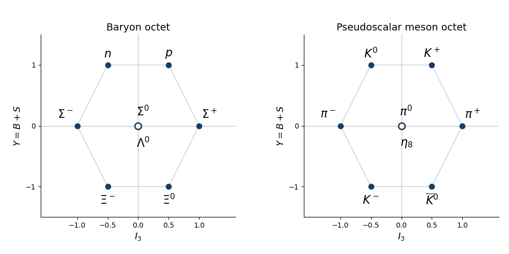

# Paper 44

↑ **Parent:** [Iii](../iii.md)

[https://www.maths.cam.ac.uk/postgrad/part-iii/files/pastpapers/2015/paper_44.pdf](https://www.maths.cam.ac.uk/postgrad/part-iii/files/pastpapers/2015/paper_44.pdf)

**Table of contents**

- [1](#1)
  - [Solution](#1/solution)
- [2](#2)
  - [Solution](#2/solution)
- [3](#3)
  - [Solution](#3/solution)
- [4](#4)
  - [Solution](#4/solution)

## 1

↑ **Parent:** [Paper 44](paper-44.md)

<h3 id="1/solution">Solution</h3>

↑ **Parent:** [1](#1)

Introduce a parameter $t$ to keep track of total degree. The [power series](../../../real-analysis.md#power-series) for the [matrix exponential](../../../linear-operator-theory.md#matrix-exponential) gives

$$
e^{tX}e^{tY}=I+t(X+Y)+t^2\left(\frac{X^2}{2}+XY+\frac{Y^2}{2}\right)+O(t^3).
$$

Set $S=X+Y$ and $C=\tfrac12[X,Y]$, where the [commutator](../../../lie-algebra.md#commutator) is $[X,Y]=XY-YX$. Expanding a second [matrix exponential](../../../linear-operator-theory.md#matrix-exponential) gives

$$
e^{tS+t^2C}=I+tS+t^2\left(C+\frac{S^2}{2}\right)+O(t^3).
$$

Since

$$
C+\frac{S^2}{2}=\frac12(XY-YX)+\frac12(X^2+XY+YX+Y^2)=\frac{X^2}{2}+XY+\frac{Y^2}{2},
$$

the two expressions agree through total degree two. More explicitly, applying the local [matrix logarithm](../../../vector-space.md#matrix-logarithm) to the first expansion gives $\log(e^{tX}e^{tY})=t(X+Y)+\tfrac12t^2[X,Y]+O(t^3)$. This proves the displayed order of the [Baker--Campbell--Hausdorff formula](../../../linear-operator-theory.md#baker-campbell-hausdorff-formula). The [Lie algebra](../../../lie-algebra.md) is closed under the [commutator](../../../lie-algebra.md#commutator), so its displayed exponent lies in the same [Lie algebra](../../../lie-algebra.md). The expansion is a [formal power series](../../../commutative-algebra.md#formal-power-series) identity, or a convergent identity sufficiently near the [identity matrix](../../../vector-space.md#identity-matrix); this argument does not assert unrestricted global convergence.

The next two terms of the [Baker--Campbell--Hausdorff formula](../../../linear-operator-theory.md#baker-campbell-hausdorff-formula) are the two cubic [commutators](../../../lie-algebra.md#commutator):

$$
\boxed{\log(e^Xe^Y)=X+Y+\frac12[X,Y]+\frac1{12}[X,[X,Y]]+\frac1{12}[Y,[Y,X]]+O(4).}
$$

Here $O(4)$ means total degree at least four in $X,Y$. If one continues by one more degree, the quartic contribution is $-\tfrac1{24}[Y,[X,[X,Y]]]$.

For the [Pauli matrices](../../../algebra.md#pauli-matrices), use the [Pauli matrix multiplication law](../../../algebra.md#pauli-matrix-multiplication-law)

$$
\tau_a\tau_b=\delta_{ab}I+i\epsilon_{abc}\tau_c.
$$

Put $N=\mathbf n\cdot\boldsymbol\tau$. The antisymmetric term disappears when contracted with $n_an_b$, so $N^2=|\mathbf n|^2I=I$. Consequently every even power of $N$ equals $I$, and every odd power equals $N$. Splitting the [matrix exponential](../../../linear-operator-theory.md#matrix-exponential) into even and odd terms of its [power series](../../../real-analysis.md#power-series) yields

$$
\boxed{e^{i\alpha N}=\cos\alpha\,I+i\sin\alpha\,N.}
$$

The [Pauli matrices](../../../algebra.md#pauli-matrices) are [Hermitian matrices](../../../hilbert-space.md#hermitian-operator), and the components of $\mathbf n$ are real, so $N^\dagger=N$. For real $\alpha$, the resulting matrix $U$ satisfies

$$
U^\dagger U=(\cos\alpha I-i\sin\alpha N)(\cos\alpha I+i\sin\alpha N)=I.
$$

Also $\operatorname{tr}N=0$ and $N^2=I$, so its two [eigenvalues](../../../linear-operator-theory.md#eigenvalue) are $1,-1$. The [eigenvalues](../../../linear-operator-theory.md#eigenvalue) of $U$ are therefore $e^{i\alpha},e^{-i\alpha}$, whose product is one. Thus $U$ is a [unitary matrix](../../../linear-operator-theory.md#unitary-matrix) with [determinant](../../../linear-algebra.md#determinant) one: **it belongs to the [SU(2) group](../../../topological-group.md#su-2-group)**.

Multiplying the two exact [Pauli matrix](../../../algebra.md#pauli-matrices) exponentials, and using $\tau_1\tau_2=i\tau_3$, gives

$$
\boxed{e^{i\alpha\tau_1}e^{i\beta\tau_2}=\cos\alpha\cos\beta\,I+i\left(\sin\alpha\cos\beta\,\tau_1+\cos\alpha\sin\beta\,\tau_2-\sin\alpha\sin\beta\,\tau_3\right).}
$$

In particular, the $\tau_3$ term has a minus sign. Its quadratic [Taylor expansion](../../../calculus.md#taylor-expansion) is

$$
I+i\alpha\tau_1+i\beta\tau_2-i\alpha\beta\tau_3-\frac12(\alpha^2+\beta^2)I+O(3).
$$

Taking $X=i\alpha\tau_1$, $Y=i\beta\tau_2$, the [Pauli matrix commutator identity](../../../algebra.md#pauli-matrix-commutator-identity) gives $[X,Y]=-2i\alpha\beta\tau_3$. The quadratic exponent in the [Baker--Campbell--Hausdorff formula](../../../linear-operator-theory.md#baker-campbell-hausdorff-formula) is therefore $Z=i\alpha\tau_1+i\beta\tau_2-i\alpha\beta\tau_3$. In $e^Z=I+Z+\tfrac12Z^2+O(3)$, only the linear part of $Z$ contributes to $Z^2$ through degree two. The anticommutator $\tau_1\tau_2+\tau_2\tau_1=0$ gives $Z^2=-(\alpha^2+\beta^2)I+O(3)$, reproducing the exact product's quadratic expansion.

## 2

↑ **Parent:** [Paper 44](paper-44.md)

<h3 id="2/solution">Solution</h3>

↑ **Parent:** [2](#2)

For a differentiable curve $R(t)$ in the [SO(3) group](../../../linear-algebra.md#so-3-group) with $R(0)=I$, differentiating $R(t)^TR(t)=I$ gives $X^T+X=0$, where $X=R'(0)$. Conversely, if $X$ is a real [skew-symmetric matrix](../../../linear-algebra.md#skew-symmetric-matrix), $e^{tX}$ is an [orthogonal matrix](../../../linear-algebra.md#orthogonal-matrix) and has [determinant](../../../linear-algebra.md#determinant) $e^{t\operatorname{tr}X}=1$. Hence

$$
\boxed{\mathfrak{so}(3)=\{X\in M_3(\mathbb R):X^T=-X\},\qquad\dim\mathfrak{so}(3)=3.}
$$

The displayed generators of the [SO(3) Lie algebra](../../../semisimple-lie-algebra.md#so-3-lie-algebra) are

$$
T_1=\begin{pmatrix}0&0&0\\0&0&-1\\0&1&0\end{pmatrix},\quad T_2=\begin{pmatrix}0&0&1\\0&0&0\\-1&0&0\end{pmatrix},\quad T_3=\begin{pmatrix}0&-1&0\\1&0&0\\0&0&0\end{pmatrix}.
$$

They are [linearly independent](../../../vector-space.md#linear-independence) and span the three independent entries of a real [skew-symmetric matrix](../../../linear-algebra.md#skew-symmetric-matrix). Equivalently, $T_a\mathbf v=\mathbf e_a\times\mathbf v$. The vector triple-product identity then gives

$$
[T_a,T_b]\mathbf v=\mathbf e_a\times(\mathbf e_b\times\mathbf v)-\mathbf e_b\times(\mathbf e_a\times\mathbf v)=(\mathbf e_a\times\mathbf e_b)\times\mathbf v.
$$

Thus the [structure constants of a Lie algebra](../../../lie-algebra.md#structure-constant-of-a-lie-algebra) in this basis are

$$
\boxed{[T_a,T_b]=\epsilon_{abc}T_c,\qquad f_{ab}{}^c=\epsilon_{abc}.}
$$

Use a real, antisymmetric convention throughout the [SO(3) vector Higgs model](../../../standard-model.md#so-3-vector-higgs-model). With [gauge coupling](../../../relativistic-quantum-field.md#gauge-coupling) $g$, the [gauge covariant derivative](../../../relativistic-quantum-field.md#gauge-covariant-derivative) and [gauge field strength](../../../relativistic-quantum-field.md#gauge-field-strength) are

$$
\boxed{D_\mu\Phi=\partial_\mu\Phi+gA_\mu\Phi,\qquad F_{\mu\nu}=\partial_\mu A_\nu-\partial_\nu A_\mu+g[A_\mu,A_\nu],\qquad[D_\mu,D_\nu]=gF_{\mu\nu}.}
$$

There is no factor of $i$ in these formulas because $T_a$ are real antisymmetric generators. For a local [non-Abelian gauge transformation](../../../relativistic-quantum-field.md#non-abelian-gauge-transformation) $\Phi'=R\Phi$, with $R(x)$ in the [SO(3) group](../../../linear-algebra.md#so-3-group), the compatible transformation of the [gauge potential](../../../relativistic-quantum-field.md#gauge-field) is

$$
A'_\mu=RA_\mu R^{-1}-g^{-1}(\partial_\mu R)R^{-1}.
$$

It gives $D'_\mu\Phi'=R D_\mu\Phi$ and $F'_{\mu\nu}=RF_{\mu\nu}R^{-1}$. These covariance laws fix the relative signs in the [gauge covariant derivative](../../../relativistic-quantum-field.md#gauge-covariant-derivative) and [gauge field strength](../../../relativistic-quantum-field.md#gauge-field-strength).

An [SO(3) invariant quartic scalar potential](../../../standard-model.md#so-3-invariant-quartic-scalar-potential) is

$$
\boxed{V(\Phi)=\frac\lambda4(\Phi^T\Phi-v^2)^2,\qquad\lambda>0,\quad v>0.}
$$

Since $(R\Phi)^T(R\Phi)=\Phi^T\Phi$, this [scalar potential](../../../quantum-field-theory.md#scalar-potential) is [gauge-invariant](../../../relativistic-quantum-field.md#gauge-invariance). Its minimum is the sphere $\Phi^T\Phi=v^2$, rather than a preferred direction in the internal vector space.

Writing $\mathbf A_\mu=(A_{\mu1},A_{\mu2},A_{\mu3})$, the [cross product](../../../vector-space.md#cross-product) form of the [gauge covariant derivative](../../../relativistic-quantum-field.md#gauge-covariant-derivative) is $D_\mu\Phi=\partial_\mu\Phi+g\mathbf A_\mu\times\Phi$. In components this is

$$
\boxed{\begin{aligned}(D_\mu\Phi)_1&=\partial_\mu\Phi_1+g(A_{\mu2}\Phi_3-A_{\mu3}\Phi_2),\\(D_\mu\Phi)_2&=\partial_\mu\Phi_2+g(A_{\mu3}\Phi_1-A_{\mu1}\Phi_3),\\(D_\mu\Phi)_3&=\partial_\mu\Phi_3+g(A_{\mu1}\Phi_2-A_{\mu2}\Phi_1).\end{aligned}}
$$

Correspondingly, the [gauge field strength](../../../relativistic-quantum-field.md#gauge-field-strength) has components

$$
F_{\mu\nu a}=\partial_\mu A_{\nu a}-\partial_\nu A_{\mu a}+g\epsilon_{abc}A_{\mu b}A_{\nu c}.
$$

A [covariantly constant vector Higgs field](../../../standard-model.md#covariantly-constant-vector-higgs-field) has constant norm, because

$$
\partial_\mu(\Phi^T\Phi)=2\Phi^T\partial_\mu\Phi=-2g\Phi^TA_\mu\Phi=0.
$$

The last equality uses antisymmetry of the [gauge potential](../../../relativistic-quantum-field.md#gauge-field). On a connected region write this norm as $\phi\geq0$. If $\phi=0$, the [vector Higgs field](../../../standard-model.md#vector-higgs-field) is identically zero. If $\phi>0$, the [SO(3) group](../../../linear-algebra.md#so-3-group) acts transitively on [unit vectors](../../../vector-space.md#unit-vector), so choose a smooth local [non-Abelian gauge transformation](../../../relativistic-quantum-field.md#non-abelian-gauge-transformation) rotating $\Phi/\phi$ to $\mathbf e_3$. In this [unitary gauge](../../../standard-model.md#unitary-gauge), $\Phi=(0,0,\phi)^T$ with $\phi$ constant. This is a local construction, and is global on a trivial contractible region; a nontrivial bundle can require more than one gauge patch.

For nonzero $\phi$, substituting the constant aligned [vector Higgs field](../../../standard-model.md#vector-higgs-field) into $D_\mu\Phi=0$ gives $g\phi(A_{\mu2},-A_{\mu1},0)^T=0$. For nonzero [gauge coupling](../../../relativistic-quantum-field.md#gauge-coupling), **the most general compatible [gauge potential](../../../relativistic-quantum-field.md#gauge-field) and [gauge field strength](../../../relativistic-quantum-field.md#gauge-field-strength) are**

$$
\boxed{A_\mu=a_\mu T_3,\qquad F_{\mu\nu}=(\partial_\mu a_\nu-\partial_\nu a_\mu)T_3,}
$$

where $a_\mu$ is an arbitrary real one-form. Thus the surviving [gauge group](../../../relativistic-quantum-field.md#gauge-group) is the $SO(2)$ [stabilizer subgroup](../../../group-theory.md#stabilizer-subgroup) of $\mathbf e_3$. A [covariantly constant vector Higgs field](../../../standard-model.md#covariantly-constant-vector-higgs-field) does not force the [gauge field strength](../../../relativistic-quantum-field.md#gauge-field-strength) to vanish: it only requires the curvature to annihilate that field.

For the [Higgs mechanism](../../../standard-model.md#higgs-mechanism), choose a vacuum of the [SO(3) invariant quartic scalar potential](../../../standard-model.md#so-3-invariant-quartic-scalar-potential), so the constant norm is $v$. The canonically normalized [kinetic term](../../../quantum-field-theory.md#kinetic-term) then contains

$$
\frac12(D_\mu\Phi)^T(D^\mu\Phi)\supset\frac12g^2v^2\left(A_{\mu1}A_1^\mu+A_{\mu2}A_2^\mu\right).
$$

The two broken-direction [gauge bosons](../../../relativistic-quantum-field.md#gauge-boson) have mass $gv$ (or $|g|v$ if the sign of $g$ is unrestricted), while the $T_3$ [gauge boson](../../../relativistic-quantum-field.md#gauge-boson) remains massless. The two angular [Goldstone bosons](../../../critical-phenomenon.md#goldstone-boson) supply the massive vectors' [longitudinal gauge-boson polarizations](../../../relativistic-quantum-field.md#longitudinal-polarization-of-a-massive-vector-boson). The radial fluctuation remains a physical [scalar field](../../../quantum-field-theory.md#scalar-field), with $m_h^2=2\lambda v^2$ for this normalization. The condition $D_\mu\Phi=0$ selects backgrounds without broken-direction [gauge potentials](../../../relativistic-quantum-field.md#gauge-field); fluctuations about such a vacuum exhibit the two massive modes. Constancy of the norm alone does not require it to minimize the [scalar potential](../../../quantum-field-theory.md#scalar-potential).

## 3

↑ **Parent:** [Paper 44](paper-44.md)

<h3 id="3/solution">Solution</h3>

↑ **Parent:** [3](#3)

The [special orthogonal group](../../../linear-algebra.md#special-orthogonal-group) in five dimensions is

$$
SO(5)=\{R\in M_5(\mathbb R):R^TR=I,\ \det R=1\}.
$$

Its [Lie algebra](../../../lie-algebra.md) consists of real [skew-symmetric matrices](../../../linear-algebra.md#skew-symmetric-matrix). There are $5\cdot4/2=10$ independent entries above the diagonal, so **$\dim SO(5)=10$**. Equivalently, the orthogonality equations impose fifteen independent constraints on twenty-five matrix entries; the [determinant](../../../linear-algebra.md#determinant) condition chooses a component without changing the dimension.

Fix the fifth coordinate. The matrices $\operatorname{diag}(S,1)$, $S\in SO(4)$, form an explicit subgroup. Under this subgroup the defining vector space splits as $\mathbb R^4\oplus\mathbb R\mathbf e_5$, so its [branching rule](../../../lie-algebra.md#branching-rule) is $\mathbf5\downarrow SO(4)=\mathbf4\oplus\mathbf1$. An element of the [so5 Lie algebra](../../../semisimple-lie-algebra.md#so5-lie-algebra) can be written uniquely as

$$
X=\begin{pmatrix}B&w\\-w^T&0\end{pmatrix},\qquad B\in\mathfrak{so}(4),\quad w\in\mathbb R^4.
$$

Conjugation by $\operatorname{diag}(S,1)$ sends $B$ to $SBS^{-1}$ and $w$ to $Sw$. The first summand is the six-dimensional [Adjoint representation of a Lie algebra](../../../lie-algebra.md#adjoint-representation-of-a-lie-algebra) of $\mathfrak{so}(4)$, and the second is its four-dimensional vector representation. Hence the [SO5 to SO4 branching](../../../semisimple-lie-algebra.md#so5-to-so4-branching) gives

$$
\boxed{\mathbf5\to\mathbf4\oplus\mathbf1,\qquad\mathbf{10}\to\mathbf6\oplus\mathbf4.}
$$

For the [left SU(2) subgroup of SO(4)](../../../semisimple-lie-algebra.md#left-su-2-subgroup-of-so-4), identify $\mathbb R^4$ with the [quaternions](../../../algebra.md#quaternion). Left multiplication by a unit [quaternion](../../../algebra.md#quaternion) is a real orthogonal transformation and gives an embedded [SU(2) group](../../../topological-group.md#su-2-group). More generally, $q\mapsto a q b^{-1}$ gives the double cover $SU(2)_L\times SU(2)_R\to SO(4)$ with kernel $\{(1,1),(-1,-1)\}$. After complexifying, the vector representation is $(\mathbf2,\mathbf2)$ and the [Adjoint representation](../../../lie-algebra.md#adjoint-representation-of-a-lie-algebra) is $(\mathbf3,\mathbf1)\oplus(\mathbf1,\mathbf3)$. Restricting to the left factor turns the right factor into a multiplicity space. Therefore

$$
\boxed{\mathbf4\to\mathbf2\oplus\mathbf2,\qquad\mathbf6\to\mathbf3\oplus\mathbf1\oplus\mathbf1\oplus\mathbf1,\qquad\mathbf1\to\mathbf1.}
$$

These are decompositions into complex [irreducible representations](../../../representation-theory.md#irreducible-representation); the real $\mathbf4$ is the underlying real representation of a quaternionic doublet. Combining the [branching rules](../../../lie-algebra.md#branching-rule) gives

$$
\mathbf5\to2\mathbf2\oplus\mathbf1,\qquad\mathbf{10}\to\mathbf3\oplus2\mathbf2\oplus3\mathbf1.
$$

Write a [weight](../../../semisimple-lie-algebra.md#weight-representation-theory) as $\lambda=(x,y)$. The integrality conditions for the [B2 root system](../../../semisimple-lie-algebra.md#b2-root-system) give $2x\in\mathbb Z$ and $y-x\in\mathbb Z$. Hence $x=m/2$, $y=m/2+n$, with $m,n\in\mathbb Z$. Thus

$$
\boxed{P=\mathbb Z^2\ \cup\ \left(\mathbb Z+\frac12\right)^2.}
$$

This is the [B2 weight lattice](../../../semisimple-lie-algebra.md#b2-weight-lattice), with an integer square lattice and a second square lattice shifted by $(1/2,1/2)$. The eight [roots of a root system](../../../semisimple-lie-algebra.md#root-of-a-root-system) are

$$
\pm(1,0),\quad\pm(0,1),\quad\pm(1,1),\quad\pm(1,-1).
$$

The short roots lie on the coordinate axes and the long roots on the diagonals. The positive roots for the given simple-root choice are $\alpha$, $\beta$, $\alpha+\beta$, $2\alpha+\beta$.

The integrality conditions determine the [weight lattice](../../../semisimple-lie-algebra.md#weight-lattice) of the [Lie algebra](../../../lie-algebra.md), equivalently of the simply connected [Spin group](../../../semisimple-lie-algebra.md#spin-group) $\operatorname{Spin}(5)$. For the global [special orthogonal group](../../../linear-algebra.md#special-orthogonal-group) $SO(5)$, a $2\pi$ rotation in either coordinate plane is the identity, so a genuine [group representation](../../../representation-theory.md#group-representation) requires integer $x,y$. Thus **the half-integer coset contains spin representations that do not descend to $SO(5)$**. Both representations requested here have integer weights, so their diagrams are unaffected by this distinction.

The [root system](../../../semisimple-lie-algebra.md#root-system) of the displayed $SO(4)$ subgroup is $\{\pm(1,1),\pm(1,-1)\}$. The two orthogonal pairs give its two commuting $\mathfrak{su}(2)$ factors. Choose the left factor to have root $\delta=(1,1)$; exchanging the two diagonal pairs exchanges left and right. Its [coroot](../../../semisimple-lie-algebra.md#coroot) pairs with a [weight](../../../semisimple-lie-algebra.md#weight-representation-theory) as

$$
\langle\lambda,\delta^\vee\rangle=\frac{2\lambda\cdot\delta}{\delta\cdot\delta}=x+y.
$$

This demonstrates the [diagonal-root SU(2) embedding in SO(5)](../../../semisimple-lie-algebra.md#diagonal-root-su-2-embedding-in-so-5) directly. The short-axis root $\alpha$ would instead give $2x$, and therefore a different subgroup: on the vector representation it would produce a triplet and two singlets rather than two doublets and a singlet.

For the vector representation, simultaneously rotate the first and second coordinate planes. Over $\mathbb C$, the two planes give opposite pairs of [weights](../../../semisimple-lie-algebra.md#weight-representation-theory), while the fifth coordinate is fixed. Hence its [weight diagram](../../../semisimple-lie-algebra.md#weight-diagram) is

$$
\boxed{\operatorname{Wt}(\mathbf5)=\{(1,0),(-1,0),(0,1),(0,-1),(0,0)\},}
$$

with every [weight multiplicity](../../../semisimple-lie-algebra.md#weight-multiplicity) equal to one. Evaluating $x+y$ gives $+1$ twice, $-1$ twice and $0$ once, exactly two [SU(2) representations](../../../representation-theory.md#representation-theory-of-su-2) of dimension two and one singlet.

For the [Adjoint representation](../../../lie-algebra.md#adjoint-representation-of-a-lie-algebra), the [root-space decomposition](../../../semisimple-lie-algebra.md#root-space-decomposition) has one one-dimensional space for each of the eight roots and a two-dimensional zero-weight [Cartan subalgebra](../../../semisimple-lie-algebra.md#cartan-subalgebra). Thus

$$
\boxed{\operatorname{Wt}(\mathbf{10})=\{\text{eight roots of }B_2\}\cup\{(0,0)\text{ with multiplicity }2\}.}
$$

The [coroot](../../../semisimple-lie-algebra.md#coroot) values $x+y$ have multiplicities $1,2,4,2,1$ at $-2,-1,0,1,2$. One zero-weight state joins the $\pm2$ states to make a triplet; the $\pm1$ states form two doublets, leaving three zero-weight singlets. This verifies the earlier [branching rule](../../../lie-algebra.md#branching-rule) and accounts for all ten dimensions.

**[Figure 1](#3/image-b2-weight-lattice-and-the-weight-diagrams-of-the-vector-and-adjoint-representations). B2 weight lattice and the weight diagrams of the vector and adjoint representations**.

## 4

↑ **Parent:** [Paper 44](paper-44.md)

<h3 id="4/solution">Solution</h3>

↑ **Parent:** [4](#4)

Use [flavor hypercharge](../../../standard-model.md#flavor-hypercharge) $Y=B+S$, where $B$ is [baryon number](../../../standard-model.md#baryon-number) and $S$ is [strangeness](../../../standard-model.md#strangeness). The [isospin](../../../standard-model.md#isospin) coordinate is $I_3$. The [baryon octet](../../../standard-model.md#baryon-octet) has coordinates

$$
\begin{array}{c|rrrrrrrr}
\text{state}&p&n&\Sigma^+&\Sigma^0&\Sigma^-&\Lambda^0&\Xi^0&\Xi^-\\\hline
I_3&\tfrac12&-\tfrac12&1&0&-1&0&\tfrac12&-\tfrac12\\
Y&1&1&0&0&0&0&-1&-1
\end{array}
$$

Here the [nucleons](../../../physics.md#nucleon) have $S=0$, the [Sigma baryons](../../../physics.md#sigma-baryon) and [Lambda baryon](../../../physics.md#lambda-baryon) have $S=-1$, and the [Xi baryons](../../../physics.md#xi-baryon) have $S=-2$. The central [Sigma baryon](../../../physics.md#sigma-baryon) belongs to an [isospin](../../../standard-model.md#isospin) triplet while the central [Lambda baryon](../../../physics.md#lambda-baryon) is an [isospin](../../../standard-model.md#isospin) singlet; equal coordinates do not identify the states.

The pseudoscalar [meson octet](../../../standard-model.md#meson-octet) is

$$
\begin{array}{c|rrrrrrrr}
\text{state}&K^+&K^0&\pi^+&\pi^0&\pi^-&\eta_8&\bar K^0&K^-\\\hline
I_3&\tfrac12&-\tfrac12&1&0&-1&0&\tfrac12&-\tfrac12\\
Y&1&1&0&0&0&0&-1&-1
\end{array}
$$

The [pions](../../../standard-model.md#pion) have $S=0$, the upper [kaons](../../../physics.md#kaon) have $S=+1$, and their lower antiparticles have $S=-1$. The two central states are the neutral [pion](../../../standard-model.md#pion) and the [Eta octet state](../../../standard-model.md#eta-octet-state). This is the octet basis of [flavor symmetry](../../../standard-model.md#flavor-symmetry); the physical eta can also mix with the flavor-singlet state.

**[Figure 2](#4/image-flavor-su-3-baryon-and-pseudoscalar-meson-octets-in-isospin-and-strong-hypercharge-coordinates). Flavor SU(3) baryon and pseudoscalar meson octets in isospin and strong hypercharge coordinates**.

For the [flavor SU(3) Cartan generators](../../../standard-model.md#flavor-su-3-cartan-generators), choose the Hermitian physics convention and the [inner product](../../../linear-algebra.md#inner-product) $\langle A,B\rangle=\operatorname{tr}(AB)$. Then an orthonormal diagonal basis is

$$
\boxed{h_1=\frac1{\sqrt2}\operatorname{diag}(1,-1,0),\qquad h_2=\frac1{\sqrt6}\operatorname{diag}(1,1,-2),\qquad\operatorname{tr}(h_ih_j)=\delta_{ij}.}
$$

Strictly, $ih_1,ih_2$ are elements of the anti-Hermitian [SU(3) Lie algebra](../../../lie-algebra.md#su-3-lie-algebra); $h_1,h_2$ are the corresponding Hermitian observables. In the quark basis $(u,d,s)$, the up and down [quarks](../../../standard-model.md#quark) form an [isospin](../../../standard-model.md#isospin) doublet and the strange [quark](../../../standard-model.md#quark) is a singlet. Their $I_3$ values are $(1/2,-1/2,0)$. Each [quark](../../../standard-model.md#quark) has [baryon number](../../../standard-model.md#baryon-number) $1/3$, and their [strangeness](../../../standard-model.md#strangeness) values are $(0,0,-1)$. It follows that

$$
\boxed{I_3=\frac{h_1}{\sqrt2},\qquad Y=\sqrt{\frac23}\,h_2=\operatorname{diag}\left(\frac13,\frac13,-\frac23\right).}
$$

These [flavor hypercharge](../../../standard-model.md#flavor-hypercharge) conventions differ from the [electroweak hypercharge](../../../standard-model.md#hypercharge) convention. If instead the inner product is $2\operatorname{tr}(AB)$, the orthonormal basis is $t_3=h_1/\sqrt2$, $t_8=h_2/\sqrt2$, and the same operators are $I_3=t_3$, $Y=2t_8/\sqrt3$.

In the ordinary [quark model](../../../physics.md#quark-model), the [proton](../../../physics.md#proton) has valence content $uud$ and charge $+1$, while the [neutron](../../../physics.md#neutron) has content $udd$ and charge zero. Additivity of [electric charge](../../../electromagnetism.md#electric-charge) gives $2q_u+q_d=1$ and $q_u+2q_d=0$, hence $q_u=2/3$, $q_d=-1/3$. The [Sigma baryon](../../../physics.md#sigma-baryon) $\Sigma^-$ has content $dds$ and charge $-1$, giving $2q_d+q_s=-1$. Thus the [quark](../../../standard-model.md#quark) triplet's [electric charges](../../../electromagnetism.md#electric-charge), in units of the positive elementary charge, are

$$
\boxed{(q_u,q_d,q_s)=\left(\frac23,-\frac13,-\frac13\right).}
$$

The [Gell-Mann--Nishijima formula](../../../standard-model.md#gell-mann-nishijima-formula) is consequently

$$
\boxed{Q=I_3+\frac Y2=\frac{h_1}{\sqrt2}+\frac{h_2}{\sqrt6}=\operatorname{diag}\left(\frac23,-\frac13,-\frac13\right).}
$$

It also reproduces every [baryon octet](../../../standard-model.md#baryon-octet) charge from the first diagram. On [antiquarks](../../../standard-model.md#antiquark) the additive quantum numbers reverse sign, and combining a [quark](../../../standard-model.md#quark) with an [antiquark](../../../standard-model.md#antiquark) reproduces the [meson octet](../../../standard-model.md#meson-octet) charges.

Because the down and strange [quarks](../../../standard-model.md#quark) have identical [electric charge](../../../electromagnetism.md#electric-charge), $Q$ commutes with the [U-spin](../../../standard-model.md#u-spin) generators

$$
U_1=\frac{E_{23}+E_{32}}2,\qquad U_2=\frac{E_{23}-E_{32}}{2i},\qquad U_3=\frac12\operatorname{diag}(0,1,-1).
$$

They satisfy $[U_a,U_b]=i\epsilon_{abc}U_c$; equivalently the anti-Hermitian matrices $iU_a$ span an $\mathfrak{su}(2)$ subalgebra. The entries on the $d,s$ block of $Q$ are equal, so **$[Q,U_a]=0$ for all three [U-spin](../../../standard-model.md#u-spin) generators**. The [electric charge](../../../electromagnetism.md#electric-charge) is therefore constant within each irreducible [U-spin](../../../standard-model.md#u-spin) multiplet. For example, [U-spin](../../../standard-model.md#u-spin) relates $\pi^+$ and $K^+$, and relates $p$ and $\Sigma^+$, without changing their charge. It does not imply exact mass degeneracy: unequal down- and strange-quark masses break [U-spin](../../../standard-model.md#u-spin).

For [pion-nucleon octet channels](../../../standard-model.md#pion-nucleon-octet-channels), assume the collision is governed by the [strong interaction](../../../standard-model.md#strong-interaction). The initial [baryon number](../../../standard-model.md#baryon-number) is one and [strangeness](../../../standard-model.md#strangeness) is zero, so an outgoing [meson](../../../physics.md#meson)-[baryon](../../../physics.md#baryon) pair must preserve $B=1$, $S=0$, and [electric charge](../../../electromagnetism.md#electric-charge). Thus its total [flavor hypercharge](../../../standard-model.md#flavor-hypercharge) is $Y=1$. The allowed types are

$$
\boxed{\pi N,\qquad\eta_8N,\qquad K\Lambda,\qquad K\Sigma.}
$$

A [kaon](../../../physics.md#kaon) of $S=+1$ can accompany a [Lambda baryon](../../../physics.md#lambda-baryon) or [Sigma baryon](../../../physics.md#sigma-baryon) of $S=-1$. An antikaon cannot balance the nonpositive [strangeness](../../../standard-model.md#strangeness) of an octet [baryon](../../../physics.md#baryon). A [Xi baryon](../../../physics.md#xi-baryon) would require a meson of $S=+2$, which the [meson octet](../../../standard-model.md#meson-octet) does not contain.

Resolving these types by [electric charge](../../../electromagnetism.md#electric-charge) gives all possible pairs:

$$
\begin{array}{c|l|l}
Q&\text{incoming}&\text{outgoing pairs allowed by additive charges}\\\hline
2&\pi^+p&\pi^+p,\ K^+\Sigma^+\\
1&\pi^0p,\ \pi^+n&\pi^+n,\ \pi^0p,\ \eta_8p,\ K^+\Lambda^0,\ K^+\Sigma^0,\ K^0\Sigma^+\\
0&\pi^-p,\ \pi^0n&\pi^-p,\ \pi^0n,\ \eta_8n,\ K^0\Lambda^0,\ K^+\Sigma^-,\ K^0\Sigma^0\\
-1&\pi^-n&\pi^-n,\ K^0\Sigma^-
\end{array}
$$

In the [isospin](../../../standard-model.md#isospin)-symmetric approximation, total [isospin](../../../standard-model.md#isospin) is conserved as well: the incoming $1\otimes\tfrac12$ contains $I=\tfrac12,\tfrac32$. The $\pi N$ and $K\Sigma$ channels contain both values, while $\eta_8N$ and $K\Lambda$ contain only $I=\tfrac12$. The extreme-charge initial states are pure $I=\tfrac32$, consistently excluding $\eta_8N$ and $K\Lambda$. [Clebsch-Gordan coefficients](../../../representation-theory.md#clebsch-gordan-coefficients) relate amplitudes in different charge channels; the table establishes permission, not equal probabilities. Electromagnetism and unequal up- and down-quark masses introduce small violations of [isospin](../../../standard-model.md#isospin) symmetry.

Finally, [energy](../../../classical-mechanics.md#energy) and [momentum conservation](../../../classical-mechanics.md#momentum-conservation) require $\sqrt{s}\geq m_M+m_B$ for a particular pair, where $s$ is the squared total [four-momentum](../../../special-relativity.md#four-momentum). Only channels above their own threshold can occur. Total [angular momentum](../../../classical-mechanics.md#angular-momentum) and [parity symmetry in quantum field theory](../../../quantum-field-theory.md#parity-symmetry-in-quantum-field-theory) constrain the [partial waves](../../../quantum-mechanics.md#partial-wave) of the [meson-baryon scattering](../../../standard-model.md#meson-baryon-scattering): a pseudoscalar [meson](../../../physics.md#meson) and a positive-parity spin-one-half [baryon](../../../physics.md#baryon) have pair parity $-(-1)^L$ and total [angular momentum](../../../classical-mechanics.md#angular-momentum) $J=L\pm\tfrac12$ (only $J=\tfrac12$ for $L=0$). Initial and final [partial waves](../../../quantum-mechanics.md#partial-wave) must have matching $J$ and parity. Sufficient energy can open a channel, but cannot remove the [electric charge conservation](../../../electromagnetism.md#charge-conservation), [baryon number](../../../standard-model.md#baryon-number), or [strangeness](../../../standard-model.md#strangeness) constraints.

## ↑ Ancestors (8)

1. [Iii](../iii.md)
2. [2015](../../2015.md)
3. [Past exam of the mathematics course of the University of Cambridge](../../../past-exam-of-the-mathematics-course-of-the-university-of-cambridge.md)
4. [Mathematics course of the University of Cambridge](../../../university-of-cambridge.md#mathematics-course-of-the-university-of-cambridge)
5. [Course of the University of Cambridge](../../../university-of-cambridge.md#course-of-the-university-of-cambridge)
6. [University of Cambridge](../../../university-of-cambridge.md)
7. [List of universities](../../../README.md#list-of-universities)
8. [Codex Wiki](../../../README.md)
