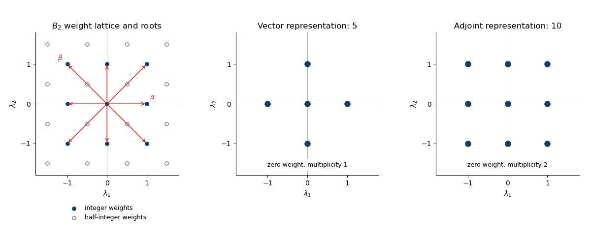

<h1 id="3/solution">Solution</h1>

↑ **Parent:** [3](../3.md)

The [special orthogonal group](../../../../../special-orthogonal-group.md) in five dimensions is

$$
SO(5)=\{R\in M_5(\mathbb R):R^TR=I,\ \det R=1\}.
$$

Its [Lie algebra](../../../../../lie-algebra-split.md) consists of real [skew-symmetric matrices](../../../../../skew-symmetric-matrix.md). There are $5\cdot4/2=10$ independent entries above the diagonal, so **$\dim SO(5)=10$**. Equivalently, the orthogonality equations impose fifteen independent constraints on twenty-five matrix entries; the [determinant](../../../../../determinant.md) condition chooses a component without changing the dimension.

Fix the fifth coordinate. The matrices $\operatorname{diag}(S,1)$, $S\in SO(4)$, form an explicit subgroup. Under this subgroup the defining vector space splits as $\mathbb R^4\oplus\mathbb R\mathbf e_5$, so its [branching rule](../../../../../branching-rule.md) is $\mathbf5\downarrow SO(4)=\mathbf4\oplus\mathbf1$. An element of the [so5 Lie algebra](../../../../../so5-lie-algebra.md) can be written uniquely as

$$
X=\begin{pmatrix}B&w\\-w^T&0\end{pmatrix},\qquad B\in\mathfrak{so}(4),\quad w\in\mathbb R^4.
$$

Conjugation by $\operatorname{diag}(S,1)$ sends $B$ to $SBS^{-1}$ and $w$ to $Sw$. The first summand is the six-dimensional [Adjoint representation of a Lie algebra](../../../../../adjoint-representation-of-a-lie-algebra.md) of $\mathfrak{so}(4)$, and the second is its four-dimensional vector representation. Hence the [SO5 to SO4 branching](../../../../../so5-to-so4-branching.md) gives

$$
\boxed{\mathbf5\to\mathbf4\oplus\mathbf1,\qquad\mathbf{10}\to\mathbf6\oplus\mathbf4.}
$$

For the [left SU(2) subgroup of SO(4)](../../../../../left-su-2-subgroup-of-so-4.md), identify $\mathbb R^4$ with the [quaternions](../../../../../quaternion.md). Left multiplication by a unit [quaternion](../../../../../quaternion.md) is a real orthogonal transformation and gives an embedded [SU(2) group](../../../../../su-2-group.md). More generally, $q\mapsto a q b^{-1}$ gives the double cover $SU(2)_L\times SU(2)_R\to SO(4)$ with kernel $\{(1,1),(-1,-1)\}$. After complexifying, the vector representation is $(\mathbf2,\mathbf2)$ and the [Adjoint representation](../../../../../adjoint-representation-of-a-lie-algebra.md) is $(\mathbf3,\mathbf1)\oplus(\mathbf1,\mathbf3)$. Restricting to the left factor turns the right factor into a multiplicity space. Therefore

$$
\boxed{\mathbf4\to\mathbf2\oplus\mathbf2,\qquad\mathbf6\to\mathbf3\oplus\mathbf1\oplus\mathbf1\oplus\mathbf1,\qquad\mathbf1\to\mathbf1.}
$$

These are decompositions into complex [irreducible representations](../../../../../irreducible-representation.md); the real $\mathbf4$ is the underlying real representation of a quaternionic doublet. Combining the [branching rules](../../../../../branching-rule.md) gives

$$
\mathbf5\to2\mathbf2\oplus\mathbf1,\qquad\mathbf{10}\to\mathbf3\oplus2\mathbf2\oplus3\mathbf1.
$$

Write a [weight](../../../../../weight-representation-theory.md) as $\lambda=(x,y)$. The integrality conditions for the [B2 root system](../../../../../b2-root-system.md) give $2x\in\mathbb Z$ and $y-x\in\mathbb Z$. Hence $x=m/2$, $y=m/2+n$, with $m,n\in\mathbb Z$. Thus

$$
\boxed{P=\mathbb Z^2\ \cup\ \left(\mathbb Z+\frac12\right)^2.}
$$

This is the [B2 weight lattice](../../../../../b2-weight-lattice.md), with an integer square lattice and a second square lattice shifted by $(1/2,1/2)$. The eight [roots of a root system](../../../../../root-of-a-root-system.md) are

$$
\pm(1,0),\quad\pm(0,1),\quad\pm(1,1),\quad\pm(1,-1).
$$

The short roots lie on the coordinate axes and the long roots on the diagonals. The positive roots for the given simple-root choice are $\alpha$, $\beta$, $\alpha+\beta$, $2\alpha+\beta$.

The integrality conditions determine the [weight lattice](../../../../../weight-lattice.md) of the [Lie algebra](../../../../../lie-algebra-split.md), equivalently of the simply connected [Spin group](../../../../../spin-group.md) $\operatorname{Spin}(5)$. For the global [special orthogonal group](../../../../../special-orthogonal-group.md) $SO(5)$, a $2\pi$ rotation in either coordinate plane is the identity, so a genuine [group representation](../../../../../group-representation.md) requires integer $x,y$. Thus **the half-integer coset contains spin representations that do not descend to $SO(5)$**. Both representations requested here have integer weights, so their diagrams are unaffected by this distinction.

The [root system](../../../../../root-system.md) of the displayed $SO(4)$ subgroup is $\{\pm(1,1),\pm(1,-1)\}$. The two orthogonal pairs give its two commuting $\mathfrak{su}(2)$ factors. Choose the left factor to have root $\delta=(1,1)$; exchanging the two diagonal pairs exchanges left and right. Its [coroot](../../../../../coroot.md) pairs with a [weight](../../../../../weight-representation-theory.md) as

$$
\langle\lambda,\delta^\vee\rangle=\frac{2\lambda\cdot\delta}{\delta\cdot\delta}=x+y.
$$

This demonstrates the [diagonal-root SU(2) embedding in SO(5)](../../../../../diagonal-root-su-2-embedding-in-so-5.md) directly. The short-axis root $\alpha$ would instead give $2x$, and therefore a different subgroup: on the vector representation it would produce a triplet and two singlets rather than two doublets and a singlet.

For the vector representation, simultaneously rotate the first and second coordinate planes. Over $\mathbb C$, the two planes give opposite pairs of [weights](../../../../../weight-representation-theory.md), while the fifth coordinate is fixed. Hence its [weight diagram](../../../../../weight-diagram.md) is

$$
\boxed{\operatorname{Wt}(\mathbf5)=\{(1,0),(-1,0),(0,1),(0,-1),(0,0)\},}
$$

with every [weight multiplicity](../../../../../weight-multiplicity.md) equal to one. Evaluating $x+y$ gives $+1$ twice, $-1$ twice and $0$ once, exactly two [SU(2) representations](../../../../../representation-theory-of-su-2.md) of dimension two and one singlet.

For the [Adjoint representation](../../../../../adjoint-representation-of-a-lie-algebra.md), the [root-space decomposition](../../../../../root-space-decomposition.md) has one one-dimensional space for each of the eight roots and a two-dimensional zero-weight [Cartan subalgebra](../../../../../cartan-subalgebra.md). Thus

$$
\boxed{\operatorname{Wt}(\mathbf{10})=\{\text{eight roots of }B_2\}\cup\{(0,0)\text{ with multiplicity }2\}.}
$$

The [coroot](../../../../../coroot.md) values $x+y$ have multiplicities $1,2,4,2,1$ at $-2,-1,0,1,2$. One zero-weight state joins the $\pm2$ states to make a triplet; the $\pm1$ states form two doublets, leaving three zero-weight singlets. This verifies the earlier [branching rule](../../../../../branching-rule.md) and accounts for all ten dimensions.

**[Figure 1](#3/image-b2-weight-lattice-and-the-weight-diagrams-of-the-vector-and-adjoint-representations). B2 weight lattice and the weight diagrams of the vector and adjoint representations**.

## ↑ Ancestors (10)

1. [3](../3.md)
2. [Paper 44](../../paper-44-split.md)
3. [Iii](../../split.md)
4. [2015](../../../split.md)
5. [Past exam of the mathematics course of the University of Cambridge](../../../../split.md)
6. [Mathematics course of the University of Cambridge](../../../../../mathematics-course-of-the-university-of-cambridge.md)
7. [Course of the University of Cambridge](../../../../../course-of-the-university-of-cambridge.md)
8. [University of Cambridge](../../../../../university-of-cambridge-split.md)
9. [List of universities](../../../../../list-of-universities.md)
10. [Codex Wiki](../../../../../split.md)
