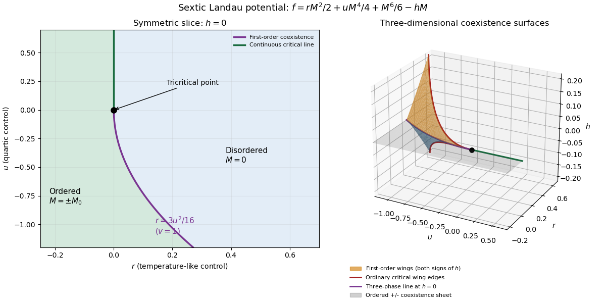

<h1 id="1/solution">Solution</h1>

↑ **Parent:** [1](../1.md)

In [Landau-Ginzburg theory](../../../../../landau-ginzburg-theory.md), use the [sextic even Landau potential](../../../../../sextic-even-landau-potential.md) with a fixed positive stabilising coefficient $v$:

$$
f(M;T,g,h)=f_0(T,g)+\frac r2M^2+\frac u4M^4+\frac v6M^6-hM,
\qquad r=r(T,g),\quad u=u(T,g),\quad v>0.
$$

Here $M$ is the scalar [order parameter](../../../../../order-parameter.md), $h$ its conjugate magnetic field, and $g$ an independent symmetry-preserving control, such as the single-ion coupling in the [Blume–Capel model](../../../../../blume-capel-model.md). Thus $g$ need not break $M\mapsto-M$, whereas $h$ does. The [Blume–Capel mean-field tricritical parameters](../../../../../blume-capel-mean-field-tricritical-parameters.md) are one realization; generally, a [tricritical point](../../../../../tricritical-point.md) occurs when

$$
\boxed{r(T_{\mathrm{TCP}},g_{\mathrm{TCP}})=0,
\qquad u(T_{\mathrm{TCP}},g_{\mathrm{TCP}})=0,
\qquad h=0,\qquad v>0.}
$$

Two controls tune away the quadratic and quartic terms. For $u>0$, crossing $r=0$ at $h=0$ gives a [continuous phase transition](../../../../../continuous-phase-transition.md); for $u<0$, the quartic term instead favours a finite-$M$ minimum before the origin loses local stability. The sextic term bounds the [free energy](../../../../../thermodynamic-free-energy.md) below. **The [tricritical point](../../../../../tricritical-point.md) joins the continuous and discontinuous transition loci.**

For the symmetric [phase diagram](../../../../../phase-diagram.md), write $s=M^2$. A nonzero [stationary point](../../../../../stationary-point.md) obeys $r+us+vs^2=0$. Its [free-energy density](../../../../../free-energy-density.md) relative to the origin is $rs/2+us^2/4+vs^3/6$. Equality of the two minimum values, together with stationarity, gives

$$
\boxed{M_0^2=-\frac{3u}{4v},\qquad
r=\frac{3u^2}{16v}\quad(u<0).}
$$

At this [phase coexistence](../../../../../phase-coexistence.md) point,

$$
f(M)-f_0=\frac v6M^2\left(M^2+\frac{3u}{4v}\right)^2\geq0,
$$

so $M=0,\pm M_0$ are genuinely degenerate [global minima](../../../../../global-minimum.md), not just stationary solutions. The [spinodal points](../../../../../spinodal-point.md) are $r=0$ for the disordered local minimum and $r=u^2/(4v)$ for the appearance of the ordered minima. They are limits of [metastability](../../../../../metastability.md), distinct from the equilibrium [first-order phase transition](../../../../../first-order-phase-transition.md) at $3u^2/(16v)$.

Accordingly, the coefficient equations determining the physical temperature curves are

$$
\boxed{r(T_C(g),g)=0\quad\text{with }u(T_C(g),g)>0,}
$$

$$
\boxed{r(T_0(g),g)=\frac{3u(T_0(g),g)^2}{16v(T_0(g),g)}
\quad\text{with }u(T_0(g),g)<0.}
$$

The simultaneous zeros of $r$ and $u$ determine $T_{\mathrm{TCP}}$ and $g_{\mathrm{TCP}}$. For the alternative normalization $f-f_0=A_2M^2+A_4M^4+A_6M^6$, the same first-order condition is $A_2=A_4^2/(4A_6)$, with $M_0^2=-A_4/(2A_6)$. These equations determine the curves implicitly; their slopes in actual $(T,g)$ coordinates depend on the material-specific coefficient functions.

In three controls $(T,g,h)$, or locally equivalent $(r,u,h)$ coordinates, there are [tricritical first-order wings](../../../../../tricritical-wing.md). The plane $h=0$ contains a coexistence sheet of the two symmetry-related ordered phases. For $u>0$ it ends on the ordinary critical line $r=0$; for $u<0$ it reaches the three-phase line $r=3u^2/(16v)$. Two further first-order surfaces extend from that line into $h>0$ and $h<0$. Across a wing, two minima of the same sign but different magnitudes exchange global stability; the field favours that sign. Each wing ends on an ordinary critical edge where those minima and their intervening maximum merge. The three surfaces and their critical boundaries meet at the [tricritical point](../../../../../tricritical-point.md).

The [tricritical wing critical edges](../../../../../tricritical-wing-critical-edge.md) follow by imposing $f'=f''=f'''=0$ at $M\ne0$:

$$
\boxed{M_c^2=-\frac{3u}{10v},\qquad
r_c=\frac{9u^2}{20v},\qquad
h_c=\frac{6u^2}{25v}M_c\quad(u<0).}
$$

Here $f''''(M_c)=-12u>0$, confirming an ordinary quartic critical minimum locally. The field scale $|h_c|\propto(-u)^{5/2}$ and the temperature-like displacement $r_c\propto u^2$ both vanish at the [tricritical point](../../../../../tricritical-point.md). If $r,u$ are independent smooth local coordinates in $(T,g)$, the following diagram has the same local topology as the physical three-dimensional [phase diagram](../../../../../phase-diagram.md). Its surfaces use exact equal-minimum conditions, as described by [tricritical wing coexistence factorization](../../../../../tricritical-wing-coexistence-factorization.md).

**[Figure 1](#1/image-symmetric-transition-curves-and-three-dimensional-first-order-wings-of-a-sextic-landau-potential). Symmetric transition curves and three-dimensional first-order wings of a sextic Landau potential**.

For the [order-parameter critical exponent](../../../../../order-parameter-critical-exponent.md) and [critical-isotherm exponent](../../../../../critical-isotherm-exponent.md) at the [tricritical point](../../../../../tricritical-point.md), set $u=0$ to leading order and take $r\propto t$. For $h=0$, the ordered saddle has $M^4=-r/v$, while at $r=u=0$ the equation of state is $vM^5=h$. Hence **the tricritical [mean-field critical exponents](../../../../../mean-field-critical-exponent.md) are**

$$
\boxed{\beta=\frac14,\qquad\delta=5.}
$$

These are [mean-field critical exponents](../../../../../mean-field-critical-exponent.md). Below the tricritical [upper critical dimension](../../../../../upper-critical-dimension.md) they need not be the interacting exponents, and at that dimension logarithmic corrections can accompany the powers. Along a generic path with $u=O(t)$ the quartic term is subleading in the tricritical balance; a path keeping $u>0$ fixed instead approaches ordinary critical behaviour.

For the [Blume–Capel model](../../../../../blume-capel-model.md), take ferromagnetic $J>0$, count each nearest-neighbour bond once and use hypercubic coordination $z=2D$. The nearest-neighbour direction sum in the printed Hamiltonian is understood implicitly. In a ferromagnetic [mean-field approximation](../../../../../mean-field-approximation.md), write $M=\langle\sigma\rangle$ and replace the interaction by its self-consistent single-site field $zJM$. The single-site [partition function](../../../../../canonical-partition-function.md) and variational [free-energy density](../../../../../free-energy-density.md) are

$$
Z_1(M)=1+2e^{-g/(k_BT)}\cosh\!\left(\frac{zJM}{k_BT}\right),
\qquad
f_{\mathrm{MF}}(M)=\frac{zJ}{2}M^2-k_BT\log Z_1(M).
$$

The first term prevents double counting the interaction energy. Differentiation gives the [mean-field self-consistency equation](../../../../../self-consistency-equation.md)

$$
\boxed{M=\frac{2e^{-g/(k_BT)}\sinh(zJM/(k_BT))}
 {1+2e^{-g/(k_BT)}\cosh(zJM/(k_BT))}.}
$$

Set $K=zJ/(k_BT)$ and $q=2e^{-g/(k_BT)}/[1+2e^{-g/(k_BT)}]$, the occupied-spin probability at $M=0$. Expanding the single-site logarithm yields

$$
\frac{f_{\mathrm{MF}}-f_{\mathrm{MF}}(0)}{k_BT}
=\frac12(K-qK^2)M^2
-\frac{q(1-3q)K^4}{24}M^4
-\frac{q(1-15q+30q^2)K^6}{720}M^6+O(M^8).
$$

The nontrivial simultaneous quadratic and quartic zeros require $qK=1$ and $q=1/3$, hence $K=3$. At those values the sixth-order coefficient is $9/40>0$, so the degeneracy is a stable [tricritical point](../../../../../tricritical-point.md). **The mean-field tricritical parameters are**

$$
\boxed{T_{\mathrm{TCP}}=\frac{zJ}{3k_B}=\frac{2DJ}{3k_B},\qquad
 g_{\mathrm{TCP}}=k_BT_{\mathrm{TCP}}\log4.}
$$

This is a mean-field result, not a dimension-independent exact lattice transition temperature. The [Boltzmann constant](../../../../../boltzmann-constant.md) $k_B$ is kept explicit in this lattice calculation.

## ↑ Ancestors (10)

1. [1](../1.md)
2. [Paper 45](../../paper-45-split.md)
3. [Iii](../../split.md)
4. [2015](../../../split.md)
5. [Past exam of the mathematics course of the University of Cambridge](../../../../split.md)
6. [Mathematics course of the University of Cambridge](../../../../../mathematics-course-of-the-university-of-cambridge.md)
7. [Course of the University of Cambridge](../../../../../course-of-the-university-of-cambridge.md)
8. [University of Cambridge](../../../../../university-of-cambridge-split.md)
9. [List of universities](../../../../../list-of-universities.md)
10. [Codex Wiki](../../../../../split.md)
