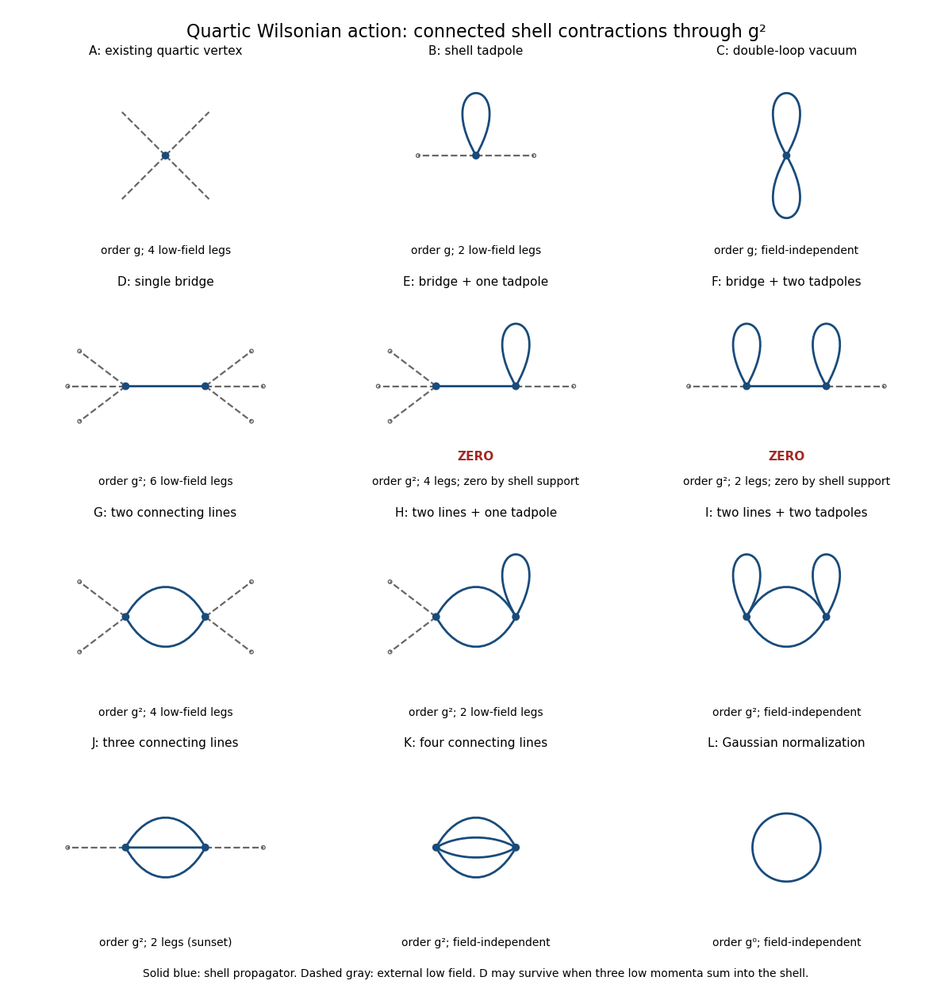

# Paper 46

↑ **Parent:** [Iii](../iii.md)

[https://www.maths.cam.ac.uk/postgrad/part-iii/files/pastpapers/2015/paper_46.pdf](https://www.maths.cam.ac.uk/postgrad/part-iii/files/pastpapers/2015/paper_46.pdf)

**Table of contents**

- [1](#1)
  - [a](#1/a)
    - [Solution](#1/a/solution)
  - [b](#1/b)
    - [Solution](#1/b/solution)
  - [c](#1/c)
    - [Solution](#1/c/solution)
- [2](#2)
  - [i](#2/i)
    - [Solution](#2/i/solution)
  - [ii](#2/ii)
    - [Solution](#2/ii/solution)
  - [iii](#2/iii)
    - [Solution](#2/iii/solution)
- [3](#3)
  - [i](#3/i)
    - [Solution](#3/i/solution)
  - [ii](#3/ii)
    - [Solution](#3/ii/solution)
- [4](#4)
  - [a](#4/a)
    - [Solution](#4/a/solution)
  - [b](#4/b)
    - [Solution](#4/b/solution)
  - [c](#4/c)
    - [Solution](#4/c/solution)

## 1

↑ **Parent:** [Paper 46](paper-46.md)

<h3 id="1/a">a</h3>

↑ **Parent:** [1](#1)

<h4 id="1/a/solution">Solution</h4>

↑ **Parent:** [A](#1/a)

Decompose the original [scalar field](../../../quantum-field-theory.md#scalar-field) as $\Phi=\phi+\widehat\phi$, where $\widetilde\phi(p)$ has support in $|p|\leq\Lambda'$ and $\widetilde{\widehat\phi}(p)$ has support in $\Lambda'<|p|\leq\Lambda$. This is a [momentum-shell decomposition of a scalar field](../../../perturbative-quantum-field-theory.md#momentum-shell-decomposition-of-a-scalar-field). The two collections of integration variables are disjoint. Define the lower-scale [Wilsonian effective action](../../../perturbative-quantum-field-theory.md#wilsonian-effective-action) by integrating out the second collection:

$$
\boxed{e^{-S_{\Lambda'}^{\mathrm{eff}}[\phi]}=\int_{\mathrm{shell}}\mathcal D\widehat\phi\,e^{-S_\Lambda^{\mathrm{eff}}[\phi+\widehat\phi]}.}
$$

A field-independent normalization may be retained as a vacuum term or absorbed into the measure. Integrating this identity over the low modes recovers the original [Euclidean path integral](../../../quantum-field-theory.md#euclidean-path-integral), so it preserves all observables depending only on those modes.

Put $\Delta S=S_\Lambda^{\mathrm{eff}}[\phi+\widehat\phi]-S_\Lambda^{\mathrm{eff}}[\phi]$. The quadratic cross terms integrate to zero: in [Fourier transform](../../../analysis.md#fourier-transform) variables each pairs a low momentum with its negative, which cannot be a shell momentum. Expanding the interaction therefore gives

$$
\boxed{\Delta S=\int d^4x\left\{\frac12(\partial\widehat\phi)^2+\frac12m^2\widehat\phi^2+\frac g{24}\left(4\phi^3\widehat\phi+6\phi^2\widehat\phi^2+4\phi\widehat\phi^3+\widehat\phi^4\right)\right\}.}
$$

Factoring $e^{-S_\Lambda^{\mathrm{eff}}[\phi]}$ out of the shell integral and taking minus its logarithm yields

$$
\boxed{S_{\Lambda'}^{\mathrm{eff}}[\phi]=S_\Lambda^{\mathrm{eff}}[\phi]-\log\int_{\mathrm{shell}}\mathcal D\widehat\phi\,e^{-\Delta S[\phi,\widehat\phi]}.}
$$

This definition is a [Wilsonian effective action](../../../perturbative-quantum-field-theory.md#wilsonian-effective-action), rather than a Legendre transform generating only [one-particle-irreducible Feynman diagrams](../../../perturbative-quantum-field-theory.md#one-particle-irreducible-feynman-diagram).

<h3 id="1/b">b</h3>

↑ **Parent:** [1](#1)

<h4 id="1/b/solution">Solution</h4>

↑ **Parent:** [B](#1/b)

Let the [shell-restricted scalar propagator](../../../scalar-field-theory.md#shell-restricted-scalar-propagator) be

$$
C_>(x-y)=\int_{\Lambda'<|p|\leq\Lambda}\frac{d^4p}{(2\pi)^4}\frac{e^{ip\cdot(x-y)}}{p^2+m^2}.
$$

Write $\Delta S=S_0[\widehat\phi]+V[\phi,\widehat\phi]$ and average with the normalized Gaussian shell measure. The [cumulant expansion](../../../probability-theory.md#cumulant-expansion) gives

$$
S_{\Lambda'}^{\mathrm{eff}}=S_\Lambda^{\mathrm{eff}}-\log Z_>^0+\langle V\rangle_0-\frac12\left(\langle V^2\rangle_0-\langle V\rangle_0^2\right)+O(g^3).
$$

The subtraction removes [disconnected Feynman diagrams](../../../perturbative-quantum-field-theory.md#disconnected-feynman-diagram); the logarithm retains [connected Feynman diagrams](../../../perturbative-quantum-field-theory.md#connected-feynman-diagram) made from shell contractions. This is the [connected shell-contraction expansion](../../../perturbative-quantum-field-theory.md#connected-shell-contraction-expansion). An external line denotes the background low field, not an additional low-momentum propagator.

**[Figure 1](#1/b/image-connected-quartic-shell-diagrams-through-second-order-including-vacuum-terms-and-the-two-momentum-support-zeros). Connected quartic shell diagrams through second order, including vacuum terms and the two momentum-support zeros**.

At order $g$, panel A is the existing four-field [interaction vertex](../../../perturbative-quantum-field-theory.md#interaction-vertex). The new shell contractions are B, a [tadpole diagram](../../../perturbative-quantum-field-theory.md#tadpole-diagram) contributing a two-field vertex, and C, a [Vacuum Feynman diagram](../../../perturbative-quantum-field-theory.md#vacuum-feynman-diagram) contributing a constant. The Gaussian [functional determinant](../../../quantum-field-theory.md#functional-determinant) in panel L is another field-independent term, of order $g^0$; the original quadratic [kinetic term](../../../quantum-field-theory.md#kinetic-term) and mass term are retained as well.

For completeness, all two-vertex topologies from [Wick contractions](../../../perturbative-quantum-field-theory.md#wick-contraction) at order $g^2$ are shown. Let $r$ be the number of shell lines joining the vertices and $t_1,t_2$ their numbers of self-contractions. The external-field counts are

$$
e_i=4-r-2t_i,\qquad r\geq1,\qquad t_i\geq0,\qquad e_i\geq0.
$$

Interchanging the two vertices identifies the same topology. Enumerating these conditions gives exactly the following eight possibilities:

- D: $(r,t_1,t_2)=(1,0,0)$, with $(e_1,e_2)=(3,3)$; a six-field vertex kernel.
- E: $(1,0,1)$, with $(3,1)$; a formal four-field kernel, which vanishes for the sharp shell split.
- F: $(1,1,1)$, with $(1,1)$; a formal two-field kernel, which also vanishes for the sharp shell split.
- G: $(2,0,0)$, with $(2,2)$; a four-field vertex kernel.
- H: $(2,0,1)$, with $(2,0)$; a two-field vertex kernel, containing a [tadpole diagram](../../../perturbative-quantum-field-theory.md#tadpole-diagram).
- I: $(2,1,1)$, with $(0,0)$; a connected [Vacuum Feynman diagram](../../../perturbative-quantum-field-theory.md#vacuum-feynman-diagram).
- J: $(3,0,0)$, with $(1,1)$; the two-field [sunset diagram](../../../perturbative-quantum-field-theory.md#sunset-diagram) kernel.
- K: $(4,0,0)$, with $(0,0)$; a connected [Vacuum Feynman diagram](../../../perturbative-quantum-field-theory.md#vacuum-feynman-diagram) with four joining lines.

The support qualification is important. In E or F, a vertex with one external low field and one bridge also has a tadpole whose two momenta cancel. Conservation forces the bridge momentum to equal that single low momentum, outside the shell. Equivalently, convolution by $C_>$ annihilates $\phi$. This is [momentum-support exclusion for Wilsonian bridge diagrams](../../../perturbative-quantum-field-theory.md#momentum-support-exclusion-for-wilsonian-bridge-diagrams). D is different: its bridge carries the sum of three low momenta, which can lie in the shell. Its kernel is proportional to $\phi^3(x)C_>(x-y)\phi^3(y)$ and need not vanish. Thus [one-particle-reducible Feynman diagrams](../../../perturbative-quantum-field-theory.md#one-particle-reducible-feynman-diagram) must not be excluded merely because the object being computed is an effective action.

These kernels need not be local before a [derivative expansion](../../../quantum-field-theory.md#derivative-expansion). Their momentum dependence generates derivative interactions where such an expansion is valid. If all external momenta are sufficiently far below $\Lambda'$, D vanishes too; in particular it does not produce a zero-momentum local $\phi^6$ coupling at order $g^2$. A local six-field term is allowed and is generated at higher orders, for example by a three-vertex shell triangle.

**To all orders, expect every scalar interaction allowed by the original symmetries: arbitrary even powers of the field and their allowed derivative couplings, together with vacuum terms.** The [Z2 symmetry](../../../quantum-field-theory.md#z2-symmetry) $\phi\mapsto-\phi$ excludes odd-field vertices. The original quartic form is therefore not closed under exact Wilsonian integration.

<h3 id="1/c">c</h3>

↑ **Parent:** [1](#1)

<h4 id="1/c/solution">Solution</h4>

↑ **Parent:** [C](#1/c)

After integrating out the shell, let a chosen operator's coefficient be $\kappa+\Delta\kappa$ and write the two-derivative quadratic term as $\tfrac12(1+\Delta Z)(\partial\phi)^2$. Here $\Delta\kappa$ is the shell-induced change before rescaling, and $\Delta Z$ is the shell correction to the [wavefunction renormalization](../../../perturbative-quantum-field-theory.md#wave-function-renormalization). Work in an operator basis in which that quadratic term has this form; the other generated operators remain in the [Wilsonian effective action](../../../perturbative-quantum-field-theory.md#wilsonian-effective-action).

Under $x'=bx$, the volume element changes by $d^4x=b^{-4}d^4x'$ and each derivative by $\partial_x=b\partial_{x'}$. [Canonical field normalization](../../../perturbative-quantum-field-theory.md#canonical-field-normalization) is restored by defining

$$
\phi'(x')=b^{-1}\sqrt{1+\Delta Z}\,\phi(x'/b),\qquad
\phi(x)=\frac b{\sqrt{1+\Delta Z}}\phi'(bx).
$$

Indeed, the volume factor, two derivatives and two field factors cancel in the [kinetic term](../../../quantum-field-theory.md#kinetic-term). A term with $n$ fields and $m$ derivatives consequently obtains the factor $b^{-4}b^m b^n(1+\Delta Z)^{-n/2}$. Hence

$$
\boxed{\kappa'=\frac{\kappa+\Delta\kappa}{(1+\Delta Z)^{n/2}}\,b^{m+n-4}
=\frac{\kappa+\Delta\kappa}{(1+\Delta Z)^{n/2}}\left(\frac{\Lambda'}\Lambda\right)^{m+n-4}.}
$$

This is [Wilsonian rescaling of a scalar coupling](../../../perturbative-quantum-field-theory.md#wilsonian-rescaling-of-a-scalar-coupling). The exponent is minus the coupling's engineering [mass dimension](../../../perturbative-quantum-field-theory.md#mass-dimension), $[\kappa]=4-n-m$. The rescaling also returns the low-momentum cutoff to $\Lambda$, because $p'=p/b$.

## 2

↑ **Parent:** [Paper 46](paper-46.md)

<h3 id="2/i">i</h3>

↑ **Parent:** [2](#2)

<h4 id="2/i/solution">Solution</h4>

↑ **Parent:** [I](#2/i)

The [cubic scalar field theory](../../../scalar-field-theory.md#phi-cubed-theory) has a [one-particle-irreducible Feynman diagram](../../../perturbative-quantum-field-theory.md#one-particle-irreducible-feynman-diagram) with two cubic vertices, one external leg at each vertex, and two internal lines joining them:

**[Figure 2](#2/i/image-one-loop-cubic-scalar-two-point-insertion-with-momenta-p-and-p-plus-k-and-symmetry-factor-one-half). One-loop cubic scalar two-point insertion with momenta p and p plus k and symmetry factor one half**.

The Euclidean [Feynman rule](../../../perturbative-quantum-field-theory.md#feynman-rule) for each cubic [interaction vertex](../../../perturbative-quantum-field-theory.md#interaction-vertex) is $-g\mu^{(6-d)/2}$: the minus sign comes from expanding $e^{-S_{\mathrm{int}}}$, and $1/3!$ in the action cancels the permutations of its three fields. The [mass dimension](../../../perturbative-quantum-field-theory.md#mass-dimension) of the cubic coupling is $(6-d)/2$, so $\mu^{(6-d)/2}$ permits $g$ to remain dimensionless. Two vertices supply $(-g)^2\mu^{6-d}$.

Each internal [scalar propagator](../../../scalar-field-theory.md#scalar-propagator) contributes $1/(p^2+m^2)$ with its own momentum. Conservation leaves one independent loop momentum; choose the two propagator momenta to be $p$ and $p+k$. The remaining Fourier integration measure is $d^dp/(2\pi)^d$. Finally, the factor $1/2$ is the [Feynman-diagram symmetry factor](../../../perturbative-quantum-field-theory.md#feynman-diagram-symmetry-factor) for exchanging the two identical internal lines. Direct [Wick contraction](../../../perturbative-quantum-field-theory.md#wick-contraction) counting gives the same factor: two choices for which vertex receives a labeled external leg, $3^2$ choices of the incident fields and $2!$ pairings of the remaining fields, divided by $2!(3!)^2$, yield $1/2$.

**The displayed loop integral is the amputated two-point insertion.** For the correction to the full propagator, multiply it by the external [scalar propagators](../../../scalar-field-theory.md#scalar-propagator), giving $D_0(k)^2 I(k)$ with $D_0(k)=1/(k^2+m^2)$.

<h3 id="2/ii">ii</h3>

↑ **Parent:** [2](#2)

<h4 id="2/ii/solution">Solution</h4>

↑ **Parent:** [Ii](#2/ii)

Apply a [Feynman parameter](../../../perturbative-quantum-field-theory.md#feynman-parameter) and shift the loop momentum to $\ell=p+xk$. The common denominator becomes $[\ell^2+M_x^2]^2$, where

$$
M_x^2=m^2+x(1-x)k^2.
$$

For positive $M_x^2$, the Gamma-integral representation $a^{-2}=\int_0^\infty ds\,s e^{-sa}$ and a [Gaussian integral](../../../calculus.md#gaussian-integral) give

$$
\int\frac{d^d\ell}{(2\pi)^d}\frac1{(\ell^2+M_x^2)^2}
=\frac1{(4\pi)^{d/2}}\int_0^\infty ds\,s^{1-d/2}e^{-sM_x^2}
=\frac{\Gamma(2-d/2)}{(4\pi)^{d/2}}(M_x^2)^{d/2-2}.
$$

This formula initially converges for $\operatorname{Re}d<4$ and defines the [Euclidean massive loop integral](../../../perturbative-quantum-field-theory.md#euclidean-massive-loop-integral) at other dimensions by [analytic continuation](../../../complex-analysis.md#analytic-continuation). Consequently,

$$
I(k)=\frac{g^2\mu^{6-d}}{2(4\pi)^{d/2}}\Gamma(2-d/2)\int_0^1dx\,[m^2+x(1-x)k^2]^{d/2-2}.
$$

With $d=6-\epsilon$, the [Gamma function](../../../complex-analysis.md#gamma-function) factor is $\Gamma(-1+\epsilon/2)=-2/\epsilon+O(1)$. Only its pole matters: the other factors can be evaluated at $\epsilon=0$ when extracting that pole. Since $\int_0^1x(1-x)dx=1/6$,

$$
\boxed{I_{\mathrm{div}}(k)=-\frac{g^2}{(4\pi)^3\epsilon}\left(m^2+\frac{k^2}{6}\right).}
$$

This is the [one-loop two-point divergence in six-dimensional cubic scalar theory](../../../scalar-field-theory.md#one-loop-two-point-divergence-in-six-dimensional-cubic-scalar-theory). Its polynomial momentum dependence is precisely what permits subtraction by local [counterterms](../../../perturbative-quantum-field-theory.md#counterterm).

<h3 id="2/iii">iii</h3>

↑ **Parent:** [2](#2)

<h4 id="2/iii/solution">Solution</h4>

↑ **Parent:** [Iii](#2/iii)

Use a [mass counterterm](../../../perturbative-quantum-field-theory.md#mass-counterterm) and a [wavefunction renormalization](../../../perturbative-quantum-field-theory.md#wave-function-renormalization) counterterm, defining their additive coefficients by

$$
\mathcal L_{\mathrm{ct}}=\frac12\delta Z(\partial\phi)^2+\frac12\delta m^2\phi^2,\qquad
\delta K(k)=\delta Z k^2+\delta m^2.
$$

The sign follows from how the [Euclidean path integral](../../../quantum-field-theory.md#euclidean-path-integral) expands. A quadratic [counterterm](../../../perturbative-quantum-field-theory.md#counterterm) inserts $-\delta K$ into the propagator, whereas the loop defined in the question inserts $+I$. To this order,

$$
D(k)=D_0(k)+D_0(k)^2[I(k)-\delta K(k)]+\cdots,
\qquad D(k)^{-1}=k^2+m^2-I(k)+\delta K(k)+\cdots.
$$

Thus cancellation requires $\delta K=I_{\mathrm{div}}$, rather than its negative. In the [minimal subtraction scheme](../../../perturbative-quantum-field-theory.md#minimal-subtraction-scheme), with no finite parts added,

$$
\boxed{\delta Z=-\frac{g^2}{6(4\pi)^3\epsilon},\qquad
\delta m^2=-\frac{g^2m^2}{(4\pi)^3\epsilon}.}
$$

These are the [minimal-subtraction two-point counterterms in cubic scalar theory](../../../scalar-field-theory.md#minimal-subtraction-two-point-counterterms-in-cubic-scalar-theory). They absorb respectively the $k^2$ and constant terms in the two-point pole.

The additive mass coefficient is distinct from the shift of a bare mass when the bare field also includes [wavefunction renormalization](../../../perturbative-quantum-field-theory.md#wave-function-renormalization). If $\phi_B=\sqrt{1+\delta Z}\,\phi$ and $(1+\delta Z)m_B^2=m^2+\delta m^2$, then to one-loop order

$$
m_B^2-m^2=\delta m^2-m^2\delta Z=-\frac{5g^2m^2}{6(4\pi)^3\epsilon}.
$$

This last relation specifies the convention; the boxed coefficients are those multiplying the local [counterterms](../../../perturbative-quantum-field-theory.md#counterterm) displayed above.

## 3

↑ **Parent:** [Paper 46](paper-46.md)

<h3 id="3/i">i</h3>

↑ **Parent:** [3](#3)

<h4 id="3/i/solution">Solution</h4>

↑ **Parent:** [I](#3/i)

A [phase-space path integral](../../../quantum-field-theory.md#phase-space-path-integral) is defined as a limit of finite-dimensional integrals, not by assigning a classical derivative to every path. Choose $t_1=0<t_2<\cdots<t_{N+1}=T$, let $\Delta t_i=t_{i+1}-t_i$, and set $q_{N+1}=q_f$. On slice $i$ the precise prescription is

$$
\boxed{\dot q_i:=\frac{q_{i+1}-q_i}{\Delta t_i},\qquad
\int p\dot q\,dt\longrightarrow\sum_{i=1}^N p_i(q_{i+1}-q_i).}
$$

The remaining Hamiltonian term must have a compatible operator-ordering prescription. For example, evaluate $H$ at $(p_i,(q_{i+1}+q_i)/2)$ for midpoint/Weyl ordering. A prepoint prescription $H(p_i,q_i)$ defines a corresponding ordering instead. This choice matters for a general mixed $H(p,q)$; the separable kinetic-plus-potential Hamiltonian in the next part admits the usual Trotter prescription.

This is [time slicing of a phase-space path integral](../../../quantum-field-theory.md#time-slicing-of-a-phase-space-path-integral). Integrate the intermediate $q_i$ and the slice momenta and only then take $\max_i\Delta t_i\to0$. Typical paths of the [Euclidean path integral](../../../quantum-field-theory.md#euclidean-path-integral) need not be differentiable; the finite difference is the meaning of the printed $\dot q$. For a fixed-endpoint kernel the initial coordinate is fixed as well, whereas propagation of a [wavefunction](../../../quantum-mechanics.md#wave-function) includes an integral over that initial coordinate.

<h3 id="3/ii">ii</h3>

↑ **Parent:** [3](#3)

<h4 id="3/ii/solution">Solution</h4>

↑ **Parent:** [Ii](#3/ii)

Use the prepoint prescription for the separable [Hamiltonian](../../../classical-mechanics.md#hamiltonian). Its regulated exponent is

$$
\sum_{i=1}^N\left[ip_i(q_{i+1}-q_i)-\Delta t_i\left(\frac{p_i^2}{2m}+V(q_i)\right)\right].
$$

Each momentum integration is an ordinary [Gaussian integral](../../../calculus.md#gaussian-integral):

$$
\int_{-\infty}^\infty dp_i\,e^{-\Delta t_i p_i^2/(2m)+ip_i(q_{i+1}-q_i)}
=\sqrt{\frac{2\pi m}{\Delta t_i}}\exp\left[-\frac{m(q_{i+1}-q_i)^2}{2\Delta t_i}\right].
$$

Therefore the measure written in the question gives exactly

$$
\boxed{\mathcal Dq_{\mathrm{raw},N}=\prod_{i=1}^N\sqrt{\frac{2\pi m}{\Delta t_i}}\,dq_i,\qquad
S_{E,N}=\sum_{i=1}^N\left[\frac{m(q_{i+1}-q_i)^2}{2\Delta t_i}+\Delta t_i V(q_i)\right].}
$$

The resulting configuration integral is $\int\mathcal Dq_{\mathrm{raw},N}e^{-S_{E,N}}$. This is [Gaussian momentum integration in a phase-space path integral](../../../quantum-field-theory.md#gaussian-momentum-integration-in-a-phase-space-path-integral). Formally its exponent tends to the usual Euclidean kinetic-plus-potential action, but the slice-dependent factors in the measure must be retained.

For a normalized [quantum-mechanical propagator](../../../quantum-mechanics.md#quantum-mechanical-propagator), Fourier completeness uses $dp_i/(2\pi)$ rather than $dp_i$. With that normalization the configuration measure is

$$
\boxed{\mathcal Dq_N=\prod_{i=1}^N\sqrt{\frac{m}{2\pi\Delta t_i}}\,dq_i.}
$$

This differs from the raw measure by $(2\pi)^{-N}$. It makes the free single-step kernel integrate to one and tend to a delta distribution as the interval tends to zero. In these formulas $q_{N+1}$ is fixed and $q_1,\ldots,q_N$ are integrated for propagation from an initial [wavefunction](../../../quantum-mechanics.md#wave-function). If both endpoints are fixed, omit $dq_1$ while retaining its slice normalization factor. The continuum expression means the limit of these measures and exponents, not a flat product of $dq(t)$ with no time-step weights.

We now address the unheaded real-time continuation. Set $m=\hbar=1$. The [normalized short-time Schrödinger kernel](../../../quantum-mechanics.md#normalized-short-time-schrodinger-kernel) gives the final-slice recurrence

$$
\psi(q,t+\Delta t)=\frac1{\sqrt{2\pi i\Delta t}}\int_{-\infty}^{\infty}dq'\,
\exp\left[\frac{i(q-q')^2}{2\Delta t}-i\Delta t V(q')\right]\psi(q',t).
$$

The square-root branch is fixed by the usual damped [Fresnel integral](../../../analysis.md#fresnel-integral), or continuation from the Euclidean kernel. The hint's $dq'/\sqrt{\Delta t}$ contains the essential time-step dependence; the constant $(2\pi i)^{-1/2}$ fixes the identity limit and is included at every step.

Put $\eta=q'-q$. The normalized oscillatory Gaussian has moments

$$
\langle1\rangle=1,\qquad\langle\eta\rangle=0,\qquad\langle\eta^2\rangle=i\Delta t,\qquad\langle\eta^4\rangle=3(i\Delta t)^2.
$$

Taylor-expand the smooth [wavefunction](../../../quantum-mechanics.md#wave-function) and the potential over one short step. Odd moments vanish, and potential-derivative corrections first contribute at order $(\Delta t)^2$. Thus

$$
\psi(q,t+\Delta t)=\psi(q,t)+\frac{i\Delta t}{2}\partial_q^2\psi(q,t)-i\Delta t V(q)\psi(q,t)+O((\Delta t)^2).
$$

Subtract the initial value, divide by $\Delta t$ and take the limit:

$$
\boxed{i\partial_t\psi(q,t)=\left[-\frac12\partial_q^2+V(q)\right]\psi(q,t).}
$$

This proves the [Time-dependent Schrödinger equation](../../../physics.md#time-dependent-schrodinger-equation) by the [Schrödinger equation from a short-time path integral](../../../quantum-mechanics.md#schrodinger-equation-from-a-short-time-path-integral) argument. Nonuniform partitions give the same limit when their largest time step tends to zero.

## 4

↑ **Parent:** [Paper 46](paper-46.md)

<h3 id="4/a">a</h3>

↑ **Parent:** [4](#4)

<h4 id="4/a/solution">Solution</h4>

↑ **Parent:** [A](#4/a)

Choose Lie-algebra generators with $[T_b,T_c]=f^a{}_{bc}T_a$ and an invariant orthonormal color metric. Since the coupling is placed outside the gauge kinetic term, it is absorbed into $A_\mu$ in the connection convention. The [gauge field strength](../../../relativistic-quantum-field.md#gauge-field-strength) and [adjoint covariant derivative](../../../relativistic-quantum-field.md#adjoint-covariant-derivative) are

$$
\boxed{F_{\mu\nu}^a=\partial_\mu A_\nu^a-\partial_\nu A_\mu^a+f^a{}_{bc}A_\mu^bA_\nu^c,\qquad
(D_\mu c)^a=\partial_\mu c^a+f^a{}_{bc}A_\mu^bc^c.}
$$

The [structure constants](../../../algebra.md#structure-constant) are antisymmetric in $b,c$ and obey the [Jacobi identity](../../../lie-algebra.md#jacobi-identity). These definitions give $[D_\mu,D_\nu]v=[F_{\mu\nu},v]$ on an adjoint-valued field. The field $c$ is a Grassmann-odd [Faddeev-Popov ghost field](../../../relativistic-quantum-field.md#faddeev-popov-ghost); the Lie bracket in $D_\mu c$ contracts its color components in the same way as for any adjoint field.

<h3 id="4/b">b</h3>

↑ **Parent:** [4](#4)

<h4 id="4/b/solution">Solution</h4>

↑ **Parent:** [B](#4/b)

Put the anticommuting parameter on the left and write $\delta\Phi=\epsilon s\Phi$. Then $s$ is a [left-acting BRST differential](../../../relativistic-quantum-field.md#left-acting-brst-differential): it is odd and satisfies the graded product rule $s(UV)=(sU)V+(-1)^{|U|}U(sV)$. The [Faddeev-Popov ghost field](../../../relativistic-quantum-field.md#faddeev-popov-ghost) $c$ and [antighost field](../../../relativistic-quantum-field.md#faddeev-popov-antighost-field) $b$ are odd, whereas $A_\mu$ and the [Nakanishi-Lautrup field](../../../relativistic-quantum-field.md#nakanishi-lautrup-field) $h$ are even. Use $sA_\mu=D_\mu c$, $sc=-[c,c]/2$, $sb=h$, $sh=0$.

A total derivative in the Lagrangian variation must be included in the [Noether current](../../../quantum-field-theory.md#noether-current). For constant $\epsilon$, the ghost covariant derivative has $s(D_\mu c)=0$, by the [Jacobi identity](../../../lie-algebra.md#jacobi-identity) and the odd statistics of $c$. The Yang-Mills term is invariant, and the remaining variation is

$$
\delta\mathcal L=\epsilon\left[(\partial^\mu h^a)(D_\mu c)^a+h^a\partial^\mu(D_\mu c)^a\right]
=\epsilon\partial_\mu K^\mu,\qquad K^\mu=h^a(D^\mu c)^a.
$$

The term proportional to $\xi$ does not vary because $sh=0$.

To obtain the signs without an ambiguity about fermionic canonical momenta, now allow $\epsilon=\epsilon(x)$. In particular,

$$
\delta(D_\mu c)^a=-\frac12(\partial_\mu\epsilon)f^a{}_{bc}c^bc^c.
$$

The coefficients of $\partial_\mu\epsilon$ in the Yang-Mills, ghost, and multiplier terms are respectively

$$
-\frac1{g^2}F^{\mu\nu a}(D_\nu c)^a,\qquad
h^a(D^\mu c)^a+\frac12(\partial^\mu b^a)f^a{}_{bc}c^bc^c,\qquad
h^a(D^\mu c)^a.
$$

The positive sign of the last ghost expression results from moving $\partial_\mu\epsilon$ past the odd $\partial^\mu b^a$. Subtracting the total-derivative term $K^\mu$ therefore gives the [Yang-Mills BRST Noether current](../../../relativistic-quantum-field.md#yang-mills-brst-noether-current)

$$
\boxed{j_{\mathrm{BRST}}^\mu=-\frac1{g^2}F^{\mu\nu a}(D_\nu c)^a+h^a(D^\mu c)^a+\frac12(\partial^\mu b^a)f^a{}_{bc}c^bc^c.}
$$

Indeed, the full localized variation is $\delta\mathcal L=(\partial_\mu\epsilon)j^\mu+\partial_\mu(\epsilon K^\mu)$. The [Noether theorem](../../../calculus-of-variations.md#noether-theorem) then gives $\partial_\mu j^\mu=0$ on the field equations. With spatial boundary terms vanishing, the corresponding [BRST charge](../../../relativistic-quantum-field.md#brst-charge) in four spacetime dimensions is

$$
\boxed{Q_{\mathrm{BRST}}=\int d^3\mathbf x\left[-\frac1{g^2}F^{0\nu a}(D_\nu c)^a+h^a(D^0c)^a+\frac12(\partial^0b^a)f^a{}_{bc}c^bc^c\right].}
$$

It is odd and has ghost number one. Overall generator phases depend on the convention relating this [Noether charge](../../../quantum-field-theory.md#noether-charge) to quantum commutators; one may use $s\mathcal O=i[Q_{\mathrm{BRST}},\mathcal O\}$. The displayed current fixes the classical Noether normalization for the left-parameter convention.

<h3 id="4/c">c</h3>

↑ **Parent:** [4](#4)

<h4 id="4/c/solution">Solution</h4>

↑ **Parent:** [C](#4/c)

Let $G_1,\ldots,G_r$ be the separated gauge-invariant insertions. Their [BRST symmetry](../../../relativistic-quantum-field.md#brst-symmetry) variations vanish: the [gauge field strength](../../../relativistic-quantum-field.md#gauge-field-strength) and its [gauge covariant derivatives](../../../relativistic-quantum-field.md#gauge-covariant-derivative) transform by adjoint commutators, and invariant color contractions remove these commutators. Thus $sG_i=0$.

Make the infinitesimal change of integration variables $\Phi\mapsto\Phi+\epsilon s\Phi$ in the normalized expectation of $\mathcal O(x)\prod_iG_i$. The action is invariant up to its boundary term and, by assumption, the measure has no Jacobian anomaly. Therefore

$$
0=\left\langle s\left(\mathcal O(x)\prod_iG_i\right)\right\rangle
=\left\langle(s\mathcal O(x))\prod_iG_i\right\rangle.
$$

Since $s\mathcal O$ is generated by the [BRST charge](../../../relativistic-quantum-field.md#brst-charge), this is the [graded BRST Ward identity](../../../relativistic-quantum-field.md#graded-brst-ward-identity)

$$
\boxed{\left\langle[Q_{\mathrm{BRST}},\mathcal O(x)\}\prod_iG_i\right\rangle=0.}
$$

Here $[Q,\mathcal O\}=Q\mathcal O-(-1)^{|\mathcal O|}\mathcal OQ$ is the [graded commutator](../../../commutative-algebra.md#graded-commutator). For even $\mathcal O$ it is the ordinary commutator printed in the question; for odd $\mathcal O$ it is an anticommutator. Separation of the other insertions from $x$ avoids the additional coincident-point contact terms. An operator need not itself be [BRST-closed](../../../relativistic-quantum-field.md#brst-closed-operator) for this identity to hold.

**A BRST-exact insertion has zero correlation with physical, gauge-invariant insertions.** This is the decoupling of [BRST-exact insertions in physical correlation functions](../../../relativistic-quantum-field.md#brst-exact-insertions-in-physical-correlation-functions). In the associated [BRST cohomology](../../../relativistic-quantum-field.md#brst-cohomology), physical information is represented by closed states or operators modulo exact ones, schematically $\ker Q/\operatorname{im}Q$, using the nilpotence of the [BRST charge](../../../relativistic-quantum-field.md#brst-charge) in the anomaly-free theory. Gauge-fixing fields thereby do not supply additional physical observables.

For example, the gauge parameter dependence is exact:

$$
\frac{\partial\mathcal L}{\partial\xi}=-\frac12h^ah^a=s\left(-\frac12b^ah^a\right).
$$

Differentiating a normalized physical correlation function with respect to $\xi$ inserts this expression; the [BRST Ward identity](../../../relativistic-quantum-field.md#brst-ward-identity) makes that derivative zero under the same invariant-measure and boundary assumptions. This illustrates [gauge-fixing parameter independence from BRST symmetry](../../../relativistic-quantum-field.md#gauge-fixing-parameter-independence-from-brst-symmetry).

## ↑ Ancestors (8)

1. [Iii](../iii.md)
2. [2015](../../2015.md)
3. [Past exam of the mathematics course of the University of Cambridge](../../../past-exam-of-the-mathematics-course-of-the-university-of-cambridge.md)
4. [Mathematics course of the University of Cambridge](../../../university-of-cambridge.md#mathematics-course-of-the-university-of-cambridge)
5. [Course of the University of Cambridge](../../../university-of-cambridge.md#course-of-the-university-of-cambridge)
6. [University of Cambridge](../../../university-of-cambridge.md)
7. [List of universities](../../../README.md#list-of-universities)
8. [Codex Wiki](../../../README.md)
