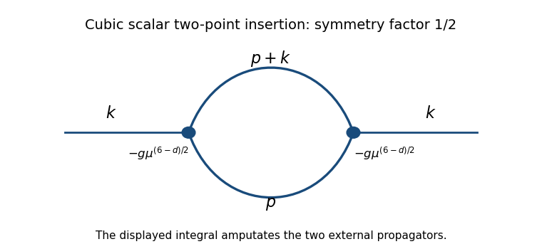

<h1 id="2/i/solution">Solution</h1>

↑ **Parent:** [I](../i.md)

The [cubic scalar field theory](../../../../../../phi-cubed-theory.md) has a [one-particle-irreducible Feynman diagram](../../../../../../one-particle-irreducible-feynman-diagram.md) with two cubic vertices, one external leg at each vertex, and two internal lines joining them:

**[Figure 2](#2/i/image-one-loop-cubic-scalar-two-point-insertion-with-momenta-p-and-p-plus-k-and-symmetry-factor-one-half). One-loop cubic scalar two-point insertion with momenta p and p plus k and symmetry factor one half**.

The Euclidean [Feynman rule](../../../../../../feynman-rule.md) for each cubic [interaction vertex](../../../../../../interaction-vertex.md) is $-g\mu^{(6-d)/2}$: the minus sign comes from expanding $e^{-S_{\mathrm{int}}}$, and $1/3!$ in the action cancels the permutations of its three fields. The [mass dimension](../../../../../../mass-dimension.md) of the cubic coupling is $(6-d)/2$, so $\mu^{(6-d)/2}$ permits $g$ to remain dimensionless. Two vertices supply $(-g)^2\mu^{6-d}$.

Each internal [scalar propagator](../../../../../../scalar-propagator.md) contributes $1/(p^2+m^2)$ with its own momentum. Conservation leaves one independent loop momentum; choose the two propagator momenta to be $p$ and $p+k$. The remaining Fourier integration measure is $d^dp/(2\pi)^d$. Finally, the factor $1/2$ is the [Feynman-diagram symmetry factor](../../../../../../feynman-diagram-symmetry-factor.md) for exchanging the two identical internal lines. Direct [Wick contraction](../../../../../../wick-contraction.md) counting gives the same factor: two choices for which vertex receives a labeled external leg, $3^2$ choices of the incident fields and $2!$ pairings of the remaining fields, divided by $2!(3!)^2$, yield $1/2$.

**The displayed loop integral is the amputated two-point insertion.** For the correction to the full propagator, multiply it by the external [scalar propagators](../../../../../../scalar-propagator.md), giving $D_0(k)^2 I(k)$ with $D_0(k)=1/(k^2+m^2)$.

## ↑ Ancestors (11)

1. [I](../i.md)
2. [2](../../2.md)
3. [Paper 46](../../../paper-46-split.md)
4. [Iii](../../../split.md)
5. [2015](../../../../split.md)
6. [Past exam of the mathematics course of the University of Cambridge](../../../../../split.md)
7. [Mathematics course of the University of Cambridge](../../../../../../mathematics-course-of-the-university-of-cambridge.md)
8. [Course of the University of Cambridge](../../../../../../course-of-the-university-of-cambridge.md)
9. [University of Cambridge](../../../../../../university-of-cambridge-split.md)
10. [List of universities](../../../../../../list-of-universities.md)
11. [Codex Wiki](../../../../../../split.md)
