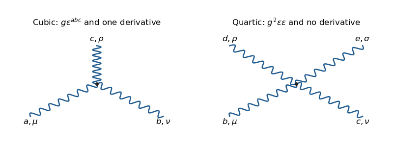

# Paper 47

↑ **Parent:** [Iii](../iii.md)

[https://www.maths.cam.ac.uk/postgrad/part-iii/files/pastpapers/2015/paper_47.pdf](https://www.maths.cam.ac.uk/postgrad/part-iii/files/pastpapers/2015/paper_47.pdf)

**Table of contents**

- [1](#1)
  - [Solution](#1/solution)
- [2](#2)
  - [Solution](#2/solution)
- [3](#3)
  - [a](#3/a)
    - [i](#3/a/i)
      - [Solution](#3/a/i/solution)
    - [ii](#3/a/ii)
      - [Solution](#3/a/ii/solution)
    - [iii](#3/a/iii)
      - [Solution](#3/a/iii/solution)
  - [b](#3/b)
    - [Solution](#3/b/solution)
  - [c](#3/c)
    - [Solution](#3/c/solution)
- [4](#4)
  - [a](#4/a)
    - [Solution](#4/a/solution)
  - [b](#4/b)
    - [i](#4/b/i)
      - [Solution](#4/b/i/solution)
    - [ii](#4/b/ii)
      - [Solution](#4/b/ii/solution)
    - [iii](#4/b/iii)
      - [Solution](#4/b/iii/solution)
    - [iv](#4/b/iv)
      - [Solution](#4/b/iv/solution)
  - [c](#4/c)
    - [Solution](#4/c/solution)

## 1

↑ **Parent:** [Paper 47](paper-47.md)

<h3 id="1/solution">Solution</h3>

↑ **Parent:** [1](#1)

Use the metric $g_{\mu\nu}=\operatorname{diag}(1,-1,-1,-1)$ and the usual [Dirac adjoint](../../../relativistic-quantum-field.md#dirac-adjoint) $\bar\psi=\psi^\dagger\gamma^0$.

**Field transformation.** The [mode expansion of a Dirac field](../../../relativistic-quantum-field.md#mode-expansion-of-a-dirac-field) is

$$
\psi(x)=\sum_s\int\frac{d^3p}{(2\pi)^3\sqrt{2E_{\boldsymbol p}}}
\left[a_s(\boldsymbol p)u^s(p)e^{-ipx}
+b_s^\dagger(\boldsymbol p)v^s(p)e^{ipx}\right].
$$

[Charge conjugation](../../../quantum-field-theory.md#charge-conjugation) exchanges particle and antiparticle operators. Choose their phases so that

$$
\hat C a_s\hat C^{-1}=\eta_C b_s,\qquad
\hat C b_s^\dagger\hat C^{-1}=\eta_C a_s^\dagger,\qquad |\eta_C|=1.
$$

The conjugate relations for creation and annihilation operators preserve their [canonical anticommutation relations](../../../quantum-mechanics.md#canonical-anticommutation-relations). Thus the transformed expansion is $\eta_C$ times the same integral with $a_su^s$ replaced by $b_su^s$ and $b_s^\dagger v^s$ replaced by $a_s^\dagger v^s$. On the other hand, transposing the adjoint expansion gives $b_sC\bar v^{sT}e^{-ipx}+a_s^\dagger C\bar u^{sT}e^{ipx}$. The given spinor identities identify these expressions, proving

$$
\boxed{\hat C\psi(x)\hat C^{-1}=\eta_C C\bar\psi^T(x).}
$$

**Symmetry of the spin matrix.** Transposing $C\gamma^{\mu T}=-\gamma^\mu C$ gives $\gamma^\mu C^T=-C^T\gamma^{\mu T}$. Substitute $\gamma^{\mu T}=-C^{-1}\gamma^\mu C$ and multiply on the right by $C^{-1}$:

$$
\boxed{\gamma^\mu C^TC^{-1}=C^TC^{-1}\gamma^\mu.}
$$

The complex four-dimensional [Clifford algebra](../../../algebra.md#clifford-algebra) representation generated by the [gamma matrices](../../../algebra.md#gamma-matrices) is irreducible; equivalently its sixteen independent gamma products span the full matrix algebra. The [Schur lemma](../../../representation-theory.md#schur-s-lemma) therefore gives $C^TC^{-1}=zI$. Hence $C^T=zC$. Transposing once more gives $C=z^2C$, so $z^2=1$ and

$$
\boxed{C^T=\pm C.}
$$

This is the [transpose symmetry of a charge-conjugation matrix](../../../quantum-field-theory.md#transpose-symmetry-of-a-charge-conjugation-matrix). The given antisymmetric choice is consistent with this conclusion.

**Equation of motion.** Taking the adjoint of the free [Dirac equation](../../../relativistic-quantum-field.md#dirac-equation) yields $i(\partial_\mu\bar\psi)\gamma^\mu+m\bar\psi=0$. Its transpose, multiplied by $C$, is

$$
iC\gamma^{\mu T}\partial_\mu\bar\psi^T+mC\bar\psi^T=0.
$$

The defining matrix relation converts this into

$$
\boxed{(i\gamma^\mu\partial_\mu-m)\psi^c=0.}
$$

Thus the [charge conjugation of a Dirac field](../../../quantum-field-theory.md#charge-conjugation-of-a-dirac-field) maps free solutions to free solutions. With an external electromagnetic field, its charge would also reverse; no such background is present here.

**Chirality.** Define the [chiral projectors](../../../relativistic-quantum-field.md#chiral-projector) $P_L=(1-\gamma^5)/2$ and $P_R=(1+\gamma^5)/2$. The operator $\hat C$ acts on the field operators and commutes with these numerical matrices:

$$
\boxed{\hat C\psi_L\hat C^{-1}=P_L\psi^c,\qquad
P_L(\hat C\psi_L\hat C^{-1})=\hat C\psi_L\hat C^{-1}.}
$$

The transformed component is therefore left-chiral, as requested. There is a useful distinction: the algebraic charge conjugate of a left-chiral spinor is right-chiral. Indeed $C\gamma^{5T}C^{-1}=\gamma^5$ and $\overline{P_L\psi}=\bar\psi P_R$ give

$$
(\psi_L)^c=P_R\psi^c,\qquad
\hat C\psi_L\hat C^{-1}=(\psi_R)^c.
$$

This is the [operator conjugation of a chiral field component](../../../quantum-field-theory.md#operator-conjugation-of-a-chiral-field-component); it avoids confusing projection after operator conjugation with charge conjugation of the already projected spinor.

**Baryogenesis.** Consider equal initial populations of a heavy particle $X$ and its antiparticle, with two baryon-number-violating decay channels carrying different final baryon numbers $b_1,b_2$. Let $r$ and $\bar r$ be the branching fractions into a channel and its antiparticle channel. The net baryon number produced per initial particle-antiparticle pair is

$$
\Delta B=(b_1-b_2)(r-\bar r).
$$

Exact [charge conjugation](../../../quantum-field-theory.md#charge-conjugation) symmetry equates the conjugate branching fractions and makes this vanish. Exact [CP symmetry](../../../quantum-field-theory.md#cp-symmetry) also equates the fully summed conjugate decay rates, because [parity](../../../quantum-mechanics.md#parity) reverses momenta and helicities without changing baryon number. Thus both [violation of charge conjugation](../../../quantum-field-theory.md#violation-of-charge-conjugation) and [CP violation](../../../quantum-field-theory.md#cp-violation) are necessary for generating an asymmetry from a symmetric initial state.

[Violation of charge conjugation](../../../quantum-field-theory.md#violation-of-charge-conjugation) alone can generate a helicity asymmetry while leaving total baryon number zero. For example, with $L,R$ denoting helicities, [CP symmetry](../../../quantum-field-theory.md#cp-symmetry) may enforce $\Gamma(X\to q_Lq_L)=\Gamma(\bar X\to\bar q_R\bar q_R)$ and the analogous relation with $L,R$ exchanged, even when same-helicity charge-conjugate rates differ. The [CP rate cancellation in baryogenesis](../../../cosmology.md#cp-rate-cancellation-in-baryogenesis) means that summing over helicities cancels the baryon asymmetry. These are the symmetry requirements in the [Sakharov conditions](../../../cosmology.md#sakharov-conditions); baryon-number violation and departure from thermal equilibrium are also needed in the conventional decay mechanism.

## 2

↑ **Parent:** [Paper 47](paper-47.md)

<h3 id="2/solution">Solution</h3>

↑ **Parent:** [2](#2)

**Spectrum and symmetry.** Choose a [vacuum expectation value](../../../quantum-field-theory.md#vacuum-expectation-value) $\phi_0=(0,v/\sqrt2)^T$. In [unitary gauge](../../../standard-model.md#unitary-gauge) the scalar field is $\phi=(0,(v+h)/\sqrt2)^T$, with real $h$. The [Pauli matrix multiplication law](../../../algebra.md#pauli-matrix-multiplication-law) gives $\{\tau^a,\tau^b\}=\delta^{ab}I/2$. Since $A^aA^b$ is symmetric in gauge indices, only this symmetric product contributes. The kinetic and potential terms therefore become

$$
(D_\mu\phi)^\dagger D^\mu\phi
=\frac12(\partial_\mu h)^2+\frac{g^2}{8}(v+h)^2A_\mu^aA^{a\mu},
$$

$$
V(h)=\frac{\lambda v^2}{2}h^2+\frac{\lambda v}{2}h^3+\frac{\lambda}{8}h^4.
$$

Comparison with $\frac12m_A^2A_\mu^aA^{a\mu}$ and $\frac12m_h^2h^2$ gives

$$
\boxed{m_{A^1}=m_{A^2}=m_{A^3}=\frac{gv}{2},\qquad m_h=\sqrt{\lambda}\,v.}
$$

These are the [scalar interactions after complete SU2 breaking](../../../relativistic-quantum-field.md#scalar-interactions-after-complete-su2-breaking). The scalar mass uses the specified potential normalization: the prefactor $\lambda/2$ is important.

A nonzero complex doublet has trivial stabilizer in $SU(2)$: a matrix fixing $(0,v)^T$ must have second column $(0,1)^T$, and unitarity and determinant one then fix the first column too. Thus all three gauge generators are broken. Three scalar angular directions are absorbed by the [Higgs mechanism](../../../standard-model.md#higgs-mechanism), giving each [gauge boson](../../../relativistic-quantum-field.md#gauge-boson) a longitudinal polarization. The physical degrees of freedom count is

$$
\boxed{3\times2+4=3\times3+1=10,\qquad\text{no massless physical fields}.}
$$

There is no surviving electromagnetic $U(1)$ in this theory: it contains only the gauged $SU(2)$, not the electroweak product group. The would-be [Goldstone bosons](../../../critical-phenomenon.md#goldstone-boson) are not additional physical massless particles. This is [complete breaking by an SU2 scalar doublet](../../../relativistic-quantum-field.md#complete-breaking-by-an-su2-scalar-doublet).

**Scalar interactions.** In [unitary gauge](../../../standard-model.md#unitary-gauge), all interaction terms containing the physical scalar are

$$
\boxed{\mathcal L_{\mathrm{scalar,int}}
=\frac{g^2v}{4}hA_\mu^aA^{a\mu}
+\frac{g^2}{8}h^2A_\mu^aA^{a\mu}
-\frac{\lambda v}{2}h^3-\frac{\lambda}{8}h^4.}
$$

These give $hAA$, $hhAA$, $hhh$, and $hhhh$ [Feynman vertices](../../../perturbative-quantum-field-theory.md#interaction-vertex). Their factors are respectively $ig^2v\,\delta^{ab}g_{\mu\nu}/2$, $ig^2\delta^{ab}g_{\mu\nu}/2$, $-3i\lambda v$, and $-3i\lambda$, including the identical-leg multiplicities. Gauge-dependent descriptions also contain the absorbed scalar modes; the above are all physical-scalar interactions in the chosen gauge.

**Gauge self-interactions.** Write $f_{\mu\nu}^a=\partial_\mu A_\nu^a-\partial_\nu A_\mu^a$. Expanding the field-strength square gives the cubic and quartic pieces

$$
\boxed{\mathcal L_3
=\frac g2\epsilon^{abc}f_{\mu\nu}^aA^{b\mu}A^{c\nu}
=g\epsilon^{abc}(\partial_\mu A_\nu^a)A^{b\mu}A^{c\nu},}
$$

$$
\boxed{\mathcal L_4
=-\frac{g^2}{4}\epsilon^{abc}\epsilon^{ade}
A_\mu^bA_\nu^cA^{d\mu}A^{e\nu}.}
$$

The sign of the cubic term follows from the minus sign in the given nonlinear field strength. The quartic term can also be written using $\epsilon^{abc}\epsilon^{ade}=\delta^{bd}\delta^{ce}-\delta^{be}\delta^{cd}$. The cubic [Feynman vertex](../../../perturbative-quantum-field-theory.md#interaction-vertex) joins three wavy gauge lines, has one momentum factor, and is proportional to $g\epsilon^{abc}$. The quartic [Feynman vertex](../../../perturbative-quantum-field-theory.md#interaction-vertex) joins four wavy lines, is proportional to $g^2$, and has products of structure constants with metric contractions. There are no higher pure-gauge vertices in this Lagrangian. These are the [SU2 gauge self-interaction vertices](../../../relativistic-quantum-field.md#su2-gauge-self-interaction-vertices).

**[Figure 1](#2/image-cubic-and-quartic-gauge-boson-vertices-from-the-su2-field-strength-square). Cubic and quartic gauge-boson vertices from the SU2 field-strength square**.

## 3

↑ **Parent:** [Paper 47](paper-47.md)

<h3 id="3/a">a</h3>

↑ **Parent:** [3](#3)

<h4 id="3/a/i">i</h4>

↑ **Parent:** [A](#3/a)

<h5 id="3/a/i/solution">Solution</h5>

↑ **Parent:** [I](#3/a/i)

Only a $t$-channel [Z boson](../../../standard-model.md#z-boson) connects the muon-[neutrino](../../../standard-model.md#neutrino) line to the [Electron](../../../physics.md#electron) line. Its endpoints are the [weak neutral current](../../../standard-model.md#neutral-current) vertices $Z\nu_\mu\bar\nu_\mu$ and $Ze^-e^+$. A [W boson](../../../standard-model.md#w-boson) couples $\nu_\mu$ to a muon, so it cannot produce an additional elastic charged-current diagram with external electrons. There is no photon-[neutrino](../../../standard-model.md#neutrino) vertex, and a strictly massless Standard Model [neutrino](../../../standard-model.md#neutrino) has no Higgs Yukawa vertex. **There is one diagram.**

**[Figure 2](#3/a/i/image-all-five-tree-level-weak-diagrams-for-muon-neutrino-electron-neutrino-and-electron-antineutrino-scattering-on-electrons). All five tree-level weak diagrams for muon-neutrino, electron-neutrino, and electron-antineutrino scattering on electrons**.

<h4 id="3/a/ii">ii</h4>

↑ **Parent:** [A](#3/a)

<h5 id="3/a/ii/solution">Solution</h5>

↑ **Parent:** [Ii](#3/a/ii)

There are **two diagrams**: the $t$-channel [Z boson](../../../standard-model.md#z-boson) exchange from the [weak neutral current](../../../standard-model.md#neutral-current), and a crossed $u$-channel [W boson](../../../standard-model.md#w-boson) exchange from the [weak charged current](../../../standard-model.md#charged-current). The charged-current vertices pair the incoming [neutrino](../../../standard-model.md#neutrino) $k$ with the outgoing [Electron](../../../physics.md#electron) $p'$ and the incoming [Electron](../../../physics.md#electron) $p$ with the outgoing [neutrino](../../../standard-model.md#neutrino) $k'$. The exchanged momentum has square $u=(k-p')^2$. With charge flow from the first vertex to the second, the exchanged boson is $W^+$. The corresponding panels show both topologies; no photon or Higgs diagram survives the stated [neutrino](../../../standard-model.md#neutrino) assumptions.

<h4 id="3/a/iii">iii</h4>

↑ **Parent:** [A](#3/a)

<h5 id="3/a/iii/solution">Solution</h5>

↑ **Parent:** [Iii](#3/a/iii)

There are **two diagrams**: $t$-channel [Z boson](../../../standard-model.md#z-boson) exchange and $s$-channel [W boson](../../../standard-model.md#w-boson) exchange. The incoming [Electron](../../../physics.md#electron) and [Electron](../../../physics.md#electron)-antineutrino can annihilate into $W^-$, which then produces the outgoing pair. The charged-current propagator carries momentum $k+p$, hence invariant $s$. The solid-line arrows in the diagram indicate fermion-number flow; those on antineutrino legs run opposite their physical motion.

<h3 id="3/b">b</h3>

↑ **Parent:** [3](#3)

<h4 id="3/b/solution">Solution</h4>

↑ **Parent:** [B](#3/b)

**Flavour issue in the printed effective interaction.** The displayed charged-current factor uses an [Electron](../../../physics.md#electron) field even for the muon-[neutrino](../../../standard-model.md#neutrino) term. Taken literally, this introduces an extra $\nu_\mu e$ charged-current interaction, contradicting the Standard Model diagrams in part (a). In the Standard Model that factor uses the charged lepton of the same flavour; for [Electron](../../../physics.md#electron) scattering the charged-current contribution is therefore present only for $\nu_e$. The [weak flavour selection in neutrino-electron scattering](../../../standard-model.md#weak-flavour-selection-in-neutrino-electron-scattering) fixes the physically consistent assignment used below. The literal printed consequence is given afterwards, so the discrepancy is explicit.

At leading order in the [Electron](../../../physics.md#electron) mass and in the four-fermion regime, define $\Gamma_L^\alpha=\gamma^\alpha(1-\gamma^5)$. The [weak neutral current](../../../standard-model.md#neutral-current) yields the [scattering amplitude](../../../quantum-mechanics.md#scattering-amplitude)

$$
\boxed{\mathcal M_\mu=-\frac{G_F}{\sqrt2}
[\bar u_\nu(k')\Gamma_L^\alpha u_\nu(k)]
[\bar u_e(p')\gamma_\alpha(c_V-c_A\gamma^5)u_e(p)].}
$$

An overall amplitude phase has no observable effect. The [Fermi interaction](../../../quantum-field-theory.md#fermi-interaction) is valid when the exchanged invariants are small compared with the squared weak-boson masses.

Average over the two initial [Electron](../../../physics.md#electron) spin states, and sum over final spins. There is no averaging over a sterile right-handed incoming [neutrino](../../../standard-model.md#neutrino). Using the [fermion spin sum](../../../relativistic-quantum-field.md#fermion-spin-sum), the averaged square is

$$
\overline{|\mathcal M_\mu|^2}=\frac{G_F^2}{4}
\operatorname{Tr}[\not k'\Gamma_L^\alpha\not k\Gamma_L^\beta]\,
\operatorname{Tr}[\not p'\gamma_\alpha(c_V-c_A\gamma^5)
\not p\gamma_\beta(c_V-c_A\gamma^5)].
$$

To display the trace contraction, define

$$
S^{\alpha\beta}(a,b)=a^\alpha b^\beta+a^\beta b^\alpha-g^{\alpha\beta}(a\cdot b),
\qquad E^{\alpha\beta}(a,b)=\epsilon^{\alpha\beta\rho\sigma}a_\rho b_\sigma.
$$

The supplied [gamma matrix trace identities](../../../algebra.md#gamma-matrix-trace-identities) give the two tensors $8(S(k',k)+iE(k',k))$ and $4[(c_V^2+c_A^2)S(p',p)+2ic_Vc_AE(p',p)]$. Symmetric-antisymmetric mixed contractions vanish. Set $X=(k'\cdot p')(k\cdot p)$ and $Y=(k'\cdot p)(k\cdot p')$. The remaining contractions are $S(k',k)S(p',p)=2(X+Y)$ and $E(k',k)E(p',p)=-2(X-Y)$, using the stated negative epsilon-contraction sign. Their sum gives

$$
\overline{|\mathcal M_\mu|^2}
=16G_F^2\left[
(c_V+c_A)^2(k\cdot p)(k'\cdot p')
+(c_V-c_A)^2(k\cdot p')(k'\cdot p)\right].
$$

The massless [Mandelstam variables](../../../special-relativity.md#mandelstam-variables) satisfy $s+t+u=0$, and the two products are $s^2/4$ and $u^2/4$, respectively. Therefore

$$
\boxed{\overline{|\mathcal M_\mu|^2}
=4G_F^2\bigl[(c_V+c_A)^2s^2+(c_V-c_A)^2u^2\bigr].}
$$

In the centre-of-momentum frame, momentum conservation gives $E=\sqrt s/2$. If $z=\cos\theta$ is the angle cosine between $p$ and $p'$, then $u=-s(1+z)/2$. The massless [two-body Lorentz-invariant phase space](../../../relativistic-quantum-field.md#two-body-lorentz-invariant-phase-space) is $d\rho_2=d\Omega/(32\pi^2)$, while the flux is $2s$. Thus

$$
\frac{d\sigma}{dz}=\frac{\overline{|\mathcal M|^2}}{32\pi s}
=\frac{G_F^2s}{8\pi}
\left[(c_V+c_A)^2+\frac14(c_V-c_A)^2(1+z)^2\right].
$$

Integrate $\int_{-1}^1dz=2$ and $\int_{-1}^1(1+z)^2dz=8/3$:

$$
\boxed{\sigma_\mu=\frac{G_F^2s}{4\pi}
\left[(c_V+c_A)^2+\frac13(c_V-c_A)^2\right]
=\frac{G_F^2s}{3\pi}(c_V^2+c_Vc_A+c_A^2).}
$$

Consequently the intended coefficients are

$$
\boxed{F(s)=\frac{s}{3\pi},\qquad A=1,\qquad B=1,\qquad C=0.}
$$

This is the [massless neutrino-electron contact cross-section](../../../quantum-field-theory.md#massless-neutrino-electron-contact-cross-section).

For completeness, the literal printed muon-[neutrino](../../../standard-model.md#neutrino) charged-current term would instead shift both couplings by one, exactly as in part (c):

$$
\sigma_{\mu,\mathrm{literal}}
=\frac{G_F^2s}{3\pi}
[c_V^2+c_Vc_A+c_A^2+3(c_V+c_A)+3].
$$

For arbitrary real $c_V,c_A$, its linear terms cannot be represented by the requested quadratic form with coupling-independent constants. **The Standard Model result and the literal printed interaction are not the same problem.**

<h3 id="3/c">c</h3>

↑ **Parent:** [3](#3)

<h4 id="3/c/solution">Solution</h4>

↑ **Parent:** [C](#3/c)

For [Electron](../../../physics.md#electron)-[neutrino](../../../standard-model.md#neutrino) scattering the [weak charged current](../../../standard-model.md#charged-current) adds an [Electron](../../../physics.md#electron) left-current. The supplied [Fierz rearrangement](../../../quantum-field-theory.md#fierz-identity) has a minus sign for matrix components; the extra minus from ordering the external fermions cancels it. Accordingly the charged contribution is constructive in the [neutrino](../../../standard-model.md#neutrino)-current/[Electron](../../../physics.md#electron)-current ordering used in part (b):

$$
\boxed{\mathcal M_e=-\frac{G_F}{\sqrt2}
[\bar u_\nu(k')\Gamma_L^\alpha u_\nu(k)]
[\bar u_e(p')\gamma_\alpha((c_V+1)-(c_A+1)\gamma^5)u_e(p)].}
$$

Thus $\mathcal M_e$ is obtained from the physically consistent $\mathcal M_\mu$ by $c_V\mapsto c_V+1$, $c_A\mapsto c_A+1$. The right-[Electron](../../../physics.md#electron) coupling $c_V-c_A$ is unchanged, while the left-[Electron](../../../physics.md#electron) coupling $c_V+c_A$ increases by two. This is the [charged-current shift in neutrino-electron scattering](../../../quantum-field-theory.md#charged-current-shift-in-neutrino-electron-scattering).

For the antineutrino, choose the external phase convention in which

$$
\boxed{\overline{\mathcal M}_e=+\frac{G_F}{\sqrt2}
[\bar v_\nu(k)\Gamma_L^\alpha v_\nu(k')]
[\bar u_e(p')\gamma_\alpha((c_V+1)-(c_A+1)\gamma^5)u_e(p)].}
$$

The reversed ordering of the antineutrino spinors implements [crossing symmetry](../../../quantum-mechanics.md#crossing-symmetry); the displayed overall sign can be changed by an external-state phase. Its [neutrino](../../../standard-model.md#neutrino) trace has the opposite antisymmetric part, so the $s^2$ and $u^2$ weights exchange:

$$
\overline{|\overline{\mathcal M}_e|^2}
=4G_F^2\left[(c_V-c_A)^2s^2+(c_V+c_A+2)^2u^2\right].
$$

The phase-space integration already performed in part (b) immediately gives

$$
\boxed{\sigma_e=\frac{G_F^2s}{4\pi}
\left[(c_V+c_A+2)^2+\frac13(c_V-c_A)^2\right],}
$$

$$
\boxed{\overline\sigma_e=\frac{G_F^2s}{4\pi}
\left[(c_V-c_A)^2+\frac13(c_V+c_A+2)^2\right].}
$$

Equivalently, with $a=c_V+1,b=c_A+1$, these are $G_F^2s(a^2+ab+b^2)/(3\pi)$ and $G_F^2s(a^2-ab+b^2)/(3\pi)$. This is the [neutrino-antineutrino interchange of chiral scattering weights](../../../quantum-field-theory.md#neutrino-antineutrino-interchange-of-chiral-scattering-weights). It uses the contact limit, not the full resonant $s$-channel propagator.

If the printed flavour-mismatched interaction is retained literally, its $\nu_\mu e$ amplitude already equals the displayed $\nu_e e$ amplitude. There is then no further flavour shift between those two processes, although antineutrino crossing still exchanges the weights. The distinction identified in part (b) is therefore necessary for the Standard Model interpretation of all three processes.

## 4

↑ **Parent:** [Paper 47](paper-47.md)

<h3 id="4/a">a</h3>

↑ **Parent:** [4](#4)

<h4 id="4/a/solution">Solution</h4>

↑ **Parent:** [A](#4/a)

Use the [weak hypercharge](../../../standard-model.md#hypercharge) normalization $Q=T_3+Y$. Write $U(x)\in SU(2)_L$ and the hypercharge transformation as $e^{i\beta(x)Y}$. A left-handed doublet transforms as $\psi_L\mapsto e^{i\beta Y_L}U\psi_L$, while a right-handed singlet transforms as $\psi_R\mapsto e^{i\beta Y_R}\psi_R$. The [Higgs doublet](../../../standard-model.md#higgs-field) transforms as $\phi\mapsto e^{i\beta/2}U\phi$.

The representations per [fermion generation](../../../standard-model.md#fermion-generation) are:

| Field | $SU(3)_c$ | $SU(2)_L$ | $Y$ in $Q=T_3+Y$ | $\widehat Y=2Y$ in $Q=T_3+\widehat Y/2$ |
| --- | --- | --- | --- | --- |
| $Q_L=(u_L,d_L)^T$ | $\mathbf3$ | $\mathbf2$ | $1/6$ | $1/3$ |
| $u_R$ | $\mathbf3$ | $\mathbf1$ | $2/3$ | $4/3$ |
| $d_R$ | $\mathbf3$ | $\mathbf1$ | $-1/3$ | $-2/3$ |
| $L_L=(\nu_L,e_L)^T$ | $\mathbf1$ | $\mathbf2$ | $-1/2$ | $-1$ |
| $e_R$ | $\mathbf1$ | $\mathbf1$ | $-1$ | $-2$ |
| $\phi=(\phi^+,\phi^0)^T$ | $\mathbf1$ | $\mathbf2$ | $1/2$ | $1$ |

There is no right-handed [neutrino](../../../standard-model.md#neutrino) in the minimal [Standard Model](../../../standard-model.md). If such a sterile singlet were added, its hypercharge would be zero. The two hypercharge columns give equivalent normalizations, not different physical assignments. This is the [electroweak representation and hypercharge table](../../../standard-model.md#electroweak-representation-and-hypercharge-table).

[Yukawa interactions](../../../standard-model.md#yukawa-interaction) use $\phi$ for down-type quarks and charged leptons, but $\widetilde\phi=i\sigma^2\phi^*$ for up-type quarks. The conjugate doublet transforms as $e^{-i\beta/2}U\widetilde\phi$, using the pseudoreality of the $SU(2)$ fundamental representation. For example, the hypercharge sums in the down, charged-lepton, and up terms are

$$
-\frac16+\frac12-\frac13=0,\qquad
+\frac12+\frac12-1=0,\qquad
-\frac16-\frac12+\frac23=0.
$$

The doublet indices contract between $\bar\psi_L$ and the scalar, and colour indices contract in the quark terms. This verifies [gauge invariance](../../../relativistic-quantum-field.md#gauge-invariance).

The indices $i,j=1,2,3$ label [fermion generations](../../../standard-model.md#fermion-generation), specifying which left-handed family and right-handed family are coupled. They are not weak-isospin indices. Each fermion type has its own complex [Yukawa matrix](../../../standard-model.md#yukawa-matrix). After symmetry breaking these matrices determine masses; the mismatch of the two quark left-handed mass rotations produces the [CKM matrix](../../../standard-model.md#cabibbo-kobayashi-maskawa-matrix). **Left fields are weak doublets, right fields are weak singlets, and the scalar is a hypercharge-$1/2$ doublet in the stated convention.**

<h3 id="4/b">b</h3>

↑ **Parent:** [4](#4)

<h4 id="4/b/i">i</h4>

↑ **Parent:** [B](#4/b)

<h5 id="4/b/i/solution">Solution</h5>

↑ **Parent:** [I](#4/b/i)

**Allowed via a charged-current weak decay.** The quark emits a virtual $W^-$ in $b\to uW^{-*}$, followed by $W^{-*}\to e^-\bar\nu_e$. The relevant terms are the quark and lepton [weak charged currents](../../../standard-model.md#charged-current), with amplitude proportional to the [CKM matrix](../../../standard-model.md#cabibbo-kobayashi-maskawa-matrix) element $V_{ub}$. At low energy their product gives a [four-fermion interaction](../../../quantum-field-theory.md#four-fermion-interaction) of the form $(\bar u_L\gamma^\mu b_L)(\bar e_L\gamma_\mu\nu_{eL})$ plus its conjugate.

<h4 id="4/b/ii">ii</h4>

↑ **Parent:** [B](#4/b)

<h5 id="4/b/ii/solution">Solution</h5>

↑ **Parent:** [Ii](#4/b/ii)

**Allowed through second-order weak interactions, not a tree-level neutral-current vertex.** This is the flavour-changing transition responsible for [neutral kaon mixing](../../../physics.md#neutral-kaon-mixing), with change of strangeness by two. Box [Feynman diagrams](../../../perturbative-quantum-field-theory.md#feynman-diagram) contain two [W bosons](../../../standard-model.md#w-boson) and internal up-type quarks. Their vertices come from the [weak charged current](../../../standard-model.md#charged-current) and contain [CKM matrix](../../../standard-model.md#cabibbo-kobayashi-maskawa-matrix) factors. At low energy they generate an operator $(\bar s_L\gamma_\mu d_L)(\bar s_L\gamma^\mu d_L)$ plus its conjugate. The [GIM mechanism](../../../standard-model.md#gim-mechanism) cancels the flavour-independent part of the internal-quark sum; unequal quark masses leave a nonzero loop amplitude.

<h4 id="4/b/iii">iii</h4>

↑ **Parent:** [B](#4/b)

<h5 id="4/b/iii/solution">Solution</h5>

↑ **Parent:** [Iii](#4/b/iii)

**The coupling is allowed, with an on-shell threshold condition.** The [Higgs field](../../../standard-model.md#higgs-field) kinetic term produces

$$
\mathcal L\supset\frac{2m_W^2}{v}hW_\mu^+W^{-\mu},
$$

and hence a tree-level [Feynman vertex](../../../perturbative-quantum-field-theory.md#interaction-vertex). A decay into two real [W bosons](../../../standard-model.md#w-boson) requires $m_h>2m_W$ for nonzero phase space. Below that threshold the vertex still mediates $h\to WW^*$ or decays through two virtual bosons into fermions. Thus an allowed Lagrangian coupling does not by itself guarantee an on-shell two-body decay.

<h4 id="4/b/iv">iv</h4>

↑ **Parent:** [B](#4/b)

<h5 id="4/b/iv/solution">Solution</h5>

↑ **Parent:** [Iv](#4/b/iv)

**Absent in the minimal Standard Model.** The single charged-lepton [Yukawa matrix](../../../standard-model.md#yukawa-matrix) supplies both the [fermion mass matrix](../../../standard-model.md#fermion-mass-matrix) and the Higgs coupling, so the same left/right rotations diagonalize both. There is no off-diagonal $h\tau\mu$ vertex. With massless neutrinos, the separate charged-lepton family numbers prevent this transition perturbatively. If [neutrino](../../../standard-model.md#neutrino) masses and mixing are added, loop-induced [charged-lepton flavour violation](../../../standard-model.md#charged-lepton-flavor-violation) can occur but is extremely suppressed; a sizeable rate would require an additional source of flavour violation. Part (c) provides one such source.

<h3 id="4/c">c</h3>

↑ **Parent:** [4](#4)

<h4 id="4/c/solution">Solution</h4>

↑ **Parent:** [C](#4/c)

A larger-than-predicted rate can be described by adding new fields and symmetry-respecting renormalizable interactions, or, when those fields are much heavier than the energy being probed, by an [effective field theory](../../../quantum-field-theory.md#effective-field-theory). In the latter description, add [gauge-invariant operators](../../../relativistic-quantum-field.md#gauge-invariant-operator) with [Wilson coefficients](../../../quantum-field-theory.md#wilson-coefficient) divided by appropriate powers of a heavy scale. Their interference with existing amplitudes, or their leading contribution to an otherwise forbidden amplitude, can enhance a decay. The operators should respect the Standard Model gauge group and be consistent with other observables; writing an arbitrary flavour-changing term without its electroweak completion is insufficient.

For charged leptons, the proposed operator has [mass dimension](../../../perturbative-quantum-field-theory.md#mass-dimension) six: the fermion bilinear contributes three, the scalar doublet one, and $\phi^\dagger\phi$ two. Its hypercharge vanishes by the same calculation as the renormalizable lepton [Yukawa interaction](../../../standard-model.md#yukawa-interaction), and the extra factor $\phi^\dagger\phi$ is a gauge singlet. Thus its coefficient scales as $\Lambda^{-2}$.

In [unitary gauge](../../../standard-model.md#unitary-gauge), $\phi=(0,(v+h)/\sqrt2)^T$, so the renormalizable and dimension-six terms combine into

$$
\mathcal L\supset-\bar e_L^i
\left[\lambda_{ij}(v+h)
+\frac{\lambda'_{ij}}{2\Lambda^2}(v+h)^3\right]e_R^j+\mathrm{h.c.}
$$

The charged-lepton [fermion mass matrix](../../../standard-model.md#fermion-mass-matrix) and the single-Higgs Yukawa matrix are therefore

$$
M=v\lambda+\frac{v^3}{2\Lambda^2}\lambda',\qquad
Y_h=\lambda+\frac{3v^2}{2\Lambda^2}\lambda'
=\frac Mv+\frac{v^2}{\Lambda^2}\lambda'.
$$

This is the [dimension-six Higgs Yukawa misalignment](../../../standard-model.md#dimension-six-higgs-yukawa-misalignment). Let $U_L^\dagger MU_R=\operatorname{diag}(m_e,m_\mu,m_\tau)$ and $\widehat\lambda'=U_L^\dagger\lambda'U_R$. In the mass basis,

$$
\boxed{\widehat Y_h
=\frac{\operatorname{diag}(m_e,m_\mu,m_\tau)}v
+\frac{v^2}{\Lambda^2}\widehat\lambda'.}
$$

The two matrices need not be aligned. Choosing a nonzero off-diagonal $\widehat\lambda'_{\mu\tau}$ or $\widehat\lambda'_{\tau\mu}$ produces the required [charged-lepton flavour violation](../../../standard-model.md#charged-lepton-flavor-violation) while keeping the [fermion mass matrix](../../../standard-model.md#fermion-mass-matrix) diagonal.

For example, the amplitude for $h\to\mu^-\tau^+$ is, up to an overall phase,

$$
\mathcal M=-\bar u_\mu\left[
(\widehat Y_h)_{\mu\tau}P_R+
(\widehat Y_h)^*_{\tau\mu}P_L\right]v_\tau.
$$

Neglecting the final lepton masses, summing spins gives $m_h^2(|(\widehat Y_h)_{\mu\tau}|^2+|(\widehat Y_h)_{\tau\mu}|^2)$. The conjugate charge channel has the same rate. The summed width is

$$
\boxed{\Gamma(h\to\mu^-\tau^++\mu^+\tau^-)
=\frac{m_h}{8\pi}\frac{v^4}{\Lambda^4}
\left(|\widehat\lambda'_{\mu\tau}|^2+
|\widehat\lambda'_{\tau\mu}|^2\right).}
$$

This demonstrates an enhancement that is absent in the minimal renormalizable theory. It requires flavour misalignment: an added matrix aligned with the original Yukawa matrix would not generate these decays. The same operator also predicts double-Higgs and triple-Higgs lepton interactions through the remaining powers of $(v+h)^3$.

## ↑ Ancestors (8)

1. [Iii](../iii.md)
2. [2015](../../2015.md)
3. [Past exam of the mathematics course of the University of Cambridge](../../../past-exam-of-the-mathematics-course-of-the-university-of-cambridge.md)
4. [Mathematics course of the University of Cambridge](../../../university-of-cambridge.md#mathematics-course-of-the-university-of-cambridge)
5. [Course of the University of Cambridge](../../../university-of-cambridge.md#course-of-the-university-of-cambridge)
6. [University of Cambridge](../../../university-of-cambridge.md)
7. [List of universities](../../../README.md#list-of-universities)
8. [Codex Wiki](../../../README.md)
