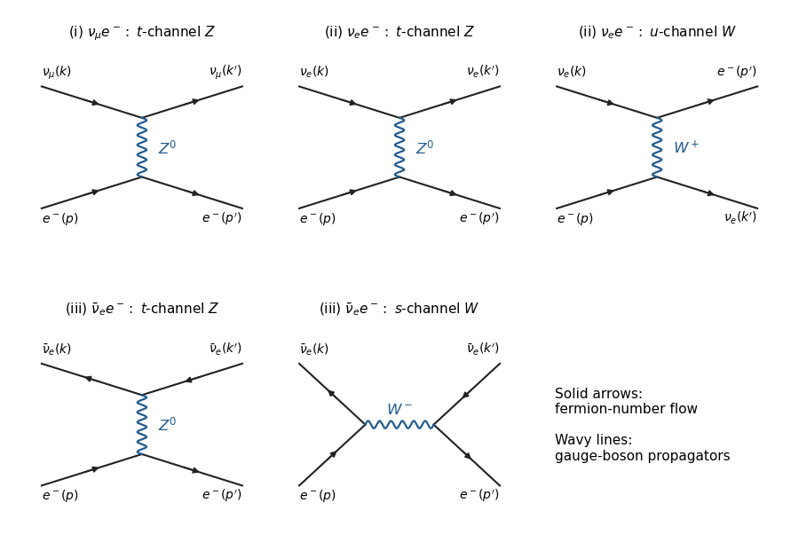

<h1 id="3/a/i/solution">Solution</h1>

↑ **Parent:** [I](../i.md)

Only a $t$-channel [Z boson](../../../../../../../z-boson.md) connects the muon-[neutrino](../../../../../../../neutrino.md) line to the [Electron](../../../../../../../electron.md) line. Its endpoints are the [weak neutral current](../../../../../../../neutral-current.md) vertices $Z\nu_\mu\bar\nu_\mu$ and $Ze^-e^+$. A [W boson](../../../../../../../w-boson.md) couples $\nu_\mu$ to a muon, so it cannot produce an additional elastic charged-current diagram with external electrons. There is no photon-[neutrino](../../../../../../../neutrino.md) vertex, and a strictly massless Standard Model [neutrino](../../../../../../../neutrino.md) has no Higgs Yukawa vertex. **There is one diagram.**

**[Figure 2](#3/a/i/image-all-five-tree-level-weak-diagrams-for-muon-neutrino-electron-neutrino-and-electron-antineutrino-scattering-on-electrons). All five tree-level weak diagrams for muon-neutrino, electron-neutrino, and electron-antineutrino scattering on electrons**.

## ↑ Ancestors (12)

1. [I](../i.md)
2. [A](../../a.md)
3. [3](../../../3.md)
4. [Paper 47](../../../../paper-47-split.md)
5. [Iii](../../../../split.md)
6. [2015](../../../../../split.md)
7. [Past exam of the mathematics course of the University of Cambridge](../../../../../../split.md)
8. [Mathematics course of the University of Cambridge](../../../../../../../mathematics-course-of-the-university-of-cambridge.md)
9. [Course of the University of Cambridge](../../../../../../../course-of-the-university-of-cambridge.md)
10. [University of Cambridge](../../../../../../../university-of-cambridge-split.md)
11. [List of universities](../../../../../../../list-of-universities.md)
12. [Codex Wiki](../../../../../../../split.md)
