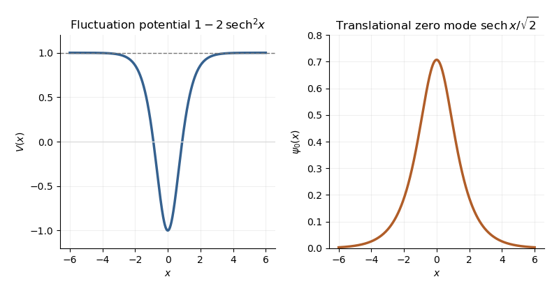

<h1 id="2/solution">Solution</h1>

↑ **Parent:** [2](../2.md)

Choose boundary states with nonzero overlap with the lowest-energy state in the vacuum sector $Q=0$ and in the one-[kink](../../../../../scalar-field-kink.md) [topological sector](../../../../../topological-sector.md) $Q=1$. In a finite spatial box, a fixed [scalar field configuration eigenstate](../../../../../scalar-field-configuration-eigenstate.md) may be used formally, with temporal endpoints equal to the chosen configuration. More generally, smear the endpoints with wavefunctionals $\Psi_Q$. Their [unitary time evolution](../../../../../unitary-time-evolution.md) kernels are

$$
\begin{aligned}
K_Q(T)&=\langle\Psi_Q|e^{-i\widehat HT}|\Psi_Q\rangle\\
&=\int\mathcal D\phi_f\,\mathcal D\phi_i\;\Psi_Q^*[\phi_f]\Psi_Q[\phi_i]\int_{\phi(0)=\phi_i}^{\phi(mT)=\phi_f}\mathcal D\phi\;e^{iS[\phi]}.
\end{aligned}
$$

The inner [scalar field path integral](../../../../../scalar-field-path-integral.md) remains in the chosen [topological sector](../../../../../topological-sector.md), with $\phi(+\infty)-\phi(-\infty)=2\pi Q$. A zero-total-[momentum](../../../../../momentum.md) projection can be included to select the rest state; alternatively, the translational prefactor does not change the large-time exponential. After a [Wick rotation](../../../../../wick-rotation.md) to physical Euclidean time $\tau$, the [energy eigenstate](../../../../../energy-eigenstate.md) expansion gives $K_Q^E(\tau)\sim C_Qe^{-E_Q\tau}$. Thus the exact [vacuum-subtracted soliton mass](../../../../../vacuum-subtracted-soliton-mass.md) is

$$
\boxed{M=-\lim_{L\to\infty}\lim_{\tau\to\infty}\frac1\tau\log\frac{K_1^E(\tau)}{K_0^E(\tau)}.}
$$

Equivalently it is $iT^{-1}\log(K_1/K_0)$ at large time with a damping prescription. The ratio subtracts the [vacuum energy](../../../../../vacuum-energy.md); the [Hamiltonian operator](../../../../../hamiltonian-quantum-mechanics.md) and [action](../../../../../action.md) here are the fully regulated and renormalized ones, not merely their classical approximations.

With the dimensionless coordinates of this paper, the correctly normalized classical [action](../../../../../action.md) is

$$
S[\phi]=\frac1{\beta^2}\int_0^{mT}dt\int dx\left[\frac12\dot\phi^2-\frac12(\phi')^2+\cos\phi-1\right].
$$

For the static [Sine-Gordon kink](../../../../../sine-gordon-kink.md), $\phi_K'=2\operatorname{sech}x$ and $1-\cos\phi_K=2\operatorname{sech}^2x$, so $M_{\rm cl}=8m/\beta^2$. Write $\eta=\delta\phi$. Expanding and integrating by parts gives

$$
\boxed{S[\phi_K+\eta]=-\frac{8mT}{\beta^2}+\frac1{2\beta^2}\int_0^{mT}dt\int dx\;\eta(-\partial_t^2-\Delta_x)\eta+O(\eta^3/\beta^2),\quad \Delta_x=-\partial_x^2+\cos\phi_K=-\partial_x^2+1-2\operatorname{sech}^2x.}
$$

The first variation is $\beta^{-2}\int(\phi_K''-\sin\phi_K)\eta$, plus boundary terms. It vanishes because the [kink](../../../../../scalar-field-kink.md) satisfies the [Euler-Lagrange field equation](../../../../../euler-lagrange-field-equation.md) and the fluctuations have the prescribed temporal endpoints and admissible spatial boundary behavior. This is the [principle of stationary action](../../../../../principle-of-stationary-action.md), not a symmetry assumption about $\eta$.

The printed expansion omits $\beta^{-2}$ despite the stated [Lagrangian density](../../../../../lagrangian-density.md). **Its displayed form is the expansion of $\beta^2S$; it is not the physical $S$ at arbitrary coupling.** Alternatively, writing $\eta=\beta\chi$ puts the quadratic term in canonical normalization, while leaving the classical term $-8mT/\beta^2$ unchanged. This normalization repair does not change $\Delta_x$ or the physical fluctuation frequencies.

The [Sine-Gordon kink fluctuation operator](../../../../../sine-gordon-kink-fluctuation-operator.md) has the useful factorization

$$
A=\partial_x+\tanh x,\qquad \Delta_x=A^\dagger A,\qquad AA^\dagger=-\partial_x^2+1.
$$

It is nonnegative, and $A\psi_0=0$ gives the normalized [translational zero mode of a sine-Gordon kink](../../../../../translational-zero-mode-of-a-sine-gordon-kink.md):

$$
\boxed{\omega_0^2=0,\qquad \psi_0(x)=\frac{\operatorname{sech}x}{\sqrt2}\ \propto\ \phi_K'(x).}
$$

A displacement $a$ changes $\phi_K(x-a)$ by $-a\phi_K'(x)$. Thus the [zero mode in field theory](../../../../../zero-mode-in-field-theory.md) is the position [collective coordinate](../../../../../collective-coordinate-of-a-soliton.md) of the [kink](../../../../../scalar-field-kink.md), reflecting [translation invariance](../../../../../translation-invariance.md). It has no restoring force and no oscillator [zero-point energy](../../../../../zero-point-energy.md). Integrate that [collective coordinate](../../../../../collective-coordinate-of-a-soliton.md) separately rather than inserting a zero factor into the Gaussian [functional determinant](../../../../../functional-determinant.md).

**[Figure 1](#2/image-sine-gordon-kink-fluctuation-potential-and-normalized-translational-zero-mode). Sine-Gordon kink fluctuation potential and normalized translational zero mode**.

In the [Gaussian fluctuation approximation](../../../../../gaussian-fluctuation-approximation.md), the formal oscillator contribution to the [one-loop soliton mass correction](../../../../../one-loop-soliton-mass-correction.md), before adding any [counterterm](../../../../../counterterm.md), is

$$
\boxed{\Delta M_{\rm osc}(L)=\frac m2\left(\sum_n\omega_n-\sum_n\omega_n^{(0)}\right),\qquad \omega_n=\sqrt{\lambda_n(\Delta_x)},\quad \omega_n^{(0)}=\sqrt{\lambda_n(-\partial_x^2+1)}.}
$$

Use a common regulator for the two sums, include all discrete modes, and treat the translation mode as above. The vacuum sum is essential: subtracting only classical vacuum energy would leave an extensive oscillator energy. A periodic fluctuation and its derivative are matched at the two ends of the large box; the one-[kink](../../../../../scalar-field-kink.md) background lies in the twisted [topological sector](../../../../../topological-sector.md), and its infinite-line profile is accurate up to exponentially small boundary corrections.

For a continuum [scattering wavefunction](../../../../../scattering-wavefunction.md), equality of its two asymptotic values gives the [periodic-box phase-shift quantization](../../../../../periodic-box-phase-shift-quantization.md)

$$
e^{ik_nL+i\delta(k_n)}=1,\qquad k_nL+\delta(k_n)=2\pi n,\qquad k_n^{(0)}=\frac{2\pi n}{L}.
$$

Away from the threshold, expand at a matched mode number:

$$
k_n-k_n^{(0)}=-\frac{\delta(k_n^{(0)})}{L}+O(L^{-2}),\qquad \omega_n-\omega_n^{(0)}=-\frac{\delta(k_n^{(0)})}{L}\frac{k_n^{(0)}}{\sqrt{1+(k_n^{(0)})^2}}+O(L^{-2}).
$$

Since consecutive free wave numbers are separated by $2\pi/L$, replacing the continuum-mode sum by an [integral](../../../../../integral.md) proves the displayed continuum contribution:

$$
\boxed{\Delta M_{\rm cont}\simeq-\frac m2\int_{-\Lambda}^{\Lambda}\frac{dk}{2\pi}\,\delta(k)\frac{k}{\sqrt{k^2+1}}.}
$$

The [ultraviolet cutoff](../../../../../ultraviolet-cutoff.md) is retained until the [counterterm](../../../../../counterterm.md) is added.

There is a finite threshold issue if this expression is identified with the complete oscillator correction. It can be settled directly using the factorization: a continuum [eigenfunction](../../../../../eigenfunction.md) is $f_k\propto(\tanh x-ik)e^{ikx}$. Its transmission phase obeys

$$
e^{i\delta(k)}=\frac{1-ik}{-1-ik}=\frac{k+i}{k-i},\qquad \delta(k)=2\arctan(1/k)\quad(k\ne0),
$$

with the odd phase branch that tends to zero at large $|k|$. For $k>0$, the continuum roots have labels $n=1,2,\ldots$; there is no periodic continuum root at $k=0$, since the limiting eigenfunction $\tanh x$ has opposite signs at the two ends. The [bound state](../../../../../bound-state.md) at $\omega_0=0$ replaces the free $k=0$ oscillator with $\omega_0^{(0)}=1$. Consequently, in [mode-number regularization of soliton masses](../../../../../mode-number-regularization-of-soliton-masses.md),

$$
\boxed{\Delta M_{\rm osc}\simeq-\frac m2+\Delta M_{\rm cont}.}
$$

**The PDF's continuum-only formula misses this finite $-m/2$ under this standard phase and mode-counting convention.** It has the correct logarithmic [ultraviolet divergence](../../../../../ultraviolet-divergence.md), but the missing term is not suppressed by large $L$. Changing the phase branch requires changing the mode labels and endpoint terms consistently; it cannot erase a physical mode from the formal spectrum sum.

At high momentum, $\delta(k)=2/k+O(k^{-3})$, so both expressions have divergent part $-(m/\pi)\log\Lambda$. The canonical field $\varphi=\phi/\beta$ has a quartic interaction with coupling $-m^2\beta^2$. Its vacuum [tadpole diagram](../../../../../tadpole-diagram.md) shifts the squared [mass](../../../../../mass.md) by $-m^2\beta^2 J(\Lambda)/4$, where

$$
J(\Lambda)=\int_{-\Lambda}^{\Lambda}\frac{dk}{2\pi\sqrt{k^2+1}}=\frac{\operatorname{arsinh}\Lambda}{\pi}.
$$

The [Sine-Gordon vacuum tadpole counterterm](../../../../../sine-gordon-vacuum-tadpole-counterterm.md) has $\delta m^2=+m^2\beta^2J/4$ and adds potential energy density $\delta m^2(1-\cos\phi)/\beta^2$. Since $\int(1-\cos\phi_K)dx=4$, its vacuum-subtracted [kink](../../../../../scalar-field-kink.md) energy is

$$
\boxed{\Delta M_{\rm ct}=\frac{4\delta m^2}{m\beta^2}=mJ(\Lambda)\sim\frac m\pi\log(2\Lambda),}
$$

which cancels the logarithmic [ultraviolet divergence](../../../../../ultraviolet-divergence.md). Finite parts require a specified [renormalization condition](../../../../../renormalization-condition.md). As a consistency check, with this tadpole subtraction and matched mode-number cutoff, integration by parts yields

$$
\Delta M_{\rm osc}+\Delta M_{\rm ct}=-\frac{m}{2\pi}\,\delta(\Lambda)\sqrt{\Lambda^2+1}\longrightarrow-\frac m\pi.
$$

The complete [semiclassical soliton mass](../../../../../semiclassical-soliton-mass.md) is then $8m/\beta^2-m/\pi+O(m\beta^2)$ in that convention. This last finite result uses the bound-mode term and is additional to the requested ultraviolet cancellation.

## ↑ Ancestors (10)

1. [2](../2.md)
2. [Paper 50](../../paper-50-split.md)
3. [Iii](../../split.md)
4. [2015](../../../split.md)
5. [Past exam of the mathematics course of the University of Cambridge](../../../../split.md)
6. [Mathematics course of the University of Cambridge](../../../../../mathematics-course-of-the-university-of-cambridge.md)
7. [Course of the University of Cambridge](../../../../../course-of-the-university-of-cambridge.md)
8. [University of Cambridge](../../../../../university-of-cambridge-split.md)
9. [List of universities](../../../../../list-of-universities.md)
10. [Codex Wiki](../../../../../split.md)
