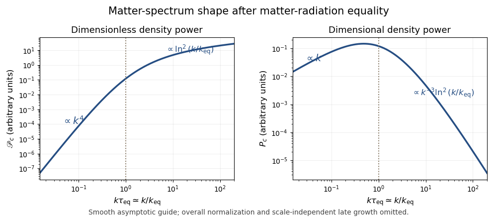

<h1 id="4/iv/solution">Solution</h1>

↑ **Parent:** [Iv](../iv.md)

Write $\mathscr P_c(k,\tau)=k^3|\Delta_c(k,\tau)|^2/(2\pi^2)$ for the [dimensionless power spectrum](../../../../../../dimensionless-cosmological-power-spectrum.md). A radiation-era mode enters the horizon at $\tau_h\sim k^{-1}$. The early superhorizon law gives $\mathscr P_c(k,\tau_h)\sim A$: the $\tau_h^4$ and $k^4$ factors cancel.

For $k\tau_{\rm eq}\ll1$, the mode remains outside the horizon throughout the radiation era. Its amplitude grows as $\tau^2$ both before and after equality, and continues with the same scale-independent growing factor even if it later enters during [matter domination](../../../../../../matter-domination.md). Hence the low-wavenumber shape is preserved:

$$
\boxed{\mathscr P_c(k,\tau)\sim A\tau^4k^4,\qquad k\tau_{\rm eq}\ll1.}
$$

For $k\tau_{\rm eq}\gg1$, horizon entry occurs during [radiation domination](../../../../../../radiation-domination.md). Its subsequent logarithmic amplitude growth supplies a factor $\ln(\tau_{\rm eq}/\tau_h)\sim\ln(k\tau_{\rm eq})$ by equality. During the matter era the amplitude grows by $(\tau/\tau_{\rm eq})^2$. Squaring gives the [logarithmic high-wavenumber density-spectrum transfer](../../../../../../logarithmic-high-wavenumber-density-spectrum-transfer.md):

$$
\boxed{\mathscr P_c(k,\tau)\sim A\left(\frac{\tau}{\tau_{\rm eq}}\right)^4[\ln(k\tau_{\rm eq})]^2,\qquad k\tau_{\rm eq}\gg1.}
$$

The horizon-entry and equality matching fixes order-one coefficients and additive constants inside the logarithm. The displayed branches capture the requested leading spectrum and share its schematic normalization; their asymptotic forms must not be joined literally at $k\tau_{\rm eq}=1$, where the high-$k$ logarithm alone vanishes.

Thus the present [dimensionless power spectrum](../../../../../../dimensionless-cosmological-power-spectrum.md) rises as $k^4$ on large scales and only as $\ln^2 k$ on small scales, with a smooth bend near the [matter-radiation equality scale](../../../../../../matter-radiation-equality-scale.md), $k_{\rm eq}\sim\tau_{\rm eq}^{-1}$. The ordinary dimensional [cosmological density power spectrum](../../../../../../matter-power-spectrum.md) instead satisfies

$$
P_c(k)=\frac{2\pi^2}{k^3}\mathscr P_c(k)\propto\begin{cases}k,&k\ll k_{\rm eq},\\ k^{-3}\ln^2(k/k_{\rm eq}),&k\gg k_{\rm eq}.
\end{cases}
$$

It has a turnover near equality; the dimensionless spectrum does not. The following comparison of [dimensional and dimensionless matter spectra across equality](../../../../../../dimensional-and-dimensionless-matter-spectra-across-equality.md) uses a smooth guide with the correct asymptotes, not an exact solution through the transition. Overall vertical normalization and the later scale-independent growth factor are suppressed.

**[Figure 1](#4/iv/image-present-matter-spectrum-across-equality-dimensionless-power-bends-from-k-to-the-fourth-power-to-logarithmic-growth-while-dimensional-power-turns-over). Present matter spectrum across equality: dimensionless power bends from k to the fourth power to logarithmic growth, while dimensional power turns over**.

## ↑ Ancestors (11)

1. [Iv](../iv.md)
2. [4](../../4.md)
3. [Paper 53](../../../paper-53-split.md)
4. [Iii](../../../split.md)
5. [2015](../../../../split.md)
6. [Past exam of the mathematics course of the University of Cambridge](../../../../../split.md)
7. [Mathematics course of the University of Cambridge](../../../../../../mathematics-course-of-the-university-of-cambridge.md)
8. [Course of the University of Cambridge](../../../../../../course-of-the-university-of-cambridge.md)
9. [University of Cambridge](../../../../../../university-of-cambridge-split.md)
10. [List of universities](../../../../../../list-of-universities.md)
11. [Codex Wiki](../../../../../../split.md)
