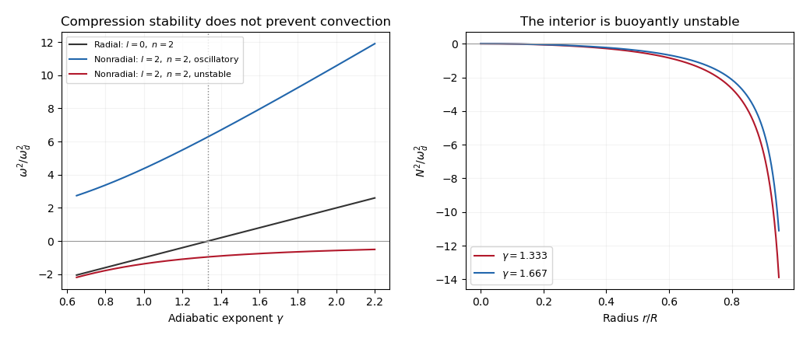

<h1 id="4/c/solution">Solution</h1>

↑ **Parent:** [C](../c.md)

For the [polynomial stellar-mode coefficient reduction](../../../../../../polynomial-stellar-mode-coefficient-reduction.md), write the highest coefficients as

$$
U=u\,r^{n-2}+\cdots,\quad V=v\,r^n+\cdots,\quad
D_r=d\,r^{n-2}+\cdots,\quad
\widehat p=\rho\omega_d^2h\,r^n+\cdots,\quad
\widehat\Phi=\omega_d^2j\,r^n+\cdots.
$$

Set $x=\omega^2/\omega_d^2$, $L=n(2l+n+1)$ and $k=l+n+1$. The highest powers in the equations of (b) give

$$
\begin{aligned}
xu&=-d+n(j+h),&
xv&=j+h,\\
h&=u+lv+\frac{\gamma}{2}d,&
Lj&=-3d,&
d&=ku+lnv.
\end{aligned}
$$

The factor $3$ follows from $4\pi G\rho=3\omega_d^2$; the positive $\gamma d/2$ term comes from the highest, negative $r^2$ coefficient of the equilibrium pressure.

For $l>0$, the final spectrum found below has $x\ne0$. Eliminating $u,v$ first gives

$$
u=\frac{n(x-l)d}{xL},\qquad
v=\frac{(x+k)d}{xL},\qquad j=-\frac{3d}{L}.
$$

The remaining pressure relation is

$$
(x-l)v-u=\left(\frac{\gamma}{2}-\frac3L\right)d.
$$

A nontrivial leading coefficient has $d\ne0$, so

$$
(x-l)(x+l+1)=x\left(\frac{\gamma L}{2}-3\right).
$$

Thus

$$
\boxed{x^2+\left(4-\frac{\gamma L}{2}\right)x-l(l+1)=0,}
$$

or, in dimensional form,

$$
\boxed{\omega^4+
\left[4-\frac{\gamma}{2}n(2l+n+1)\right]\omega_d^2\omega^2
-l(l+1)\omega_d^4=0.}
$$

For the printed stability continuation, define $H=\gamma L/2-4$. The two branches for nonradial [stellar oscillations](../../../../../../stellar-oscillation.md) are

$$
x_\pm=\frac{H\pm\sqrt{H^2+4l(l+1)}}2.
$$

For every $l>0$, their product is $-l(l+1)<0$. Therefore **one branch oscillates and the other grows exponentially, for every positive $\gamma$**. With the chosen time dependence, $x_-<0$ gives $\omega=i\omega_d\sqrt{-x_-}$ and growth rate $\omega_d\sqrt{-x_-}$. Increasing $\gamma$ does not remove this nonradial instability. At large $n$ or large $\gamma$, $x_+\sim\gamma L/2-4$ is a stiff compressive branch, while $x_-\sim-l(l+1)/(\gamma L/2-4)$ is a slower unstable buoyancy branch.

The [buoyancy frequency](../../../../../../buoyancy-frequency.md) supplies the physical explanation. The background density has zero gradient, but pressure decreases outward:

$$
\boxed{N^2=-\frac{2\omega_d^2r^2}{\gamma(R^2-r^2)}<0
\quad(0<r<R).}
$$

The [specific entropy](../../../../../../specific-entropy.md) of the [perfect gas](../../../../../../ideal-gas.md) decreases outward, because $p/\rho^\gamma$ does. An adiabatically displaced fluid parcel therefore experiences destabilizing buoyancy. The model has [convective instability of a uniform-density star](../../../../../../convective-instability-of-a-uniform-density-star.md), even when its radial compression modes are stable. The divergence of this expression at the zero-pressure surface also reflects the artificial equilibrium; the interior negative sign is already decisive.

For $l=0$, the formal quadratic factors as

$$
x\left[x+4-\frac{\gamma}{2}n(n+1)\right]=0.
$$

The physical radial displacement has no $V\nabla F$ component. Using its equations directly gives

$$
\boxed{\frac{\omega_{\rm radial}^2}{\omega_d^2}
=\frac{\gamma}{2}n(n+1)-4.}
$$

Indeed $d=(n+1)u$, $j=-3u/n$, and $h=u+\gamma(n+1)u/2$ yield this result directly in the radial momentum equation. The extra identically zero factor in the two-component determinant need not represent an independent radial mode, since $V$ is redundant when $l=0$.

The lowest allowed degree, $n=2$, has $\omega_{\rm radial}^2=(3\gamma-4)\omega_d^2$. Hence **all these radial modes are stable for $\gamma>4/3$; the fundamental radial mode is marginal at $\gamma=4/3$ and unstable below it**. Higher $n$ have their individual thresholds $\gamma=8/[n(n+1)]$. These [radial stability of a uniform-density star](../../../../../../radial-stability-of-a-uniform-density-star.md) thresholds coexist with nonradial [convective instability](../../../../../../stellar-convective-instability.md). They are conclusions within the polynomial interior family assumed in the question; no boundary-condition quantization is being asserted.

**[Figure 1](#4/c/image-radial-and-nonradial-squared-mode-frequencies-and-the-negative-buoyancy-frequency-of-a-uniform-density-gas-star). Radial and nonradial squared mode frequencies and the negative buoyancy frequency of a uniform-density gas star**.

## ↑ Ancestors (11)

1. [C](../c.md)
2. [4](../../4.md)
3. [Paper 57](../../../paper-57-split.md)
4. [Iii](../../../split.md)
5. [2015](../../../../split.md)
6. [Past exam of the mathematics course of the University of Cambridge](../../../../../split.md)
7. [Mathematics course of the University of Cambridge](../../../../../../mathematics-course-of-the-university-of-cambridge.md)
8. [Course of the University of Cambridge](../../../../../../course-of-the-university-of-cambridge.md)
9. [University of Cambridge](../../../../../../university-of-cambridge-split.md)
10. [List of universities](../../../../../../list-of-universities.md)
11. [Codex Wiki](../../../../../../split.md)
