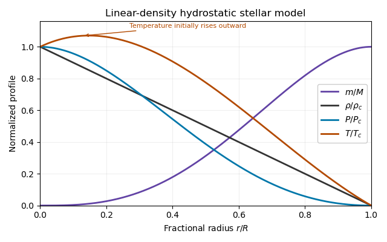

<h1 id="1/a/solution">Solution</h1>

↑ **Parent:** [A](../a.md)

Write $\mathcal R=k/(\mu H)$, where $H$ is the atomic mass unit used in the [mean molecular weight](../../../../../../mean-molecular-weight.md) convention, and let $\kappa$ be the [Rosseland mean opacity](../../../../../../rosseland-mean-opacity.md) per unit mass. For a static spherical star with negligible thermal storage, the [stellar structure equations](../../../../../../stellar-structure-equations.md) are

$$
\boxed{\frac{dm}{dr}=4\pi r^2\rho,\qquad\frac{dP}{dr}=-\frac{Gm\rho}{r^2},\qquad\frac{dL}{dr}=4\pi r^2\rho\epsilon,\qquad\frac{dT}{dr}=-\frac{3\kappa\rho L}{16\pi ac\,r^2T^3},\qquad P=\mathcal R\rho T.}
$$

Here $\epsilon$ is the net [stellar energy-generation rate](../../../../../../stellar-energy-generation-rate.md) per unit mass; $a$ is the radiation energy-density constant and $c$ the speed of light. The last differential equation follows from [radiative diffusion](../../../../../../radiative-diffusion.md), $F=-(c/3\kappa\rho)d(aT^4)/dr$, with $L=4\pi r^2F$. There is no gravothermal storage term in the specified [stellar energy balance equation](../../../../../../stellar-energy-balance-equation.md). Neglecting [radiation pressure](../../../../../../radiation-pressure.md) in force balance does not remove radiation as an energy carrier. Regular central conditions are $m(0)=L(0)=0$; take negligible external [pressure](../../../../../../pressure.md), $P(R)=0$, for the analytic [hydrostatic equilibrium](../../../../../../hydrostatic-equilibrium.md) model below.

Set $x=r/R$. Integrating the [enclosed mass](../../../../../../enclosed-mass.md) directly gives

$$
m(r)=4\pi\rho_c\left(\frac{r^3}{3}-\frac{r^4}{4R}\right),\qquad M=\frac{\pi\rho_cR^3}{3}.
$$

Thus

$$
\boxed{\rho_c=\frac{3M}{\pi R^3},\qquad m(r)=M(4x^3-3x^4).}
$$

The [stellar hydrostatic equation](../../../../../../hydrostatic-pressure-support-equation.md) then gives

$$
P(r)=4\pi G\rho_c^2R^2\int_x^1\left(\frac{t}{3}-\frac{t^2}{4}\right)(1-t)\,dt
=4\pi G\rho_c^2R^2\left(\frac5{144}-\frac{x^2}{6}+\frac{7x^3}{36}-\frac{x^4}{16}\right).
$$

Factorizing makes the surface behaviour transparent:

$$
\boxed{P(r)=P_c(1-x)^2\left(1+2x-\frac95x^2\right),\qquad P_c=\frac{5\pi G\rho_c^2R^2}{36}=\frac{5GM^2}{4\pi R^4}.}
$$

The [ideal gas](../../../../../../ideal-gas.md) equation of state gives the [temperature](../../../../../../temperature.md) profile

$$
\boxed{T(r)=T_c(1-x)\left(1+2x-\frac95x^2\right),\qquad T_c=\frac{P_c}{\mathcal R\rho_c}=\frac{5GM}{12\mathcal R R}=\frac{5\mu HGM}{12kR}.}
$$

No small-$x$ approximation was needed. In particular, close to the centre,

$$
m=4Mx^3+O(x^4),\qquad\frac{P}{P_c}=1-\frac{24}{5}x^2+O(x^3),\qquad\frac{T}{T_c}=1+x-\frac{19}{5}x^2+O(x^3).
$$

These exact hydrostatic formulas reveal a limitation of the prescribed [linear-density stellar model](../../../../../../linear-density-stellar-model.md). Its [mass density](../../../../../../density.md) has a central cusp, and $T'(0^+)=T_c/R>0$. A positive opacity with positive outward [luminosity](../../../../../../luminosity.md) would instead require $T'<0$ in [radiative diffusion](../../../../../../radiative-diffusion.md). Moreover, regular positive nuclear heating gives $L=O(r^3)$ and therefore $T'=O(r)$ at the centre. Thus the imposed profile is a **hydrostatic toy model**, not a complete positive-heating radiative-equilibrium solution of all the [stellar structure equations](../../../../../../stellar-structure-equations.md). The requested algebraic profiles and nuclear-luminosity integral can still be computed consistently as properties of that toy model.

**[Figure 1](#1/a/image-normalized-mass-density-pressure-and-temperature-in-the-linear-density-hydrostatic-stellar-model). Normalized mass, density, pressure and temperature in the linear-density hydrostatic stellar model**.

## ↑ Ancestors (11)

1. [A](../a.md)
2. [1](../../1.md)
3. [Paper 58](../../../paper-58-split.md)
4. [Iii](../../../split.md)
5. [2015](../../../../split.md)
6. [Past exam of the mathematics course of the University of Cambridge](../../../../../split.md)
7. [Mathematics course of the University of Cambridge](../../../../../../mathematics-course-of-the-university-of-cambridge.md)
8. [Course of the University of Cambridge](../../../../../../course-of-the-university-of-cambridge.md)
9. [University of Cambridge](../../../../../../university-of-cambridge-split.md)
10. [List of universities](../../../../../../list-of-universities.md)
11. [Codex Wiki](../../../../../../split.md)
