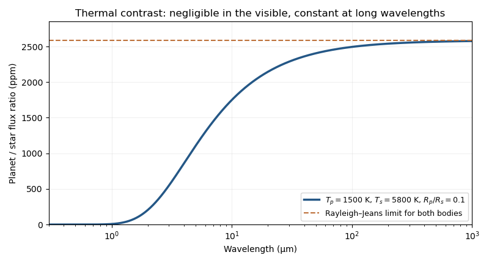
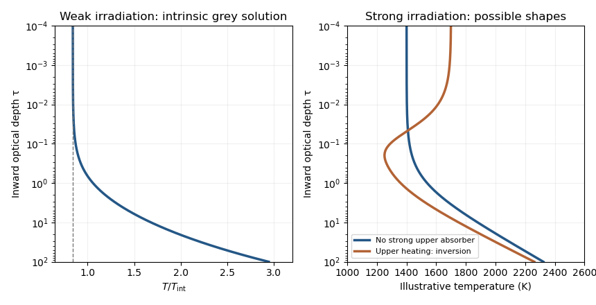

# Paper 59

↑ **Parent:** [Iii](../iii.md)

[https://www.maths.cam.ac.uk/postgrad/part-iii/files/pastpapers/2015/paper_59.pdf](https://www.maths.cam.ac.uk/postgrad/part-iii/files/pastpapers/2015/paper_59.pdf)

**Table of contents**

- [1](#1)
  - [a](#1/a)
    - [Solution](#1/a/solution)
  - [b](#1/b)
    - [Solution](#1/b/solution)
  - [c](#1/c)
    - [i](#1/c/i)
      - [Solution](#1/c/i/solution)
    - [ii](#1/c/ii)
      - [Solution](#1/c/ii/solution)
- [2](#2)
  - [a](#2/a)
    - [Solution](#2/a/solution)
  - [b](#2/b)
    - [Solution](#2/b/solution)
  - [c](#2/c)
    - [Solution](#2/c/solution)
  - [d](#2/d)
    - [Solution](#2/d/solution)
- [3](#3)
  - [a](#3/a)
    - [Solution](#3/a/solution)
  - [b](#3/b)
    - [Solution](#3/b/solution)
  - [c](#3/c)
    - [Solution](#3/c/solution)
- [4](#4)
  - [a](#4/a)
    - [Solution](#4/a/solution)
  - [b](#4/b)
    - [Solution](#4/b/solution)
  - [c](#4/c)
    - [Solution](#4/c/solution)
  - [d](#4/d)
    - [Solution](#4/d/solution)
  - [e](#4/e)
    - [Solution](#4/e/solution)
  - [f](#4/f)
    - [Solution](#4/f/solution)
  - [g](#4/g)
    - [Solution](#4/g/solution)
  - [h](#4/h)
    - [Solution](#4/h/solution)
  - [i](#4/i)
    - [Solution](#4/i/solution)
  - [j](#4/j)
    - [Solution](#4/j/solution)

## 1

↑ **Parent:** [Paper 59](paper-59.md)

<h3 id="1/a">a</h3>

↑ **Parent:** [1](#1)

<h4 id="1/a/solution">Solution</h4>

↑ **Parent:** [A](#1/a)

Take the [optical depth](../../../astrophysics.md#optical-depth) to increase inward and let $\mu>0$ denote an outward ray. For thermal absorption and emission in [local thermodynamic equilibrium](../../../astrophysics.md#local-thermodynamic-equilibrium), the [radiative transfer source function](../../../astrophysics.md#radiative-transfer-source-function) is the [Planck function](../../../astrophysics.md#planck-function), so the [radiative transfer equation](../../../astrophysics.md#radiative-transfer-equation) is

$$
\mu\frac{dI_\lambda}{d\tau}=I_\lambda-B_\lambda[T(\tau)].
$$

This assumes negligible scattering, or a source function genuinely thermalized to $B_\lambda$; LTE by itself does not turn an arbitrary scattering source into a [Planck function](../../../astrophysics.md#planck-function). Multiply by $e^{-\tau/\mu}$, integrate between the two boundaries, and solve for the outward [specific intensity](../../../astrophysics.md#specific-intensity):

$$
\boxed{I_\lambda(\tau_2,\mu)=I_\lambda(\tau_1,\mu)e^{-(\tau_1-\tau_2)/\mu}+\int_{\tau_2}^{\tau_1}\frac{B_\lambda[T(\tau)]}{\mu}e^{-(\tau-\tau_2)/\mu}\,d\tau.}
$$

The bottom boundary value is the quantity denoted $I_\lambda(0)$ in the supplied notation; it is not an optical-depth-zero boundary. The first term is attenuated incident radiation, and the second is emission from the intervening layers. This is the [formal solution of the radiative transfer equation](../../../astrophysics.md#formal-solution-of-the-radiative-transfer-equation).

For an [isothermal atmosphere](../../../statistical-physics.md#isothermal-atmosphere) at temperature $T$, the [Planck function](../../../astrophysics.md#planck-function) is constant and the integral can be evaluated:

$$
I_\lambda(\tau_2,\mu)=B_\lambda(T)+[I_\lambda(\tau_1,\mu)-B_\lambda(T)]e^{-(\tau_1-\tau_2)/\mu}.
$$

For a bounded bottom intensity and $\tau_1\to\infty$, **$I_\lambda=B_\lambda(T)$ in every outgoing direction, and $F_\lambda=\pi B_\lambda(T)$**. Thus the emergent spectrum is a [blackbody](../../../astrophysics.md#blackbody) spectrum. The [blackbody limit of an isothermal atmosphere](../../../astrophysics.md#blackbody-limit-of-an-isothermal-atmosphere) does not require a temperature gradient: it follows from complete thermalization in an optically thick medium.

<h3 id="1/b">b</h3>

↑ **Parent:** [1](#1)

<h4 id="1/b/solution">Solution</h4>

↑ **Parent:** [B](#1/b)

For unresolved, uniformly bright [blackbodies](../../../astrophysics.md#blackbody) at a common distance $d$, the monochromatic observed [radiative fluxes](../../../astrophysics.md#radiative-flux) are $F_{s,\lambda}=\pi B_\lambda(T_s)R_s^2/d^2$ and $F_{p,\lambda}=\pi B_\lambda(T_p)R_p^2/d^2$. Define the planet-star contrast $r_\lambda=F_{p,\lambda}/F_{s,\lambda}$. The [Planck law](../../../statistical-physics.md#planck-s-law) gives

$$
r_\lambda=\left(\frac{R_p}{R_s}\right)^2\frac{e^{hc/(\lambda k_BT_s)}-1}{e^{hc/(\lambda k_BT_p)}-1}.
$$

Outside the [exoplanet secondary eclipse](../../../exoplanet.md#exoplanet-secondary-eclipse), the system flux is $F_s+F_p$; during complete occultation it is $F_s$. Consequently the exact [thermal eclipse depth](../../../exoplanet.md#thermal-eclipse-depth) normalized to the out-of-eclipse light is

$$
\boxed{d_\lambda=\frac{F_{p,\lambda}}{F_{s,\lambda}+F_{p,\lambda}}=\frac{r_\lambda}{1+r_\lambda}.}
$$

Only in the faint-planet limit is $d_\lambda\simeq r_\lambda$. Reflected starlight, partial occultation and spatial temperature variations are omitted under the stated [blackbody](../../../astrophysics.md#blackbody) model.

For a cooler [hot Jupiter](../../../exoplanet.md#hot-jupiter) with $T_p<T_s$, the planet-star contrast is exponentially small at short wavelengths and increases towards a constant plateau. This is the [monotonicity of blackbody planet-star contrast](../../../exoplanet.md#monotonicity-of-blackbody-planet-star-contrast), rather than the peaked shape of the planet's absolute [blackbody](../../../astrophysics.md#blackbody) flux. An illustrative example uses $T_p=1500\,\mathrm K$, $T_s=5800\,\mathrm K$ and $R_p/R_s=0.1$:

**[Figure 1](#1/b/image-blackbody-hot-jupiter-planet-star-contrast-increasing-towards-its-rayleigh-jeans-plateau). Blackbody hot-Jupiter planet-star contrast increasing towards its Rayleigh-Jeans plateau**.

At wavelengths long enough for the [Rayleigh-Jeans law](../../../astrophysics.md#rayleigh-jeans-law) to apply to both bodies, $B_\lambda\simeq2ck_BT/\lambda^4$. Therefore

$$
\boxed{r_\lambda\longrightarrow r_\infty=\left(\frac{R_p}{R_s}\right)^2\frac{T_p}{T_s},\qquad d_\lambda\longrightarrow\frac{r_\infty}{1+r_\infty}.}
$$

The common $\lambda^{-4}$ dependence cancels. In the illustrative case, the contrast plateau is about $2.6\times10^{-3}$, or $2600$ parts per million.

<h3 id="1/c">c</h3>

↑ **Parent:** [1](#1)

<h4 id="1/c/i">i</h4>

↑ **Parent:** [C](#1/c)

<h5 id="1/c/i/solution">Solution</h5>

↑ **Parent:** [I](#1/c/i)

The continuum [exoplanet transit photometry](../../../exoplanet.md#exoplanet-transit-photometry) depth is approximately the opaque projected area ratio, assuming a corrected or negligible [limb darkening](../../../astrophysics.md#limb-darkening) contribution:

$$
D_0=\left(\frac{R_p}{R_s}\right)^2=0.01,\qquad R_p=0.1R_s.
$$

For a Sun-sized host, **$R_p\simeq6.96\times10^7\,\mathrm m\simeq R_J\simeq11R_\oplus$**. The natural size analogue is [Jupiter](../../../planetary-science.md#jupiter), not [Earth](../../../planetary-science.md#earth).

The expected bulk constituent is **[molecular hydrogen](../../../chemistry.md#molecular-hydrogen)**, with [helium](../../../chemistry.md#helium) next most abundant for a retained [primary planetary atmosphere](../../../exoplanet.md#primary-planetary-atmosphere). The [water](../../../chemistry.md#water) band detects a strong trace absorber; it does not imply that [water](../../../chemistry.md#water) is the dominant gas. This interpretation assumes a conventional H/He [gas giant](../../../planetary-science.md#gas-giant); the measured radius by itself is not a measurement of mass or composition.

<h4 id="1/c/ii">ii</h4>

↑ **Parent:** [C](#1/c)

<h5 id="1/c/ii/solution">Solution</h5>

↑ **Parent:** [Ii](#1/c/ii)

Interpret the quoted band amplitude as an absolute transit-depth increment $\Delta D=0.0003$, or $300$ parts per million. For a thin atmospheric annulus of extra height $\Delta z$, the [atmospheric spectral-feature amplitude](../../../exoplanet.md#atmospheric-spectral-feature-amplitude) is

$$
\Delta D=\frac{(R_p+\Delta z)^2-R_p^2}{R_s^2}\simeq\frac{2R_p\Delta z}{R_s^2},\qquad \boxed{\Delta z\simeq\frac{\Delta D}{2D_0}R_p=0.015R_p\simeq1040\,\mathrm{km}.}
$$

Let the [water](../../../chemistry.md#water) band span $N_H$ [atmospheric scale heights](../../../exoplanet.md#atmospheric-scale-height), so $\Delta z=N_HH$. For a nearly [isothermal atmosphere](../../../statistical-physics.md#isothermal-atmosphere) with constant gravity and [mean molecular weight](../../../thermodynamics.md#mean-molecular-weight) $\mu$, $H=k_BT/(\mu m_ug)$. The [temperature from a transmission-band amplitude](../../../exoplanet.md#temperature-from-a-transmission-band-amplitude) is therefore

$$
\boxed{T\simeq\frac{\mu m_ug}{k_B}\frac{\Delta D R_s^2}{2R_pN_H},\qquad \frac{T}{T_0}=\frac{0.015R_p}{N_HH_0}\frac{\mu}{\mu_0}\frac{g}{g_0}.}
$$

Here $T_0,H_0,\mu_0,g_0$ refer to the chosen [Jupiter](../../../planetary-science.md#jupiter) reference layer. Assuming $g=g_J\simeq25\,\mathrm{m\,s^{-2}}$, an H/He [exoplanet atmosphere](../../../exoplanet.md#exoplanet-atmosphere) with $\mu\simeq2.3$, and a clear strong band with $N_H\simeq5$, gives $H\simeq210\,\mathrm{km}$ and **$T\simeq1.4\times10^3\,\mathrm K$**. Equivalently, a Jovian reference with $T_0\simeq165\,\mathrm K$ has $H_0\simeq24\,\mathrm{km}$, giving $H/H_0\simeq8.7$.

The assumptions are hydrostatic, approximately isothermal limb gas, constant gravity, negligible cloud truncation, H/He composition, and an effective [opacity](../../../stellar-structure.md#opacity) contrast yielding about five scale heights. In an ideal clear limb, $N_H\simeq\log(\kappa_{\rm band}/\kappa_{\rm cont})$ follows from the [slant optical depth of an isothermal atmosphere](../../../exoplanet.md#slant-optical-depth-of-an-isothermal-atmosphere). The data fix $N_HH$, not $H$ separately: **the temperature is conditional on the band [opacity](../../../stellar-structure.md#opacity) contrast and composition**. For $N_H=3$–$7$ with the same composition and gravity, the estimate is about $1000$–$2400\,\mathrm K$.

## 2

↑ **Parent:** [Paper 59](paper-59.md)

<h3 id="2/a">a</h3>

↑ **Parent:** [2](#2)

<h4 id="2/a/solution">Solution</h4>

↑ **Parent:** [A](#2/a)

Let $z$ increase outward and define the inward [optical depth](../../../astrophysics.md#optical-depth) by $d\tau/dz=-\bar\kappa\rho$. With constant outward internal [radiative flux](../../../astrophysics.md#radiative-flux) $F=\sigma T_{\rm int}^4$, [radiative diffusion](../../../astrophysics.md#radiative-diffusion) gives

$$
\frac{dT}{d\tau}=\frac{3F}{16\sigma T^3},\qquad \frac{dT^4}{d\tau}=\frac34T_{\rm int}^4,\qquad T^4=\frac34T_{\rm int}^4(\tau+q).
$$

The constant $q$ is a boundary condition; diffusion alone does not determine it. For an unirradiated [grey atmosphere](../../../astrophysics.md#grey-atmosphere) with the [Eddington closure approximation](../../../astrophysics.md#eddington-closure-approximation) and [Eddington surface boundary condition](../../../astrophysics.md#eddington-surface-boundary-condition), $q=2/3$, so

$$
\boxed{T(\tau)=T_{\rm int}\left[\frac34\left(\tau+\frac23\right)\right]^{1/4}.}
$$

The [internal effective temperature of a planet](../../../exoplanet.md#internal-effective-temperature-of-a-planet) is defined by its intrinsic cooling flux, not by its incident stellar heating. Since $dT/d\tau>0$ and $d\tau/dz<0$, temperature decreases outward. Towards the thin upper layers, $T\to2^{-1/4}T_{\rm int}\simeq0.84T_{\rm int}$; if the density and optical-depth gradient vanish there, $dT/dz\to0$. This is the upper nearly [isothermal atmosphere](../../../statistical-physics.md#isothermal-atmosphere). The diffusion approximation itself fails at small optical depth: the grey boundary closure supplies the approximate continuation. Small irradiation perturbs this intrinsic-flux solution.

Young, self-luminous [gas giants](../../../planetary-science.md#gas-giant) at wide orbital separations can have intrinsic cooling dominate their photospheric budget. They are favorable for [exoplanet direct imaging](../../../exoplanet.md#exoplanet-direct-imaging), especially in the [infrared](../../../optics.md#infrared), where their own thermal radiation is easier to separate from the host light. A strongly irradiated [hot Jupiter](../../../exoplanet.md#hot-jupiter) instead has a large stable outer radiative region set mainly by stellar heating; it can be nearly isothermal over a broad pressure range or develop an [atmospheric thermal inversion](../../../exoplanet.md#inversion-meteorology) if stellar light is absorbed sufficiently high. Inversion is not inevitable for every strongly irradiated planet. Deep [convection](../../../fluid-mechanics.md#convection) begins below its [radiative-convective boundary](../../../exoplanet.md#radiative-convective-boundary).

**[Figure 2](#2/a/image-intrinsic-grey-atmosphere-cooling-profile-compared-with-illustrative-irradiated-hot-jupiter-profiles). Intrinsic grey-atmosphere cooling profile compared with illustrative irradiated hot-Jupiter profiles**.

The intrinsic curve follows the grey formula. The irradiated curves illustrate possible shapes only; they are not solutions for a specified [opacity](../../../stellar-structure.md#opacity) model. Smaller optical depth corresponds to greater altitude.

<h3 id="2/b">b</h3>

↑ **Parent:** [2](#2)

<h4 id="2/b/solution">Solution</h4>

↑ **Parent:** [B](#2/b)

Use a dry [ideal gas](../../../thermodynamics.md#ideal-gas) of fixed composition with specific gas constant $\mathcal R=C_p-C_v$ and constant [specific heat capacity at constant pressure](../../../thermodynamics.md#specific-heat-capacity-at-constant-pressure) $C_p$. For a fixed-mass parcel, $PV^\gamma=$ constant and $PV=m_{\rm parcel}\mathcal RT_g$ imply

$$
T_gP^{-(\gamma-1)/\gamma}=\mathrm{constant},\qquad \frac{dT_g}{dP}=\frac{\mathcal R}{C_p}\frac{T_g}{P}=\frac1{\rho_gC_p}.
$$

Along a hydrostatic adiabat, $dP/dz=-\rho_gg$; hence the [dry adiabatic lapse rate](../../../exoplanet.md#dry-adiabatic-lapse-rate) is

$$
\boxed{\left(\frac{dT_g}{dz}\right)_{\rm ad}=-\frac g{C_p}.}
$$

For an actual pressure-balanced parcel rising in an ambient atmosphere, $dP/dz=-\rho_{\rm env}g$ instead gives $dT_g/dz=-(g/C_p)(T_g/T_{\rm env})$. The usual lapse-rate expression is exact for a hydrostatic adiabatic column and is the local first-order result at the launch point where $T_g=T_{\rm env}$, as needed in a linear stability test. Treating an already much hotter parcel as an exact copy of the ambient hydrostatic column would be an extra approximation.

After a small upward displacement $\delta z$ from temperature equilibrium, its temperature excess is

$$
T_g-T_{\rm env}\simeq\left[-\frac g{C_p}-\frac{dT_{\rm env}}{dz}\right]\delta z.
$$

At equal pressure, warmer gas is less dense and continues to rise. Thus the [Schwarzschild criterion](../../../stellar-structure.md#schwarzschild-criterion) in altitude form is

$$
\boxed{\frac{dT_{\rm env}}{dz}<-\frac g{C_p}\quad\text{unstable},\qquad \frac{dT_{\rm env}}{dz}=-\frac g{C_p}\quad\text{neutral}.}
$$

The supplied non-strict inequality includes the marginal case; strict growth requires the strict inequality. A downward displacement gives the same stability conclusion. Efficient [convection](../../../fluid-mechanics.md#convection) normally adjusts an initially superadiabatic gradient to a nearly adiabatic one.

Deep envelopes of [gas giants](../../../planetary-science.md#gas-giant) and [ice giants](../../../planetary-science.md#ice-giant) commonly transport intrinsic heat by [convection](../../../fluid-mechanics.md#convection), as do the [planetary tropospheres](../../../exoplanet.md#planetary-troposphere) of many weakly irradiated atmospheres. [Earth](../../../planetary-science.md#earth)'s dry [troposphere](../../../planetary-science.md#troposphere) provides another approximate example, with moisture changing the lapse rate. Strongly irradiated [hot Jupiters](../../../exoplanet.md#hot-jupiter) can still have deep convective interiors, while their upper radiative regions need not be convective. Composition gradients can modify the homogeneous-gas criterion and inhibit overturning even in an interior.

<h3 id="2/c">c</h3>

↑ **Parent:** [2](#2)

<h4 id="2/c/solution">Solution</h4>

↑ **Parent:** [C](#2/c)

In [local thermodynamic equilibrium](../../../astrophysics.md#local-thermodynamic-equilibrium), thermal intensity samples the [Planck function](../../../astrophysics.md#planck-function) near an optical depth of order unity. The [Eddington-Barbier relation](../../../astrophysics.md#eddington-barbier-relation) makes this explicit: $I_\lambda(0,\mu)\simeq B_\lambda[T(\tau_\lambda=\mu)]$. A molecular band has greater [opacity](../../../stellar-structure.md#opacity) than its adjacent continuum and therefore samples a higher layer. A band in emission relative to the continuum implies that this higher layer is hotter: **the line-forming region has an [atmospheric thermal inversion](../../../exoplanet.md#inversion-meteorology)** under the assumed LTE, thermal interpretation.

The continuum is thermal radiation from an optically thick, deeper [photosphere](../../../stellar-structure.md#photosphere), with comparatively smooth [opacity](../../../stellar-structure.md#opacity). In an H/He [hot Jupiter](../../../exoplanet.md#hot-jupiter), [collision-induced absorption](../../../astrophysics.md#collision-induced-absorption-and-emission) by H2-H2 and H2-He collisions supplies an important continuum; weak overlapping molecular lines and opaque [exoplanet clouds](../../../exoplanet.md#exoplanet-cloud) can contribute too. It is not a separate [blackbody](../../../astrophysics.md#blackbody) emitter floating above the gas. A strongly isothermal layer would erase LTE molecular contrast rather than generate emission peaks.

In the emitting inversion, $dT/dz>0$, whereas the [dry adiabatic lapse rate](../../../exoplanet.md#dry-adiabatic-lapse-rate) has $dT/dz=-g/C_p<0$. Therefore

$$
\boxed{\frac{dT}{dz}>0>-\frac g{C_p},}
$$

which lies on the stable side of the [Schwarzschild criterion](../../../stellar-structure.md#schwarzschild-criterion). An upward-displaced parcel cools and becomes denser than the ambient hot upper gas. The region can thus carry and redistribute thermal energy by [radiative transfer](../../../astrophysics.md#radiative-transfer), **not by unstable thermal [convection](../../../fluid-mechanics.md#convection)**. Winds may transport energy horizontally; stability rules out the specified buoyant vertical [convection](../../../fluid-mechanics.md#convection), not every possible motion.

<h3 id="2/d">d</h3>

↑ **Parent:** [2](#2)

<h4 id="2/d/solution">Solution</h4>

↑ **Parent:** [D](#2/d)

An [atmospheric thermal inversion](../../../exoplanet.md#inversion-meteorology) is an altitude interval with $dT/dz>0$. Absorption of incoming stellar radiation above the usual thermal-emitting layers can heat the upper gas faster than it cools, producing an inversion. In a [semi-grey irradiated atmosphere](../../../exoplanet.md#semi-grey-irradiated-atmosphere), a large shortwave-to-infrared [opacity](../../../stellar-structure.md#opacity) ratio favors such high-altitude energy deposition; local infrared emitters and the intrinsic flux also matter.

In the [Solar system](../../../astrophysics.md#solar-system), **[Earth](../../../planetary-science.md#earth) and all four giant planets have well-known stratospheric inversions**. The [ozone layer](../../../exoplanet.md#ozone-layer) absorbs ultraviolet sunlight on [Earth](../../../planetary-science.md#earth); [methane](../../../chemistry.md#methane) and photochemical hydrocarbons absorb solar radiation in the giant planets, with aerosols contributing. The giant planets are [Jupiter](../../../planetary-science.md#jupiter), [Saturn](../../../astrophysics.md#saturn), [Uranus](../../../astrophysics.md#uranus) and [Neptune](../../../planetary-science.md#neptune). This refers to their stratospheric temperature rise, not to the gradient at every atmospheric level.

For [hot Jupiters](../../../exoplanet.md#hot-jupiter), influential factors include the stellar flux and spectrum; the abundances of high-altitude absorbers such as [titanium monoxide](../../../chemistry.md#titanium-monoxide) and [vanadium monoxide](../../../chemistry.md#vanadium-ii-oxide); [atmospheric metallicity of a giant planet](../../../exoplanet.md#atmospheric-metallicity-of-a-giant-planet) and [atmospheric carbon-to-oxygen ratio](../../../exoplanet.md#atmospheric-carbon-to-oxygen-ratio); [thermal dissociation](../../../chemistry.md#thermal-dissociation), [atmospheric photochemistry](../../../exoplanet.md#atmospheric-photochemistry) and condensation; a [atmospheric cold trap](../../../exoplanet.md#atmospheric-cold-trap) or [atmospheric condensate rainout](../../../exoplanet.md#atmospheric-condensate-rainout) that removes absorbers; replenishment by vertical mixing; [exoplanet clouds](../../../exoplanet.md#exoplanet-cloud) and [atmospheric hazes](../../../exoplanet.md#haze); and heat redistribution by circulation. The ratio of visible heating to infrared cooling, rather than a single chemical species in isolation, determines whether an inversion persists.

## 3

↑ **Parent:** [Paper 59](paper-59.md)

<h3 id="3/a">a</h3>

↑ **Parent:** [3](#3)

<h4 id="3/a/solution">Solution</h4>

↑ **Parent:** [A](#3/a)

For a fixed [polytropic index](../../../stellar-structure.md#polytropic-index) $n>0$ and fixed equation-of-state constant $K$, let $\xi_1$ be the first zero of the regular [Lane-Emden equation](../../../nonlinear-analysis.md#lane-emden-equation) solution. A finite-radius model requires such a zero; for the usual nonnegative indices this holds for $n<5$. The surface radius and mass follow from $r=\alpha\xi$ and $\rho=\rho_c\theta^n$:

$$
R=\alpha\xi_1,\qquad M=4\pi\alpha^3\rho_c\int_0^{\xi_1}\xi^2\theta^n\,d\xi=4\pi\alpha^3\rho_c[-\xi_1^2\theta'(\xi_1)].
$$

The last equality integrates the [Lane-Emden equation](../../../nonlinear-analysis.md#lane-emden-equation); define the positive [Lane-Emden surface mass constant](../../../stellar-structure.md#lane-emden-surface-mass-constant) $\omega_n=-\xi_1^2\theta'(\xi_1)$. Substituting $\alpha=C_1\rho_c^{(1-n)/(2n)}$ gives

$$
R=C_1\xi_1\rho_c^{(1-n)/(2n)},\qquad M=4\pi C_1^3\omega_n\rho_c^{(3-n)/(2n)}.
$$

The central-density exponents cancel when the required powers are taken. Thus the [polytropic mass-radius relation](../../../stellar-structure.md#polytropic-mass-radius-relation) is

$$
\boxed{M^{n-1}R^{3-n}=C_2=(4\pi C_1^3\omega_n)^{n-1}(C_1\xi_1)^{3-n}.}
$$

It is independent of $\rho_c$, with $n,K$ and composition held fixed. For $n=1$ the radius is fixed; for $n=3$ the mass is fixed. These limiting powers need no division by a vanishing exponent.

For $n=0$, the literal pressure-density power and the supplied expression for $\alpha$ are singular. Interpret this case separately as an [incompressible planetary interior](../../../exoplanet.md#incompressible-planetary-interior) with constant density. Then $M=4\pi\rho R^3/3$, or **$R\propto M^{1/3}$** at fixed density. A weakly compressed rocky body, or a rough uniform-density approximation to [Earth](../../../planetary-science.md#earth), is an example; realistic terrestrial planets are stratified and compressible.

For $n=3/2$, $P\propto\rho^{5/3}$. This describes a cold nonrelativistic degenerate electron gas of fixed composition, or a fully convective monatomic [ideal gas](../../../thermodynamics.md#ideal-gas) at fixed [entropy](../../../thermodynamics.md#entropy). Examples are a nonrelativistic [white dwarf](../../../stellar-astrophysics.md#white-dwarf), a sufficiently cooled partly degenerate [brown dwarf](../../../stellar-astrophysics.md#brown-dwarf) as an approximation, and an approximately fully convective low-mass star for the ideal-gas version. The fixed-$K$ scaling is **$R\propto M^{-1/3}$**. It must not be applied to an entire main-sequence stellar sequence with different entropies; the [entropy dependence of a polytropic mass-radius relation](../../../stellar-structure.md#entropy-dependence-of-a-polytropic-mass-radius-relation) explains the distinction.

<h3 id="3/b">b</h3>

↑ **Parent:** [3](#3)

<h4 id="3/b/solution">Solution</h4>

↑ **Parent:** [B](#3/b)

The [mass-radius curve of solar-composition substellar objects](../../../exoplanet.md#mass-radius-curve-of-solar-composition-substellar-objects) reflects the transition from weak compression to pressure ionization and [electron degeneracy pressure](../../../statistical-physics.md#electron-degeneracy-pressure), followed by sustained [hydrogen burning](../../../stellar-astrophysics.md#hydrogen-burning). A schematic joining representative object classes is:

**[Figure 3](#3/b/image-schematic-mass-radius-sequence-from-ice-giants-through-gas-giants-and-brown-dwarfs-to-low-mass-stars). Schematic mass-radius sequence from ice giants through gas giants and brown dwarfs to low-mass stars**.

The illustration is not an age-specific numerical evolutionary model. In particular, [ice giants](../../../planetary-science.md#ice-giant) contain much more heavy material than a solar-composition giant, so a single uniform-composition equation of state does not describe the entire joined curve.

- At the low-mass, weak-compression end, a fixed-density or fixed-composition approximation gives **$R\propto M^{1/3}$**. [Ice giants](../../../planetary-science.md#ice-giant) such as [Neptune](../../../planetary-science.md#neptune) and [Uranus](../../../astrophysics.md#uranus) have substantial [water](../../../chemistry.md#water)/rock-rich interiors and modest H/He envelopes; changing envelope fraction changes the radius markedly. Their heat comes from retained formation energy, contraction and [radiogenic heating](../../../physics.md#radiogenic-heating) of heavy material. Fluid interiors generally convect, while composition stratification can impede mixing; outer radiative layers release the heat.
- Ordinary [gas giants](../../../planetary-science.md#gas-giant) reach radii of order $R_J$ over a broad range around Jovian masses: an effective $n\simeq1$ [polytrope](../../../astrophysical-fluid-dynamics.md#polytrope) explains the approximate **$R\propto M^0$** segment. Increased mass compresses material enough to offset the added volume. Cooling and [Kelvin-Helmholtz contraction](../../../stellar-astrophysics.md#kelvin-helmholtz-mechanism), with additional differentiation energy such as helium settling in [Saturn](../../../astrophysics.md#saturn), supply the intrinsic luminosity. Their deep envelopes are usually convective, with radiative photospheres.
- More massive [brown dwarfs](../../../stellar-astrophysics.md#brown-dwarf) become increasingly supported by [electron degeneracy pressure](../../../statistical-physics.md#electron-degeneracy-pressure). The cold nonrelativistic $n=3/2$ limit gives **$R\propto M^{-1/3}$**, but finite [entropy](../../../thermodynamics.md#entropy) and Coulomb effects flatten actual giant/brown-dwarf curves and their radii depend on age. They cool and contract; temporary deuterium fusion occurs above a composition-dependent [deuterium-burning mass](../../../stellar-astrophysics.md#deuterium-burning-mass) near $13M_J$. This threshold does not cause a sharp structural kink or permanent stellar luminosity. Interiors are largely convective and surface emission is radiative.
- Near the [hydrogen-burning minimum mass](../../../stellar-astrophysics.md#hydrogen-burning-minimum-mass), roughly $0.075$–$0.08M_\odot$ or $75$–$85M_J$ for near-solar composition, sustained fusion prevents indefinite cooling into a degenerate object. The [low-mass main-sequence star](../../../stellar-astrophysics.md#low-mass-main-sequence-star) branch turns upward, with approximately **$R\propto M$** over the illustrative interval. Its [entropy](../../../thermodynamics.md#entropy) is not constant across masses, so this branch is compatible with an approximately $n=3/2$ internal profile. Hydrogen fusion through the [proton–proton chain](../../../stellar-astrophysics.md#proton-proton-chain) provides energy; the lowest-mass main-sequence stars are fully convective, capped by radiative atmospheres.

Planet/brown-dwarf naming conventions and deuterium burning do not define a universal discontinuity in the [mass-radius relation](../../../exoplanet.md#mass-radius-relation). Composition, age and irradiation move the curves; the hydrogen-burning transition changes the long-term energy source more fundamentally.

<h3 id="3/c">c</h3>

↑ **Parent:** [3](#3)

<h4 id="3/c/solution">Solution</h4>

↑ **Parent:** [C](#3/c)

For an [incompressible planetary interior](../../../exoplanet.md#incompressible-planetary-interior) of density $\rho$, the enclosed mass and local gravity are $M(r)=4\pi\rho r^3/3$ and $g(r)=4\pi G\rho r/3$. [Hydrostatic equilibrium](../../../statistical-physics.md#hydrostatic-equilibrium) therefore gives

$$
\frac{dP}{dr}=-\frac{GM(r)\rho}{r^2}=-\frac{4\pi G\rho^2}{3}r.
$$

Integrating inward from negligible surface pressure at $r=R_p$ yields the [uniform-density planetary pressure profile](../../../exoplanet.md#uniform-density-planetary-pressure-profile):

$$
\boxed{P(r)=\frac{2\pi G\rho^2}{3}(R_p^2-r^2)=P_c\left(1-\frac{r^2}{R_p^2}\right),\qquad P_c=\frac{2\pi G\rho^2R_p^2}{3}.}
$$

The surface gravity is $g_s=GM/R_p^2=4\pi G\rho R_p/3$. Eliminate $\rho R_p$ to obtain

$$
\boxed{P_c=\frac{3g_s^2}{8\pi G}.}
$$

The units of $g_s^2/G$ are pressure. For a nonzero imposed surface pressure, add $P_s$ throughout and interpret the boxed central value as $P_c-P_s$. The constant-density approximation is crucial; real centrally concentrated rocky planets need a different profile and generally a larger central pressure at the same mass and radius.

## 4

↑ **Parent:** [Paper 59](paper-59.md)

<h3 id="4/a">a</h3>

↑ **Parent:** [4](#4)

<h4 id="4/a/solution">Solution</h4>

↑ **Parent:** [A](#4/a)

The usual major carbon/oxygen reservoirs in a hydrogen-rich [hot Jupiter](../../../exoplanet.md#hot-jupiter) are **[water](../../../chemistry.md#water), [carbon monoxide](../../../chemistry.md#carbon-monoxide) and [methane](../../../chemistry.md#methane)**, with their relative importance set by [thermochemical equilibrium](../../../thermodynamics.md#thermochemical-equilibrium). This is not a universal ranking for every temperature and composition: nitrogen molecules or [carbon dioxide](../../../chemistry.md#carbon-dioxide) can exceed a strongly depleted member of this trio.

At about one bar, the useful net reaction is

$$
\mathrm{CO}+3\mathrm{H}_2\rightleftharpoons\mathrm{CH}_4+\mathrm{H}_2\mathrm O.
$$

The rightward reaction is exothermic. Cooler gas favors [methane](../../../chemistry.md#methane) and [water](../../../chemistry.md#water); warming favors [carbon monoxide](../../../chemistry.md#carbon-monoxide) and suppresses [methane](../../../chemistry.md#methane). The CO/CH4 crossover is of order $10^3\,\mathrm K$ and shifts with pressure, elemental inventory and metallicity; it is not a universal temperature. [Water](../../../chemistry.md#water) remains an important oxygen reservoir for oxygen-rich compositions but can dissociate at sufficiently high temperature.

Increasing the [atmospheric metallicity of a giant planet](../../../exoplanet.md#atmospheric-metallicity-of-a-giant-planet) raises the available carbon and oxygen. In a dilute, H2-dominated regime, major CO and H2O abundances roughly increase with the enrichment factor, and cool-regime CH4 does likewise. CO2 can rise faster, approximately quadratically in suitable warm regimes. At very high enrichment, the H2 fraction and [mean molecular weight](../../../thermodynamics.md#mean-molecular-weight) also change, invalidating simple linear scalings.

At high temperature and [atmospheric carbon-to-oxygen ratio](../../../exoplanet.md#atmospheric-carbon-to-oxygen-ratio) below unity, CO binds much of the carbon, leaving excess oxygen for H2O. As C/O approaches or exceeds one, CO consumes nearly all available oxygen and **H2O is strongly depleted**; excess carbon enhances CH4, [hydrogen cyanide](../../../chemistry.md#hydrogen-cyanide) and [acetylene](../../../chemistry.md#acetylene). Cooler CH4-dominated chemistry uses less oxygen in CO and can leave more [water](../../../chemistry.md#water) even at the same elemental ratio. These trends are [carbon partition and atmospheric water abundance](../../../exoplanet.md#carbon-partition-and-atmospheric-water-abundance), and assume equilibrium rather than vertical or horizontal quenching.

<h3 id="4/b">b</h3>

↑ **Parent:** [4](#4)

<h4 id="4/b/solution">Solution</h4>

↑ **Parent:** [B](#4/b)

- **Vertical chemical quenching:** when the [eddy mixing time](../../../exoplanet.md#eddy-mixing-time) becomes shorter than the [chemical relaxation time](../../../thermodynamics.md#chemical-relaxation-time), transported gas retains a deeper abundance rather than reaching local [thermochemical equilibrium](../../../thermodynamics.md#thermochemical-equilibrium). For example, [carbon monoxide–methane quenching](../../../exoplanet.md#carbon-monoxide-methane-quenching) can maintain excess [carbon monoxide](../../../chemistry.md#carbon-monoxide) in cool upper giant-planet gas where equilibrium favors [methane](../../../chemistry.md#methane).
- **[Atmospheric photochemistry](../../../exoplanet.md#atmospheric-photochemistry):** ultraviolet photons dissociate molecules and drive reaction networks away from thermal equilibrium. For example, irradiation of CH4-containing gas can produce [acetylene](../../../chemistry.md#acetylene) and hydrocarbon precursors of an [atmospheric haze](../../../exoplanet.md#haze).
- **[Horizontal chemical quenching](../../../exoplanet.md#horizontal-chemical-quenching):** winds cross a day-night temperature gradient faster than reactions can reset the composition. For example, CO-rich dayside gas can reach a cooler [hot Jupiter](../../../exoplanet.md#hot-jupiter) nightside without converting most of its carbon to CH4.

These are three distinct ways to maintain [disequilibrium chemistry in an exoplanet atmosphere](../../../exoplanet.md#disequilibrium-chemistry-in-an-exoplanet-atmosphere); each compares chemistry with a different transport or irradiation process.

<h3 id="4/c">c</h3>

↑ **Parent:** [4](#4)

<h4 id="4/c/solution">Solution</h4>

↑ **Parent:** [C](#4/c)

- **Muted near-infrared molecular bands:** [exoplanet transmission spectra](../../../exoplanet.md#exoplanet-transmission-spectrum) across approximately $1.1$–$1.7\,\mu\mathrm m$, or a broader $1$–$5\,\mu\mathrm m$ interval, can show weak [water](../../../chemistry.md#water) features because an opaque [exoplanet cloud deck](../../../exoplanet.md#exoplanet-cloud-deck) truncates the atmospheric annulus before the gas becomes transparent in the continuum.
- **A rising transit radius towards blue wavelengths:** optical [exoplanet transmission spectroscopy](../../../exoplanet.md#transit-spectroscopy) over roughly $0.3$–$1\,\mu\mathrm m$ can show a [Rayleigh scattering](../../../electromagnetism.md#rayleigh-scattering) or aerosol slope from small haze particles. Larger particles can instead give a nearly wavelength-independent, grey continuum.
- **Enhanced reflected light:** an optical [exoplanet secondary eclipse](../../../exoplanet.md#exoplanet-secondary-eclipse) or [reflected-light planetary phase curve](../../../exoplanet.md#reflected-light-planetary-phase-curve) observation around $0.4$–$0.9\,\mu\mathrm m$ can indicate a large [geometric albedo](../../../exoplanet.md#geometric-albedo) and wavelength-dependent reflection from bright condensate [exoplanet clouds](../../../exoplanet.md#exoplanet-cloud).

Cloud particles can scatter or absorb, so not every [atmospheric haze](../../../exoplanet.md#haze) makes a high-albedo planet. Weak molecular bands alone also admit low abundance or high [mean molecular weight](../../../thermodynamics.md#mean-molecular-weight); a consistent spectral combination is stronger evidence than a single signature.

<h3 id="4/d">d</h3>

↑ **Parent:** [4](#4)

<h4 id="4/d/solution">Solution</h4>

↑ **Parent:** [D](#4/d)

Assume a circular orbit of radius $a$, a spherical planet, bolometric [Bond albedo](../../../exoplanet.md#bond-albedo) $A_B$, negligible internal heat, unit thermal emissivity and complete redistribution of absorbed heat over the sphere. The stellar [luminosity](../../../astrophysics.md#luminosity) is $L_s=4\pi R_s^2\sigma T_s^4$, and the planet absorbs the incident [radiative flux](../../../astrophysics.md#radiative-flux) through its projected cross-section:

$$
P_{\rm abs}=\pi R_p^2(1-A_B)\frac{L_s}{4\pi a^2}.
$$

Thermal reradiation is $P_{\rm emit}=4\pi R_p^2\sigma T_{\rm eq}^4$. Equating these gives the [planetary equilibrium temperature](../../../exoplanet.md#planetary-equilibrium-temperature)

$$
\boxed{T_{\rm eq}=\left[\frac{(1-A_B)L_s}{16\pi\sigma a^2}\right]^{1/4}=T_s\sqrt{\frac{R_s}{2a}}(1-A_B)^{1/4}.}
$$

The planet's radius cancels. A non-black thermal emissivity $\epsilon$ divides the absorbed flux by $\epsilon$ in the fourth-power balance. For uniform dayside-only reradiation, the emitting area is $2\pi R_p^2$ and $T_{\rm day}=2^{1/4}T_{\rm eq}$. With no local redistribution, the substellar point has $T_{\rm sub}=\sqrt2T_{\rm eq}$, while other points depend on incidence angle. These are different temperature conventions, not contradictory formulas.

The [planetary equilibrium temperature](../../../exoplanet.md#planetary-equilibrium-temperature) is not the surface greenhouse temperature or the [internal effective temperature of a planet](../../../exoplanet.md#internal-effective-temperature-of-a-planet). If intrinsic cooling matters and both powers escape through the same emitting area, the total [effective temperature](../../../stellar-structure.md#effective-temperature) obeys $T_{\rm eff}^4=T_{\rm int}^4+T_{\rm eq}^4$.

<h3 id="4/e">e</h3>

↑ **Parent:** [4](#4)

<h4 id="4/e/solution">Solution</h4>

↑ **Parent:** [E](#4/e)

The [circumstellar habitable zone](../../../exoplanet.md#circumstellar-habitable-zone) is the range of orbital distances where a terrestrial planet with a specified atmospheric inventory can retain liquid [water](../../../chemistry.md#water) at its surface. It is a conditional climate criterion, not a guarantee of life or a requirement for every possible subsurface habitat.

Four influential factors are:

- The incident stellar energy and spectrum, including orbital distance and long-term stellar evolution.
- Atmospheric pressure and composition, [greenhouse effect](../../../exoplanet.md#greenhouse-effect), [Bond albedo](../../../exoplanet.md#bond-albedo) and clouds, which set the relation between absorbed light and surface temperature.
- The [water](../../../chemistry.md#water) and volatile inventory, together with planetary mass and the ability to retain or replenish an atmosphere.
- Internal and surface evolution, including [plate tectonics](../../../geophysics.md#plate-tectonics), outgassing and the [carbonate-silicate cycle](../../../geophysics.md#carbonate-silicate-cycle), which can regulate climate over geological time.

For a Sun-like present-day star and an Earth-like planet, **a useful conservative range is approximately $0.95$–$1.7\,\mathrm{AU}$**. The inner limit depends on the adopted moist or [runaway greenhouse](../../../exoplanet.md#runaway-greenhouse) condition, and the outer limit on the [maximum greenhouse outer habitable-zone limit](../../../exoplanet.md#maximum-greenhouse-outer-habitable-zone-limit). More restrictive water-loss choices put the inner edge near $0.99\,\mathrm{AU}$. Empirical optimistic limits based on past [Venus](../../../planetary-science.md#venus) and [Mars](../../../astrophysics.md#mars) are about $0.75$–$1.8\,\mathrm{AU}$. These are model conventions rather than exact universal boundaries.

<h3 id="4/f">f</h3>

↑ **Parent:** [4](#4)

<h4 id="4/f/solution">Solution</h4>

↑ **Parent:** [F](#4/f)

An ideal [atmospheric biosignature gas](../../../exoplanet.md#atmospheric-biosignature-gas) has a strong, distinguishable spectral signature, can accumulate to a detectable abundance, and has a biologically plausible production flux. Its abiotic sources should be small or identifiable from the planet's environmental context; its lifetime must be long enough for detection but compatible with continuing replenishment. A useful diagnosis may be a disequilibrium combination of gases rather than a single molecule.

A [primary metabolic byproduct](../../../biology.md#primary-metabolic-byproduct) comes from reactions needed for energy generation, growth or biomass synthesis. Examples include methane from methanogenesis and oxygen released by oxygenic [photosynthesis](../../../biology.md#photosynthesis). A [secondary metabolic byproduct](../../../biology.md#secondary-metabolic-byproduct) results from specialized functions such as chemical defense, signaling or stress responses; [dimethyl sulfide](../../../chemistry.md#dimethyl-sulfide) and [chloromethane](../../../chemistry.md#chloromethane) are examples. Secondary products can be chemically more distinctive but are often produced in much smaller amounts.

For modern [Earth](../../../planetary-science.md#earth), **[molecular oxygen](../../../chemistry.md#molecular-oxygen) (O2) and [nitrous oxide](../../../chemistry.md#nitrous-oxide) (N2O) are characteristic, predominantly biologically maintained atmospheric gases**: oxygenic [photosynthesis](../../../biology.md#photosynthesis) maintains the former, and microbial nitrogen cycling produces much of the latter. [Ozone](../../../chemistry.md#ozone) (O3) is also a classic remote biosignature, but is made photochemically from O2 rather than being a second independent metabolic product. If O2/O3 are counted as a two-gas observational pair, they diagnose the same oxygen reservoir.

The word “unique” needs qualification: no one gas is guaranteed to be biogenic on every planet. An [oxygen biosignature false positive](../../../exoplanet.md#oxygen-biosignature-false-positive) can arise from [water](../../../chemistry.md#water) loss or CO2 photochemistry in suitable environments, and nonbiological N2O production is possible. The modern terrestrial source attribution does not remove the need for context when interpreting another world.

<h3 id="4/g">g</h3>

↑ **Parent:** [4](#4)

<h4 id="4/g/solution">Solution</h4>

↑ **Parent:** [G](#4/g)

For typical well-mixed structures, the dominant processes are:

- **[Gas giant](../../../planetary-science.md#gas-giant) interiors:** efficient [convection](../../../fluid-mechanics.md#convection) through most of the deep fluid envelope; [radiative transfer](../../../astrophysics.md#radiative-transfer) releases the heat near the [photosphere](../../../stellar-structure.md#photosphere).
- **Rocky interiors:** slow solid-state [mantle convection](../../../geophysics.md#mantle-convection) over geological time, with [heat conduction](../../../thermodynamics.md#thermal-conduction) dominant across the rigid [lithosphere](../../../geophysics.md#lithosphere). A liquid core can also convect; being solid does not prevent creep-driven heat transport in the mantle.
- **Weakly irradiated giant atmospheres at $0.1$–$10\,\mathrm{bar}$:** usually [convection](../../../fluid-mechanics.md#convection) in the [planetary troposphere](../../../exoplanet.md#planetary-troposphere), becoming radiative near and above the [tropopause](../../../exoplanet.md#tropopause). The transition pressure and cloud or compositional effects vary between planets.
- **Strongly irradiated [hot Jupiter](../../../exoplanet.md#hot-jupiter) atmospheres at $0.1$–$10\,\mathrm{bar}$:** usually a stable radiative region; the deep [radiative-convective boundary](../../../exoplanet.md#radiative-convective-boundary) can lie at substantially larger pressure. Atmospheric winds also redistribute energy horizontally.

Representative temperatures must specify the level: **[Earth](../../../planetary-science.md#earth) has about $288\,\mathrm K$ at the surface** (about $255\,\mathrm K$ effective emission temperature); **[Jupiter](../../../planetary-science.md#jupiter) has about $165\,\mathrm K$ near one bar** (about $125\,\mathrm K$ effective temperature); **[hot Jupiters](../../../exoplanet.md#hot-jupiter) commonly have photospheric temperatures of order $1000$–$2500\,\mathrm K$**; and **the [Sun](../../../stellar-astrophysics.md#sun)'s [photosphere](../../../stellar-structure.md#photosphere) is about $5800\,\mathrm K$**. Upper layers, nightsides, deep interiors and the solar corona have different temperatures. These are characteristic values, not constant temperatures throughout each atmosphere.

<h3 id="4/h">h</h3>

↑ **Parent:** [4](#4)

<h4 id="4/h/solution">Solution</h4>

↑ **Parent:** [H](#4/h)

[Plate tectonics](../../../geophysics.md#plate-tectonics) is the movement and recycling of a planet's [lithosphere](../../../geophysics.md#lithosphere) as discrete plates over a deformable mantle. [Mantle convection](../../../geophysics.md#mantle-convection), the negative buoyancy of cool subducting slabs ([slab pull](../../../geophysics.md#slab-pull)), and gravitational sliding from elevated spreading ridges ([ridge push](../../../geophysics.md#ridge-push)) supply driving stresses; deformation and friction resist motion. The mantle mostly deforms by slow solid-state creep, rather than being a global liquid layer.

Its effects include [subduction](../../../geophysics.md#subduction) and recycling of crust, creation of new crust, mountain building, [earthquakes](../../../geophysics.md#earthquake) and [volcanism](../../../geophysics.md#volcanism), transport of internal heat, and recycling of [water](../../../chemistry.md#water) and carbon. The [carbonate-silicate cycle](../../../geophysics.md#carbonate-silicate-cycle) can couple volcanic CO2 supply to weathering and long-term climate.

Three major controls on a [super-Earth](../../../exoplanet.md#super-earth)'s tectonic mode are:

- **Mass and pressure-dependent material behavior:** gravity and mantle depth affect buoyancy and convective stresses, but high-pressure changes in viscosity and density also affect whether slabs sink.
- **Thermal state and heat budget:** age, [radiogenic heating](../../../physics.md#radiogenic-heating), residual formation heat and surface temperature set convective vigor, plate thickness and the strength of the lid.
- **[Water](../../../chemistry.md#water) and lithospheric weakening:** hydration, rock rheology, fault damage and yield strength determine whether driving stresses can break and recycle the [lithosphere](../../../geophysics.md#lithosphere) rather than leave a stagnant lid.

A larger mass alone does not establish active [plate tectonics](../../../geophysics.md#plate-tectonics). The competition between driving stress, yielding and sustained slab buoyancy must be evaluated for the planet's composition and thermal history.

<h3 id="4/i">i</h3>

↑ **Parent:** [4](#4)

<h4 id="4/i/solution">Solution</h4>

↑ **Parent:** [I](#4/i)

Three detection methods are **[exoplanet transit photometry](../../../exoplanet.md#exoplanet-transit-photometry), the [radial-velocity method](../../../exoplanet.md#doppler-spectroscopy), and [exoplanet direct imaging](../../../exoplanet.md#exoplanet-direct-imaging)**. Transits detect obscuration of the star; radial velocities detect stellar reflex motion; imaging separates the planet's own reflected or thermal light from the star.

[Exoplanet transit photometry](../../../exoplanet.md#exoplanet-transit-photometry) supports wavelength-dependent [exoplanet transmission spectra](../../../exoplanet.md#exoplanet-transmission-spectrum), while the same orbital geometry supports [exoplanet secondary eclipses](../../../exoplanet.md#exoplanet-secondary-eclipse) and phase-resolved planetary spectra. [Exoplanet direct imaging](../../../exoplanet.md#exoplanet-direct-imaging) provides resolved light for atmospheric spectroscopy. Stellar radial-velocity discovery alone does not measure an atmosphere, although high-resolution follow-up can separate a moving planetary molecular spectrum through its changing [Doppler effect](../../../physics.md#doppler-effect).

Two favorable conditions for detecting wide-orbit planets by [exoplanet direct imaging](../../../exoplanet.md#exoplanet-direct-imaging) are:

- **Resolvable projected separation:** the angular separation is $\theta\simeq a_\perp/d$, so a wide orbit around a nearby star places the planet beyond the instrument's inner working angle, related to $\lambda/D$ and the [coronagraph](../../../optics.md#coronagraph) design.
- **Sufficient planet-star contrast:** young, massive planets remain intrinsically hot and bright in the [infrared](../../../optics.md#infrared), improving contrast against the star; starlight suppression and favorable observing wavelengths further help.

A wide orbit improves separation but weakens reflected-light illumination and lengthens the orbital period. These conditions therefore describe imaging sensitivity, not an assertion that every detection method becomes easier at large separation.

<h3 id="4/j">j</h3>

↑ **Parent:** [4](#4)

<h4 id="4/j/solution">Solution</h4>

↑ **Parent:** [J](#4/j)

The [hot-Jupiter radius inflation](../../../exoplanet.md#hot-jupiter-radius-inflation) problem is that some strongly irradiated giant planets have radii much larger than standard age-, mass- and composition-dependent cooling models predict. Greater internal [entropy](../../../thermodynamics.md#entropy) generally means a larger radius at fixed mass. The two broad classes of explanation are **retaining existing heat by delaying cooling** and **depositing additional energy into the deep planet**.

For [delayed cooling of an inflated giant planet](../../../exoplanet.md#delayed-cooling-of-an-inflated-giant-planet):

- **Enhanced atmospheric [opacity](../../../stellar-structure.md#opacity)** slows radiative leakage and keeps the deep interior hot. Required enrichment or persistent cloud [opacity](../../../stellar-structure.md#opacity) must be compatible with composition and spectra; adding heavy material also tends to increase density. Insulation can preserve initial heat but cannot necessarily reinflate an already cooled planet.
- **[Layered convection in a giant planet](../../../exoplanet.md#layered-convection-in-a-giant-planet)** uses a stabilizing composition gradient and double-diffusive layers to reduce heat transport. The needed gradient and layer structure must survive mixing, and their efficiency is model-dependent; very inefficient transport cannot simply be assumed for every planet.

For [heating of an inflated giant planet](../../../exoplanet.md#heating-of-an-inflated-giant-planet):

- **[Tidal heating](../../../planetary-science.md#tidal-heating)** dissipates orbital or spin energy, often requiring maintained eccentricity or obliquity. Nearly circular, synchronized planets have little of the simplest eccentricity-tide power, so a pumping mechanism or different tidal configuration is needed to explain them.
- **[Ohmic heating of a giant planet](../../../exoplanet.md#ohmic-heating-of-a-giant-planet)** dissipates wind-induced electric currents in a conducting, magnetized atmosphere and interior. It requires appropriate ionization, conductivity, magnetic field, wind speeds and sufficiently deep deposition; magnetic drag can limit the available mechanical power.

Surface or upper-atmosphere heating that is promptly reradiated need not raise deep [entropy](../../../thermodynamics.md#entropy). The depth and long-term power budget distinguish an effective inflation mechanism from one that merely changes a photospheric temperature.

## ↑ Ancestors (8)

1. [Iii](../iii.md)
2. [2015](../../2015.md)
3. [Past exam of the mathematics course of the University of Cambridge](../../../past-exam-of-the-mathematics-course-of-the-university-of-cambridge.md)
4. [Mathematics course of the University of Cambridge](../../../university-of-cambridge.md#mathematics-course-of-the-university-of-cambridge)
5. [Course of the University of Cambridge](../../../university-of-cambridge.md#course-of-the-university-of-cambridge)
6. [University of Cambridge](../../../university-of-cambridge.md)
7. [List of universities](../../../README.md#list-of-universities)
8. [Codex Wiki](../../../README.md)
