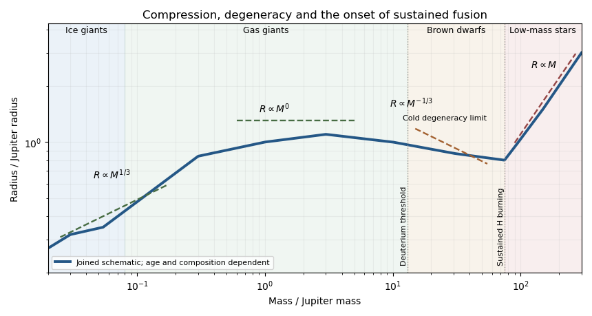

<h1 id="3/b/solution">Solution</h1>

↑ **Parent:** [B](../b.md)

The [mass-radius curve of solar-composition substellar objects](../../../../../../mass-radius-curve-of-solar-composition-substellar-objects.md) reflects the transition from weak compression to pressure ionization and [electron degeneracy pressure](../../../../../../electron-degeneracy-pressure.md), followed by sustained [hydrogen burning](../../../../../../hydrogen-burning.md). A schematic joining representative object classes is:

**[Figure 3](#3/b/image-schematic-mass-radius-sequence-from-ice-giants-through-gas-giants-and-brown-dwarfs-to-low-mass-stars). Schematic mass-radius sequence from ice giants through gas giants and brown dwarfs to low-mass stars**.

The illustration is not an age-specific numerical evolutionary model. In particular, [ice giants](../../../../../../ice-giant.md) contain much more heavy material than a solar-composition giant, so a single uniform-composition equation of state does not describe the entire joined curve.

- At the low-mass, weak-compression end, a fixed-density or fixed-composition approximation gives **$R\propto M^{1/3}$**. [Ice giants](../../../../../../ice-giant.md) such as [Neptune](../../../../../../neptune.md) and [Uranus](../../../../../../uranus.md) have substantial [water](../../../../../../water.md)/rock-rich interiors and modest H/He envelopes; changing envelope fraction changes the radius markedly. Their heat comes from retained formation energy, contraction and [radiogenic heating](../../../../../../radiogenic-heating.md) of heavy material. Fluid interiors generally convect, while composition stratification can impede mixing; outer radiative layers release the heat.
- Ordinary [gas giants](../../../../../../gas-giant.md) reach radii of order $R_J$ over a broad range around Jovian masses: an effective $n\simeq1$ [polytrope](../../../../../../polytrope.md) explains the approximate **$R\propto M^0$** segment. Increased mass compresses material enough to offset the added volume. Cooling and [Kelvin-Helmholtz contraction](../../../../../../kelvin-helmholtz-mechanism.md), with additional differentiation energy such as helium settling in [Saturn](../../../../../../saturn.md), supply the intrinsic luminosity. Their deep envelopes are usually convective, with radiative photospheres.
- More massive [brown dwarfs](../../../../../../brown-dwarf.md) become increasingly supported by [electron degeneracy pressure](../../../../../../electron-degeneracy-pressure.md). The cold nonrelativistic $n=3/2$ limit gives **$R\propto M^{-1/3}$**, but finite [entropy](../../../../../../entropy.md) and Coulomb effects flatten actual giant/brown-dwarf curves and their radii depend on age. They cool and contract; temporary deuterium fusion occurs above a composition-dependent [deuterium-burning mass](../../../../../../deuterium-burning-mass.md) near $13M_J$. This threshold does not cause a sharp structural kink or permanent stellar luminosity. Interiors are largely convective and surface emission is radiative.
- Near the [hydrogen-burning minimum mass](../../../../../../hydrogen-burning-minimum-mass.md), roughly $0.075$–$0.08M_\odot$ or $75$–$85M_J$ for near-solar composition, sustained fusion prevents indefinite cooling into a degenerate object. The [low-mass main-sequence star](../../../../../../low-mass-main-sequence-star.md) branch turns upward, with approximately **$R\propto M$** over the illustrative interval. Its [entropy](../../../../../../entropy.md) is not constant across masses, so this branch is compatible with an approximately $n=3/2$ internal profile. Hydrogen fusion through the [proton–proton chain](../../../../../../proton-proton-chain.md) provides energy; the lowest-mass main-sequence stars are fully convective, capped by radiative atmospheres.

Planet/brown-dwarf naming conventions and deuterium burning do not define a universal discontinuity in the [mass-radius relation](../../../../../../mass-radius-relation.md). Composition, age and irradiation move the curves; the hydrogen-burning transition changes the long-term energy source more fundamentally.

## ↑ Ancestors (11)

1. [B](../b.md)
2. [3](../../3.md)
3. [Paper 59](../../../paper-59-split.md)
4. [Iii](../../../split.md)
5. [2015](../../../../split.md)
6. [Past exam of the mathematics course of the University of Cambridge](../../../../../split.md)
7. [Mathematics course of the University of Cambridge](../../../../../../mathematics-course-of-the-university-of-cambridge.md)
8. [Course of the University of Cambridge](../../../../../../course-of-the-university-of-cambridge.md)
9. [University of Cambridge](../../../../../../university-of-cambridge-split.md)
10. [List of universities](../../../../../../list-of-universities.md)
11. [Codex Wiki](../../../../../../split.md)
