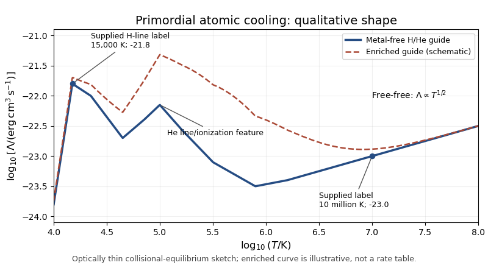

<h1 id="1/ii/solution">Solution</h1>

↑ **Parent:** [Ii](../ii.md)

For an optically thin, low-density plasma, the [astrophysical cooling function](../../../../../../astrophysical-cooling-function.md) packages collisional radiation losses and temperature-dependent ion fractions into the coefficient multiplying $n_H^2$. Because the volume loss rate has units $\mathrm{erg\,cm^{-3}\,s^{-1}}$, the coefficient has units **$\mathrm{erg\,cm^3\,s^{-1}}$**. The energy-density unit printed in the numerical hint cannot be the unit of this coefficient. Interpret the quoted logarithmic values in the dimensionally consistent cooling-coefficient unit.

Assume [collisional ionization equilibrium](../../../../../../collisional-ionization-equilibrium.md), a primordial hydrogen-helium mixture and no external photoheating. In the specified range, the [primordial atomic cooling curve](../../../../../../primordial-atomic-cooling-curve.md) has the following features. Just above $10^4\,\mathrm K$, thermal [Electrons](../../../../../../electron.md) begin to excite neutral [hydrogen](../../../../../../hydrogen.md) efficiently; subsequent line emission, especially [Lyman-alpha emission](../../../../../../lyman-alpha-emission.md), causes a steep rise. The excitation rate contains a threshold factor of order $e^{-10.2\,\mathrm{eV}/(k_BT)}$. [Hydrogen](../../../../../../hydrogen.md) line cooling is strong near a few times $10^4\,\mathrm K$; the supplied value at $1.5\times10^4\,\mathrm K$ provides a useful low-temperature label.

As [hydrogen](../../../../../../hydrogen.md) becomes ionized, neutral-hydrogen line cooling declines. [Helium](../../../../../../helium.md) excitation and [ionization](../../../../../../ionization.md) produce a further shoulder or peak around $10^5\,\mathrm K$. [Collisional excitation](../../../../../../collisional-excitation.md), [collisional ionization](../../../../../../collisional-ionization.md) and [radiative recombination](../../../../../../radiative-recombination.md) all contribute: excitation photons remove [Electron](../../../../../../electron.md) kinetic energy, [ionization](../../../../../../ionization.md) consumes it, and recombination produces free-bound radiation. Once [hydrogen](../../../../../../hydrogen.md) and [helium](../../../../../../helium.md) are almost fully stripped, their bound-state cooling disappears and the curve falls into a relatively inefficient interval. At high temperature, [thermal bremsstrahlung](../../../../../../thermal-bremsstrahlung.md) dominates, with an approximate **$\Lambda\propto T^{1/2}$** tail and a weak Gaunt-factor correction.

The sketch uses the two supplied numerical labels and a qualitative hydrogen-helium interpolation; it is not a tabulated atomic-rate calculation.

**[Figure 1](#1/ii/image-qualitative-primordial-atomic-cooling-curve-with-hydrogen-and-helium-line-features-a-bremsstrahlung-tail-and-an-illustrative-metal-enriched-comparison). Qualitative primordial atomic cooling curve with hydrogen and helium line features, a bremsstrahlung tail, and an illustrative metal-enriched comparison**.

[Metal-line cooling](../../../../../../metal-line-cooling.md) raises the cooling coefficient markedly over much of $10^5$–$10^7\,\mathrm K$, because heavier elements supply many ions and excitation transitions after [hydrogen](../../../../../../hydrogen.md) and [helium](../../../../../../helium.md) have lost their bound [Electrons](../../../../../../electron.md). It also broadens and reshapes the line-cooling peaks. Fine-structure lines can permit cooling below the [hydrogen](../../../../../../hydrogen.md) atomic threshold; [molecular hydrogen](../../../../../../molecular-hydrogen.md) can likewise cool metal-free gas below that threshold, but lies outside the requested temperature range. At sufficiently high temperatures [thermal free-free emission](../../../../../../thermal-bremsstrahlung.md) again dominates the continuum. The enhanced curve in the figure is a schematic comparison, not a numerical claim about a specified metallicity. Thus **metals generally shorten the cooling time and extend the temperature range of efficient cooling**; [ionization](../../../../../../ionization.md) state, abundance and radiation field determine the actual curve.

## ↑ Ancestors (11)

1. [Ii](../ii.md)
2. [1](../../1.md)
3. [Paper 61](../../../paper-61-split.md)
4. [Iii](../../../split.md)
5. [2015](../../../../split.md)
6. [Past exam of the mathematics course of the University of Cambridge](../../../../../split.md)
7. [Mathematics course of the University of Cambridge](../../../../../../mathematics-course-of-the-university-of-cambridge.md)
8. [Course of the University of Cambridge](../../../../../../course-of-the-university-of-cambridge.md)
9. [University of Cambridge](../../../../../../university-of-cambridge-split.md)
10. [List of universities](../../../../../../list-of-universities.md)
11. [Codex Wiki](../../../../../../split.md)
