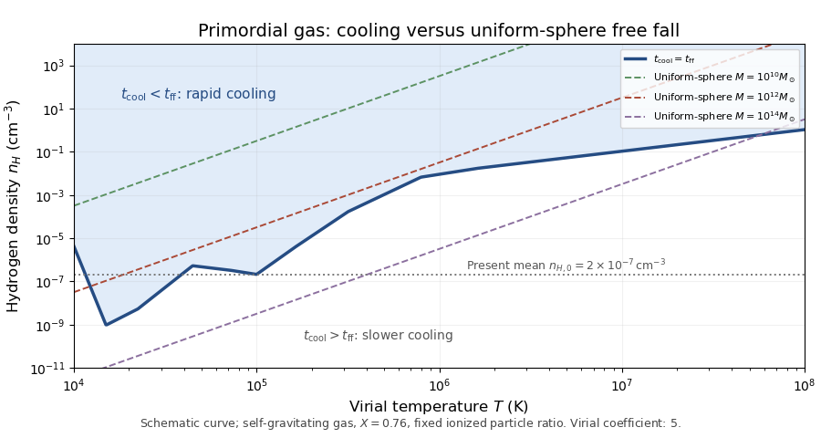

<h1 id="1/iii/solution">Solution</h1>

↑ **Parent:** [Iii](../iii.md)

The [optically thin gas cooling time](../../../../../../optically-thin-gas-cooling-time.md) is thermal energy density divided by the radiative loss rate. Write $\chi=n_{\rm tot}/n_H$ for the number of thermal particles per [hydrogen](../../../../../../hydrogen.md) nucleus, $X$ for the [hydrogen mass fraction](../../../../../../hydrogen-mass-fraction.md), and $f_g=\rho_g/\rho_{\rm grav}$ for the gas fraction of the gravitating mass. Then

$$
t_{\rm cool}=\frac{3\chi k_BT}{2n_H\Lambda(T)},\qquad \rho_{\rm grav}=\frac{m_pn_H}{Xf_g},\qquad t_{\rm ff}=\left(\frac{3\pi}{32G\rho_{\rm grav}}\right)^{1/2}.
$$

The last expression is the [free-fall time of a uniform sphere](../../../../../../free-fall-time-of-a-uniform-sphere.md). Equating the two times gives the [cooling-to-free-fall equality curve](../../../../../../cooling-to-free-fall-equality-curve.md)

$$
\boxed{n_{H,\rm crit}(T)=\frac{32Gm_p}{3\pi Xf_g}\left[\frac{3\chi k_BT}{2\Lambda(T)}\right]^2.}
$$

At fixed temperature, $t_{\rm cool}/t_{\rm ff}=\sqrt{n_{H,\rm crit}/n_H}$: **above the curve, $t_{\rm cool}<t_{\rm ff}$; below it, cooling is slower**. The temperature dependence is approximately $n_{H,\rm crit}\propto T^2/\Lambda^2$. Strong line cooling therefore creates low-density troughs, whereas the fully ionized bremsstrahlung tail gives $n_{H,\rm crit}\propto T$.

For the diagram choose a self-gravitating uniform gas cloud, $f_g=1$, with $X=0.76$, [proton](../../../../../../proton.md) mass $m_p\simeq1.67\times10^{-24}\,\mathrm g$, and the fully ionized particle ratio $\chi=2+3(1-X)/(4X)\simeq2.24$. Using this fixed ratio is a convenient sketch normalization; the varying low-temperature ion fraction changes the coefficient by a factor of order unity. The supplied cooling values then give $n_{H,\rm crit}\sim10^{-9}\,\mathrm{cm^{-3}}$ at $1.5\times10^4\,\mathrm K$ and $n_{H,\rm crit}\sim0.1\,\mathrm{cm^{-3}}$ at $10^7\,\mathrm K$. A dark-matter-dominated potential has $f_g<1$, shortening the free-fall time and moving the equality curve upward by $1/f_g$.

To relate the plane to mass, use the [virial theorem](../../../../../../virial-theorem.md) for a uniform self-gravitating sphere. Its gravitational potential energy is $-3GM^2/(5R)$, so $k_BT_{\rm vir}=GM\mu m_p/(5R)$, where $\mu=1/(X\chi)$. With $M=(4\pi/3)\rho R^3$, the [virial mass contours in a cooling diagram](../../../../../../virial-mass-contours-in-a-cooling-diagram.md) satisfy

$$
M=\left(\frac{5k_BT}{G\mu m_p}\right)^{3/2}\left(\frac{3X}{4\pi m_pn_H}\right)^{1/2},\qquad n_H\propto\frac{T^3}{M^2}.
$$

The coefficient $5$ is for this uniform-sphere convention; other halo profiles change it. The horizontal mean-density label is $n_{H,0}\simeq2\times10^{-7}\,\mathrm{cm^{-3}}$. Real collapsing clouds are overdense, and their characteristic densities rise at earlier epochs.

**[Figure 2](#1/iii/image-cooling-and-free-fall-equality-in-hydrogen-density-and-virial-temperature-for-a-uniform-primordial-gas-cloud-with-constant-mass-contours-and-the-present-mean-hydrogen-density). Cooling and free-fall equality in hydrogen density and virial temperature for a uniform primordial gas cloud, with constant-mass contours and the present mean hydrogen density**.

The [cooling criterion for galaxy formation](../../../../../../cooling-criterion-for-galaxy-formation.md) requires a cloud to lose shock-generated virial heat rapidly enough to contract and fragment. At higher virial masses and temperatures, hydrogen-helium line cooling ceases to be efficient, so a growing bound aggregate can remain a hot, pressure-supported atmosphere rather than condense as one giant luminous galaxy. Combined with virial mass contours and the densities at which clouds assemble, the diagram gives a characteristic upper galaxy-scale cooling mass, conventionally of order $10^{12}M_\odot$ in the simple baryonic-cloud argument. Larger aggregates are predominantly groups or clusters containing smaller galaxies and hot gas.

This [upper galaxy mass from gas cooling](../../../../../../upper-galaxy-mass-from-gas-cooling.md) is a physical scale, not an exact universal mass cutoff derivable from the two cooling labels alone. Composition, formation density, geometry, metals and a dark-matter potential shift it. Cooling that is slower than free fall but faster than the available cosmic time can still yield gradual central condensation. Mergers of existing stellar galaxies can also assemble a larger stellar system without rapidly cooling the entire gas mass of its host halo.

## ↑ Ancestors (11)

1. [Iii](../iii.md)
2. [1](../../1.md)
3. [Paper 61](../../../paper-61-split.md)
4. [Iii](../../../split.md)
5. [2015](../../../../split.md)
6. [Past exam of the mathematics course of the University of Cambridge](../../../../../split.md)
7. [Mathematics course of the University of Cambridge](../../../../../../mathematics-course-of-the-university-of-cambridge.md)
8. [Course of the University of Cambridge](../../../../../../course-of-the-university-of-cambridge.md)
9. [University of Cambridge](../../../../../../university-of-cambridge-split.md)
10. [List of universities](../../../../../../list-of-universities.md)
11. [Codex Wiki](../../../../../../split.md)
