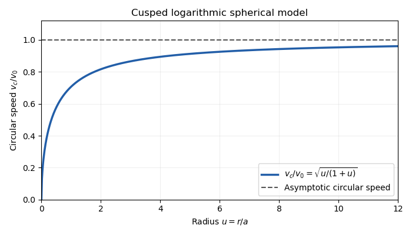

<h1 id="2/solution">Solution</h1>

↑ **Parent:** [2](../2.md)

A [phase-space distribution function](../../../../../phase-space-distribution-function.md) describes the mass in a small cell of positions and velocities: $F(\mathbf x,\mathbf v,t)\,d^3x\,d^3v$ is that mass. Its velocity integral is the spatial [mass density](../../../../../density.md), and $F/\rho$ at a fixed position is a normalized velocity probability density. A number-normalized [galactic distribution function](../../../../../galactic-distribution-function.md) differs by the stellar mass convention.

Take $a>0$ and $v_0>0$. For the [cusped logarithmic spherical galaxy model](../../../../../cusped-logarithmic-spherical-galaxy-model.md), differentiate the [gravitational potential](../../../../../newtonian-potential-of-a-point-mass.md) and use the spherical [Poisson equation for Newtonian gravity](../../../../../poisson-equation-for-newtonian-gravity.md):

$$
\Phi'=\frac{v_0^2}{a+r},\qquad 4\pi G\rho=\frac1{r^2}\frac{d}{dr}(r^2\Phi')=v_0^2\frac{2a+r}{r(a+r)^2}.
$$

Thus

$$
\boxed{\rho(r)=\frac{v_0^2}{4\pi G}\frac{2a+r}{r(a+r)^2},\qquad M(r)=\frac{v_0^2r^2}{G(a+r)}.}
$$

A [circular orbit](../../../../../circular-orbit.md) requires $v_c^2/r=\Phi'$. Its [galaxy rotation curve](../../../../../galaxy-rotation-curve.md) is therefore

$$
\boxed{v_c(r)=v_0\sqrt{\frac r{a+r}}.}
$$

It rises as $v_0\sqrt{r/a}$ at small radius and approaches $v_0$ from below at large radius.

**[Figure 1](#2/image-rotation-curve-of-the-cusped-logarithmic-spherical-galaxy-model). Rotation curve of the cusped logarithmic spherical galaxy model**.

The outer [flat galaxy rotation curve](../../../../../flat-galaxy-rotation-curve.md) is qualitatively useful for galaxies. However, the density has an inner $1/r$ cusp and an outer $1/r^2$ tail, while $M(r)\sim v_0^2r/G$ diverges. The model therefore requires an outer truncation for a finite galaxy, and does not describe a central constant-density core. Its [gravitational potential](../../../../../newtonian-potential-of-a-point-mass.md) cannot be normalized to zero at infinity.

For a star, the specific energy is $E=v^2/2+\Phi$ and the [specific angular momentum](../../../../../specific-angular-momentum.md) is $\mathbf L=\mathbf x\times\mathbf v$. Since the [gravitational potential](../../../../../newtonian-potential-of-a-point-mass.md) is stationary and spherical,

$$
\frac{dE}{dt}=\mathbf v\cdot(\dot{\mathbf v}+\nabla\Phi)=0,\qquad\frac{d\mathbf L}{dt}=\mathbf x\times\left(-\Phi'\frac{\mathbf x}{r}\right)=0.
$$

Thus **both the specific energy and the entire angular-momentum vector are conserved**.

For [Jeans theorem](../../../../../jeans-theorem.md), follow a stellar trajectory in [phase space](../../../../../phase-space.md). The [Collisionless Boltzmann equation](../../../../../collisionless-boltzmann-equation.md) is precisely

$$
\frac{dF}{dt}=\partial_tF+\mathbf v\cdot\nabla_xF-\nabla\Phi\cdot\nabla_vF=0.
$$

In a steady system $\partial_tF=0$, so the value of the [galactic distribution function](../../../../../galactic-distribution-function.md) is constant along every trajectory: it is itself an [integral of motion](../../../../../integral-of-motion.md). Conversely, if $I_1,\ldots,I_m$ are time-independent [integrals of motion](../../../../../integral-of-motion.md), then $F=h(I_1,\ldots,I_m)$ satisfies $dF/dt=\sum h_{,a}\dot I_a=0$. Locally, a complete set of invariant orbit labels expresses any steady [galactic distribution function](../../../../../galactic-distribution-function.md) this way. This is the weak form of [Jeans theorem](../../../../../jeans-theorem.md); a stronger assertion about a small set of isolating integrals needs additional orbital regularity or mixing assumptions. In particular, the theorem does not say that every steady galaxy must have a [galactic distribution function](../../../../../galactic-distribution-function.md) depending on only $E$ and $L$.

For the proposed [constant-anisotropy distribution function](../../../../../constant-anisotropy-distribution-function.md), write $v_T=(v_\theta^2+v_\phi^2)^{1/2}$ and $L=rv_T$. Introduce a polar angle $\psi$ in the tangential velocity plane. Then $d^3v=dv_r\,v_Tdv_T\,d\psi$, so the apparent $1/L$ singularity cancels against the velocity Jacobian. This [inverse-angular-momentum velocity integration](../../../../../inverse-angular-momentum-velocity-integration.md) makes the density finite for every $r>0$.

Let $t=e^{-\Phi/v_0^2}=a/(a+r)$, $c_1=1$, $c_2=2$, and $\alpha_k=k/(2v_0^2)$. Each exponential component contributes

$$
\rho_k=\frac{c_kt^k}{8\pi^3Gar}\int_{-\infty}^{\infty}e^{-\alpha_kv_r^2}\,dv_r\int_0^\infty e^{-\alpha_kv_T^2}\,dv_T\int_0^{2\pi}d\psi=\frac{v_0^2}{4\pi Gar}\frac{c_k}{k}t^k.
$$

Here the two [Gaussian integrals](../../../../../gaussian-integral.md) and the angular integral have product $\pi^2/\alpha_k$. Consequently,

$$
\rho=\frac{v_0^2}{4\pi Gar}(t+t^2)=\frac{v_0^2}{4\pi G}\frac{2a+r}{r(a+r)^2}.
$$

The [galactic distribution function](../../../../../galactic-distribution-function.md) is nonnegative, gives the required density, and depends on conserved $E,L$; by [Jeans theorem](../../../../../jeans-theorem.md) it is a self-consistent steady solution.

Differentiating the [Gaussian integral](../../../../../gaussian-integral.md) with respect to $\alpha_k$ shows that each component has $\langle v_r^2\rangle_k=1/(2\alpha_k)=v_0^2/k$, and the same value for $\langle v_T^2\rangle_k$. Angular averaging gives $\langle v_\theta^2\rangle_k=\langle v_\phi^2\rangle_k=v_0^2/(2k)$. Weighting these by $\rho_1,\rho_2$ yields the [velocity dispersions](../../../../../velocity-dispersion.md)

$$
\boxed{\sigma_r^2=v_0^2\frac{t+t^2/2}{t+t^2}=\frac{v_0^2}{2}\frac{3a+2r}{2a+r},\qquad\sigma_\theta^2=\sigma_\phi^2=\frac{v_0^2}{4}\frac{3a+2r}{2a+r}.}
$$

The radial numerator includes $2r$, as in the original PDF. All mean velocities vanish by parity. The same parity, or the zero angular average of $\sin\psi\cos\psi$, gives **$\langle v_rv_\theta\rangle=\langle v_rv_\phi\rangle=\langle v_\theta v_\phi\rangle=0$**.

The [velocity-anisotropy parameter](../../../../../velocity-anisotropy-parameter.md) is

$$
\boxed{\beta=1-\frac{\sigma_\theta^2+\sigma_\phi^2}{2\sigma_r^2}=\frac12.}
$$

The [constant-anisotropy distribution function](../../../../../constant-anisotropy-distribution-function.md) therefore favors radial motion at every radius: the radial variance is twice either individual tangential variance. It still has a substantial population with nonzero [angular momentum](../../../../../angular-momentum.md), rather than exclusively radial orbits. The $L^{-1}$ factor enhances low-angular-momentum stars. The radial [velocity dispersion](../../../../../velocity-dispersion.md) approaches $3v_0^2/4$ at the centre and $v_0^2$ far out; each individual tangential variance is half as large. There is no mean rotation, despite the well-defined [galaxy rotation curve](../../../../../galaxy-rotation-curve.md) for hypothetical [circular orbits](../../../../../circular-orbit.md).

## ↑ Ancestors (10)

1. [2](../2.md)
2. [Paper 62](../../paper-62-split.md)
3. [Iii](../../split.md)
4. [2015](../../../split.md)
5. [Past exam of the mathematics course of the University of Cambridge](../../../../split.md)
6. [Mathematics course of the University of Cambridge](../../../../../mathematics-course-of-the-university-of-cambridge.md)
7. [Course of the University of Cambridge](../../../../../course-of-the-university-of-cambridge.md)
8. [University of Cambridge](../../../../../university-of-cambridge-split.md)
9. [List of universities](../../../../../list-of-universities.md)
10. [Codex Wiki](../../../../../split.md)
