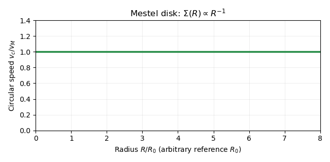

<h1 id="4/solution">Solution</h1>

↑ **Parent:** [4](../4.md)

For a spherical system, use the [spherical shell theorem](../../../../../spherical-shell-theorem.md) with shell mass $dm=4\pi\rho(s)s^2ds$. Inner shells contribute $-Gdm/r$ to the [gravitational potential](../../../../../newtonian-potential-of-a-point-mass.md), while an outer shell contributes its constant interior potential $-Gdm/s$. With $\Phi(\infty)=0$, assuming the required integrals converge,

$$
\boxed{\Phi(r)=-4\pi G\left[\frac1r\int_0^r\rho(s)s^2\,ds+\int_r^\infty\rho(s)s\,ds\right].}
$$

On differentiation, the two terms containing $\rho(r)r$ cancel. Hence $\Phi'=GM(r)/r^2$, where $M(r)=4\pi\int_0^r\rho(s)s^2ds$. Radial balance for a [circular orbit](../../../../../circular-orbit.md) gives **$v_c^2=r\Phi'=GM(r)/r$**.

For a razor-thin axisymmetric [astrophysical disk](../../../../../astrophysical-disk.md), the element of mass is $dm=\Sigma(s)s\,ds\,d\phi'$, where $\Sigma$ is the [surface density](../../../../../surface-density-of-a-disk.md). Superposing [Newtonian gravitational potentials](../../../../../newtonian-gravitational-potential.md) therefore gives

$$
\boxed{\Phi(R)=-G\int_0^\infty\Sigma(s)s\,ds\int_0^{2\pi}\frac{d\phi'}{\sqrt{R^2+s^2-2Rs\cos(\phi'-\phi)}}.}
$$

Axisymmetry permits $\phi=0$. Unlike the spherical case, an exterior annulus generally exerts a radial force: [enclosed mass does not determine a disc rotation curve](../../../../../enclosed-mass-does-not-determine-a-disc-rotation-curve.md).

For the [Legendre expansion of thin-disk gravity](../../../../../legendre-expansion-of-thin-disk-gravity.md), split the radial integral at $s=R$. In the inner part the kernel expands in $s/R$, while in the outer part it expands in $R/s$. The angular integrals of odd [Legendre polynomials](../../../../../legendre-polynomial.md) vanish, and those of even degree $n$ equal $2\alpha_n$, where

$$
\alpha_n=\pi\left[\frac{n!}{2^n((n/2)!)^2}\right]^2\quad(n\text{ even}).
$$

Introduce $I_n(R)=\int_0^R\Sigma(s)s^{n+1}ds$ and $J_n(R)=\int_R^\infty\Sigma(s)s^{-n}ds$. The [gravitational potential](../../../../../newtonian-potential-of-a-point-mass.md) becomes

$$
\Phi(R)=-2G\sum_{k=0}^\infty\alpha_{2k}\left[R^{-(2k+1)}I_{2k}(R)+R^{2k}J_{2k}(R)\right].
$$

When differentiating each bracket, the moving-limit terms cancel: $R^{-(n+1)}I_n'=\Sigma(R)$ and $R^nJ_n'=-\Sigma(R)$. Since $v_c^2=R\Phi'$, this gives

$$
v_c^2=2G\sum_{k=0}^\infty\alpha_{2k}\left[(2k+1)R^{-(2k+1)}I_{2k}-2kR^{2k}J_{2k}\right].
$$

The zeroth term has $\alpha_0=\pi$ and $M(R)=2\pi I_0$. Separating it proves

$$
\boxed{v_c^2=\frac{GM(R)}R+2G\sum_{k=1}^\infty\alpha_{2k}\left[(2k+1)R^{-(2k+1)}\int_0^R\Sigma(s)s^{2k+1}ds-2kR^{2k}\int_R^\infty\Sigma(s)s^{-2k}ds\right].}
$$

The inner correction is inward, while the exterior correction is outward. For a smooth [surface density](../../../../../surface-density-of-a-disk.md), the original potential singularity at coincident points is integrable. Its radial force is understood through a symmetric [Cauchy principal value](../../../../../cauchy-principal-value.md) or a vanishing-thickness regularization; the paired interior and exterior terms above retain the cancellation at $s=R$. This avoids treating the two singular local force contributions separately.

For an [exponential galactic disk](../../../../../exponential-galactic-disk.md), write $\Sigma(s)=\Sigma_0e^{-s/R_d}$, so $M_\infty=2\pi\Sigma_0R_d^2$ and $M(R)=M_\infty[1-(1+R/R_d)e^{-R/R_d}]$. At large $R$, the missing mass and exterior-ring terms are exponentially small. The leading nonspherical interior term is $k=1$, with $\alpha_2=\pi/4$ and $I_2(\infty)=6\Sigma_0R_d^4$. Consequently the [exponential-disk Keplerian asymptotic](../../../../../exponential-disk-keplerian-asymptotic.md) is

$$
v_c^2(R)=\frac{GM_\infty}R+\frac{9\pi G\Sigma_0R_d^4}{R^3}+O(R^{-5})=\frac{GM_\infty}R\left[1+\frac92\left(\frac{R_d}R\right)^2+O\left((R_d/R)^4\right)\right].
$$

The positive leading correction shows that **the rotation curve approaches the Keplerian limit from above**. The finite-order large-radius expansion is sufficient here; an infinite moment expansion need not converge for a disk extending to infinity.

A useful special example is the [Mestel disk](../../../../../mestel-disk.md), with [surface density](../../../../../surface-density-of-a-disk.md) $\Sigma(s)=C/s$ for $s>0$, $C>0$. It has $M(R)=2\pi CR$. For every positive even $n$,

$$
I_n=\frac{CR^{n+1}}{n+1},\qquad J_n=\frac{CR^{-n}}n,\qquad(n+1)R^{-(n+1)}I_n-nR^nJ_n=C-C=0.
$$

All the nonspherical corrections cancel, giving

$$
\boxed{v_c^2=\frac{GM(R)}R=2\pi GC=v_M^2.}
$$

Thus the [Mestel disk](../../../../../mestel-disk.md) has a perfectly [flat galaxy rotation curve](../../../../../flat-galaxy-rotation-curve.md).

**[Figure 2](#4/image-flat-rotation-curve-of-a-mestel-disk-with-surface-density-inversely-proportional-to-radius). Flat rotation curve of a Mestel disk with surface density inversely proportional to radius**.

This example has infinite total mass and a singular central [surface density](../../../../../surface-density-of-a-disk.md). The absolute [gravitational potential](../../../../../newtonian-potential-of-a-point-mass.md) cannot be set to zero at infinity, but the radial force exists as a limit of disks with increasing outer cutoff. Potential differences are $\Phi(R)-\Phi(R_0)=v_M^2\log(R/R_0)$. The earlier potential integral is therefore interpreted up to a radius-independent divergent constant for this example; the force calculation remains valid. Truncating the [Mestel disk](../../../../../mestel-disk.md) gives a more physical finite system but changes the exact flat curve near its edges.

## ↑ Ancestors (10)

1. [4](../4.md)
2. [Paper 62](../../paper-62-split.md)
3. [Iii](../../split.md)
4. [2015](../../../split.md)
5. [Past exam of the mathematics course of the University of Cambridge](../../../../split.md)
6. [Mathematics course of the University of Cambridge](../../../../../mathematics-course-of-the-university-of-cambridge.md)
7. [Course of the University of Cambridge](../../../../../course-of-the-university-of-cambridge.md)
8. [University of Cambridge](../../../../../university-of-cambridge-split.md)
9. [List of universities](../../../../../list-of-universities.md)
10. [Codex Wiki](../../../../../split.md)
