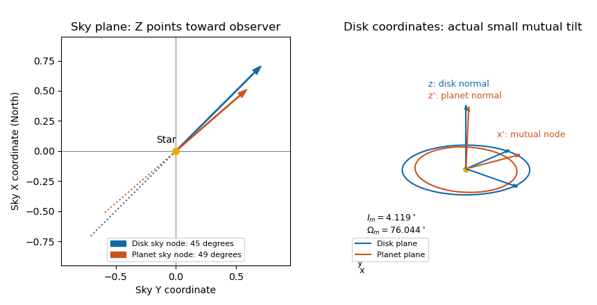
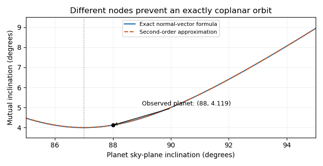
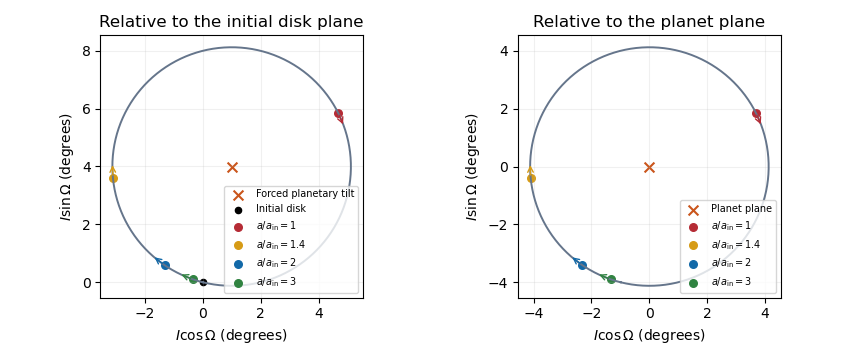

<h1 id="1/solution">Solution</h1>

↑ **Parent:** [1](../1.md)

Take the sky frame and disk frame to be right-handed [orthonormal bases](../../../../../orthonormal-basis.md), with positive angular displacement measured from $\widehat X$ toward $\widehat Y$. In particular, positive $Z$ is toward the observer, so material crossing the sky plane with positive $\dot Z$ is at the [ascending node](../../../../../ascending-node.md). Write $c_d=\cos\Omega_d$, $s_d=\sin\Omega_d$, $C_d=\cos I_d$, and $S_d=\sin I_d$. The disk frame's first [unit vector](../../../../../unit-vector.md) lies along its [ascending node](../../../../../ascending-node.md), and its second has positive $Z$ component. The [orbital-frame rotation from inclination and node](../../../../../orbital-frame-rotation-from-inclination-and-node.md) therefore gives

$$
\boxed{T=R_Z(\Omega_d)R_X(I_d)=
\begin{pmatrix}
c_d&-s_dC_d&s_dS_d\\
s_d&c_dC_d&-c_dS_d\\
0&S_d&C_d
\end{pmatrix}.}
$$

Each column is a disk-frame [unit vector](../../../../../unit-vector.md) in sky coordinates, so $\mathbf X=T\mathbf x$ and the inverse is $\mathbf x=T^{\mathsf T}\mathbf X$. At the disk's [ascending node](../../../../../ascending-node.md), the $Z$ component of its tangential [velocity](../../../../../velocity.md) is positive, confirming the sign of the tilt.

Let $T_p=R_Z(\Omega_p)R_X(I_p)$ define a provisional planet frame whose first axis is the planet's sky-plane [ascending node](../../../../../ascending-node.md). Its normal is $\widehat z_p=(\sin\Omega_p\sin I_p,-\cos\Omega_p\sin I_p,\cos I_p)$. Expressing that normal in the disk [orthonormal basis](../../../../../orthonormal-basis.md), with $\Delta\Omega=\Omega_p-\Omega_d$, gives

$$
T^{\mathsf T}\widehat z_p=
\begin{pmatrix}
\sin I_p\sin\Delta\Omega\\
-\cos I_d\sin I_p\cos\Delta\Omega+\sin I_d\cos I_p\\
\cos I_d\cos I_p+\sin I_d\sin I_p\cos\Delta\Omega
\end{pmatrix}.
$$

The last component is the [dot product](../../../../../dot-product.md) of the two orbital normals, hence the cosine of the [mutual inclination](../../../../../mutual-inclination.md). The mutual [ascending node](../../../../../ascending-node.md) points along $\widehat z_d\times\widehat z_p$: motion there has positive disk-normal component. Set

$$
A=\cos I_d\sin I_p\cos\Delta\Omega-\sin I_d\cos I_p,
\qquad B=\sin I_p\sin\Delta\Omega.
$$

Then $\widehat x\prime=(A\widehat x+B\widehat y)/\sqrt{A^2+B^2}$, and the quadrant-correct [longitude of ascending node](../../../../../longitude-of-ascending-node.md) is $\Omega_m=\operatorname{atan2}(B,A)$. Thus

$$
\boxed{\cos I_m=\cos I_d\cos I_p+\sin I_d\sin I_p\cos\Delta\Omega,
\qquad \tan\Omega_m=\frac{\sin I_p\sin\Delta\Omega}{\cos I_d\sin I_p\cos\Delta\Omega-\sin I_d\cos I_p}.}
$$

The tangent alone cannot fix the quadrant, and $\Omega_m$ is undefined for exactly coincident [orbital planes](../../../../../orbital-plane.md).

For the two rotation routes, define $\psi$ as the oriented angle, within the planet's [orbital plane](../../../../../orbital-plane.md), from its sky-plane [ascending node](../../../../../ascending-node.md) to its disk-plane [ascending node](../../../../../ascending-node.md). If $\widehat x_p,\widehat y_p$ are the first two columns of $T_p$, take $\psi=\operatorname{atan2}(\widehat x\prime\cdot\widehat y_p,\widehat x\prime\cdot\widehat x_p)$. Both routes describe the same planet [orthonormal basis](../../../../../orthonormal-basis.md):

$$
T R_z(\Omega_m)R_x(I_m)=T_pR_z(\psi).
$$

The left route goes through the disk frame; the right goes through the sky-node planet frame. Comparing their third columns gives the two boxed relations, while comparison of first columns fixes the extra in-plane angle.

**[Figure 1](#1/image-sky-node-directions-and-the-mutual-ascending-node-of-the-disk-and-planet). Sky-node directions and the mutual ascending node of the disk and planet**.

Put $I_d=\pi/2+\delta_d$ and $I_p=\pi/2+\delta_p$. A second-order [Taylor expansion](../../../../../taylor-expansion.md) gives $\cos I_m=1-[(\delta_p-\delta_d)^2+\Delta\Omega^2]/2+O(\delta^4)$, and therefore the [mutual inclination of nearly edge-on orbits](../../../../../mutual-inclination-of-nearly-edge-on-orbits.md) satisfies

$$
\boxed{I_m^2=(I_p-I_d)^2+(\Omega_p-\Omega_d)^2+O(\delta^4).}
$$

All expansion angles are in radians. For plotting in degrees this is $I_m\simeq\sqrt{(I_p-87^\circ)^2+(4^\circ)^2}$. The given planet has exact $I_m\simeq4.119^\circ$ and $\Omega_m\simeq76.044^\circ$. The exact minimum occurs at $I_p=\operatorname{atan2}(\sin I_d\cos\Delta\Omega,\cos I_d)\simeq86.993^\circ$, with $I_{m,\min}\simeq3.995^\circ$. At $I_p=85^\circ$ and $95^\circ$, the second-order values are $\sqrt{20}^\circ\simeq4.472^\circ$ and $\sqrt{80}^\circ\simeq8.944^\circ$.

**[Figure 2](#1/image-mutual-inclination-versus-the-planet-s-observed-inclination). Mutual inclination versus the planet's observed inclination**.

For the disk evolution, neglect disk self-gravity, collisions that align the planes, and back-reaction on the planet. In the initial disk plane, use the [complex inclination](../../../../../complex-inclination.md) $w=I e^{i\Omega}$ for a ring and $w_p=I_m e^{i\Omega_m}$ for the planet. Linear [Laplace-Lagrange secular theory](../../../../../laplace-lagrange-secular-theory.md) has [forced inclination](../../../../../forced-inclination.md) $w_p$ and solution $w(a,t)=w_p[1-e^{-i\nu(a)t}]$ for initially flat rings. For an inner circular perturber, the [Laplace coefficient](../../../../../laplace-coefficient.md) formula is $\nu=n(M_p/M_\star)\alpha b_{3/2}^{(1)}(\alpha)/4$, with $\alpha=a_p/a$. Its [quadrupole approximation](../../../../../quadrupole-approximation.md) uses $b_{3/2}^{(1)}\simeq3\alpha$, yielding

$$
\nu(a)\simeq\frac34n\frac{M_p}{M_\star}\left(\frac{a_p}{a}\right)^2\propto a^{-7/2}.
$$

In the $(I\cos\Omega,I\sin\Omega)$ plot referenced to the initial disk, every ring runs clockwise on the same circle centered at $w_p$, starting at the origin. Inner rings advance more quickly. If the axes are instead referenced to the planet's plane, the relative tilt is $w-w_p=-w_pe^{-i\nu t}$: these circles are centered at the origin, and the [mutual inclination](../../../../../mutual-inclination.md) is constant. Both conventions describe the same [nodal precession](../../../../../nodal-precession.md); they should not be mixed.

**[Figure 3](#1/image-differential-nodal-precession-in-initial-disk-and-planet-plane-inclination-coordinates). Differential nodal precession in initial-disk and planet-plane inclination coordinates**.

At an intermediate epoch, rings with $\nu t\gtrsim1$ have tilted substantially while outer rings with $\nu t\ll1$ remain near the original disk plane. This radial variation is a [planet-induced debris-disk warp](../../../../../planet-induced-debris-disk-warp.md). The characteristic affected radius grows like $t^{2/7}$. Conservative [differential nodal precession](../../../../../differential-nodal-precession.md) preserves each ring's tilt relative to the planet, so it does not by itself align every orbit; an unresolved inner region can acquire a mean plane near the planetary plane through [phase mixing](../../../../../phase-mixing.md). The secular interpretation is also described in [Wyatt's planetary dynamics lectures](https://people.ast.cam.ac.uk/~wyatt/lecture2_planetarysystemdynamics.pdf).

## ↑ Ancestors (10)

1. [1](../1.md)
2. [Paper 63](../../paper-63-split.md)
3. [Iii](../../split.md)
4. [2015](../../../split.md)
5. [Past exam of the mathematics course of the University of Cambridge](../../../../split.md)
6. [Mathematics course of the University of Cambridge](../../../../../mathematics-course-of-the-university-of-cambridge.md)
7. [Course of the University of Cambridge](../../../../../course-of-the-university-of-cambridge.md)
8. [University of Cambridge](../../../../../university-of-cambridge-split.md)
9. [List of universities](../../../../../list-of-universities.md)
10. [Codex Wiki](../../../../../split.md)
