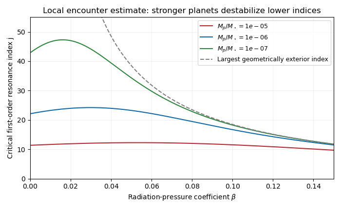

<h1 id="2/solution">Solution</h1>

↑ **Parent:** [2](../2.md)

Let $\mu=M_p/M_\star$, $q=\sqrt{1-\beta}$, and restrict first to $0\le\beta<1$. The [radiation-pressure coefficient](../../../../../radiation-pressure-coefficient.md) reduces the grain's central [gravitational parameter](../../../../../standard-gravitational-parameter.md) to $GM_\star q^2$, whereas the planet's is approximately $GM_\star$. Their [mean motions](../../../../../mean-motion.md) obey $n/n_p=q(1+\epsilon)^{-3/2}$. Setting this ratio to $j/(j+1)$ gives the [radiation-pressure shift of a mean-motion resonance](../../../../../radiation-pressure-shift-of-a-mean-motion-resonance.md):

$$
\boxed{\epsilon_j=(1-\beta)^{1/3}\left(\frac{j+1}{j}\right)^{2/3}-1.}
$$

It lies interior to the planet exactly when $q(j+1)<j$, or $j>q/(1-q)$. Equality puts the frequency commensurability at the planet's radius. For $\beta=0$ every such commensurability is exterior.

There is a frame qualification in the printed encounter formula. The circular inertial speed of the grain at $a_p(1+\epsilon_1)$ is $v_1=qv_p(1+\epsilon_1)^{-1/2}$. Subtracting the planet's inertial velocity at conjunction gives the local planet-relative inertial speed

$$
v_\infty=v_p-v_1=v_p[1-q(1-\epsilon_1/2)]+O(v_p\epsilon_1^2).
$$

This is the velocity used in the question's two-body [gravitational assist](../../../../../gravitational-assist.md) calculation. In a frame actually rotating about the star at $n_p$, the grain's tangential velocity is instead $v_1-n_pa_p(1+\epsilon_1)$, with magnitude $v_p[1+\epsilon_1-q(1-\epsilon_1/2)]$. In particular its nonradiating shear is $3v_p\epsilon_1/2$, rather than $v_p\epsilon_1/2$. Thus the requested expression uses a local translating, inertial encounter convention despite the source's rotating-frame wording. The following derivation consistently uses that convention, and its coefficients are an encounter estimate rather than an exact rotating-frame result.

Take [impact parameter](../../../../../impact-parameter.md) $b\simeq a_p\epsilon_1$ and a small [gravitational scattering angle](../../../../../gravitational-scattering-angle.md) $\theta$. Expanding the supplied hyperbolic scattering relation gives $\theta\simeq2GM_p/(b v_\infty^2)$. Initially the relative tangential velocity is $-v_\infty$; after the deflection it has tangential component $-v_\infty\cos\theta$. The relative speed is unchanged in the local [hyperbolic Kepler orbit](../../../../../hyperbolic-kepler-orbit.md), but the stellar-frame [kinetic energy](../../../../../kinetic-energy.md) changes. Taking the [dot product](../../../../../dot-product.md) with the planet's [velocity](../../../../../velocity.md) gives

$$
v_2^2-v_1^2=2v_pv_\infty(1-\cos\theta)
\simeq v_pv_\infty\theta^2
=\boxed{4\mu^2\epsilon_1^{-2}v_p^5v_\infty^{-3}}.
$$

The [specific orbital energy](../../../../../specific-orbital-energy.md) of the grain is $-GM_\star(1-\beta)/(2a)$. Comparing it immediately before and after the encounter at the same position gives

$$
v_2^2-v_1^2=GM_\star(1-\beta)\left(\frac1{a_1}-\frac1{a_2}\right)
\simeq(1-\beta)v_p^2(\epsilon_2-\epsilon_1).
$$

Consequently

$$
\boxed{\delta\epsilon\equiv\epsilon_2-\epsilon_1
\simeq4\mu^2\epsilon_1^{-2}(1-\beta)^{-1}(v_p/v_\infty)^3.}
$$

The encounter increases the grain's [semi-major axis](../../../../../semi-major-axis.md) within this geometry. These steps assume $\epsilon_1\ll1$, $\theta\ll1$, and an orbital kick small enough for the subsequent linearization.

Choose the initial [conjunction](../../../../../conjunction-astronomy.md) longitude as zero. The [synodic period](../../../../../synodic-period.md) is $2\pi/(n_p-n)$, and the planet's longitude accumulated by the next [conjunction](../../../../../conjunction-astronomy.md) is

$$
\boxed{\lambda_{c1}=\frac{2\pi}{1-q(1+\epsilon_1)^{-3/2}},\qquad
\lambda_{c2}=\frac{2\pi}{1-q(1+\epsilon_2)^{-3/2}}.}
$$

These are unwrapped longitudes, counting complete revolutions. The second uses the new mean [orbital period](../../../../../orbital-period.md) while neglecting the encounter's immediate phase offset and the difference between true and mean [conjunction](../../../../../conjunction-astronomy.md). A comparison reduced modulo $2\pi$ could not implement the stated one-turn sensitivity test.

For $\beta=0$, $v_\infty\simeq v_p\epsilon_1/2$, so $\delta\epsilon\simeq32\mu^2\epsilon_1^{-5}$ and $\lambda_c\simeq4\pi/(3\epsilon)$. [Conjunction-longitude sensitivity to an encounter](../../../../../conjunction-longitude-sensitivity-to-an-encounter.md) gives

$$
|\lambda_{c2}-\lambda_{c1}|\simeq\frac{128\pi\mu^2}{3\epsilon_1^7}.
$$

Requiring this to exceed $2\pi$ gives $\epsilon_1^7<64\mu^2/3$. At a high-index [first-order mean-motion resonance](../../../../../first-order-mean-motion-resonance.md), $\epsilon_j=(1+1/j)^{2/3}-1\simeq2/(3j)$, hence

$$
\boxed{j>\left(\frac2{729}\right)^{1/7}\mu^{-2/7}.}
$$

The interpretation of the [resonance-overlap encounter estimate](../../../../../resonance-overlap-encounter-estimate.md) is loss of coherent encounter phases: a small kick changes the next synodic encounter time by more than one planetary revolution. Resonant protection by repeatedly meeting at controlled orbital phases can then fail, allowing irregular kicks and diffusion. This sensitivity criterion motivates an unstable region; it is not a proof that every orbit or resonant phase in it must escape.

For a quantitative sketch with radiation, put $h=1-q(1-\epsilon/2)$ and $d=1-q(1+\epsilon)^{-3/2}$. Differentiating the conjunction formula and substituting the kick gives

$$
\frac{|\delta\lambda_c|}{2\pi}\simeq
\mathcal S(\epsilon,\beta,\mu)
=\frac{6\mu^2}{q\epsilon^2h^3d^2(1+\epsilon)^{5/2}}.
$$

Evaluate this at the positive $\epsilon_j$ and take $\mathcal S=1$ as the critical-index curve. At small $\beta$, increased encounter speed weakens [planetary scattering](../../../../../planetary-scattering.md), moving the threshold to larger $j$. As $\beta$ rises further, the [radiation-pressure shift of a mean-motion resonance](../../../../../radiation-pressure-shift-of-a-mean-motion-resonance.md) brings each commensurability closer to the planet, strengthening the close encounters. The curve turns over and approaches the exterior-limit boundary $j=q/(1-q)$. Larger planetary [mass](../../../../../mass.md) produces stronger kicks and a lower critical index. These competing effects are shown below; the curves retain the factors in $\mathcal S$, so their $\beta=0$ intercepts differ slightly from the leading high-$j$ formula. The boundary for disappearing exterior commensurabilities is geometric; divergence of the encounter approximation near $\epsilon=0$ should not be read as a precise physical scattering rate.

**[Figure 4](#2/image-encounter-estimate-critical-resonance-index-versus-radiation-pressure-for-three-planet-to-star-mass-ratios). Encounter-estimate critical resonance index versus radiation pressure for three planet-to-star mass ratios**.

## ↑ Ancestors (10)

1. [2](../2.md)
2. [Paper 63](../../paper-63-split.md)
3. [Iii](../../split.md)
4. [2015](../../../split.md)
5. [Past exam of the mathematics course of the University of Cambridge](../../../../split.md)
6. [Mathematics course of the University of Cambridge](../../../../../mathematics-course-of-the-university-of-cambridge.md)
7. [Course of the University of Cambridge](../../../../../course-of-the-university-of-cambridge.md)
8. [University of Cambridge](../../../../../university-of-cambridge-split.md)
9. [List of universities](../../../../../list-of-universities.md)
10. [Codex Wiki](../../../../../split.md)
