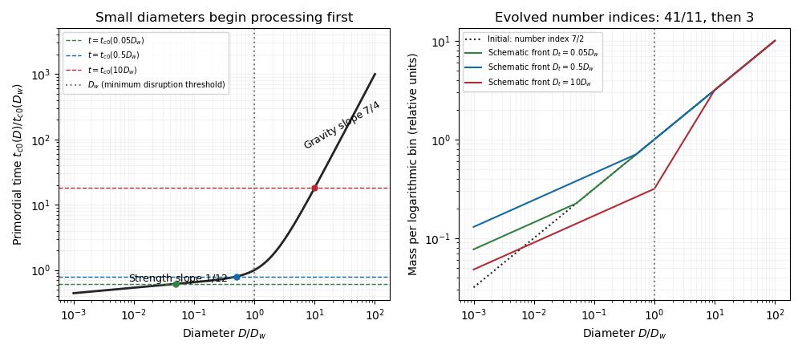

<h1 id="4/solution">Solution</h1>

↑ **Parent:** [4](../4.md)

Let $L_k=\dot m_k^{-c}$ be the mass processed by catastrophic impacts in logarithmic bin $k$. Steady [mass conservation](../../../../../mass-conservation.md) requires the same downward [mass flux](../../../../../mass-flux.md) across every interior size threshold. A scale-independent [fragment redistribution function](../../../../../fragment-redistribution-function.md) makes the transfer kernel depend only on the number of logarithmic bin steps. Consequently a self-similar interior steady [collisional cascade](../../../../../collisional-cascade.md) has $L_k=L$, independent of size: a constant processed mass per bin supplies the constant flux, with the same kernel-dependent proportionality at every bin. This is the [constant mass flux in a collisional cascade](../../../../../constant-mass-flux-in-a-collisional-cascade.md) result, away from injection and removal cutoffs. Size-independent fragmentation does not eliminate boundary waves at the very ends of a finite distribution.

For equal-density [planetesimals](../../../../../planetesimal.md), body mass is proportional to $D^3$ and a fixed logarithmic bin contains a number proportional to $Dn(D)$. The [mass per logarithmic size bin](../../../../../mass-per-logarithmic-size-bin.md) is therefore $m_{\log}\propto D^{4-\alpha}$. With the given [catastrophic planetesimal collision rate](../../../../../catastrophic-planetesimal-collision-rate.md), $Q_D^*\propto D^b$ gives

$$
L\sim m_{\log}R(D,Q_D^*)
\propto D^{7-2\alpha+b(1-\alpha)/3}.
$$

[Constant mass flux in a collisional cascade](../../../../../constant-mass-flux-in-a-collisional-cascade.md) sets the exponent to zero, yielding the [strength-dependent steady collisional-cascade slope](../../../../../strength-dependent-steady-collisional-cascade-slope.md)

$$
\boxed{\alpha=\frac{21+b}{6+b}.}
$$

The time to change an order-one fraction of a bin's mass is $m_k/(m_kR_k)=1/R_k$. Its [collisional-cascade relaxation time](../../../../../collisional-cascade-relaxation-time.md) is thus $t_c(D)\sim1/R(D,Q_D^*)$. The contemporaneous projectile population must be used when a different part of the distribution has already evolved.

For the primordial differential-number index $\alpha_0=7/2$, the [collisional-cascade relaxation time](../../../../../collisional-cascade-relaxation-time.md) is

$$
t_{c0}(D)\propto M_{\rm tot}^{-1}D^{1/2}
[Q_aD^{-1/2}+Q_bD^{3/2}]^{5/6}.
$$

It has asymptotic logarithmic slope $1/12$ in the strength regime and $7/4$ in the gravity regime. It increases monotonically: its logarithmic derivative is $1/2+(5/6)d\log Q_D^*/d\log D$, ranging from $1/12$ to $7/4$. In particular the minimum of the [catastrophic disruption threshold](../../../../../catastrophic-disruption-threshold.md) at $D_w$ is not a minimum of the collision time. The [strength-gravity disruption transition](../../../../../strength-gravity-disruption-transition.md) obeys

$$
D_w=\sqrt{\frac{Q_a}{3Q_b}},\qquad D_{\rm eq}=\sqrt{\frac{Q_a}{Q_b}}=\sqrt3D_w.
$$

Small sizes start evolving first. Before $t\sim t_{c0}(D_{\min})$, the whole distribution is nearly primordial. At intermediate times, a transition diameter $D_t$ with $t_c(D_t)\sim t$ separates processed small sizes from mostly primordial larger sizes. The steady strength-regime index is $\alpha_s=41/11$, while the gravity-regime index is $\alpha_g=3$. Thus a plot of [mass per logarithmic size bin](../../../../../mass-per-logarithmic-size-bin.md) has slopes $3/11$ and $1$ in the two evolved regimes, compared with the primordial slope $1/2$. Once $D_t\gg D_w$, both steady slopes appear below the remaining primordial tail. The transition moves to larger sizes, and the normalization eventually decays as the largest bodies are depleted. Sharp joined [power laws](../../../../../power-law.md) are a schematic description; detailed kernels produce smooth transitions and possible waves.

**[Figure 5](#4/image-primordial-collision-times-and-schematic-size-distributions-at-representative-collisional-ages). Primordial collision times and schematic size distributions at representative collisional ages**.

For the uniform depletion, the binary-collision evolution operator $F$ is quadratic in all bin masses: $F(cm)=c^2F(m)$. Let $m(t)$ be the undepleted trajectory and suppose $m_d(T)=m(T)/f$. Differentiating verifies the exact scaling within this fixed-kernel collision model,

$$
\boxed{m_d(t)=\frac1f m\left(T+\frac{t-T}{f}\right),\qquad t\ge T.}
$$

Immediately after depletion the shape is unchanged and the [catastrophic planetesimal collision rates](../../../../../catastrophic-planetesimal-collision-rate.md) are reduced by $f$. Further evolution therefore proceeds $f$ times more slowly on the original trajectory. The processed-to-primordial transition initially remains at $D_t$, then advances on the stretched collision clock.

A collision-only model starting with the smaller initial normalization $m(0)/f$ has trajectory $\widetilde m(u)=m(u/f)/f$. Matching the observed depleted distribution requires $u/f=T+(t-T)/f$. Hence the [collisional age after uniform dynamical depletion](../../../../../collisional-age-after-uniform-dynamical-depletion.md) is

$$
\boxed{t_{\rm inferred}=fT+(t-T)\simeq fT\quad\text{shortly after depletion}.}
$$

The lower observed normalization would make it appear that slow collisions had taken much longer to produce the existing break. Shape and normalization alone cannot determine $f$ without independent information about age, initial mass, or depletion history.

Finally, count all impacts exceeding the strength threshold $Q_s=Q_aD^{-1/2}$, including impacts which also disperse the target. This is the source's inclusive rubblising convention; a bound-remnant [rubblising collision](../../../../../rubblising-collision.md) alone would exclude the dispersing impacts. In the evolved gravity-regime projectile approximation, $\alpha_g=3$, so the given threshold-rate law gives the [rubblising-to-dispersal collision-rate ratio](../../../../../rubblising-to-dispersal-collision-rate-ratio.md)

$$
\frac{R_{\rm rub}}{R_{\rm cc}}=
\left(\frac{Q_D^*}{Q_s}\right)^{2/3}
=\left[1+\frac{Q_b}{Q_a}D^2\right]^{2/3}
=\left[1+\frac13\left(\frac D{D_w}\right)^2\right]^{2/3}.
$$

At the collisional front $D_t$, the age is of order one catastrophic collision time. Thus the expected number of strength-shattering impacts has the large-$D_t/D_w$ scaling

$$
\boxed{N_{\rm rub}(D_t,T)\sim\left(\frac{D_t}{D_w}\right)^{4/3}.}
$$

This is the requested scaling. It is not an exact unit-coefficient identity from the stated assumptions: using the true minimum diameter gives $R_{\rm rub}/R_{\rm cc}\simeq3^{-2/3}(D_t/D_w)^{4/3}$. The actual cumulative number is $\int_0^T R_{\rm rub}(D_t,t)\,dt$, not automatically $TR_{\rm rub}(D_t,T)$, and its coefficient depends on evolution of the projectile population. The $4/3$ estimate also assumes the relevant projectiles sample the gravity-regime slope; sampling the strength or primordial slope changes the exponent. The steady-cascade framework and evolving transitions are developed by [Wyatt, Clarke and Booth](https://arxiv.org/abs/1103.5499).

## ↑ Ancestors (10)

1. [4](../4.md)
2. [Paper 63](../../paper-63-split.md)
3. [Iii](../../split.md)
4. [2015](../../../split.md)
5. [Past exam of the mathematics course of the University of Cambridge](../../../../split.md)
6. [Mathematics course of the University of Cambridge](../../../../../mathematics-course-of-the-university-of-cambridge.md)
7. [Course of the University of Cambridge](../../../../../course-of-the-university-of-cambridge.md)
8. [University of Cambridge](../../../../../university-of-cambridge-split.md)
9. [List of universities](../../../../../list-of-universities.md)
10. [Codex Wiki](../../../../../split.md)
