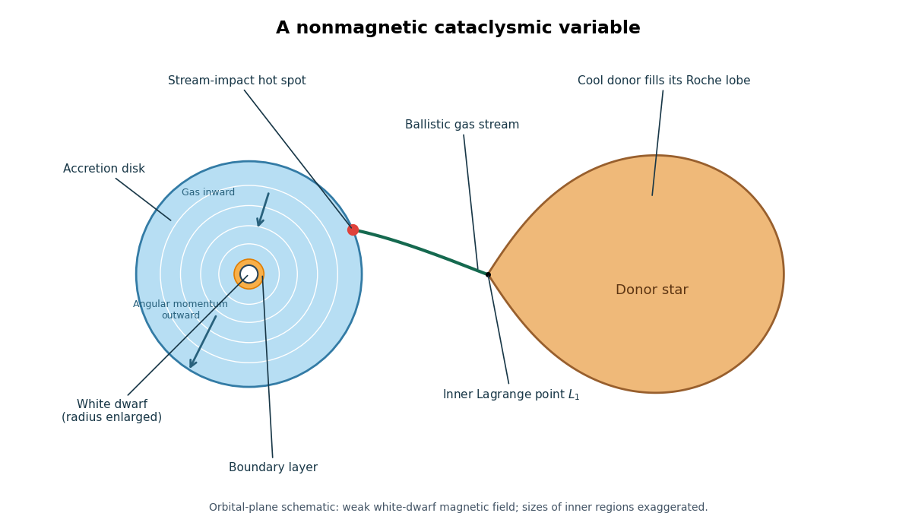

<h1 id="3/solution">Solution</h1>

↑ **Parent:** [3](../3.md)

A [cataclysmic variable](../../../../../cataclysmic-variable.md) is a close [semidetached binary](../../../../../semidetached-binary.md) in which a [white dwarf](../../../../../white-dwarf.md) accretes from a cool, usually low-mass [donor star](../../../../../donor-star.md) filling its [Roche lobe](../../../../../roche-lobe.md). In an ordinary hydrogen-rich system the [donor star](../../../../../donor-star.md) is often near the [lower main sequence](../../../../../lower-main-sequence.md). In a [nonmagnetic cataclysmic variable](../../../../../nonmagnetic-cataclysmic-variable.md) (a disk-fed [CV](../../../../../cataclysmic-variable.md)), the [white dwarf](../../../../../white-dwarf.md)'s [magnetic field](../../../../../magnetic-field.md) is too weak to control the flow over the disk. This leaves a characteristic disk-fed geometry, summarized in the original schematic below. [NASA's introduction to cataclysmic variables](https://heasarc.gsfc.nasa.gov/docs/objects/cvs/cvstext.html) describes the basic components.

**[Figure 1](#3/image-nonmagnetic-cataclysmic-variable-roche-lobe-filling-donor-l1-gas-stream-accretion-disk-hot-spot-white-dwarf-and-boundary-layer). Nonmagnetic cataclysmic variable: Roche-lobe-filling donor, L1 gas stream, accretion disk, hot spot, white dwarf and boundary layer**.

[Roche-lobe overflow](../../../../../roche-lobe-overflow.md) passes through the [inner Lagrange point](../../../../../inner-lagrange-point.md) $L_1$. A nearly ballistic stream bends in the rotating frame and strikes the outer [accretion disk](../../../../../accretion-disk.md), producing an [accretion-disk stream-impact hot spot](../../../../../accretion-disk-stream-impact-hot-spot.md). Its retained [angular momentum](../../../../../angular-momentum.md) prevents direct radial infall. [Viscous evolution of an accretion disk](../../../../../viscous-evolution-of-an-accretion-disk.md) transports [angular momentum](../../../../../angular-momentum.md) outward while gas moves inward through a nearly [Keplerian accretion disk](../../../../../keplerian-accretion-disk.md). Close to the [white dwarf](../../../../../white-dwarf.md), gas slows from orbital rotation toward the stellar rotation in an [accretion-disk boundary layer](../../../../../accretion-disk-boundary-layer.md). The disk, [accretion-disk stream-impact hot spot](../../../../../accretion-disk-stream-impact-hot-spot.md), [accretion-disk boundary layer](../../../../../accretion-disk-boundary-layer.md), [white dwarf](../../../../../white-dwarf.md) and [donor star](../../../../../donor-star.md) all contribute to the spectrum and, where the [orbital inclination](../../../../../orbital-inclination.md) permits, to the eclipses of an [eclipsing binary](../../../../../eclipsing-binary.md). In particular, “nonmagnetic” describes the accretor's control of the flow; it does not imply that the [donor star](../../../../../donor-star.md) cannot sustain a [magnetic field](../../../../../magnetic-field.md).

The gravitational power available from [accretion](../../../../../accretion.md) is approximately $L_{\rm acc}=GM_{\rm WD}\dot M_{\rm acc}/R_{\rm WD}$. For a slowly rotating [white dwarf](../../../../../white-dwarf.md) and a thin steady [Keplerian accretion disk](../../../../../keplerian-accretion-disk.md), the specific energy changes from approximately zero far out to $-GM_{\rm WD}/(2R_{\rm WD})$ at the inner disk. Roughly half the available power is radiated by the [accretion disk](../../../../../accretion-disk.md); the rest is released in the [accretion-disk boundary layer](../../../../../accretion-disk-boundary-layer.md) as the orbital [kinetic energy](../../../../../kinetic-energy.md) is dissipated. Stellar rotation and departures from a steady thin disk change this partition.

A [classical nova](../../../../../classical-nova.md) has a different energy source. Transferred [hydrogen](../../../../../hydrogen.md) accumulates on the [white dwarf](../../../../../white-dwarf.md); compression heats the base of its envelope until temperature-sensitive [hydrogen burning](../../../../../hydrogen-burning.md) accelerates. [Electron degeneracy pressure](../../../../../electron-degeneracy-pressure.md) initially weakens the expansion response to heating, helping a [thermonuclear runaway](../../../../../thermonuclear-runaway.md) develop. The envelope subsequently expands and ejects material, producing a large optical outburst followed by a decline as the ejecta expand and residual burning ends. The [white dwarf](../../../../../white-dwarf.md) usually survives, so continued [accretion](../../../../../accretion.md) can build another fuel layer. A rough recurrence scale is the ignition-envelope mass divided by the mean [accretion rate](../../../../../accretion-rate.md); both this mass and the rate vary strongly among systems. The event is an envelope eruption, and the retained fraction is not automatically unity. [Starrfield, Iliadis and Hix's nova calculations](https://arxiv.org/abs/1605.04294) explains this nuclear mechanism. **A classical nova is powered by unstable nuclear burning on the white dwarf.**

A [dwarf nova](../../../../../dwarf-nova.md) undergoes recurrent, shorter brightenings powered principally by enhanced gravitational [accretion](../../../../../accretion.md). The [hydrogen-ionization disk instability](../../../../../hydrogen-ionization-disk-instability.md) creates cold, mostly neutral and hot, ionized branches of the disk's [accretion-disk thermal S-curve](../../../../../accretion-disk-thermal-s-curve.md), separated by unstable equilibria. In quiescence the cool disk stores matter because inward transport is slow. Once a critical [surface density](../../../../../surface-density-of-a-disk.md) is reached, a heating transition puts the disk into a hotter, more state with higher effective [viscosity](../../../../../dynamic-viscosity.md): the inward [accretion rate](../../../../../accretion-rate.md) and [luminosity](../../../../../luminosity.md) rise and the disk drains. A cooling transition returns it to quiescence, completing the cycle. A persistent increase in the [donor star](../../../../../donor-star.md)'s transfer rate is not required. Sufficiently high transfer rates can keep the disk on its hot stable branch, giving a [nova-like variable](../../../../../nova-like-variable.md) rather than ordinary disk cycles. [Lasota's disk-instability analysis](https://arxiv.org/html/astro-ph/0102072v1) and [Hameury's disk-instability review](https://arxiv.org/abs/1910.01852) develop this picture. **A dwarf-nova outburst is a disk instability, not a white-dwarf thermonuclear explosion.** The names classify mechanisms and need not identify permanently distinct binaries: a nova-producing binary can also possess an unstable disk between nuclear eruptions.

The [cataclysmic-variable orbital-period distribution](../../../../../cataclysmic-variable-orbital-period-distribution.md) is not smooth. For ordinary hydrogen-rich [cataclysmic variables](../../../../../cataclysmic-variable.md), prominent features are a [cataclysmic-variable period gap](../../../../../cataclysmic-variable-period-gap.md) around two to three hours, a [cataclysmic-variable period minimum](../../../../../cataclysmic-variable-period-minimum.md) near eighty minutes, and an accumulation near that minimum. These are population features rather than absolute exclusions. Selection effects matter: luminous high-[accretion rate](../../../../../accretion-rate.md) systems are easier to find than faint evolved systems. Helium-transferring binaries have a different period range and are not described by the hydrogen-rich minimum. [Gänsicke and collaborators' period-minimum study](https://eprints.whiterose.ac.uk/id/eprint/123569/) documents the observed accumulation.

The [Roche-lobe-filling period-density relation](../../../../../roche-lobe-filling-period-density-relation.md) makes the [orbital period](../../../../../orbital-period.md) a measure of donor structure. Combining $R_d\simeq0.46a(M_d/M)^{1/3}$ with [Kepler's third law](../../../../../kepler-s-third-law.md) gives

$$
P^2=\frac{4\pi^2R_d^3}{0.46^3GM_d},\qquad
\boxed{\bar\rho_d=\frac{3\pi}{0.46^3GP^2}\simeq112\left(\frac P{\mathrm{hour}}\right)^{-2}\mathrm{g\,cm^{-3}}.}
$$

As the [donor star](../../../../../donor-star.md) loses mass, its [stellar radius response exponent](../../../../../stellar-radius-response-exponent.md) $\zeta=d\log R_d/d\log M_d$ implies

$$
\frac{d\log P}{d\log M_d}=\frac{3\zeta-1}{2}.
$$

A donor with $\zeta>1/3$ evolves toward shorter [orbital periods](../../../../../orbital-period.md). When its effective response falls below $1/3$, continued mass loss instead lengthens the [orbital period](../../../../../orbital-period.md): this is the [cataclysmic-variable period bounce](../../../../../cataclysmic-variable-period-bounce.md). A very low-mass donor may be substellar and increasingly affected by [electron degeneracy pressure](../../../../../electron-degeneracy-pressure.md); the ideal degenerate scaling $R_d\propto M_d^{-1/3}$ illustrates the reversal. The precise [cataclysmic-variable period minimum](../../../../../cataclysmic-variable-period-minimum.md) depends on thermal disequilibrium and the strength of orbital [angular momentum](../../../../../angular-momentum.md) loss. Near a turning point $|\dot P|$ is small; for an approximately steady evolutionary flow of systems, the number per period interval scales as $N(P)\propto1/|\dot P|$, explaining the accumulation. [Knigge, Baraffe and Patterson's donor-based evolutionary study](https://arxiv.org/abs/1102.2440) relates the [donor star](../../../../../donor-star.md)'s response to these period features.

Long-term transfer is driven mainly by losses of orbital [angular momentum](../../../../../angular-momentum.md), rather than by disk outbursts. [Magnetic braking of a binary star](../../../../../magnetic-braking-of-a-binary-star.md) removes the cool [donor star](../../../../../donor-star.md)'s spin through a magnetized [stellar wind](../../../../../stellar-wind.md). [Tidal synchronization](../../../../../synchronous-rotation.md) makes the orbit replenish that spin, so the wind extracts orbital [angular momentum](../../../../../angular-momentum.md). This is usually the dominant standard driving mechanism above the [cataclysmic-variable period gap](../../../../../cataclysmic-variable-period-gap.md). [Gravitational-wave emission from a binary system](../../../../../gravitational-wave-emission-from-a-binary-system.md) supplies a baseline loss, especially important below the gap. For a weak-field, slowly moving [circular orbit](../../../../../circular-orbit.md), the [circular gravitational-wave inspiral](../../../../../circular-gravitational-wave-inspiral.md) gives

$$
\frac{\dot J_{\rm GR}}J=-\frac{32G^3M_{\rm WD}M_d(M_{\rm WD}+M_d)}{5c^5a^4}.
$$

Because ordinary transfer from the lighter [donor star](../../../../../donor-star.md) tends to expand its [Roche lobe](../../../../../roche-lobe.md) if orbital [angular momentum](../../../../../angular-momentum.md) is conserved, an external loss is needed to sustain contact. In the conservative contact approximation, the [binary mass-transfer contact equation](../../../../../binary-mass-transfer-contact-equation.md) reads

$$
\frac{\dot M_d}{M_d}=\frac{2\dot J_{\rm ext}/J}{\zeta+5/3-2q},\qquad q=\frac{M_d}{M_{\rm WD}},
$$

where the [stellar radius response exponent](../../../../../stellar-radius-response-exponent.md) must match the evolutionary timescale and additional donor expansion has been neglected. The positive denominator on the stable branch makes $\dot J_{\rm ext}<0$ drive $\dot M_d<0$. Nova ejecta can introduce additional [nonconservative binary mass transfer](../../../../../nonconservative-binary-mass-transfer.md). [Knigge's evolutionary discussion](https://arxiv.org/abs/1108.4716) describes the standard loss mechanisms and their limitations.

In the [disrupted magnetic braking model](../../../../../disrupted-magnetic-braking-model.md), relatively rapid mass loss above the [cataclysmic-variable period gap](../../../../../cataclysmic-variable-period-gap.md) keeps the [donor star](../../../../../donor-star.md) inflated relative to [stellar thermal equilibrium](../../../../../stellar-thermal-equilibrium.md). When the donor approaches the [fully convective star](../../../../../fully-convective-star.md) transition, the model postulates a substantial reduction in [magnetic braking of a binary star](../../../../../magnetic-braking-of-a-binary-star.md). The [donor star](../../../../../donor-star.md) can contract within its [Roche lobe](../../../../../roche-lobe.md), suppressing [Roche-lobe overflow](../../../../../roche-lobe-overflow.md) near the upper edge of the gap. [Gravitational-wave emission from a binary system](../../../../../gravitational-wave-emission-from-a-binary-system.md) continues to shrink the [detached binary](../../../../../detached-binary.md); near the lower edge the [Roche lobe](../../../../../roche-lobe.md) again reaches the donor radius and transfer resumes. No mass transfer is needed during the detached crossing. The density relation predicts a radius ratio $(3/2)^{2/3}\simeq1.31$ between contact at three and two hours if the masses remain nearly fixed, illustrating the required inflation before detachment. The torque reduction is a model ingredient, not a claim that all [fully convective stars](../../../../../fully-convective-star.md) lose their magnetic fields. [Zorotovic and collaborators' detached-binary study](https://arxiv.org/abs/1601.07785) tests the predicted detached population in the gap.

The standard formation channel starts with an initially wider [binary star](../../../../../binary-star.md) containing two [main sequence](../../../../../main-sequence.md) stars. The initially more massive component evolves first and becomes a giant. Unstable [Roche-lobe overflow](../../../../../roche-lobe-overflow.md) can engulf the companion in a [common envelope](../../../../../common-envelope.md). Drag causes inward orbital motion, releasing [two-body orbital energy](../../../../../two-body-orbital-energy.md) and transferring [angular momentum](../../../../../angular-momentum.md) to the envelope. If the envelope is expelled before merger, a close [detached binary](../../../../../detached-binary.md) survives, containing the exposed core, which becomes a [white dwarf](../../../../../white-dwarf.md), and the lower-mass companion. This explains how a binary becomes much tighter than the giant progenitor's radius would have allowed. The outcome depends on envelope binding and the efficiency of energy deposition, summarized approximately by the [common-envelope energy formalism](../../../../../common-envelope-energy-formalism.md); ejection is not guaranteed. [Ivanova and collaborators' common-envelope analysis](https://arxiv.org/abs/1209.4302) discusses the relevant physics and uncertainties.

Subsequent [magnetic braking of a binary star](../../../../../magnetic-braking-of-a-binary-star.md) and [gravitational-wave emission from a binary system](../../../../../gravitational-wave-emission-from-a-binary-system.md) shrink the [detached binary](../../../../../detached-binary.md) until its companion fills its [Roche lobe](../../../../../roche-lobe.md). Stable [Roche-lobe overflow](../../../../../roche-lobe-overflow.md), for a suitable [binary mass ratio](../../../../../binary-mass-ratio.md) and [stellar radius response exponent](../../../../../stellar-radius-response-exponent.md), then creates a [cataclysmic variable](../../../../../cataclysmic-variable.md). Its later nuclear eruptions, disk cycles and secular [orbital period](../../../../../orbital-period.md) evolution occur on different timescales. **The formation sequence is a wide binary, envelope ejection, a close detached white-dwarf binary, and angular-momentum-driven contact.**

## ↑ Ancestors (10)

1. [3](../3.md)
2. [Paper 65](../../paper-65-split.md)
3. [Iii](../../split.md)
4. [2015](../../../split.md)
5. [Past exam of the mathematics course of the University of Cambridge](../../../../split.md)
6. [Mathematics course of the University of Cambridge](../../../../../mathematics-course-of-the-university-of-cambridge.md)
7. [Course of the University of Cambridge](../../../../../course-of-the-university-of-cambridge.md)
8. [University of Cambridge](../../../../../university-of-cambridge-split.md)
9. [List of universities](../../../../../list-of-universities.md)
10. [Codex Wiki](../../../../../split.md)
