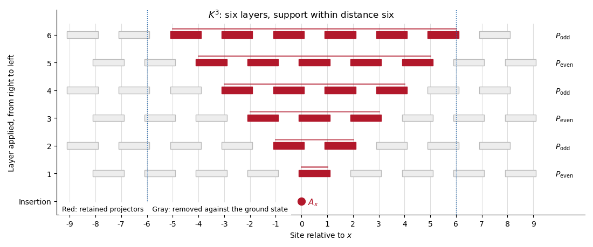

<h1 id="1/b/ii/solution">Solution</h1>

↑ **Parent:** [Ii](../ii.md)

Fix an integer radius $m\geq0$ and put $r=\lfloor m/2\rfloor$. Starting with $A_x$, scan the $2r$ layers of $K^r$ from right to left. In each layer retain precisely those bond [orthogonal projections](../../../../../../../orthogonal-projection.md) whose supports meet the current support; multiply them onto the current operator and enlarge that support to include their bonds. Discard every other projection: it commutes through the current operator and acts as the identity on $|\psi_0\rangle$, by [frustration freeness](../../../../../../../frustration-freeness.md).

If $L_r$ denotes the ordered product of the retained projections, define

$$
\boxed{A_{x(m)}=L_r A_x.}
$$

Each layer expands the support by at most one lattice spacing. Therefore the [local projector cone in a frustration-free chain](../../../../../../../local-projector-cone-in-a-frustration-free-chain.md) lies within radius $2r\leq m$ of $x$, and

$$
K^rA_x|\psi_0\rangle=A_{x(m)}|\psi_0\rangle,\qquad
\|A_{x(m)}\|\leq\|A_x\|,\qquad
\langle\psi_0|A_{x(m)}=\langle\psi_0|A_x.
$$

The last equality holds because every retained projection also fixes the ground-state bra.

For $r\geq1$, the stronger estimate from (i) gives

$$
\|(P_0A_x-A_{x(m)})|\psi_0\rangle\|
\leq\|A_x\|q^{2r-1}
\leq q^{-2}\|A_x\|q^m.
$$

For $r=0$, choose $A_{x(m)}=A_x$; the error is at most $\|A_x\|$, so the same bound holds. Hence

$$
\boxed{\|(P_0A_x-A_{x(m)})|\psi_0\rangle\|
\leq q^{-2}\|A_x\|e^{-\alpha m}.}
$$

Here $\alpha$ is exactly the value in (i), and the prefactor is independent of $m$ and chain length. Counting $K^r$ as $r$ rather than $2r$ layers would give an incorrect support claim; the [powers of a product of two orthogonal projections](../../../../../../../powers-of-a-product-of-two-orthogonal-projections.md) are what avoid a lost factor of two in the decay rate.

**[Figure 1](#1/b/ii/image-retained-bond-projectors-in-the-six-layer-cone-of-a-single-site-operator-under-three-applications-of-k). Retained bond projectors in the six-layer cone of a single-site operator under three applications of K**.

## ↑ Ancestors (12)

1. [Ii](../ii.md)
2. [B](../../b.md)
3. [1](../../../1.md)
4. [Paper 67](../../../../paper-67-split.md)
5. [Iii](../../../../split.md)
6. [2015](../../../../../split.md)
7. [Past exam of the mathematics course of the University of Cambridge](../../../../../../split.md)
8. [Mathematics course of the University of Cambridge](../../../../../../../mathematics-course-of-the-university-of-cambridge.md)
9. [Course of the University of Cambridge](../../../../../../../course-of-the-university-of-cambridge.md)
10. [University of Cambridge](../../../../../../../university-of-cambridge-split.md)
11. [List of universities](../../../../../../../list-of-universities.md)
12. [Codex Wiki](../../../../../../../split.md)
