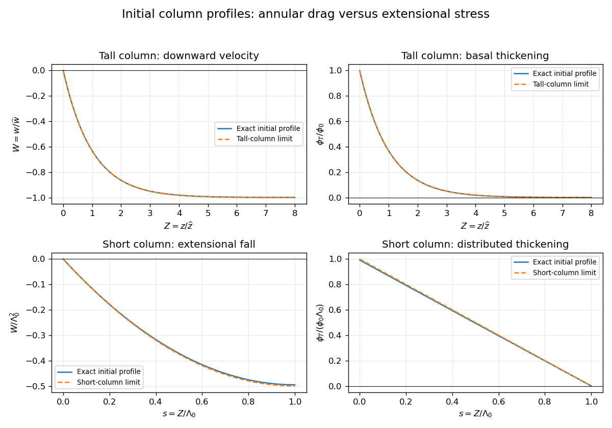

<h1 id="2/solution">Solution</h1>

↑ **Parent:** [2](../2.md)

Take $z$ positive upwards and let $f$ denote axial [body force](../../../../../body-force.md) per unit volume. With inertia and [surface tension](../../../../../surface-tension.md) omitted, the [extensional equations for a slender Newtonian column](../../../../../extensional-equations-for-a-slender-newtonian-column.md) are

$$
\boxed{\partial_t(a^2)+\partial_z(a^2w)=0,\qquad\frac{3\mu}{a^2}\partial_z(a^2\partial_z w)=\partial_zp_{\mathrm{ext}}-f.}
$$

[Mass conservation](../../../../../mass-conservation.md) gives the first equation. The second uses the [Trouton ratio](../../../../../trouton-ratio.md) three: the leading radial [velocity](../../../../../velocity.md) is $u_r=-r w_z/2$, the radial normal traction gives $p=p_{\mathrm{ext}}-\mu w_z$, and the axial [stress](../../../../../stress.md) is $-p_{\mathrm{ext}}+3\mu w_z$. An axial [control volume](../../../../../control-volume.md) balance then gives the displayed equation. The approximation requires a slender column and slowly varying radius.

Let $h=R-a$. Since the container base is closed, the total [volume flux](../../../../../volumetric-flow-rate.md) at every section is zero. The column carries flux $\pi a^2w$, so the annulus carries $-\pi a^2w$ and has mean speed of order $a|w|/h$. Its interfacial [shear stress](../../../../../shear-stress.md) is therefore of order $\lambda\mu a|w|/h^2$. Transmitting this [stress](../../../../../stress.md) through the core produces an axial [velocity](../../../../../velocity.md) variation of order $\lambda a^2|w|/h^2$. The [plug-flow criterion for a column in a low-viscosity annulus](../../../../../plug-flow-criterion-for-a-column-in-a-low-viscosity-annulus.md) is consequently

$$
\boxed{\frac{\delta w}{|w|}=O\left(\frac{\lambda a^2}{h^2}\right)\ll1\quad\text{when}\quad\lambda\ll\frac{h^2}{a^2}.}
$$

Use modified [pressure](../../../../../pressure.md) $P=p_{\mathrm{ext}}+\rho gz$, removing the annular fluid's [hydrostatic pressure](../../../../../hydrostatic-pressure.md). In a local planar gap, with $y=0$ at the column and $y=h$ at the container wall, [lubrication theory](../../../../../lubrication-theory.md) gives

$$
v(y)=w\left(1-\frac yh\right)+\frac{P_z}{2\lambda\mu}y(y-h),\qquad q_g=\frac{wh}{2}-\frac{h^3P_z}{12\lambda\mu}.
$$

The required return flux per unit circumference is $q_g=-aw/2$ to leading order in $h/a$. Its pressure-driven component is larger than the Couette component by $a/h$, so the [annular return flow around a slumping column](../../../../../annular-return-flow-around-a-slumping-column.md) gives

$$
\boxed{P_z=\frac{6\lambda\mu a}{h^3}w\,[1+O(h/a)].}
$$

The annular shear contribution to the integrated axial [force](../../../../../force.md) is smaller than this pressure-gradient term by $h/a$. Retaining the leading terms and substituting $f=-(\rho+\Delta\rho)g$ gives the dimensional equations

$$
\boxed{\partial_t(a^2)+\partial_z(a^2w)=0,\qquad\frac1{a^2}\partial_z(a^2w_z)=\frac{\Delta\rho g}{3\mu}+\frac{2\lambda a}{(R-a)^3}w.}
$$

The boundary conditions are $w(0,t)=0$ at the base and $w_z(L(t),t)=0$ at the free upper end; the latter expresses zero excess axial extensional [stress](../../../../../stress.md).

For $\lambda=0$ and initially constant $a=a_0$, put $G=\Delta\rho g/(3\mu)$. Then $w_{zz}=G$, so

$$
w(z,0)=G\left(\frac{z^2}{2}-L_0z\right),\qquad\boxed{w(L_0,0)=-\frac{\Delta\rho gL_0^2}{6\mu}.}
$$

For $\lambda>0$, define

$$
\phi=\frac{a^2}{R^2},\qquad\alpha(\phi)=\frac{2\sqrt\phi}{(1-\sqrt\phi)^3},\qquad\phi_0=\frac{a_0^2}{R^2},\quad\alpha_0=\alpha(\phi_0).
$$

This function records the leading thin-annulus resistance; differences from curvature and the Couette term enter at the already neglected relative order $h/a$. Choose the [extensional screening length of a slumping column](../../../../../extensional-screening-length-of-a-slumping-column.md) and the associated scales as

$$
\boxed{\widehat z=\frac{R}{\sqrt{\lambda\alpha_0}}=\sqrt{\frac{h_0^3}{2\lambda a_0}},\qquad\widehat w=G\widehat z^2,\qquad\widehat t=\frac{\widehat z}{\widehat w}=\frac{3\mu}{\Delta\rho g\widehat z}.}
$$

Here $h_0=R-a_0$ denotes the initial annular gap in this question. With $Z=z/\widehat z$, $T=t/\widehat t$ and $W=w/\widehat w$, the dimensional equations reduce to

$$
\boxed{\frac1\phi\partial_Z(\phi W_Z)=1+\frac{\alpha(\phi)}{\alpha_0}W,\qquad\phi_T+\partial_Z(\phi W)=0.}
$$

Initially $\phi=\phi_0$ and $\Lambda_0=L_0/\widehat z$, so $W_{ZZ}=1+W$, with $W(0)=0$ and $W_Z(\Lambda_0)=0$. The [initial velocity profile of an annularly confined column](../../../../../initial-velocity-profile-of-an-annularly-confined-column.md) is

$$
\boxed{W(Z,0)=\frac{\cosh(\Lambda_0-Z)}{\cosh\Lambda_0}-1,\qquad\phi_T(Z,0)=\phi_0\frac{\sinh(\Lambda_0-Z)}{\cosh\Lambda_0}.}
$$

The column thickens everywhere below its stress-free top, while that initial thickening rate is zero at the top.

For a tall column, $\Lambda_0\gg1$, the limiting forms away from exponentially small end corrections are

$$
W\simeq e^{-Z}-1,\qquad\phi_T\simeq\phi_0e^{-Z}.
$$

The bulk falls at approximately $-\widehat w$, where excess weight balances annular hydraulic resistance. Extensional [stresses](../../../../../stress.md) adjust this [velocity](../../../../../velocity.md) to zero in a basal [boundary layer](../../../../../boundary-layer.md) of thickness $\widehat z$; almost all thickening occurs there.

For a short column on this scale, $\Lambda_0\ll1$, while still slender, the limits are

$$
W\simeq\frac{Z^2}{2}-\Lambda_0Z,\qquad\phi_T\simeq\phi_0(\Lambda_0-Z).
$$

The annular-resistance term $W$ is small, so excess weight is balanced predominantly by extensional viscous [stress](../../../../../stress.md). The top speed is $-\widehat w\Lambda_0^2/2$, recovering the zero-annular-viscosity result. Thus $\widehat z$ is the vertical distance over which extensional [stress](../../../../../stress.md) communicates the basal constraint before annular resistance screens it. The sketches below use separate natural normalizations for the two limits.

**[Figure 1](#2/image-initial-velocity-and-thickening-profiles-of-long-and-short-annularly-confined-viscous-columns). Initial velocity and thickening profiles of long and short annularly confined viscous columns**.

## ↑ Ancestors (10)

1. [2](../2.md)
2. [Paper 73](../../paper-73-split.md)
3. [Iii](../../split.md)
4. [2015](../../../split.md)
5. [Past exam of the mathematics course of the University of Cambridge](../../../../split.md)
6. [Mathematics course of the University of Cambridge](../../../../../mathematics-course-of-the-university-of-cambridge.md)
7. [Course of the University of Cambridge](../../../../../course-of-the-university-of-cambridge.md)
8. [University of Cambridge](../../../../../university-of-cambridge-split.md)
9. [List of universities](../../../../../list-of-universities.md)
10. [Codex Wiki](../../../../../split.md)
