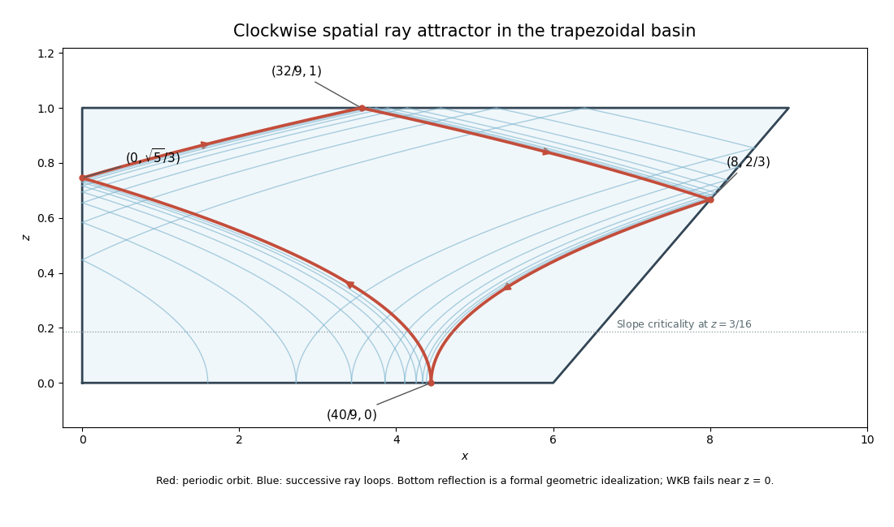

<h1 id="1/c/solution">Solution</h1>

↑ **Parent:** [C](../c.md)

Use the spatial [internal-wave ray tracing](../../../../../../internal-wave-ray-tracing.md) model, with $dx/dz=\pm16z$, and reflect the rays so that the [frequency](../../../../../../frequency.md) and tangential [wave number](../../../../../../wavenumber.md) are preserved. At a vertical wall the horizontal energy direction reverses; at a horizontal wall the vertical energy direction reverses. On the sloping wall the reflection depends on [internal-wave slope criticality](../../../../../../internal-wave-slope-criticality.md). The three-reflection orbit below encounters that wall at a height above $3/16$, so the wall reverses the horizontal energy direction there.

First take the packet to leave the bottom upward and to the left, with $0<x_0<6$. The four segments of the loop are

$$
\begin{aligned}
x&=x_0-8z^2 &&\text{to the left wall},\\
x&=8z^2-x_0 &&\text{to the top},\\
x&=16-x_0-8z^2 &&\text{to the sloping wall},\\
x&=6+3z_s+8(z^2-z_s^2) &&\text{back to the bottom}.
\end{aligned}
$$

The left-wall reflection is at $z=\sqrt{x_0/8}$ and the top reflection at $x=8-x_0$. The slope intersection solves $8z_s^2+3z_s+x_0-10=0$, giving the [internal-wave ray return map](../../../../../../internal-wave-ray-return-map.md)

$$
\boxed{z_s=\frac{\sqrt{329-32x_0}-3}{16},\qquad
R(x_0)=6+3z_s-8z_s^2=x_0-4+6z_s.}
$$

Thus the next formal bottom reflection is at $(R(x_0),0)$. On $0<x_0<6$, the slope heights are between approximately $0.544$ and $0.946$, consistent with the assumed reflection type.

An [internal-wave attractor](../../../../../../internal-wave-attractor.md) is a stable periodic ray, so solve $R(x_*)=x_*$. This gives $z_s=2/3$, and therefore

$$
\boxed{x_*=40/9.}
$$

The successive vertices are

$$
\boxed{(40/9,0)\longrightarrow(0,\sqrt5/3)\longrightarrow(32/9,1)\longrightarrow(8,2/3)\longrightarrow(40/9,0).}
$$

This is **clockwise circulation** in the $(x,z)$ plane. Differentiating the [internal-wave ray return map](../../../../../../internal-wave-ray-return-map.md) shows

$$
R'(x_0)=\frac{16z_s-3}{16z_s+3},\qquad \boxed{R'(x_*)=23/41<1.}
$$

Neighbouring bottom intersections converge to the periodic orbit, geometrically focusing the energy beam.

For completeness, the opposite upward launch direction has the reversed three-reflection itinerary: slope, top, left. In the interval where this itinerary is valid, put

$$
z_r=\frac{3+\sqrt{201-32x_0}}{16},\qquad
\boxed{R_{\rm rev}(x_0)=x_0+4-6z_r.}
$$

The three-reflection reverse map is $R^{-1}$, with domain $R(0)<x_0<R(6)$. Its fixed point is the same, but $R_{\rm rev}'(x_*)=41/23>1$. **Counterclockwise packets defocus from that orbit.** Except for the exactly periodic reverse ray, they eventually leave this itinerary. In the full geometric reflection construction, omitted-side or additional-slope reflections redirect generic rays into the clockwise attracting branch. Tangency and exactly critical reflections are singular exceptions requiring finite-wavelength or dissipative treatment.

**[Figure 1](#1/c/image-clockwise-spatial-internal-wave-attractor-and-convergence-of-neighbouring-ray-loops-in-the-trapezoidal-basin). Clockwise spatial internal-wave attractor and convergence of neighbouring ray loops in the trapezoidal basin**.

The bottom reflection is a formal spatial-ray idealization: part (b) shows that the [WKB approximation](../../../../../../wkb-approximation.md) itself fails near $z=0$, so the diagram does not imply arrival and reflection there in finite WKB travel time. In a real fluid, [viscous attenuation of an internal-wave beam](../../../../../../viscous-attenuation-of-an-internal-wave-beam.md), finite [wavelength](../../../../../../wavelength.md), [internal-wave breaking](../../../../../../internal-wave-breaking.md) and ensuing [turbulence](../../../../../../turbulence-split.md) and mixing limit the beam width and energy density. Unlimited focusing is a property of the ideal geometric model, not a prediction for the resolved physical wave.

## ↑ Ancestors (11)

1. [C](../c.md)
2. [1](../../1.md)
3. [Paper 74](../../../paper-74-split.md)
4. [Iii](../../../split.md)
5. [2015](../../../../split.md)
6. [Past exam of the mathematics course of the University of Cambridge](../../../../../split.md)
7. [Mathematics course of the University of Cambridge](../../../../../../mathematics-course-of-the-university-of-cambridge.md)
8. [Course of the University of Cambridge](../../../../../../course-of-the-university-of-cambridge.md)
9. [University of Cambridge](../../../../../../university-of-cambridge-split.md)
10. [List of universities](../../../../../../list-of-universities.md)
11. [Codex Wiki](../../../../../../split.md)
