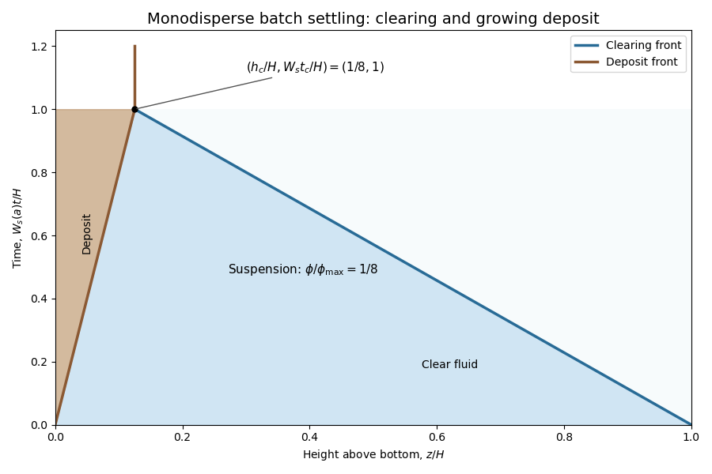

<h1 id="3/c/solution">Solution</h1>

↑ **Parent:** [C](../c.md)

Use downward distance $y=H-z$, with $z$ the height above the bottom, and write $W=W_s(a)>0$. This convention will also reproduce the printed negative deposit-front [velocity](../../../../../../velocity.md) in part (d). The ideal [simple-cubic sphere packing](../../../../../../simple-cubic-sphere-packing.md) has [packing fraction](../../../../../../packing-fraction.md) $\pi/6$; leaving $\phi_{\max}$ symbolic keeps the jump calculation independent of its value. In suspension, the [kinematic sedimentation](../../../../../../kinematic-sedimentation.md) equation is

$$
\phi_t+\partial_y j(\phi)=0,\qquad j(\phi)=W\phi\left(1-\frac\phi{\phi_{\max}}\right).
$$

Integrate this [conservation law](../../../../../../conservation-law.md) across a moving discontinuity to obtain the [Rankine-Hugoniot condition](../../../../../../rankine-hugoniot-conditions.md)

$$
\boxed{U[\phi]=[j],\qquad U=\frac{j_R-j_L}{\phi_R-\phi_L}.}
$$

The brackets denote values on the increasing-$y$ side minus those on the other side. A [sedimentation shock](../../../../../../sedimentation-shock.md) is a [concentration](../../../../../../concentration.md) jump moving at this secant slope of the particle flux. Deposited material is stationary and has zero flux.

For the upper clearing front, the states are $0$ and $\phi_{\max}/8$, giving $U_1=7W/8$ downward. For the lower deposition front, the states are $\phi_{\max}/8$ and $\phi_{\max}$, giving $U_2=-W/8$, upward. Thus

$$
\boxed{U_1=\frac78W,\qquad U_2=-\frac18W\quad\text{in downward coordinates}.}
$$

In terms of height above the bottom, the shock paths are

$$
z_{\rm clear}=H-\frac78Wt,\qquad z_{\rm bed}=\frac18Wt.
$$

They meet when $H=Wt$. Therefore **complete settling occurs at**

$$
\boxed{t_c=\frac HW,\qquad h_c=\frac H8.}
$$

The final height also follows directly from [particle volume fraction](../../../../../../particle-volume-fraction.md) conservation, $\phi_{\max}h_c=(\phi_{\max}/8)H$. The stationary deposit after the meeting carries no particle flux.

**[Figure 2](#3/c/image-monodisperse-batch-sedimentation-clearing-and-deposition-shock-paths-meet-at-time-h-ws-and-height-h-8). Monodisperse batch sedimentation: clearing and deposition shock paths meet at time H/Ws and height H/8**.

The diagram plots time vertically against height, as requested. Its shock slopes have the opposite spatial sign to $U_1,U_2$, because those velocities were defined in the downward coordinate.

## ↑ Ancestors (11)

1. [C](../c.md)
2. [3](../../3.md)
3. [Paper 74](../../../paper-74-split.md)
4. [Iii](../../../split.md)
5. [2015](../../../../split.md)
6. [Past exam of the mathematics course of the University of Cambridge](../../../../../split.md)
7. [Mathematics course of the University of Cambridge](../../../../../../mathematics-course-of-the-university-of-cambridge.md)
8. [Course of the University of Cambridge](../../../../../../course-of-the-university-of-cambridge.md)
9. [University of Cambridge](../../../../../../university-of-cambridge-split.md)
10. [List of universities](../../../../../../list-of-universities.md)
11. [Codex Wiki](../../../../../../split.md)
