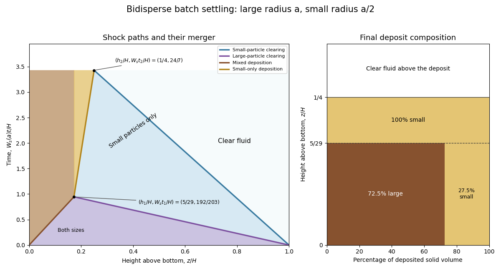

<h1 id="3/d/solution">Solution</h1>

↑ **Parent:** [D](../d.md)

Continue with downward coordinate $y=H-z$ and $W=W_s(a)>0$. By [Stokes drag law](../../../../../../stokes-s-law.md), the small-particle isolated [settling velocity](../../../../../../settling-velocity.md) is $W/4$. Normalize concentrations by $\phi_{\max}$: write $q_i=\phi_i/\phi_{\max}$. In suspension the specified independent [hindered settling](../../../../../../hindered-settling.md) laws give fluxes $j_1/\phi_{\max}=Wq_1(1-q_1)$ and $j_2/\phi_{\max}=(W/4)q_2(1-q_2)$. The initial state is $(q_1,q_2)=(1/8,1/8)$.

Two upper [sedimentation shocks](../../../../../../sedimentation-shock.md) clear the species separately. The faster front removes large particles, leaving $(0,1/8)$ behind it; the small [concentration](../../../../../../concentration.md) is unchanged across this front because the species fluxes are independent. The slower front separates that small-only suspension from clear fluid. Their downward velocities are

$$
\boxed{\widehat U_1=\frac78W,\qquad\widehat U_2=\frac7{32}W.}
$$

There is also a growing mixed deposit at the bottom. Let its normalized solid concentrations be $(p_1,p_2)$, with $p_1+p_2=1$, and let its upward speed magnitude be $s=-\widehat U_3>0$. Applying the [Rankine-Hugoniot condition](../../../../../../rankine-hugoniot-conditions.md) to each species gives

$$
s(p_1-1/8)=\frac7{64}W,\qquad s(p_2-1/8)=\frac7{256}W.
$$

Adding these relations proves

$$
\boxed{s=\frac{35}{192}W,\qquad \widehat U_3=-\frac{35}{192}W,\qquad
(p_1,p_2)=\left(\frac{29}{40},\frac{11}{40}\right).}
$$

The deposited flux is zero even though each species occupies only part of the packing: the settling law applies to the suspension, while the deposit is a separate stationary state. These jump relations determine the [deposit composition from sedimentation jump conditions](../../../../../../deposit-composition-from-sedimentation-jump-conditions.md).

The large-particle clearing front has height $H-7Wt/8$ and meets the mixed-deposit front at height $35Wt/192$. Thus

$$
\boxed{t_1=\frac{192}{203}\frac HW,\qquad h_1=\frac{35}{203}H=\frac5{29}H.}
$$

At this merger all large particles have entered the deposit. Only the small particles remain suspended, at normalized [concentration](../../../../../../concentration.md) $1/8$. The new material deposited above the mixed layer is pure small-particle solid, at total [concentration](../../../../../../concentration.md) $\phi_{\max}$. Its [sedimentation shock](../../../../../../sedimentation-shock.md) therefore has downward speed

$$
\boxed{\widehat U_4=\frac{0-(W/4)(1/8)(7/8)}{1-1/8}=-\frac W{32}.}
$$

For $t>t_1$, the deposit top and the remaining clearing front have heights

$$
z_{\rm bed}=h_1+\frac W{32}(t-t_1),\qquad z_{\rm clear}=H-\frac7{32}Wt.
$$

Their meeting, or the total solid-volume balance, gives

$$
\boxed{t_2=\frac{24}{7}\frac HW,\qquad h_2=\frac H4.}
$$

This is [two-stage bidisperse batch sedimentation](../../../../../../two-stage-bidisperse-batch-sedimentation.md): the fast species finishes first, followed by deposition of the remaining slow species.

The final solid composition by [volume](../../../../../../volume.md), and also by [mass](../../../../../../mass.md) because the particle densities are identical, is

$$
\boxed{\begin{cases}
72.5\%\ \text{large},\ 27.5\%\ \text{small},&0<z<5H/29,\\
0\%\ \text{large},\ 100\%\ \text{small},&5H/29<z<H/4.
\end{cases}}
$$

The upper pure-small layer has thickness $9H/116$. As checks, $(29/40)h_1=H/8$ accounts for all large-particle solid [volume](../../../../../../volume.md), and $(11/40)h_1+(h_2-h_1)=H/8$ accounts for all small-particle solid [volume](../../../../../../volume.md), in units of $\phi_{\max}$. If “percentage of particles” means number rather than [volume](../../../../../../volume.md), a large sphere occupies eight times the [volume](../../../../../../volume.md) of a small sphere: the mixed bottom layer contains $29/117\simeq24.8\%$ large particles by number and $88/117\simeq75.2\%$ small. The upper layer remains entirely small under either convention.

**[Figure 3](#3/d/image-bidisperse-sedimentation-three-initial-shocks-merger-at-t1-and-h1-final-settling-at-t2-and-h2-and-solid-volume-composition-of-the-deposit). Bidisperse sedimentation: three initial shocks, merger at t1 and h1, final settling at t2 and h2, and solid-volume composition of the deposit**.

## ↑ Ancestors (11)

1. [D](../d.md)
2. [3](../../3.md)
3. [Paper 74](../../../paper-74-split.md)
4. [Iii](../../../split.md)
5. [2015](../../../../split.md)
6. [Past exam of the mathematics course of the University of Cambridge](../../../../../split.md)
7. [Mathematics course of the University of Cambridge](../../../../../../mathematics-course-of-the-university-of-cambridge.md)
8. [Course of the University of Cambridge](../../../../../../course-of-the-university-of-cambridge.md)
9. [University of Cambridge](../../../../../../university-of-cambridge-split.md)
10. [List of universities](../../../../../../list-of-universities.md)
11. [Codex Wiki](../../../../../../split.md)
