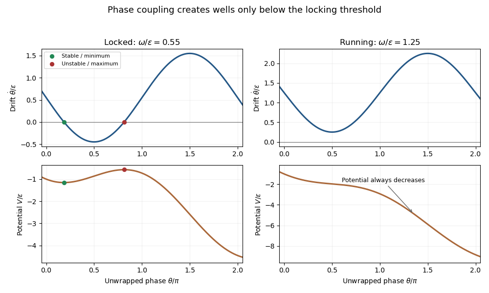

<h1 id="3/a/solution">Solution</h1>

↑ **Parent:** [A](../a.md)

Write the deterministic drift of the [Adler phase equation](../../../../../../adler-phase-equation.md) as $f(\theta)=\omega-\epsilon\sin\theta$. Its minimum is $\omega-\epsilon$ and its maximum is $\omega+\epsilon$. For $0<\omega<\epsilon$, the zero condition has exactly two solutions in the specified interval:

$$
\boxed{\theta_s=\alpha=\arcsin(\omega/\epsilon),\qquad \theta_u=\pi-\alpha.}
$$

The [linearization of a dynamical system](../../../../../../linearization-of-a-dynamical-system.md) at an [equilibrium point](../../../../../../equilibrium-point-of-a-dynamical-system.md) gives $\delta\dot\theta=f'(\theta_*)\delta\theta$, with $f'=-\epsilon\cos\theta$. Defining $\kappa=\sqrt{\epsilon^2-\omega^2}$ gives **$f'(\theta_s)=-\kappa<0$, so $\theta_s$ is stable; $f'(\theta_u)=+\kappa>0$, so $\theta_u$ is unstable**. For $\omega>\epsilon$, $f$ is positive everywhere and there are no [equilibrium points](../../../../../../equilibrium-point-of-a-dynamical-system.md): the phase runs continuously. This is the distinction between [phase locking](../../../../../../phase-locking.md) and [running phase dynamics](../../../../../../running-phase-dynamics.md).

With mobility scaled to one, the effective force is $-V'$. Therefore the [tilted washboard potential](../../../../../../tilted-washboard-potential.md) is

$$
\boxed{V(\theta)=-\omega\theta-\epsilon\cos\theta+C.}
$$

For $\omega<\epsilon$, its alternating local minima and maxima trap noise-free trajectories in wells. Minima coincide with $\theta_s+2\pi j$, and maxima with $\theta_u+2\pi j$. For $\omega>\epsilon$, $V'=\epsilon\sin\theta-\omega<0$ everywhere: there are no wells and the particle slides down the tilt. The potential is defined on the unwrapped phase and obeys $V(\theta+2\pi)=V(\theta)-2\pi\omega$; it is not a single-valued periodic equilibrium potential on the circle.

**[Figure 1](#3/a/image-locked-and-running-adler-phase-dynamics-with-drift-zeros-and-the-corresponding-tilted-potentials). Locked and running Adler phase dynamics, with drift zeros and the corresponding tilted potentials**.

At the transition $\omega=\epsilon$, the two [equilibrium points](../../../../../../equilibrium-point-of-a-dynamical-system.md) merge at $\theta=\pi/2$ in a [saddle-node bifurcation](../../../../../../saddle-node-bifurcation.md). There $f\simeq\epsilon(\theta-\pi/2)^2/2$, so the point is attracting from the left and repelling from the right; a zero linear derivative alone does not establish stable trapping.

## ↑ Ancestors (11)

1. [A](../a.md)
2. [3](../../3.md)
3. [Paper 75](../../../paper-75-split.md)
4. [Iii](../../../split.md)
5. [2015](../../../../split.md)
6. [Past exam of the mathematics course of the University of Cambridge](../../../../../split.md)
7. [Mathematics course of the University of Cambridge](../../../../../../mathematics-course-of-the-university-of-cambridge.md)
8. [Course of the University of Cambridge](../../../../../../course-of-the-university-of-cambridge.md)
9. [University of Cambridge](../../../../../../university-of-cambridge-split.md)
10. [List of universities](../../../../../../list-of-universities.md)
11. [Codex Wiki](../../../../../../split.md)
