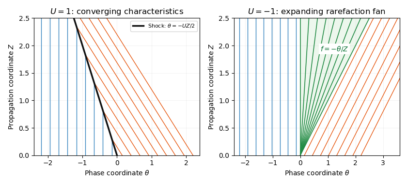

<h1 id="3/a/solution">Solution</h1>

↑ **Parent:** [A](../a.md)

The [Inviscid Burgers equation](../../../../../../inviscid-burgers-equation.md) here has the negative quadratic flux $F(f)=-f^2/2$. By the [method of characteristics](../../../../../../method-of-characteristics.md), $df/dZ=0$ and $d\theta/dZ=-f$, so a characteristic beginning at $\theta_0$ satisfies

$$
\boxed{\theta=\theta_0-f_0(\theta_0)Z,\qquad f(Z,\theta)=f_0(\theta_0).}
$$

This is a classical solution until [characteristic curves](../../../../../../characteristic-curve.md) intersect. Across a [shock wave](../../../../../../shock-wave.md), the [Rankine-Hugoniot condition](../../../../../../rankine-hugoniot-conditions.md) gives

$$
\boxed{\theta_s'=\frac{F(f_R)-F(f_L)}{f_R-f_L}=-\frac{f_R+f_L}{2}.}
$$

It uses the one-sided limiting values and agrees with the weak-shock expression.

For $U>0$, the right-state [characteristic curves](../../../../../../characteristic-curve.md) travel left with speed $-U$ while the left-state [characteristic curves](../../../../../../characteristic-curve.md) have speed zero. They converge into a compressive [shock wave](../../../../../../shock-wave.md) with speed $-U/2$. The [entropy solution](../../../../../../entropy-solution.md) is

$$
\boxed{f(Z,\theta)=\begin{cases}0,&\theta<-UZ/2,\\U,&\theta>-UZ/2.\end{cases}\quad(U>0).}
$$

The characteristic speeds satisfy $0>-U/2>-U$, so both sides enter the shock.

For $U<0$, right-state [characteristic curves](../../../../../../characteristic-curve.md) travel right with speed $-U>0$, leaving a gap. A steep continuous transition fills that gap with a [rarefaction wave](../../../../../../rarefaction-wave.md). The [entropy solution](../../../../../../entropy-solution.md) is

$$
\boxed{f(Z,\theta)=\begin{cases}0,&\theta<0,\\-\theta/Z,&0<\theta<-UZ,\\U,&\theta>-UZ.\end{cases}\quad(U<0).}
$$

The middle value is fixed by $\theta/Z=F'(f)=-f$. A discontinuity joining the two states would satisfy the jump equation but violate entropy admissibility. If $U=0$, the solution is identically zero.

**[Figure 1](#3/a/image-characteristics-forming-a-compressive-shock-and-a-rarefaction-fan-for-the-negative-flux-burgers-equation). Characteristics forming a compressive shock and a rarefaction fan for the negative-flux Burgers equation**.

## ↑ Ancestors (11)

1. [A](../a.md)
2. [3](../../3.md)
3. [Paper 77](../../../paper-77-split.md)
4. [Iii](../../../split.md)
5. [2015](../../../../split.md)
6. [Past exam of the mathematics course of the University of Cambridge](../../../../../split.md)
7. [Mathematics course of the University of Cambridge](../../../../../../mathematics-course-of-the-university-of-cambridge.md)
8. [Course of the University of Cambridge](../../../../../../course-of-the-university-of-cambridge.md)
9. [University of Cambridge](../../../../../../university-of-cambridge-split.md)
10. [List of universities](../../../../../../list-of-universities.md)
11. [Codex Wiki](../../../../../../split.md)
