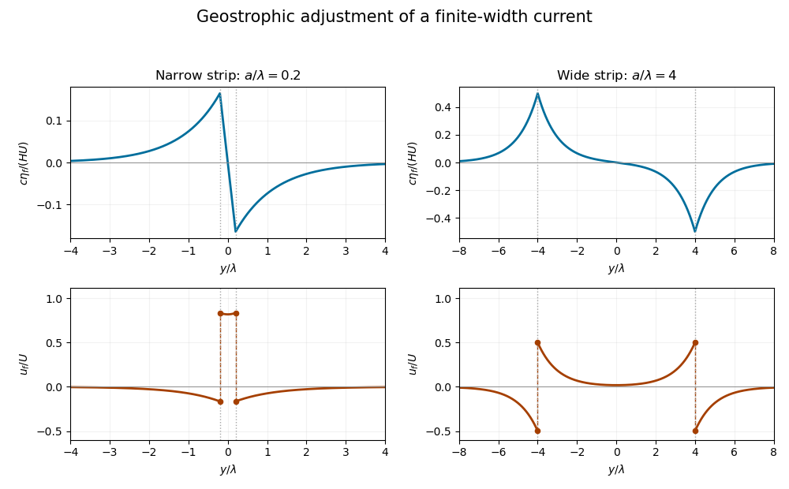

<h1 id="1/solution">Solution</h1>

↑ **Parent:** [1](../1.md)

Take $\mathbf f=f\widehat{\mathbf z}$ with $f>0$, and put $\zeta=v_x-u_y$, $d=u_x+v_y$ and $q=\zeta-f\eta/H$. Here $q$ denotes the signed vertical component of the [linearized shallow-water potential-vorticity anomaly](../../../../../linearized-shallow-water-potential-vorticity-anomaly.md), rather than its magnitude. The [divergence](../../../../../divergence.md) and vertical [curl](../../../../../curl.md) of the [linearized shallow water equations](../../../../../linearized-shallow-water-equations.md) give

$$
d_t-f\zeta=-g\nabla_h^2\eta,\qquad \zeta_t+fd=0,\qquad \eta_t=-Hd.
$$

Consequently $q_t=0$. Eliminating $d$ and substituting $\zeta=q+f\eta/H$ gives

$$
\boxed{\eta_{tt}+f^2\eta-c^2\nabla_h^2\eta=-Hfq,\qquad c^2=gH.}
$$

The vector forcing is $-H\mathbf f\cdot\mathbf q$. This is [potential-vorticity conservation](../../../../../potential-vorticity-conservation.md) in its linear, [f-plane](../../../../../f-plane.md) form: the conserved anomaly forces a stationary balanced part, while the homogeneous equation supports [inertial-gravity waves](../../../../../inertia-gravity-wave.md).

For the initial strip, differentiating the discontinuous velocity in the sense of [distributions](../../../../../distribution-mathematical-analysis.md) gives

$$
q_0(y)=U\bigl[\delta(y-a)-\delta(y+a)\bigr].
$$

These are two oppositely signed [vortex sheets](../../../../../vortex-sheet.md). In the final [geostrophic balance](../../../../../geostrophic-balance.md), $v_f=0$ and $u_f=-g\eta_f'/f$. The height therefore solves

$$
\eta_f''-\lambda^{-2}\eta_f=\frac{f}{g}q_0,\qquad \boxed{\lambda=\frac{c}{f}=\frac{\sqrt{gH}}{f}}.
$$

This is the [Rossby deformation radius](../../../../../rossby-deformation-radius.md). Decay at infinity fixes the [Green function](../../../../../green-s-function.md) to $G(y)=-\lambda e^{-|y|/\lambda}/2$. Thus the [geostrophic adjustment of a finite-width current](../../../../../geostrophic-adjustment-of-a-finite-width-current.md) has the particularly useful representation

$$
\boxed{\frac{\eta_f(y)}H=-\frac{U}{2c}\left[e^{-|y-a|/\lambda}-e^{-|y+a|/\lambda}\right].}
$$

Expanding the exponentials inside the strip gives $\eta_f/H=-(U/c)e^{-a/\lambda}\sinh(y/\lambda)$; above the strip it gives $-(U/c)e^{-y/\lambda}\sinh(a/\lambda)$, and below it gives $(U/c)e^{y/\lambda}\sinh(a/\lambda)$. The height is continuous, odd and exponentially localized. Its derivative has the jumps required by the two [Dirac delta functions](../../../../../dirac-delta-function.md).

Differentiating the height, rather than assuming a uniform final current, gives the complete velocity:

$$
\boxed{v_f=0,\qquad \frac{u_f}U=\begin{cases}e^{-a/\lambda}\cosh(y/\lambda),&|y|<a,\\-\sinh(a/\lambda)e^{-|y|/\lambda},&|y|>a.\end{cases}}
$$

The one-sided velocity jump is $U$ at each edge, with opposite orientations. The value exactly on an idealized [vortex sheet](../../../../../vortex-sheet.md) is immaterial. Inside the strip the current remains in the original direction; outside it a return current develops.

Let $r=a/\lambda$ and $s=y/\lambda$. For $r\ll1$, $u_f/U=1-r+O(r^2)$ over the narrow strip, while the outside return flow is approximately $-r e^{-|s|}$. The height varies almost linearly across the strip, $c\eta_f/(HU)\simeq-s$, and has extrema of magnitude $(1-e^{-2r})/2\simeq r$ at its edges. For $r\gg1$, the central current is exponentially small: $u_f(0)/U=e^{-r}$. Each edge supports a layer of width $\lambda$, with $u_f/U\simeq\tfrac12e^{-(a-|y|)/\lambda}$ on its inner side and $-\tfrac12e^{-(|y|-a)/\lambda}$ outside. The corresponding height extrema approach $\pm HU/(2c)$, with almost zero height deep inside and far outside. Both requested profiles are drawn from the exact functions below; the dashed jumps represent one-sided velocity limits.

**[Figure 1](#1/image-final-geostrophic-surface-height-and-velocity-profiles-for-a-narrow-current-and-a-wide-current-with-the-initial-strip-edges-marked-and-velocity-jumps-shown). Final geostrophic surface-height and velocity profiles for a narrow current and a wide current, with the initial strip edges marked and velocity jumps shown**.

For [balanced shallow-water energy as a signed potential-vorticity pairing](../../../../../balanced-shallow-water-energy-as-a-signed-potential-vorticity-pairing.md), divide out the constant density and work per unit distance in $x$. The [kinetic energy](../../../../../kinetic-energy.md) plus surface [potential energy](../../../../../potential-energy.md) is

$$
E_f=\frac12\int\left(Hu_f^2+g\eta_f^2\right)\,dy
=\frac g2\int\left(\lambda^2(\eta_f')^2+\eta_f^2\right)\,dy.
$$

Multiplication of the stationary height equation by $\eta_f$ and [integration by parts](../../../../../integration-by-parts.md), with vanishing end terms, yields

$$
\boxed{E_f=-\frac{gH}{2f}\int\eta_f q_0\,dy.}
$$

The same expression holds with $dA$ for a finite two-dimensional domain or a finite periodic length in $x$. The infinite strip's total energy is infinite, so both energies and their ratio are understood per unit $x$-length.

There is a sign defect in the printed energy expression: $|\mathbf q|$ must be replaced by the signed component $\widehat{\mathbf f}\cdot\mathbf q$. Indeed, $|q_0|=|U|[\delta(y-a)+\delta(y+a)]$, so pairing it with the odd $\eta_f$ gives zero, although the balanced state has positive energy. The signed pairing gives

$$
\int\eta_fq_0\,dy=U[\eta_f(a)-\eta_f(-a)]=-\frac{HU^2}{c}(1-e^{-2r}).
$$

Since $E_i=HU^2a$, the [energy retention in finite-width geostrophic adjustment](../../../../../energy-retention-in-finite-width-geostrophic-adjustment.md) is

$$
\boxed{E_f=\frac{HU^2\lambda}{2}(1-e^{-2r}),\qquad \frac{E_f}{E_i}=\frac{1-e^{-2r}}{2r}.}
$$

For $r\ll1$ this ratio is $1-r+\tfrac23r^2+O(r^3)$: nearly all energy remains in the narrow balanced current. For $r\gg1$ it is approximately $1/(2r)$: only the edge regions retain balanced energy. [Conservation of energy](../../../../../conservation-of-energy.md) still holds for the inviscid evolution. The missing balanced energy is carried away by [inertia-gravity waves](../../../../../inertia-gravity-wave.md); “final state” means the local balanced limit after those waves leave, rather than a loss of the total energy over the entire infinite domain.

## ↑ Ancestors (10)

1. [1](../1.md)
2. [Paper 79](../../paper-79-split.md)
3. [Iii](../../split.md)
4. [2015](../../../split.md)
5. [Past exam of the mathematics course of the University of Cambridge](../../../../split.md)
6. [Mathematics course of the University of Cambridge](../../../../../mathematics-course-of-the-university-of-cambridge.md)
7. [Course of the University of Cambridge](../../../../../course-of-the-university-of-cambridge.md)
8. [University of Cambridge](../../../../../university-of-cambridge-split.md)
9. [List of universities](../../../../../list-of-universities.md)
10. [Codex Wiki](../../../../../split.md)
