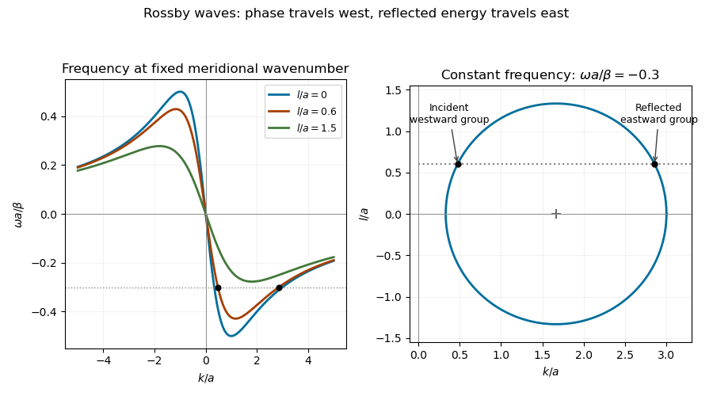

<h1 id="2/solution">Solution</h1>

↑ **Parent:** [2](../2.md)

On a sphere of radius $R$ rotating at angular speed $\Omega$, the [Coriolis parameter](../../../../../coriolis-parameter.md) is $f=2\Omega\sin\phi$. Near latitude $\phi_0$, write $y=R(\phi-\phi_0)$, use locally eastward and northward Cartesian coordinates, and expand

$$
\boxed{f=f_0+\beta y,\qquad f_0=2\Omega\sin\phi_0,\qquad \beta=\frac{2\Omega\cos\phi_0}{R}.}
$$

The [beta plane](../../../../../beta-plane.md) retains the first northward variation of [planetary vorticity](../../../../../planetary-vorticity.md) while neglecting higher latitude dependence and metric curvature. A midlatitude local calculation assumes $L/R\ll1$ and $|\beta|L/|f_0|\ll1$; near the equator the distinct equatorial [beta plane](../../../../../beta-plane.md) has $f_0=0$, so the midlatitude low-frequency reduction used below does not apply.

For a homogeneous shallow layer, the [hydrostatic approximation](../../../../../hydrostatic-approximation.md) gives $p=p_{\rm atm}+\rho g(\eta-z)$ and hence $p_x/\rho=g\eta_x$, $p_y/\rho=g\eta_y$, independently of depth. The approximation follows from the small aspect ratio $H/L$ and neglect of vertical acceleration. Differentiate the linear horizontal momentum equations in $z$. Their depth derivatives obey

$$
(u_z)_t-fv_z=0,\qquad (v_z)_t+fu_z=0.
$$

Starting from rest gives $u_z=v_z=0$ initially, and the unique solution remains zero. This establishes [depth independence of hydrostatic shallow-water flow](../../../../../depth-independence-of-hydrostatic-shallow-water-flow.md); an arbitrary pre-existing shear would not be removed merely by taking the [hydrostatic approximation](../../../../../hydrostatic-approximation.md). Integrating the [continuity equation](../../../../../continuity-equation.md) between the rigid bottom and the moving surface gives $\eta_t+H(u_x+v_y)=0$ at linear order. With the [depth-integrated shallow-water transports](../../../../../depth-integrated-shallow-water-transport.md) $U=Hu$, $V=Hv$, one obtains

$$
\boxed{U_t-fV=-c^2\eta_x,\qquad V_t+fU=-c^2\eta_y,\qquad \eta_t+U_x+V_y=0,\qquad c^2=gH.}
$$

It is useful to make the coefficient approximation in the height reduction explicit. Put $\mathcal F_y=\partial_t^2+f(y)^2$. Differentiating the two momentum equations in time and eliminating the other transport gives

$$
\mathcal F_yU=-c^2(\eta_{xt}+f\eta_y),\qquad \mathcal F_yV=-c^2(\eta_{yt}-f\eta_x).
$$

Since $\partial_y(\mathcal F_yV)=\mathcal F_yV_y+2f\beta V$, taking their horizontal [divergence](../../../../../divergence.md) and using the [continuity equation](../../../../../continuity-equation.md) gives

$$
\left[\nabla_h^2\eta-\frac{\mathcal F_y\eta}{c^2}\right]_t=\beta\eta_x-\frac{2f\beta}{c^2}V.
$$

Applying $\mathcal F_y$ proves the exact [variable-Coriolis shallow-water height equation](../../../../../variable-coriolis-shallow-water-height-equation.md)

$$
\boxed{\mathcal F_y\left[\nabla_h^2\eta-\frac{\mathcal F_y\eta}{c^2}\right]_t=\beta(\eta_{xtt}+2f\eta_{yt}-f^2\eta_x).}
$$

At the reference latitude, or after the usual local freezing of undifferentiated $f$ factors to $f_0$, this gives the height relation written with $\mathcal F_0=\partial_t^2+f_0^2$. With $f=f_0+\beta y$ over a finite region, that constant-coefficient version is a local approximation, not an exact identity. Keeping $\mathcal F_y$ as above avoids silently commuting a variable [Coriolis parameter](../../../../../coriolis-parameter.md) through a spatial derivative.

For the slow [Rossby wave](../../../../../rossby-wave.md) branch, take $|\omega|/|f_0|\ll1$, approximate $\mathcal F_0$ by $f_0^2$, and discard the two time-derivative terms on the right compared with $-f_0^2\eta_x$. This is the regular midlatitude long-time ordering, with nondegenerate zonal variation. If $a=f_0/c$, the result is

$$
\boxed{[\nabla_h^2\eta-a^2\eta]_t=-\beta\eta_x.}
$$

The printed low-frequency equation has the opposite right-hand sign. The minus sign follows directly from the preceding eliminated equation and is also the sign needed for the printed isofrequency-circle centre. An independent check uses [geostrophic balance](../../../../../geostrophic-balance.md): $\psi=g\eta/f_0$, $(u,v)=(-\psi_y,\psi_x)$, and the [shallow-water quasi-geostrophic potential vorticity](../../../../../shallow-water-quasi-geostrophic-potential-vorticity.md) is $\nabla_h^2\psi-a^2\psi+\beta y$. Linear [potential-vorticity conservation](../../../../../potential-vorticity-conservation.md) gives $(\nabla_h^2\psi-a^2\psi)_t+\beta\psi_x=0$.

For $\eta=Ae^{i(kx+ly-\omega t)}$, the [shallow-water Rossby-wave dispersion relation](../../../../../shallow-water-rossby-wave-dispersion-relation.md) is

$$
\boxed{\omega=-\frac{\beta k}{k^2+l^2+a^2}.}
$$

For fixed $l$ and $\beta>0$, it is odd in $k$, zero at $k=0$, negative for $k>0$, and tends to zero from below as $k\to+\infty$. Its minimum occurs at $k=\sqrt{l^2+a^2}$ with $\omega_{\min}=-\beta/[2\sqrt{l^2+a^2}]$. Thus both long and short waves have small frequency. The zonal [phase velocity](../../../../../phase-velocity.md) is westward, $\omega/k<0$, whereas the zonal [group velocity](../../../../../group-velocity.md) is

$$
c_{gx}=\frac{\partial\omega}{\partial k}=\frac{\beta(k^2-l^2-a^2)}{(k^2+l^2+a^2)^2}.
$$

It changes sign at the frequency minimum.

At fixed nonzero frequency, completing the square yields the [Rossby-wave isofrequency circle](../../../../../rossby-wave-isofrequency-circle.md)

$$
\boxed{\left(k+\frac{\beta}{2\omega}\right)^2+l^2=\frac{\beta^2}{4\omega^2}-a^2.}
$$

The radius is real only if $|\omega|\leq|\beta|/(2|a|)$. For $\beta>0$, the branch with $k>0$ has $\omega<0$ and a circle centred on the positive $k$-axis. If instead the printed plus-sign wave equation is taken literally with this same Fourier convention, its dispersion is $\omega=+\beta k/(k^2+l^2+a^2)$ and its circle is centred at $(+\beta/(2\omega),0)$. These two conventions cannot be mixed.

**[Figure 2](#2/image-rossby-wave-frequency-curves-and-a-constant-frequency-wavenumber-circle-showing-a-westward-group-incident-wave-and-an-eastward-group-reflected-wave-at-a-meridional-wall). Rossby-wave frequency curves and a constant-frequency wavenumber circle showing a westward-group incident wave and an eastward-group reflected wave at a meridional wall**.

For [reflection of a Rossby wave at a meridional wall](../../../../../reflection-of-a-rossby-wave-at-a-meridional-wall.md), the stationary wall preserves frequency, and its translation invariance in $y$ preserves the tangential wavenumber. Thus $\omega_r=\omega_i$, $l_r=l_i$. Both $k$ values solve

$$
\omega_i k^2+\beta k+\omega_i(l_i^2+a^2)=0.
$$

Their sum and product give

$$
\boxed{k_r=-\frac{\beta}{\omega_i}-k_i=\frac{l_i^2+a^2}{k_i}.}
$$

An incident wave in $x>0$ travels toward the wall in [group velocity](../../../../../group-velocity.md), not necessarily in [phase velocity](../../../../../phase-velocity.md). For $\beta>0$, $0<k_i<\sqrt{l_i^2+a^2}$ has $c_{gx,i}<0$, while its partner $k_r>\sqrt{l_i^2+a^2}$ has $c_{gx,r}>0$. The double-root case has zero normal [group velocity](../../../../../group-velocity.md) and does not describe a wave packet incident on the wall.

At leading [quasi-geostrophic approximation](../../../../../quasi-geostrophic-approximation.md), the [impermeability condition](../../../../../no-penetration-boundary-condition.md) is $u=-g\eta_y/f_0=0$. For $l_i\ne0$, the boundary condition gives

$$
-i\frac{g l_i}{f_0}(A_i+A_r)e^{i(l_i y-\omega_i t)}=0,\qquad \boxed{A_r=-A_i,\quad |A_r|=|A_i|.}
$$

The reflected height therefore has equal amplitude and a phase change of $\pi$. Equality here concerns the height or [quasi-geostrophic streamfunction](../../../../../quasi-geostrophic-streamfunction.md) amplitudes in the reduced model. At the degenerate $l_i=0$, geostrophic no-normal-flow is automatically satisfied and alone does not determine their ratio; the usual homogeneous wall-streamfunction condition supplies $A_r=-A_i$ if imposed. Retaining the small ageostrophic transport changes the boundary condition to

$$
\frac{A_r}{A_i}=-\frac{\omega_i k_i+i f_0l_i}{\omega_i k_r+i f_0l_i},
$$

which tends to $-1$ in the regular low-frequency ordering but is not generally of unit modulus. In particular, $l_i=0$ gives $A_r/A_i=-k_i/k_r$ in that more complete boundary relation. Thus the printed equal-amplitude assertion requires the nondegenerate leading [quasi-geostrophic approximation](../../../../../quasi-geostrophic-approximation.md), or an explicit homogeneous wall condition; it is not a general exact shallow-water reflection law.

## ↑ Ancestors (10)

1. [2](../2.md)
2. [Paper 79](../../paper-79-split.md)
3. [Iii](../../split.md)
4. [2015](../../../split.md)
5. [Past exam of the mathematics course of the University of Cambridge](../../../../split.md)
6. [Mathematics course of the University of Cambridge](../../../../../mathematics-course-of-the-university-of-cambridge.md)
7. [Course of the University of Cambridge](../../../../../course-of-the-university-of-cambridge.md)
8. [University of Cambridge](../../../../../university-of-cambridge-split.md)
9. [List of universities](../../../../../list-of-universities.md)
10. [Codex Wiki](../../../../../split.md)
