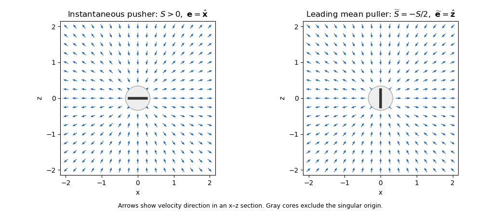

<h1 id="3/solution">Solution</h1>

↑ **Parent:** [3](../3.md)

A freely swimming body has no net external force or torque in [Stokes flow](../../../../../stokes-flow-split.md). Its [force-free](../../../../../force-free.md) condition removes the $r^{-1}$ [Stokeslet](../../../../../stokeslet.md) monopole, and its [torque-free](../../../../../torque-free.md) condition removes the antisymmetric force-dipole contribution. The leading generic far field is therefore a [symmetric traceless rank-two tensor](../../../../../symmetric-trace-free-square-of-the-defining-orthogonal-representation.md) [stresslet](../../../../../force-dipole-flow.md), decaying as $r^{-2}$. Its axial strength may vanish for special swimmers, in which case higher-order singularities dominate.

The [axisymmetric stresslet from a Stokeslet pair](../../../../../axisymmetric-stresslet-from-a-stokeslet-pair.md) provides an explicit construction and fixes the sign convention. Place forces $+F\mathbf e$ and $-F\mathbf e$ on the fluid at $+(a/2)\mathbf e$ and $-(a/2)\mathbf e$. The [Stokeslet](../../../../../stokeslet.md) tensor is

$$
J_{ij}(\mathbf r)=\frac1{8\pi\mu}
\left(\frac{\delta_{ij}}r+\frac{r_i r_j}{r^3}\right).
$$

Expanding their sum for $r\gg a$ gives

$$
\mathbf u
=FJ(\mathbf r-\tfrac a2\mathbf e)\mathbf e
-FJ(\mathbf r+\tfrac a2\mathbf e)\mathbf e
=-Fa\,(\mathbf e\cdot\nabla)[J(\mathbf r)\mathbf e]+\cdots.
$$

Since

$$
(\mathbf e\cdot\nabla)[J(\mathbf r)\mathbf e]
=\frac1{8\pi\mu}
\left[\frac{\mathbf r}{r^3}
-\frac{3(\mathbf e\cdot\mathbf r)^2\mathbf r}{r^5}\right],
$$

the dipole strength is $S=Fa$ and the resulting [stresslet](../../../../../force-dipole-flow.md) is the given one. More general surface-traction distributions produce the same leading form through their symmetric traceless first force moment.

Writing $\cos\alpha=\mathbf e\cdot\widehat{\mathbf r}$, its radial velocity is

$$
u_r=\frac{S}{8\pi\mu r^2}(3\cos^2\alpha-1).
$$

Consequently

$$
\boxed{S>0:\ \text{pusher, axial outflow and equatorial inflow};
\qquad
S<0:\ \text{puller, axial inflow and equatorial outflow}.}
$$

This classifies [pusher microswimmers](../../../../../pusher-microswimmer.md) and [puller microswimmers](../../../../../puller-microswimmer.md) in the force-on-fluid convention used by the given formula.

For the circular swimmer let $\varphi=\omega t$, $\mathbf p=(\cos\varphi,\sin\varphi,0)$, $\mathbf x'=R\mathbf p$, and choose the tangent director $\mathbf e=(-\sin\varphi,\cos\varphi,0)$. Its sign is immaterial to the [stresslet](../../../../../force-dipole-flow.md). Write $\mathbf r=\mathbf x$ for the observation vector from the circle centre, and assume $r\gg R$. The leading [far-field orbit average of a tangent stresslet](../../../../../far-field-orbit-average-of-a-tangent-stresslet.md) is obtained by replacing $\mathbf x-\mathbf x'$ by $\mathbf r$ while retaining the time-dependent director.

The [orientation averaging of an axisymmetric stresslet](../../../../../orientation-averaging-of-an-axisymmetric-stresslet.md) over a full revolution gives

$$
\langle e_i e_j\rangle
=\frac12(\delta_{ij}-\widehat z_i\widehat z_j),\qquad
\langle(\mathbf e\cdot\mathbf r)^2\rangle
=\frac12(r^2-z^2).
$$

Substitution gives

$$
\begin{aligned}
\langle\mathbf u(\mathbf r)\rangle
&=\frac{S}{8\pi\mu}
\left[-\frac{\mathbf r}{r^3}
+\frac32\frac{(r^2-z^2)\mathbf r}{r^5}\right]
+\text{higher multipoles}\\
&=-\frac{S/2}{8\pi\mu}
\left[-\frac{\mathbf r}{r^3}
+\frac{3z^2\mathbf r}{r^5}\right]
+\text{higher multipoles}.
\end{aligned}
$$

Thus

$$
\boxed{\widetilde S=-\frac S2,\qquad
\widetilde{\mathbf e}=\widehat{\mathbf z}}
$$

with $\widetilde{\mathbf e}$ equivalently $-\widehat{\mathbf z}$. The effective axis is normal to the orbit plane. A positive original strength becomes negative, and a negative strength becomes positive: **a pusher averages to a puller, and a puller averages to a pusher**, at leading far-field order. The result is independent of $R$ and $\omega$ at this order.

The accuracy of the centre replacement can be made explicit. Half a revolution changes $\mathbf p$ and $\mathbf e$ to their negatives; the [stresslet](../../../../../force-dipole-flow.md) is even in $\mathbf e$. Pairing those times replaces the displaced field by

$$
\frac12\left[G(\mathbf r-R\mathbf p,\mathbf e)
+G(\mathbf r+R\mathbf p,\mathbf e)\right]
=G(\mathbf r,\mathbf e)+O\!\left(\frac{|S|R^2}{\mu r^4}\right).
$$

Hence

$$
\boxed{\langle\mathbf u\rangle
=G(\mathbf r;\widetilde S,\widehat{\mathbf z})
+O\!\left(\frac{|S|R^2}{\mu r^4}\right).}
$$

The finite-radius average is not exactly a point [stresslet](../../../../../force-dipole-flow.md) at every location. For example, on the positive $z$ axis the exact average of the supplied model is

$$
\langle\mathbf u(0,0,z)\rangle
=-\frac{S}{8\pi\mu}\frac{z}{(z^2+R^2)^{3/2}}\,\widehat{\mathbf z},
$$

which has the derived point-stresslet limit for $z\gg R$. This [even displacement correction in an orbit-averaged stresslet](../../../../../even-displacement-correction-in-an-orbit-averaged-stresslet.md) is consistent with the far-field restriction.

**[Figure 1](#3/image-instantaneous-pusher-along-an-in-plane-axis-and-its-leading-circular-orbit-average-a-puller-normal-to-the-orbit-plane). Instantaneous pusher along an in-plane axis and its leading circular-orbit average, a puller normal to the orbit plane**.

## ↑ Ancestors (10)

1. [3](../3.md)
2. [Paper 80](../../paper-80-split.md)
3. [Iii](../../split.md)
4. [2015](../../../split.md)
5. [Past exam of the mathematics course of the University of Cambridge](../../../../split.md)
6. [Mathematics course of the University of Cambridge](../../../../../mathematics-course-of-the-university-of-cambridge.md)
7. [Course of the University of Cambridge](../../../../../course-of-the-university-of-cambridge.md)
8. [University of Cambridge](../../../../../university-of-cambridge-split.md)
9. [List of universities](../../../../../list-of-universities.md)
10. [Codex Wiki](../../../../../split.md)
