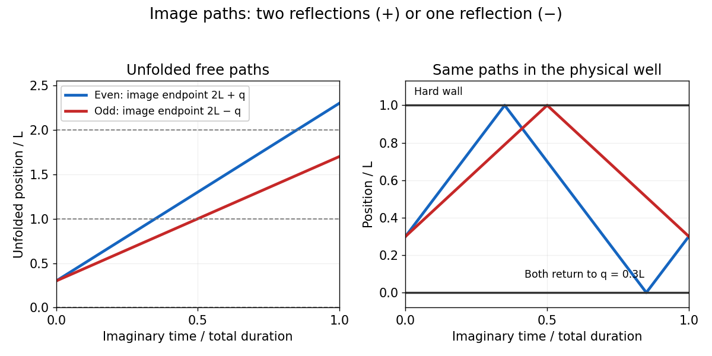

<h1 id="3/b/solution">Solution</h1>

↑ **Parent:** [B](../b.md)

Use [unfolding a reflected interval trajectory](../../../../../../unfolding-a-reflected-interval-trajectory.md): reflect the interval across each wall so that a bouncing trajectory becomes a free trajectory in an image interval. A return path starting at $q$ ends at $q+2rL$ after an even number of reflections, or at $-q+2rL$ after an odd number. Each hard-wall reflection contributes phase $-1$, giving the positive direct images and negative reflected images of the [Dirichlet heat kernel on an interval](../../../../../../dirichlet-heat-kernel-on-an-interval.md).

**[Figure 1](#3/b/image-even-and-odd-reflection-paths-unfolded-across-an-infinite-square-well). Even and odd reflection paths unfolded across an infinite square well**.

The [method of images](../../../../../../method-of-images.md) therefore gives

$$
Z=\int_0^L dq\sum_{r\in\mathbb Z}\left[\int_{q(0)=q}^{q(\beta)=q+2rL}\mathcal Dq\,e^{-\mathcal A[q]}-\int_{q(0)=q}^{q(\beta)=-q+2rL}\mathcal Dq\,e^{-\mathcal A[q]}\right],\qquad \mathcal A[q]=\frac m{2\hbar^2}\int_0^\beta(\partial_\tau q)^2d\tau.
$$

Here $\tau$ has inverse-energy units, since $\beta=1/(k_BT)$. In physical imaginary time $u=\hbar\tau$, the same dimensionless action is $\mathcal A=S_E/\hbar$, with $S_E=\int_0^{\hbar\beta}(m/2)(dq/du)^2du$. Thus the question's convention $S=(m/(2\hbar))\int_0^\beta(\partial_\tau q)^2d\tau$ has exactly the weight $e^{-S/\hbar}$.

## ↑ Ancestors (11)

1. [B](../b.md)
2. [3](../../3.md)
3. [Paper 81](../../../paper-81-split.md)
4. [Iii](../../../split.md)
5. [2015](../../../../split.md)
6. [Past exam of the mathematics course of the University of Cambridge](../../../../../split.md)
7. [Mathematics course of the University of Cambridge](../../../../../../mathematics-course-of-the-university-of-cambridge.md)
8. [Course of the University of Cambridge](../../../../../../course-of-the-university-of-cambridge.md)
9. [University of Cambridge](../../../../../../university-of-cambridge-split.md)
10. [List of universities](../../../../../../list-of-universities.md)
11. [Codex Wiki](../../../../../../split.md)
