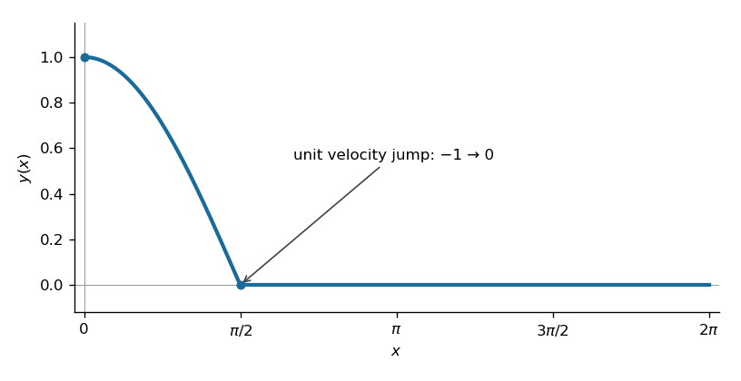
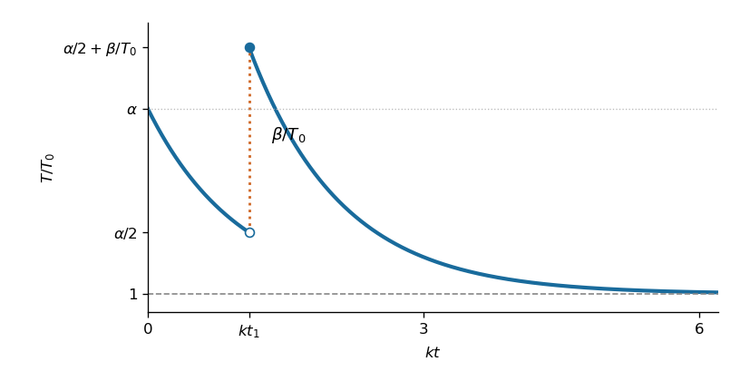

# Paper 2

↑ **Parent:** [Ia](../ia.md)

[https://www.maths.cam.ac.uk/undergrad/pastpapers/files/2016/paperia_2.pdf](https://www.maths.cam.ac.uk/undergrad/pastpapers/files/2016/paperia_2.pdf)

**Table of contents**

- [1A](#1a)
  - [a](#1a/a)
    - [Solution](#1a/a/solution)
  - [b](#1a/b)
    - [Solution](#1a/b/solution)
  - [c](#1a/c)
    - [Solution](#1a/c/solution)
- [2A](#2a)
  - [a](#2a/a)
    - [Solution](#2a/a/solution)
  - [b](#2a/b)
    - [Solution](#2a/b/solution)
- [3F](#3f)
  - [Solution](#3f/solution)
- [4F](#4f)
  - [Solution](#4f/solution)
- [5A](#5a)
  - [a](#5a/a)
    - [Solution](#5a/a/solution)
  - [b](#5a/b)
    - [i](#5a/b/i)
      - [Solution](#5a/b/i/solution)
    - [ii](#5a/b/ii)
      - [Solution](#5a/b/ii/solution)
    - [iii](#5a/b/iii)
      - [Solution](#5a/b/iii/solution)
    - [iv](#5a/b/iv)
      - [Solution](#5a/b/iv/solution)
- [6A](#6a)
  - [a](#6a/a)
    - [i](#6a/a/i)
      - [Solution](#6a/a/i/solution)
    - [ii](#6a/a/ii)
      - [Solution](#6a/a/ii/solution)
  - [b](#6a/b)
    - [Solution](#6a/b/solution)
- [7A](#7a)
  - [a](#7a/a)
    - [Solution](#7a/a/solution)
  - [b](#7a/b)
    - [Solution](#7a/b/solution)
  - [c](#7a/c)
    - [Solution](#7a/c/solution)
- [8A](#8a)
  - [a](#8a/a)
    - [Solution](#8a/a/solution)
  - [b](#8a/b)
    - [Solution](#8a/b/solution)
- [9F](#9f)
  - [Solution](#9f/solution)
- [10F](#10f)
  - [a](#10f/a)
    - [Solution](#10f/a/solution)
  - [b](#10f/b)
    - [Solution](#10f/b/solution)
  - [c](#10f/c)
    - [Solution](#10f/c/solution)
  - [d](#10f/d)
    - [Solution](#10f/d/solution)
- [11F](#11f)
  - [a](#11f/a)
    - [Solution](#11f/a/solution)
  - [b](#11f/b)
    - [Solution](#11f/b/solution)
  - [c](#11f/c)
    - [Solution](#11f/c/solution)
- [12F](#12f)
  - [a](#12f/a)
    - [Solution](#12f/a/solution)
  - [b](#12f/b)
    - [Solution](#12f/b/solution)
  - [c](#12f/c)
    - [Solution](#12f/c/solution)

## 1A

↑ **Parent:** [Paper 2](paper-2.md)

<h3 id="1a/a">a</h3>

↑ **Parent:** [1A](#1a)

<h4 id="1a/a/solution">Solution</h4>

↑ **Parent:** [A](#1a/a)

The [characteristic polynomial](../../../linear-operator-theory.md#characteristic-polynomial) of this [second-order linear differential equation](../../../differential-equation.md#second-order-linear-differential-equation) factors as $r^2-r-6=(r-3)(r+2)$. Its two distinct roots give the [general solution](../../../differential-equation.md#general-solution) $y=Ae^{3x}+Be^{-2x}$. Boundedness as $x\to\infty$ forces $A=0$, and the [initial condition](../../../differential-equation.md#initial-condition) gives $B=1$.

**The required solution is**

$$
\boxed{y(x)=e^{-2x}.}
$$

<h3 id="1a/b">b</h3>

↑ **Parent:** [1A](#1a)

<h4 id="1a/b/solution">Solution</h4>

↑ **Parent:** [B](#1a/b)

Collecting the shifted terms gives a [second-order difference equation](../../../dynamical-systems.md#second-order-difference-equation) with coefficients $1-h/2$, $-(2+6h^2)$ and $1+h/2$. Substitute $y_n=r^n$ to obtain its [characteristic equation of a linear recurrence](../../../algebra.md#characteristic-equation-of-a-linear-recurrence):

$$
(1-h/2)r^2-(2+6h^2)r+(1+h/2)=0.
$$

For real $h\ne0,2$, the roots and [general solution](../../../differential-equation.md#general-solution) are

$$
r_\pm=\frac{1+3h^2\pm\frac h2\sqrt{25+36h^2}}{1-h/2},\qquad \boxed{y_n=Ar_+^n+Br_-^n.}
$$

In the small-step regime, indeed for $0<h<2$, the [polynomial](../../../polynomial.md) is positive at $r=0$, negative at $r=1$ and positive for sufficiently large positive $r$. Thus $0<r_-<1<r_+$. The [bounded solution of a second-order constant-coefficient recurrence](../../../algebra.md#bounded-solution-of-a-second-order-constant-coefficient-recurrence) discards the growing root, and $y_0=1$ fixes its remaining coefficient:

$$
\boxed{y_n=r_-^n,\qquad r_-=1-2h+2h^2+O(h^3),\qquad y_n\approx(1-2h)^n.}
$$

The [Taylor series](../../../calculus.md#taylor-series) establishes the displayed approximation to the root. Raising that approximation to the $n$th power is a leading approximation, rather than a uniform relative approximation for arbitrarily large $n$: its relative error is controlled when $nh^2$ is small. For completeness, the degenerate values give $y_n=A+Bn$ when $h=0$, and $y_n=C13^{-n}$ when $h=2$.

<h3 id="1a/c">c</h3>

↑ **Parent:** [1A](#1a)

<h4 id="1a/c/solution">Solution</h4>

↑ **Parent:** [C](#1a/c)

Divide the [second-order difference equation](../../../dynamical-systems.md#second-order-difference-equation) by $h^2$ and set $x=nh$. The first quotient is a [central finite difference](../../../finite-difference.md#central-finite-difference) approximation to $y''(x)$; the quotient $(y_{n+1}-y_{n-1})/(2h)$ approximates $y'(x)$. Their [Taylor series](../../../calculus.md#taylor-series) errors are $O(h^2)$ for a sufficiently smooth function. This is therefore a [finite difference method](../../../finite-difference.md#finite-difference-method) for the [second-order linear differential equation](../../../differential-equation.md#second-order-linear-differential-equation) in part (a).

At a fixed $x\geq0$, take $h\to0$ with $n=x/h$ integral. Since $\log r_-=-2h+O(h^3)$, the exact bounded discrete solution satisfies

$$
\boxed{r_-^{x/h}=\exp\bigl(-2x+O(xh^2)\bigr)\longrightarrow e^{-2x}.}
$$

Likewise $(1-2h)^{x/h}\to e^{-2x}$. The decay selected by boundedness in the [linear recurrence relation](../../../algebra.md#linear-recurrence-relation) becomes exactly the decay selected by boundedness in the [ordinary differential equation](../../../differential-equation.md#ordinary-differential-equation).

## 2A

↑ **Parent:** [Paper 2](paper-2.md)

<h3 id="2a/a">a</h3>

↑ **Parent:** [2A](#2a)

<h4 id="2a/a/solution">Solution</h4>

↑ **Parent:** [A](#2a/a)

Start from $I_0(\lambda)=1/\lambda$. [Differentiation under the integral sign](../../../analysis.md#differentiation-under-the-integral-sign) gives

$$
I_n'(\lambda)=-I_{n+1}(\lambda),\qquad I_n(\lambda)=(-1)^n\frac{d^n}{d\lambda^n}\frac1\lambda.
$$

This interchange is justified locally around any $\lambda>0$ by the [dominated convergence theorem](../../../measure-theory.md#dominated-convergence-theorem): the differentiated integrands are bounded by an integrable [polynomial](../../../polynomial.md) times $e^{-\lambda x/2}$. Successive [derivatives](../../../calculus.md#derivative) of $\lambda^{-1}$ give

$$
\boxed{I_n(\lambda)=\frac{n!}{\lambda^{n+1}}.}
$$

This is also the integer case of the [Gamma function](../../../complex-analysis.md#gamma-function) integral after scaling the integration variable.

<h3 id="2a/b">b</h3>

↑ **Parent:** [2A](#2a)

<h4 id="2a/b/solution">Solution</h4>

↑ **Parent:** [B](#2a/b)

Use the inverse [change of variables](../../../calculus.md#change-of-variables-formula) $u=(x+y)/2$ and $v=(x-y)/2$. The [chain rule](../../../calculus.md#chain-rule) gives the differential operators

$$
\partial_x=\tfrac12(\partial_u+\partial_v),\qquad \partial_y=\tfrac12(\partial_u-\partial_v).
$$

The [mixed partial derivatives](../../../calculus.md#mixed-partial-derivative) cancel, assuming the twice continuously differentiable solution appropriate here. Consequently $f_{xy}=(g_{uu}-g_{vv})/4$.

**The transformed equation is**

$$
\boxed{g_{uu}-g_{vv}=4.}
$$

The factors of $1/2$ belong to the inverse [Jacobian matrix](../../../calculus.md#jacobian-matrix); using the forward transformation instead would give an incorrect factor.

## 3F

↑ **Parent:** [Paper 2](paper-2.md)

<h3 id="3f/solution">Solution</h3>

↑ **Parent:** [3F](#3f)

The [independent and identically distributed random variables](../../../random-variable.md#independent-and-identically-distributed-random-variables) have a [continuous probability distribution](../../../continuous-probability-distribution.md), so any tie has probability zero. Their [joint probability density](../../../continuous-probability-distribution.md#joint-probability-density) is unchanged by a [permutation](../../../combinatorics.md#permutation) of their indices: this is [order symmetry of independent random variables](../../../probability-theory.md#order-symmetry-of-independent-random-variables). The $n!$ strict orderings are disjoint and exhaust the sample space apart from the zero-probability ties. Each ordering therefore has the same probability, and their probabilities sum to one.

**The probability is**

$$
\boxed{\mathbb P(X_1>X_2>\cdots>X_n)=\frac1{n!}.}
$$

## 4F

↑ **Parent:** [Paper 2](paper-2.md)

<h3 id="4f/solution">Solution</h3>

↑ **Parent:** [4F](#4f)

The [moment-generating function](../../../probability-theory.md#moment-generating-function) of a [random variable](../../../random-variable.md) $Z$ is $m_Z(\theta)=\mathbb E[e^{\theta Z}]$, at the real values of $\theta$ for which that [expectation](../../../probability-theory.md#expected-value) is finite. For a [standard normal distribution](../../../probability-theory.md#standard-normal-distribution) variable $X$, combining the exponentials in its [probability density function](../../../continuous-probability-distribution.md#probability-density-function) yields

$$
\mathbb E[e^{\theta X^2}]=\frac1{\sqrt{2\pi}}\int_{-\infty}^{\infty}e^{-(1-2\theta)x^2/2}\,dx=(1-2\theta)^{-1/2},\qquad \theta<\tfrac12.
$$

The last equality follows by scaling the [Gaussian integral](../../../calculus.md#gaussian-integral). The variables $X_i^2$ are [independent random variables](../../../random-variable.md#independent-random-variables), so the [expectation](../../../probability-theory.md#expected-value) of their product factorizes. Therefore

$$
\boxed{m_Z(\theta)=\prod_{i=1}^n\mathbb E[e^{\theta X_i^2}]=(1-2\theta)^{-n/2},\qquad \theta<\tfrac12.}
$$

This is the [moment-generating function of a chi-squared distribution](../../../probability-theory.md#moment-generating-function-of-a-chi-squared-distribution) with $n$ degrees of freedom. For positive $n$ the defining [integral](../../../calculus.md#integral) diverges at and above $\theta=1/2$.

## 5A

↑ **Parent:** [Paper 2](paper-2.md)

<h3 id="5a/a">a</h3>

↑ **Parent:** [5A](#5a)

<h4 id="5a/a/solution">Solution</h4>

↑ **Parent:** [A](#5a/a)

Away from the impulse, the [harmonic oscillator equation](../../../classical-mechanics.md#simple-harmonic-motion) has a [homogeneous solution](../../../differential-equation.md#homogeneous-solution). Before $x=\pi/2$, the [initial conditions](../../../differential-equation.md#initial-condition) select $y=\cos x$. The [jump condition for an impulse](../../../differential-equation.md#jump-condition-for-an-impulse) requires continuity of $y$ and a unit jump in $y'$: a jump in $y$ would produce a derivative of the [Dirac delta distribution](../../../distribution-theory.md#dirac-delta-function), which is absent from the forcing, while integrating through the impulse gives $[y']=1$.

Just before the impulse, $y=0$ and $y'=-1$. Just afterwards, $y=0$ and $y'=0$, so uniqueness for the [harmonic oscillator equation](../../../classical-mechanics.md#simple-harmonic-motion) makes the subsequent solution identically zero. Equivalently the causal response is $H(x-\pi/2)\sin(x-\pi/2)$, with $H$ the [Heaviside step function](../../../analysis.md#heaviside-step-function), and it cancels the original oscillation.

**The solution is**

$$
\boxed{y(x)=\cos x+H(x-\pi/2)\sin(x-\pi/2)=\begin{cases}\cos x,&0\leq x<\pi/2,\\0,&x\geq\pi/2.\end{cases}}
$$

The [impulse cancellation of a harmonic oscillator](../../../differential-equation.md#impulse-cancellation-of-a-harmonic-oscillator) produces a continuous graph with a corner at $(\pi/2,0)$, followed by a horizontal zero line.

**[Figure 1](#5a/a/image-an-impulse-cancels-the-oscillator-at-zero-displacement). An impulse cancels the oscillator at zero displacement**.

<h3 id="5a/b">b</h3>

↑ **Parent:** [5A](#5a)

<h4 id="5a/b/i">i</h4>

↑ **Parent:** [B](#5a/b)

<h5 id="5a/b/i/solution">Solution</h5>

↑ **Parent:** [I](#5a/b/i)

With a positive cooling rate $k$, [Newton's law of cooling](../../../differential-equation.md#newton-s-law-of-cooling) gives $T'=-k(T-T_0)$. The temperature excess $U=T-T_0$ satisfies the [first-order linear differential equation](../../../differential-equation.md#first-order-linear-differential-equation) $U'=-kU$. Applying the [initial condition](../../../differential-equation.md#initial-condition) to its [exponential decay](../../../analysis.md#exponential-decay) solution gives

$$
\boxed{T(t)=T_0+(\alpha-1)T_0e^{-kt},\qquad 0\leq t<t_1.}
$$

The temperature approaches the ambient value $T_0$, rather than zero. The intended cooling situation has $T_0>0$ and $k>0$.

<h4 id="5a/b/ii">ii</h4>

↑ **Parent:** [B](#5a/b)

<h5 id="5a/b/ii/solution">Solution</h5>

↑ **Parent:** [Ii](#5a/b/ii)

At the first half-temperature time, the solution of [Newton's law of cooling](../../../differential-equation.md#newton-s-law-of-cooling) gives

$$
1+(\alpha-1)e^{-kt_1}=\frac\alpha2,\qquad \boxed{t_1=\frac1k\log\frac{2(\alpha-1)}{\alpha-2}.}
$$

Since $\alpha>2$, this time is positive and finite. The instantaneous temperature increase supplies the new [initial condition](../../../differential-equation.md#initial-condition) $T(t_1+)=\alpha T_0/2+\beta$. Restart the same [first-order linear differential equation](../../../differential-equation.md#first-order-linear-differential-equation) at $t_1$:

$$
\boxed{T(t)=T_0+\left[\left(\frac\alpha2-1\right)T_0+\beta\right]e^{-k(t-t_1)},\qquad t>t_1.}
$$

This is [Newton cooling with an instantaneous temperature jump](../../../differential-equation.md#newton-cooling-with-an-instantaneous-temperature-jump). The time translation in the [exponential decay](../../../analysis.md#exponential-decay) is essential: its prefactor is the excess immediately after the jump.

<h4 id="5a/b/iii">iii</h4>

↑ **Parent:** [B](#5a/b)

<h5 id="5a/b/iii/solution">Solution</h5>

↑ **Parent:** [Iii](#5a/b/iii)

Each smooth segment follows [Newton's law of cooling](../../../differential-equation.md#newton-s-law-of-cooling): $T'=-k(T-T_0)<0$ and $T''=k^2(T-T_0)>0$. Thus the graph decreases and is convex on both sides of $t_1$. It starts at $\alpha T_0$, falls to $\alpha T_0/2$, jumps upward by $\beta$, and then decreases asymptotically to $T_0$.

**The right-hand limit at the jump is above the original temperature**, because $\beta>\alpha T_0/2$ implies $T(t_1+)>\alpha T_0$. The vertical dotted segment in the sketch denotes an instantaneous jump, not a continuous evolution through intermediate temperatures. The example uses $\alpha=4$, $\beta/T_0=3$; its qualitative shape holds for all the stipulated parameters.

**[Figure 2](#5a/b/iii/image-cooling-interrupted-by-an-instantaneous-temperature-increase). Cooling interrupted by an instantaneous temperature increase**.

<h4 id="5a/b/iv">iv</h4>

↑ **Parent:** [B](#5a/b)

<h5 id="5a/b/iv/solution">Solution</h5>

↑ **Parent:** [Iv](#5a/b/iv)

Impose the target temperature on the post-jump [exponential decay](../../../analysis.md#exponential-decay):

$$
\left[\left(\frac\alpha2-1\right)T_0+\beta\right]e^{-k(t_2-t_1)}=(\alpha-1)T_0.
$$

Solving for the jump and eliminating $t_1$ using $e^{kt_1}=2(\alpha-1)/(\alpha-2)$ gives

$$
\boxed{\beta=(\alpha-1)T_0e^{k(t_2-t_1)}-\frac{\alpha-2}{2}T_0=\frac{\alpha-2}{2}T_0\bigl(e^{kt_2}-1\bigr).}
$$

**This is the unique required temperature increase, and it satisfies the stipulated lower bound.** Indeed $t_2>t_1$ implies

$$
\beta-\frac{\alpha T_0}{2}=(\alpha-1)T_0\bigl(e^{k(t_2-t_1)}-1\bigr)>0.
$$

Thus no additional restriction on the prescribed time is needed.

## 6A

↑ **Parent:** [Paper 2](paper-2.md)

<h3 id="6a/a">a</h3>

↑ **Parent:** [6A](#6a)

<h4 id="6a/a/i">i</h4>

↑ **Parent:** [A](#6a/a)

<h5 id="6a/a/i/solution">Solution</h5>

↑ **Parent:** [I](#6a/a/i)

For the stated order of the two solutions, define their [Wronskian](../../../differential-equation.md#wronskian) by

$$
W=y_1y_2'-y_1'y_2=\det\begin{pmatrix}y_1&y_2\\y_1'&y_2'\end{pmatrix}.
$$

Taking a [derivative](../../../calculus.md#derivative) cancels the two mixed products: $W'=y_1y_2''-y_1''y_2$. Substituting the [second-order linear differential equation](../../../differential-equation.md#second-order-linear-differential-equation) for each second [derivative](../../../calculus.md#derivative) cancels the $q$ terms and leaves

$$
\boxed{W'+p(x)W=0,\qquad W(x)=W(x_0)\exp\left(-\int_{x_0}^xp(s)\,ds\right).}
$$

This is the [Abel identity](../../../differential-equation.md#abel-s-identity). On an interval with continuous coefficients, [linear independence](../../../vector-space.md#linear-independence) means $W(x_0)\ne0$; hence the [Wronskian](../../../differential-equation.md#wronskian) never vanishes anywhere on that interval.

<h4 id="6a/a/ii">ii</h4>

↑ **Parent:** [A](#6a/a)

<h5 id="6a/a/ii/solution">Solution</h5>

↑ **Parent:** [Ii](#6a/a/ii)

The defining [Wronskian](../../../differential-equation.md#wronskian) identity gives the [first-order linear differential equation](../../../differential-equation.md#first-order-linear-differential-equation)

$$
\boxed{y_2'-\frac{y_1'}{y_1}y_2=\frac{W}{y_1}.}
$$

Work first on an interval where $y_1\ne0$. Dividing by $y_1$ recognizes a [derivative](../../../calculus.md#derivative):

$$
\left(\frac{y_2}{y_1}\right)'=\frac{W}{y_1^2},\qquad \boxed{y_2(x)=y_1(x)\left(C+\int_{x_0}^x\frac{W(s)}{y_1(s)^2}\,ds\right).}
$$

This is [reduction of order](../../../differential-equation.md#reduction-of-order). Choose the nonzero [Wronskian](../../../differential-equation.md#wronskian) from the [Abel identity](../../../differential-equation.md#abel-s-identity) to obtain [linear independence](../../../vector-space.md#linear-independence). The constant $C$ only adds a multiple of $y_1$. If $y_1$ has zeros, this quotient formula is local; the resulting solution can be continued across ordinary zeros using the original [second-order linear differential equation](../../../differential-equation.md#second-order-linear-differential-equation).

<h3 id="6a/b">b</h3>

↑ **Parent:** [6A](#6a)

<h4 id="6a/b/solution">Solution</h4>

↑ **Parent:** [B](#6a/b)

For real parameters, work on $x>0$ so arbitrary real powers are unambiguous. Taking [derivatives](../../../calculus.md#derivative) gives

$$
y_1'=-\gamma x^{\gamma-1}\sin(x^\gamma),\qquad y_1''=-\gamma(\gamma-1)x^{\gamma-2}\sin(x^\gamma)-\gamma^2x^{2\gamma-2}\cos(x^\gamma).
$$

The residual after substitution is

$$
\bigl(1-a\gamma^2x^{\alpha+2\gamma-2}\bigr)\cos(x^\gamma)-\gamma\bigl(a(\gamma-1)+b\bigr)x^{\alpha+\gamma-2}\sin(x^\gamma).
$$

When $\gamma\ne0$, $x^\gamma$ ranges over $(0,\infty)$. Evaluating at the zeros of the cosine first forces the sine coefficient to vanish; then the cosine coefficient vanishes identically. If $\gamma=0$, the nonzero constant $\cos1$ cannot satisfy the equation. Thus the necessary and sufficient conditions are

$$
\boxed{\gamma\ne0,\qquad \alpha=2-2\gamma,\qquad a=\gamma^{-2},\qquad b=(1-\gamma)\gamma^{-2}.}
$$

Under these conditions the normalized coefficient is $p=(1-\gamma)/x$. The [Abel identity](../../../differential-equation.md#abel-s-identity) gives $W=Cx^{\gamma-1}$. Choose $C=\gamma$ and apply [reduction of order](../../../differential-equation.md#reduction-of-order) on an interval where $\cos(x^\gamma)\ne0$:

$$
y_2=\cos(x^\gamma)\int\frac{\gamma x^{\gamma-1}}{\cos^2(x^\gamma)}\,dx=\cos(x^\gamma)\tan(x^\gamma).
$$

The substitution $u=x^\gamma$ evaluates the [integral](../../../calculus.md#integral). After continuation across the cosine zeros,

$$
\boxed{y_2(x)=\sin(x^\gamma),\qquad W(y_1,y_2)=\gamma x^{\gamma-1}\ne0.}
$$

This is a [power substitution for an oscillatory second-order equation](../../../differential-equation.md#power-substitution-for-an-oscillatory-second-order-equation): in the variable $u=x^\gamma$, the equation reduces to the [harmonic oscillator equation](../../../classical-mechanics.md#simple-harmonic-motion).

## 7A

↑ **Parent:** [Paper 2](paper-2.md)

**Classification and characteristic exponents.** For a normalized [second-order linear differential equation](../../../differential-equation.md#second-order-linear-differential-equation), an [ordinary point](../../../complex-analysis.md#ordinary-point-criterion-for-a-second-order-equation) at zero means $p$ and $q$ are [real analytic functions](../../../analysis.md#real-analytic-function) there. A [regular singular point](../../../complex-analysis.md#regular-singular-point) is a singular point where $xp$ and $x^2q$ nevertheless extend as [real analytic functions](../../../analysis.md#real-analytic-function) to zero. Write $p_0=\lim_{x\to0}xp(x)$ and $q_0=\lim_{x\to0}x^2q(x)$. The lowest-power coefficient in the [Frobenius method](../../../complex-analysis.md#frobenius-method) gives the [indicial equation](../../../differential-equation.md#indicial-equation)

$$
\sigma(\sigma-1)+p_0\sigma+q_0=0.
$$

Its roots are the [characteristic exponents at a regular singular point](../../../complex-analysis.md#characteristic-exponent-at-a-regular-singular-point). If their difference is not an integer, there are two [linearly independent](../../../vector-space.md#linear-independence) solutions $x^{\sigma_j}A_j(x)$, with $A_j$ [real analytic](../../../analysis.md#real-analytic-function) and $A_j(0)\ne0$. For distinct real roots $\sigma_1>\sigma_2$ with integer difference, a solution for the larger root exists, and a second has the form $x^{\sigma_2}B(x)+c\,y_1\log x$; the logarithmic coefficient can vanish. For a repeated root, the second solution has the form $y_1\log x+x^{\sigma_1}B(x)$ after normalization. This is a [Logarithmic Frobenius solution](../../../complex-analysis.md#logarithmic-solution-from-a-repeated-frobenius-exponent). Complex conjugate roots $a\pm ib$ give real solutions whose leading behaviour is $x^a\cos(b\log x)$ and $x^a\sin(b\log x)$, with analytic-series corrections. All these descriptions are on $x>0$, or on a fixed complex branch.

For the present equation, division by $x$ gives $p=1+(1-m)/x$ and $q=(1-m)/x$. Therefore $xp=x+1-m$ and $x^2q=(1-m)x$ are [real analytic](../../../analysis.md#real-analytic-function). **Zero is regular singular when $m\ne1$; when $m=1$, it is ordinary after removing the common factor $x$.** In that exceptional case the normalized equation is $y''+y'=0$.

For the [Frobenius method](../../../complex-analysis.md#frobenius-method) substitution, the lowest coefficient and the general [linear recurrence relation](../../../algebra.md#linear-recurrence-relation) are

$$
\boxed{\sigma(\sigma-m)=0,\qquad \sigma=0\ \text{or}\ m,}
$$

$$
(n+\sigma)(n+\sigma-m)a_n+(n+\sigma-m)a_{n-1}=0\quad(n\geq1).
$$

These equations come respectively from the coefficients of $x^{\sigma-1}$ and $x^{n+\sigma-1}$. At $m=1$, the same formal exponents $0,1$ describe the two possible leading powers at an [ordinary point](../../../complex-analysis.md#ordinary-point-criterion-for-a-second-order-equation), rather than singular behaviour.

<h3 id="7a/a">a</h3>

↑ **Parent:** [7A](#7a)

<h4 id="7a/a/solution">Solution</h4>

↑ **Parent:** [A](#7a/a)

For the exponent $\sigma=m$, the [linear recurrence relation](../../../algebra.md#linear-recurrence-relation) reduces to $(m+n)a_n=-a_{n-1}$. The excluded nonpositive integers ensure that no denominator is zero. Normalize $a_0=1$ and iterate:

$$
a_n=\frac{(-1)^n}{(m+1)(m+2)\cdots(m+n)}.
$$

The [ratio test](../../../real-analysis.md#ratio-test) gives an infinite radius of convergence for the [power series](../../../real-analysis.md#power-series) factor. Hence a solution is

$$
\boxed{y_m(x)=x^m\left(1+\sum_{n=1}^{\infty}\frac{(-1)^nx^n}{(m+1)(m+2)\cdots(m+n)}\right).}
$$

For nonintegral $m$, choose instead the exponent $\sigma=0$. Since $n-m\ne0$ for every positive integer $n$, its [linear recurrence relation](../../../algebra.md#linear-recurrence-relation) gives $na_n=-a_{n-1}$. Thus

$$
\boxed{y_0(x)=e^{-x}.}
$$

The distinct nonintegral leading exponents establish [linear independence](../../../vector-space.md#linear-independence). More explicitly, $W(e^{-x},y_m)=m e^{-x}x^{m-1}$ by the [Abel identity](../../../differential-equation.md#abel-s-identity) and the leading coefficient at zero, so the [Wronskian](../../../differential-equation.md#wronskian) is nonzero. The factor $x^m$ uses the real branch on $x>0$.

<h3 id="7a/b">b</h3>

↑ **Parent:** [7A](#7a)

<h4 id="7a/b/solution">Solution</h4>

↑ **Parent:** [B](#7a/b)

For positive integral $m$, the exponent-zero [linear recurrence relation](../../../algebra.md#linear-recurrence-relation) fixes $a_n=(-1)^na_0/n!$ for $1\leq n<m$, but at $n=m$ its factor $n-m$ vanishes and leaves $a_m$ free. Choose $a_0=1$ and $a_m=0$. All later coefficients then vanish by the same [linear recurrence relation](../../../algebra.md#linear-recurrence-relation).

**A polynomial solution of degree $m-1$ is**

$$
\boxed{P_{m-1}(x)=\sum_{n=0}^{m-1}\frac{(-1)^nx^n}{n!}.}
$$

For $m=1$ this is the constant solution $1$, in agreement with the [ordinary point](../../../complex-analysis.md#ordinary-point-criterion-for-a-second-order-equation) exception. The [terminating Frobenius series](../../../complex-analysis.md#terminating-frobenius-series) arises because the coefficient equation at the resonant index becomes $0=0$, permitting truncation rather than forcing a logarithm.

<h3 id="7a/c">c</h3>

↑ **Parent:** [7A](#7a)

<h4 id="7a/c/solution">Solution</h4>

↑ **Parent:** [C](#7a/c)

Here the [indicial equation](../../../differential-equation.md#indicial-equation) has the repeated root $0$. The first [Frobenius method](../../../complex-analysis.md#frobenius-method) solution is $y_1=e^{-x}$. Since $p=1+1/x$, the [Abel identity](../../../differential-equation.md#abel-s-identity) gives $W=Ce^{-x}/x$. [Reduction of order](../../../differential-equation.md#reduction-of-order) with $C=1$ produces

$$
y_2=e^{-x}\int\frac{e^x}{x}\,dx=e^{-x}\left(\log x+\sum_{j=1}^{\infty}\frac{x^j}{j\,j!}\right),\qquad x>0,
$$

where the additive constant is absorbed into $y_1$. In particular the logarithmic coefficient is nonzero: an additional independent [real analytic](../../../analysis.md#real-analytic-function) solution does not exist.

**The general local form is**

$$
\boxed{y(x)=C_1A(x)+C_2\bigl(A(x)\log x+B(x)\bigr),\quad A(x)=e^{-x},\quad B\text{ analytic at }0.}
$$

This is the repeated-root [Logarithmic Frobenius solution](../../../complex-analysis.md#logarithmic-solution-from-a-repeated-frobenius-exponent). On the negative real side one may use $\log|x|$, or use a fixed logarithm branch for a complex solution.

## 8A

↑ **Parent:** [Paper 2](paper-2.md)

<h3 id="8a/a">a</h3>

↑ **Parent:** [8A](#8a)

<h4 id="8a/a/solution">Solution</h4>

↑ **Parent:** [A](#8a/a)

Write the system as $\mathbf x'=M\mathbf x$, with $M=\begin{pmatrix}2&5\\-1&-2\end{pmatrix}$. Its [characteristic polynomial](../../../linear-operator-theory.md#characteristic-polynomial) is $\lambda^2+1$, so its [eigenvalues](../../../linear-operator-theory.md#eigenvalue) are $i$ and $-i$. An [eigenvector](../../../linear-operator-theory.md#eigenvector) for $i$ is $v=(5,-2+i)^{\mathsf T}$. Thus $e^{it}v$ is a complex solution, and its [real part](../../../complex-analysis.md#real-part) and [imaginary part](../../../complex-analysis.md#imaginary-part) give real solutions:

$$
u(t)=\begin{pmatrix}5\cos t\\-2\cos t-\sin t\end{pmatrix},\qquad w(t)=\begin{pmatrix}5\sin t\\\cos t-2\sin t\end{pmatrix}.
$$

Their initial vectors are $(5,-2)^{\mathsf T}$ and $(0,1)^{\mathsf T}$, with determinant $5\ne0$. Consequently they are [linearly independent](../../../vector-space.md#linear-independence) and span the two-dimensional solution space.

**The general real solution is**

$$
\boxed{\begin{pmatrix}x(t)\\y(t)\end{pmatrix}=\alpha\begin{pmatrix}5\cos t\\-2\cos t-\sin t\end{pmatrix}+\beta\begin{pmatrix}5\sin t\\\cos t-2\sin t\end{pmatrix}.}
$$

<h3 id="8a/b">b</h3>

↑ **Parent:** [8A](#8a)

<h4 id="8a/b/solution">Solution</h4>

↑ **Parent:** [B](#8a/b)

For a constant matrix, the [matrix exponential](../../../linear-operator-theory.md#matrix-exponential) series and its differentiated series converge uniformly on bounded time intervals, as follows by comparison with the scalar exponential in a [operator norm](../../../continuous-dual-space.md#operator-norm). Termwise [derivatives](../../../calculus.md#derivative) therefore give

$$
\frac{d}{dt}e^{tM}=\sum_{n=1}^{\infty}\frac{t^{n-1}M^n}{(n-1)!}=Me^{tM},\qquad e^{0M}=I.
$$

Hence $\mathbf x(t)=e^{tM}\mathbf x_0$ solves the [initial value problem](../../../differential-equation.md#initial-value-problem). For this particular matrix, direct multiplication gives $M^2=-I$. Splitting the [matrix exponential](../../../linear-operator-theory.md#matrix-exponential) into its even and odd powers proves

$$
\boxed{e^{tM}=I\cos t+M\sin t=\begin{pmatrix}\cos t+2\sin t&5\sin t\\-\sin t&\cos t-2\sin t\end{pmatrix}.}
$$

This is the [matrix exponential when the square is minus the identity](../../../linear-operator-theory.md#matrix-exponential-when-the-square-is-minus-the-identity). If $\mathbf x_0=(x_0,y_0)^{\mathsf T}$, the [general solution](../../../differential-equation.md#general-solution) is

$$
\boxed{x(t)=x_0\cos t+(2x_0+5y_0)\sin t,\qquad y(t)=y_0\cos t-(x_0+2y_0)\sin t.}
$$

The constants in part (a) are $\alpha=x_0/5$ and $\beta=y_0+2x_0/5$, which makes the two forms identical.

## 9F

↑ **Parent:** [Paper 2](paper-2.md)

<h3 id="9f/solution">Solution</h3>

↑ **Parent:** [9F](#9f)

Set $U=X/(X+Y)$ and $V=X+Y$. Their inverse [change of variables](../../../calculus.md#change-of-variables-formula) is $X=UV$, $Y=(1-U)V$, with domain $0<U<1$, $V>0$. The absolute [Jacobian determinant](../../../calculus.md#jacobian-determinant) of this inverse transformation is

$$
\left|\det\begin{pmatrix}v&u\\-v&1-u\end{pmatrix}\right|=v.
$$

Use the [independence of random variables](../../../random-variable.md#independent-random-variables) to multiply the two original [Gamma distribution](../../../continuous-probability-distribution.md#gamma-distribution) densities. The [change of variables formula](../../../calculus.md#change-of-variables-formula) then gives the [joint probability density](../../../continuous-probability-distribution.md#joint-probability-density)

$$
f_{U,V}(u,v)=\frac{\theta^{n+m}}{(n-1)!(m-1)!}\,u^{n-1}(1-u)^{m-1}v^{n+m-1}e^{-\theta v},\qquad 0<u<1,\ v>0.
$$

Factor this into two normalized densities:

$$
f_{U,V}(u,v)=\left[\frac{(n+m-1)!}{(n-1)!(m-1)!}u^{n-1}(1-u)^{m-1}\right]\left[\frac{\theta^{n+m}}{(n+m-1)!}v^{n+m-1}e^{-\theta v}\right].
$$

The support is a product domain, and the factors are precisely a [Beta distribution](../../../probability-theory.md#beta-distribution) density and a [Gamma distribution](../../../continuous-probability-distribution.md#gamma-distribution) density. Therefore

$$
\boxed{U\sim B(n,m),\qquad V\sim\Gamma(n+m,\theta),\qquad U\text{ and }V\text{ independent}.}
$$

This [beta-gamma independence](../../../continuous-probability-distribution.md#beta-gamma-independence) uses the common rate $\theta$; it is a rate parameter, not the scale parameter $1/\theta$.

## 10F

↑ **Parent:** [Paper 2](paper-2.md)

<h3 id="10f/a">a</h3>

↑ **Parent:** [10F](#10f)

<h4 id="10f/a/solution">Solution</h4>

↑ **Parent:** [A](#10f/a)

For any fixed bin, each ball supplies an independent [Bernoulli distribution](../../../discrete-probability-distribution.md#bernoulli-distribution) indicator with success probability $1/m$. Summing the $n$ [indicator variables](../../../statistical-modelling.md#indicator-variable) gives

$$
\boxed{B_i\sim\operatorname{Bin}(n,1/m).}
$$

The full occupancy vector has a [multinomial distribution](../../../discrete-probability-distribution.md#multinomial-distribution), the basic [uniform balls-in-bins allocation](../../../discrete-probability-distribution.md#uniform-balls-in-bins-allocation). Distinct bin counts are **not independent** when $n\geq1$ and $m\geq2$. To see this, write $B_i=\sum_{r=1}^n I_{r,i}$. For the same ball, $I_{r,i}I_{r,j}=0$ if $i\ne j$, while indicators from distinct balls are independent. Their [covariance](../../../variance.md#covariance) is therefore

$$
\boxed{\operatorname{Cov}(B_i,B_j)=-\frac{n}{m^2}<0\quad(i\ne j).}
$$

With no balls the counts are deterministic; with one bin there are no distinct bin pairs. These degenerate cases do not contradict the conclusion.

<h3 id="10f/b">b</h3>

↑ **Parent:** [10F](#10f)

<h4 id="10f/b/solution">Solution</h4>

↑ **Parent:** [B](#10f/b)

Express the three counts as sums of [indicator variables](../../../statistical-modelling.md#indicator-variable) for $B_i=0$, $B_i=1$ and $B_i\geq2$. The [linearity of expectation](../../../probability-theory.md#linearity-of-expectation) applies even though the bin counts are dependent. The [binomial distribution](../../../discrete-probability-distribution.md#binomial-distribution) gives

$$
p_0=(1-1/m)^n,\qquad p_1=\frac nm(1-1/m)^{n-1}.
$$

Thus

$$
\boxed{\mathbb E[E]=m(1-1/m)^n,\qquad \mathbb E[S]=n(1-1/m)^{n-1},}
$$

$$
\boxed{\mathbb E[C]=m\left[1-(1-1/m)^n-\frac nm(1-1/m)^{n-1}\right].}
$$

The relation $E+S+C=m$ checks the sum of these [expectations](../../../probability-theory.md#expected-value). For $m=1$, use the direct deterministic occupancies, or the usual binomial convention $0^0=1$ when $n=1$.

<h3 id="10f/c">c</h3>

↑ **Parent:** [10F](#10f)

<h4 id="10f/c/solution">Solution</h4>

↑ **Parent:** [C](#10f/c)

There are more bins than balls, so the [pigeonhole principle](../../../algebra.md#pigeonhole-principle) forces at least one empty bin. In fact $E\geq m-n=(a-1)n$. Consequently

$$
\boxed{\mathbb P(E=0)=0.}
$$

For the expected fraction, substitute $m=an$ into part (b). The elementary exponential limit, obtained by taking logarithms, gives

$$
\boxed{\frac{\mathbb E[E]}m=\left(1-\frac1{an}\right)^n\longrightarrow e^{-1/a}.}
$$

This is the empty-bin case of the [Poisson limit for occupancy fractions](../../../discrete-probability-distribution.md#poisson-limit-for-occupancy-fractions), with limiting mean occupancy $1/a$.

<h3 id="10f/d">d</h3>

↑ **Parent:** [10F](#10f)

<h4 id="10f/d/solution">Solution</h4>

↑ **Parent:** [D](#10f/d)

If $C=0$, every bin contains at most one ball, so the total number of balls is at most $m$. Since $n=dm>m$, the [pigeonhole principle](../../../algebra.md#pigeonhole-principle) makes that event impossible:

$$
\boxed{\mathbb P(C=0)=0.}
$$

As $n\to\infty$ along these values, $m\to\infty$ and the mean occupancy $n/m$ is $d$. Apply part (b):

$$
\frac{\mathbb E[C]}m=1-\left(1-\frac1m\right)^{dm}-d\left(1-\frac1m\right)^{dm-1}.
$$

Both powers tend to $e^{-d}$. Hence

$$
\boxed{\frac{\mathbb E[C]}m\longrightarrow1-(1+d)e^{-d}.}
$$

The [Poisson limit for occupancy fractions](../../../discrete-probability-distribution.md#poisson-limit-for-occupancy-fractions) interprets the answer as the probability that a [Poisson distribution](../../../discrete-probability-distribution.md#poisson-distribution) variable with mean $d$ is at least two.

## 11F

↑ **Parent:** [Paper 2](paper-2.md)

<h3 id="11f/a">a</h3>

↑ **Parent:** [11F](#11f)

<h4 id="11f/a/solution">Solution</h4>

↑ **Parent:** [A](#11f/a)

Write $\mu=\mathbb E[X]$ and $A=\{X>\theta\mu\}$. The finite [second moment](../../../probability-theory.md#second-moment) implies a finite first [moment](../../../probability-theory.md#moment), and nonnegativity with $\mathbb E[X^2]>0$ implies $\mu>0$. On $A^c$, one has $0\leq X\leq\theta\mu$. Therefore

$$
\mathbb E[X\mathbf1_{A^c}]\leq\theta\mu\,\mathbb P(A^c)\leq\theta\mu.
$$

Subtract this from $\mathbb E[X]=\mu$ to obtain the [truncated first moment bound](../../../probability-and-statistics.md#truncated-first-moment-bound):

$$
\boxed{\mathbb E[X\mathbf1_A]\geq(1-\theta)\mathbb E[X].}
$$

The [indicator function](../../../measure-theory.md#indicator-function) uses the strict event specified in the question; any mass at the threshold belongs to $A^c$.

<h3 id="11f/b">b</h3>

↑ **Parent:** [11F](#11f)

<h4 id="11f/b/solution">Solution</h4>

↑ **Parent:** [B](#11f/b)

For real [random variables](../../../random-variable.md) with finite [second moments](../../../probability-theory.md#second-moment), the [Cauchy-Schwarz inequality](../../../probability-and-statistics.md#cauchy-schwarz-inequality) is

$$
\boxed{|\mathbb E[Y_1Y_2]|^2\leq\mathbb E[Y_1^2],\mathbb E[Y_2^2].}
$$

The product is integrable because $2|Y_1Y_2|\leq Y_1^2+Y_2^2$. If $\mathbb E[Y_2^2]=0$, then $Y_2=0$ almost surely and the result is immediate. Otherwise the nonnegative [expectation](../../../probability-theory.md#expected-value) of a square gives, for every real $t$,

$$
0\leq\mathbb E[(Y_1-tY_2)^2]=\mathbb E[Y_1^2]-2t\mathbb E[Y_1Y_2]+t^2\mathbb E[Y_2^2].
$$

Choose $t=\mathbb E[Y_1Y_2]/\mathbb E[Y_2^2]$. The resulting inequality is exactly the claimed [Cauchy-Schwarz inequality](../../../probability-and-statistics.md#cauchy-schwarz-inequality). Equality holds precisely when $Y_1$ is a constant multiple of $Y_2$ almost surely in this nondegenerate case.

<h3 id="11f/c">c</h3>

↑ **Parent:** [11F](#11f)

<h4 id="11f/c/solution">Solution</h4>

↑ **Parent:** [C](#11f/c)

Apply the [Cauchy-Schwarz inequality](../../../probability-and-statistics.md#cauchy-schwarz-inequality) to $Y_1=X$ and the [indicator variable](../../../statistical-modelling.md#indicator-variable) $Y_2=\mathbf1_A$. Since $\mathbf1_A^2=\mathbf1_A$, it gives

$$
\bigl(\mathbb E[X\mathbf1_A]\bigr)^2\leq\mathbb E[X^2]\,\mathbb P(A).
$$

Both sides of the [truncated first moment bound](../../../probability-and-statistics.md#truncated-first-moment-bound) in part (a) are nonnegative, so squaring it preserves the inequality. Combining the bounds and dividing by the positive [second moment](../../../probability-theory.md#second-moment) proves

$$
\boxed{\mathbb P\bigl(X>\theta\mathbb E[X]\bigr)\geq(1-\theta)^2\frac{\mathbb E[X]^2}{\mathbb E[X^2]}.}
$$

This is the [Paley-Zygmund inequality](../../../probability-and-statistics.md#paley-zygmund-inequality). It includes $\theta=0$; at $\theta=1$ the lower bound is zero and remains valid.

## 12F

↑ **Parent:** [Paper 2](paper-2.md)

<h3 id="12f/a">a</h3>

↑ **Parent:** [12F](#12f)

<h4 id="12f/a/solution">Solution</h4>

↑ **Parent:** [A](#12f/a)

For each unordered triple of distinct [vertices](../../../graph.md#vertex-graph-theory), let $I_A$ be the [indicator variable](../../../statistical-modelling.md#indicator-variable) that its three [edges](../../../graph-theory.md#edge-of-a-graph) are present. This is a [binomial random graph](../../../graph-theory.md#binomial-random-graph), so edge independence gives $\mathbb E[I_A]=p^3$. The [triangle count in a binomial random graph](../../../graph-theory.md#triangle-count-in-a-binomial-random-graph) is $T=\sum_A I_A$. There are $\binom n3$ such triples; all are triangles in the [complete graph](../../../graph-theory.md#complete-graph).

**The combinatorial maximum and expectation are**

$$
\boxed{T_{\max}=\binom n3,\qquad \mathbb E[T]=\binom n3p^3.}
$$

The maximum is attainable with positive probability if $p>0$; for $p=0$, the [random variable](../../../random-variable.md) is identically zero. The [linearity of expectation](../../../probability-theory.md#linearity-of-expectation) requires no independence between different triangle indicators.

<h3 id="12f/b">b</h3>

↑ **Parent:** [12F](#12f)

<h4 id="12f/b/solution">Solution</h4>

↑ **Parent:** [B](#12f/b)

The [Markov inequality](../../../probability-inequality.md#markov-inequality) states that for a nonnegative [random variable](../../../random-variable.md) $Z$ and $a>0$,

$$
\mathbb P(Z\geq a)\leq\frac{\mathbb E[Z]}a.
$$

Because $T$ is integer-valued, apply it with $a=1$. With $p=n^{-\alpha}$,

$$
\mathbb P(T>0)=\mathbb P(T\geq1)\leq\binom n3 n^{-3\alpha}\leq\frac16n^{3-3\alpha}\longrightarrow0\quad(\alpha>1).
$$

Therefore

$$
\boxed{\mathbb P(T=0)\longrightarrow1.}
$$

This is the [first moment method](../../../probability-inequality.md#first-moment-method): if the expected [triangle count in a binomial random graph](../../../graph-theory.md#triangle-count-in-a-binomial-random-graph) tends to zero, triangles occur with vanishing probability.

<h3 id="12f/c">c</h3>

↑ **Parent:** [12F](#12f)

<h4 id="12f/c/solution">Solution</h4>

↑ **Parent:** [C](#12f/c)

The [Chebyshev inequality](../../../probability-inequality.md#chebyshev-inequality) states that for a [random variable](../../../random-variable.md) $Z$ with finite [variance](../../../variance.md) and $a>0$,

$$
\mathbb P\bigl(|Z-\mathbb E[Z]|\geq a\bigr)\leq\frac{\operatorname{Var}(Z)}{a^2}.
$$

Write $\mu_n=\mathbb E[T]$. The ratio in the hypothesis presupposes $\mu_n>0$ for all sufficiently large $n$. On the event $T=0$, the deviation from the mean equals $\mu_n$. Thus the [Chebyshev inequality](../../../probability-inequality.md#chebyshev-inequality) with $a=\mu_n$ gives

$$
\boxed{\mathbb P(T=0)\leq\frac{\operatorname{Var}(T)}{\mathbb E[T]^2}\longrightarrow0.}
$$

This is the [second moment method](../../../probability-inequality.md#second-moment-method). It uses only the stipulated relative [variance](../../../variance.md) bound; no assumption that triangle indicators are independent is needed.

## ↑ Ancestors (8)

1. [Ia](../ia.md)
2. [2016](../../2016.md)
3. [Past exam of the mathematics course of the University of Cambridge](../../../past-exam-of-the-mathematics-course-of-the-university-of-cambridge.md)
4. [Mathematics course of the University of Cambridge](../../../university-of-cambridge.md#mathematics-course-of-the-university-of-cambridge)
5. [Course of the University of Cambridge](../../../university-of-cambridge.md#course-of-the-university-of-cambridge)
6. [University of Cambridge](../../../university-of-cambridge.md)
7. [List of universities](../../../README.md#list-of-universities)
8. [Codex Wiki](../../../README.md)
