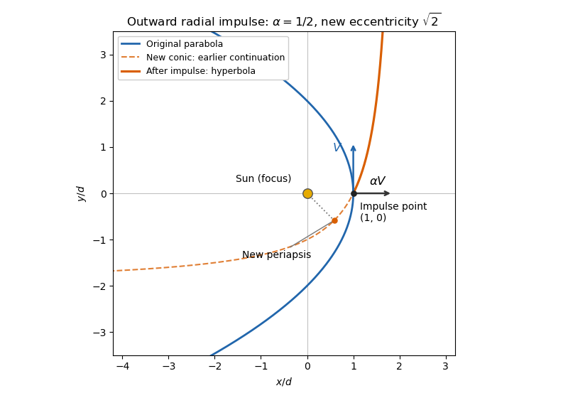

<h1 id="10b/solution">Solution</h1>

↑ **Parent:** [10B](../10b.md)

For unit [mass](../../../../../mass.md), the [inverse-square force](../../../../../inverse-square-force.md) has [potential energy](../../../../../potential-energy.md) $-k/r$, with zero potential at infinity. Conservation of [angular momentum](../../../../../angular-momentum.md) gives $r^2\dot\theta=h$. Differentiate the polar equation of the [Kepler orbit](../../../../../kepler-orbit.md):

$$
\frac{dr}{d\theta}=\frac{\ell e\sin\theta}{(1+e\cos\theta)^2},
\qquad
\dot r=\frac{he\sin\theta}{\ell}.
$$

Consequently the total [mechanical energy](../../../../../mechanical-energy.md) is

$$
\begin{aligned}
E&=\frac12\left(\dot r^2+\frac{h^2}{r^2}\right)-\frac{k}{r}\\
&=\frac{h^2}{2\ell^2}
\left[e^2\sin^2\theta+(1+e\cos\theta)^2-2(1+e\cos\theta)\right]\\
&=\boxed{\frac{h^2(e^2-1)}{2\ell^2}},
\end{aligned}
$$

where $k=h^2/\ell$. This also explains the sign distinction between an [elliptic orbit](../../../../../elliptic-orbit.md), a [parabolic Kepler orbit](../../../../../parabolic-trajectory.md), and a [hyperbolic Kepler orbit](../../../../../hyperbolic-kepler-orbit.md).

At the original [periapsis](../../../../../periapsis.md), the [parabolic Kepler orbit](../../../../../parabolic-trajectory.md) has $e=1$, $r=d=\ell/2$, and purely tangential speed $V$. Thus

$$
\ell=2d,\qquad h=dV,\qquad V^2=\frac{2k}{d}.
$$

The outward radial [impulse](../../../../../impulse.md) has zero moment about the Sun, so it preserves [angular momentum](../../../../../angular-momentum.md) and hence $\ell$. Its additional velocity is perpendicular to the original velocity, so the new [mechanical energy](../../../../../mechanical-energy.md) is $E'=\alpha^2V^2/2$. Applying the energy formula gives

$$
\frac{V^2}{8}(e'^2-1)=\frac{\alpha^2V^2}{2},
\qquad
\boxed{e'=\sqrt{1+4\alpha^2}}.
$$

For $\alpha>0$, the new orbit is a [hyperbolic Kepler orbit](../../../../../hyperbolic-kepler-orbit.md); $\alpha=0$ leaves the parabola unchanged.

To fix the orientation of the sketch, put the Sun at the origin, the impulse point at $(d,0)$, and take the original motion there upwards. The new velocity is $(\alpha V,V)$. The [eccentricity vector](../../../../../eccentricity-vector.md) is

$$
\mathbf e'=\frac{\mathbf v'\times\mathbf h}{k}-\hat{\mathbf r}
=(1,-2\alpha).
$$

It points towards the new [periapsis](../../../../../periapsis.md), which is rotated clockwise through $\beta=\arctan(2\alpha)$ from the original periapsis direction. Thus, measured using the original polar angle $\theta$, the new orbit is

$$
\boxed{r=\frac{2d}{1+\cos\theta-2\alpha\sin\theta}
=\frac{2d}{1+e'\cos(\theta+\beta)}}.
$$

In particular, the impulse point is already on the outgoing part of the new orbit and is not its new periapsis. The old parabola satisfies $x=d-y^2/(4d)$. Both orbits pass through $(d,0)$ and have the same focus, but the hyperbola's new periapsis axis is tilted.

**[Figure 1](#10b/image-original-parabolic-orbit-and-the-orbit-after-an-outward-radial-impulse). Original parabolic orbit and the orbit after an outward radial impulse**. Illustrative case $\alpha=1/2$, with distances in units of $d$. The solid orange curve is the subsequent hyperbolic trajectory; its dashed continuation is the earlier part of the mathematical conic. The original velocity and radial velocity increment are shown at the impulse point.

## ↑ Ancestors (10)

1. [10B](../10b.md)
2. [Paper 4](../../paper-4-split.md)
3. [Ia](../../split.md)
4. [2016](../../../split.md)
5. [Past exam of the mathematics course of the University of Cambridge](../../../../split.md)
6. [Mathematics course of the University of Cambridge](../../../../../mathematics-course-of-the-university-of-cambridge.md)
7. [Course of the University of Cambridge](../../../../../course-of-the-university-of-cambridge.md)
8. [University of Cambridge](../../../../../university-of-cambridge-split.md)
9. [List of universities](../../../../../list-of-universities.md)
10. [Codex Wiki](../../../../../split.md)
