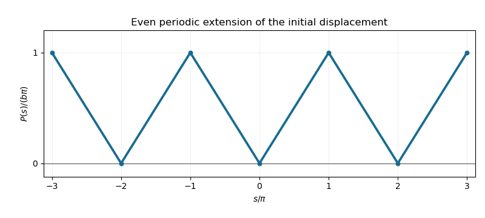

# Paper 2

↑ **Parent:** [Ib](../ib.md)

[https://www.maths.cam.ac.uk/undergrad/pastpapers/files/2016/paperib_2_0.pdf](https://www.maths.cam.ac.uk/undergrad/pastpapers/files/2016/paperib_2_0.pdf)

**Table of contents**

- [1F](#1f)
  - [Solution](#1f/solution)
- [2E](#2e)
  - [Solution](#2e/solution)
- [3G](#3g)
  - [a](#3g/a)
    - [Solution](#3g/a/solution)
  - [b](#3g/b)
    - [Solution](#3g/b/solution)
  - [c](#3g/c)
    - [Solution](#3g/c/solution)
- [4E](#4e)
  - [a](#4e/a)
    - [Solution](#4e/a/solution)
  - [b](#4e/b)
    - [Solution](#4e/b/solution)
- [5A](#5a)
  - [Solution](#5a/solution)
- [6D](#6d)
  - [a](#6d/a)
    - [Solution](#6d/a/solution)
  - [b](#6d/b)
    - [Solution](#6d/b/solution)
  - [c](#6d/c)
    - [Solution](#6d/c/solution)
- [7C](#7c)
  - [a](#7c/a)
    - [Solution](#7c/a/solution)
  - [b](#7c/b)
    - [Solution](#7c/b/solution)
  - [c](#7c/c)
    - [Solution](#7c/c/solution)
- [8H](#8h)
  - [Solution](#8h/solution)
- [9H](#9h)
  - [Solution](#9h/solution)
- [10F](#10f)
  - [a](#10f/a)
    - [Solution](#10f/a/solution)
  - [b](#10f/b)
    - [Solution](#10f/b/solution)
  - [c](#10f/c)
    - [Solution](#10f/c/solution)
- [11E](#11e)
  - [a](#11e/a)
    - [Solution](#11e/a/solution)
  - [b](#11e/b)
    - [Solution](#11e/b/solution)
  - [c](#11e/c)
    - [Solution](#11e/c/solution)
- [12G](#12g)
  - [a](#12g/a)
    - [Solution](#12g/a/solution)
  - [b](#12g/b)
    - [Solution](#12g/b/solution)
  - [c](#12g/c)
    - [Solution](#12g/c/solution)
  - [d](#12g/d)
    - [Solution](#12g/d/solution)
- [13A](#13a)
  - [Solution](#13a/solution)
- [14F](#14f)
  - [a](#14f/a)
    - [Solution](#14f/a/solution)
  - [b](#14f/b)
    - [Solution](#14f/b/solution)
  - [c](#14f/c)
    - [Solution](#14f/c/solution)
- [15C](#15c)
  - [a](#15c/a)
    - [Solution](#15c/a/solution)
  - [b](#15c/b)
    - [Solution](#15c/b/solution)
  - [c](#15c/c)
    - [Solution](#15c/c/solution)
- [16A](#16a)
  - [a](#16a/a)
    - [Solution](#16a/a/solution)
  - [b](#16a/b)
    - [Solution](#16a/b/solution)
- [17B](#17b)
  - [a](#17b/a)
    - [Solution](#17b/a/solution)
  - [b](#17b/b)
    - [Solution](#17b/b/solution)
  - [c](#17b/c)
    - [Solution](#17b/c/solution)
  - [d](#17b/d)
    - [Solution](#17b/d/solution)
  - [e](#17b/e)
    - [Solution](#17b/e/solution)
  - [f](#17b/f)
    - [Solution](#17b/f/solution)
- [18D](#18d)
  - [a](#18d/a)
    - [Solution](#18d/a/solution)
  - [b](#18d/b)
    - [Solution](#18d/b/solution)
  - [c](#18d/c)
    - [Solution](#18d/c/solution)
  - [d](#18d/d)
    - [Solution](#18d/d/solution)
- [19D](#19d)
  - [a](#19d/a)
    - [Solution](#19d/a/solution)
  - [b](#19d/b)
    - [Solution](#19d/b/solution)
  - [c](#19d/c)
    - [i](#19d/c/i)
      - [Solution](#19d/c/i/solution)
    - [ii](#19d/c/ii)
      - [Solution](#19d/c/ii/solution)
- [20H](#20h)
  - [a](#20h/a)
    - [Solution](#20h/a/solution)
  - [b](#20h/b)
    - [i](#20h/b/i)
      - [Solution](#20h/b/i/solution)
    - [ii](#20h/b/ii)
      - [Solution](#20h/b/ii/solution)
    - [iii](#20h/b/iii)
      - [Solution](#20h/b/iii/solution)

## 1F

↑ **Parent:** [Paper 2](paper-2.md)

<h3 id="1f/solution">Solution</h3>

↑ **Parent:** [1F](#1f)

Use [completing the square](../../../polynomial.md#completing-the-square) rather than computing the [eigenvalues](../../../linear-operator-theory.md#eigenvalue) of the [symmetric matrix](../../../linear-algebra.md#symmetric-matrix). Successively removing the mixed terms gives

$$
q=2\left(x+2y-\frac32z\right)^2-7y^2+8yz-\frac52z^2
=2\left(x+2y-\frac32z\right)^2-7\left(y-\frac47z\right)^2-\frac3{14}z^2.
$$

Thus **one suitable invertible linear change of coordinates** is

$$
\boxed{X=x+2y-\frac32z,\quad Y=y-\frac47z,\quad Z=z;\qquad q=2X^2-7Y^2-\frac3{14}Z^2.}
$$

The coordinate [matrix](../../../vector-space.md#matrix) is upper triangular with [determinant](../../../linear-algebra.md#determinant) one, so the change is an [invertible linear map](../../../calculus.md#invertible-linear-map). Its inverse is $z=Z$, $y=Y+4Z/7$, $x=X-2Y+5Z/14$. Hence the diagonal coefficients can be taken as $2,-7,-3/14$. This is a [matrix congruence](../../../linear-algebra.md#matrix-congruence) of a [quadratic form](../../../linear-algebra.md#quadratic-form); an [orthogonal transformation](../../../linear-algebra.md#orthogonal-transformation) was not required.

## 2E

↑ **Parent:** [Paper 2](paper-2.md)

<h3 id="2e/solution">Solution</h3>

↑ **Parent:** [2E](#2e)

The [fraction field](../../../commutative-algebra.md#field-of-fractions) of an [integral domain](../../../commutative-algebra.md#integral-domain) $R$ is a [field](../../../algebra.md#field) $F$ containing an identified copy of $R$ in which every element has the form $a/b$ with $a,b\in R$ and $b\ne0$. Equality means $a/b=c/d$ exactly when $ad=bc$; the operations are the usual addition and multiplication of fractions. We use unital [ring homomorphisms](../../../commutative-algebra.md#ring-homomorphism).

Since $\varphi$ is [injective](../../../algebra.md#injective-function), $\varphi(b)\ne0$ whenever $b\ne0$. Define

$$
\boxed{\Phi(a/b)=\varphi(a)\varphi(b)^{-1}.}
$$

If $ad=bc$, applying the [ring homomorphism](../../../commutative-algebra.md#ring-homomorphism) and dividing by $\varphi(b)\varphi(d)$ proves the value is independent of the representative. The fraction addition and multiplication rules show that $\Phi$ preserves both operations and one, and $\Phi(a/1)=\varphi(a)$. If $\Phi(a/b)=0$, then $\varphi(a)=0$, so $a=0$ because $\varphi$ is an [injective function](../../../algebra.md#injective-function); therefore its [kernel](../../../linear-algebra.md#kernel-of-a-linear-map) is zero and $\Phi$ is [injective](../../../algebra.md#injective-function). It is also the unique extension, because any [ring homomorphism](../../../commutative-algebra.md#ring-homomorphism) extending $\varphi$ must send $b^{-1}$ to $\varphi(b)^{-1}$.

For a counterexample, take $R=\mathbb Z$, $F=\mathbb Q$, and reduction modulo two $\psi:\mathbb Z\to\mathbb Z/2\mathbb Z$. An extension would give $1=\Psi(2)\Psi(1/2)=0$, a contradiction. **Nonzero denominators must become invertible in the target; an arbitrary ring homomorphism need not have that property.**

## 3G

↑ **Parent:** [Paper 2](paper-2.md)

<h3 id="3g/a">a</h3>

↑ **Parent:** [3G](#3g)

<h4 id="3g/a/solution">Solution</h4>

↑ **Parent:** [A](#3g/a)

[Differentiability](../../../analysis.md#differentiability) here is understood in the sense of the [Fréchet derivative](../../../calculus.md#frechet-derivative): there is a [linear map](../../../vector-space.md#linear-map) $L:\mathbb R^n\to\mathbb R^m$ such that

$$
\boxed{f(x+h)=f(x)+Lh+r(h),\qquad \frac{\|r(h)\|}{\|h\|}\longrightarrow0\quad(h\to0).}
$$

The map $L=Df(x)$ is the [Fréchet derivative](../../../calculus.md#frechet-derivative). In finite dimensions a [linear map](../../../vector-space.md#linear-map) is bounded, so $\|Lh\|\le C\|h\|$ for some $C$. The defining estimate therefore implies

$$
\|f(x+h)-f(x)\|\le C\|h\|+o(\|h\|)\longrightarrow0.
$$

This is precisely [continuity](../../../calculus.md#continuous-function) at $x$: **differentiability implies continuity.**

<h3 id="3g/b">b</h3>

↑ **Parent:** [3G](#3g)

<h4 id="3g/b/solution">Solution</h4>

↑ **Parent:** [B](#3g/b)

First suppose each $g_j$ is [differentiable](../../../analysis.md#differentiable-function) at $x_j$. Write $g_j(x_j+t)=g_j(x_j)+v_jt+r_j(t)$, where $v_j\in\mathbb R^m$ and $r_j(t)=o(|t|)$. Define the [linear map](../../../vector-space.md#linear-map) $Lh=\sum_jv_jh_j$. Given $\varepsilon>0$, choose a common sufficiently small neighbourhood so that $\|r_j(h_j)\|\le\varepsilon|h_j|$ for all $j$, with $r_j(0)=0$. Then

$$
\left\|f(x+h)-f(x)-Lh\right\|\le\varepsilon\sum_j|h_j|\le\varepsilon\sqrt n\,\|h\|.
$$

This proves [differentiability](../../../analysis.md#differentiability), with

$$
\boxed{Df(x)h=\sum_{j=1}^n g_j'(x_j)h_j.}
$$

Conversely, suppose $f$ is [differentiable](../../../analysis.md#differentiable-function) with [Fréchet derivative](../../../calculus.md#frechet-derivative) $L$. Along the $j$th coordinate direction $e_j$, the other summands cancel exactly:

$$
g_j(x_j+t)-g_j(x_j)=f(x+te_j)-f(x)=tLe_j+o(|t|).
$$

Thus $g_j$ is [differentiable](../../../analysis.md#differentiable-function) at $x_j$, with $g_j'(x_j)=Le_j$. **The equivalence works because each summand varies in only one coordinate; it is stronger than merely having partial derivatives.**

<h3 id="3g/c">c</h3>

↑ **Parent:** [3G](#3g)

<h4 id="3g/c/solution">Solution</h4>

↑ **Parent:** [C](#3g/c)

The function $g(t)=|t|^{3/2}$ is [differentiable](../../../analysis.md#differentiable-function) everywhere: for $t\ne0$, its [derivative](../../../calculus.md#derivative) is $(3/2)\operatorname{sgn}(t)\sqrt{|t|}$, while at zero the difference quotient is $\operatorname{sgn}(t)\sqrt{|t|}\to0$.

The function $k(t)=|t|^{1/2}$ is [differentiable](../../../analysis.md#differentiable-function) for $t\ne0$, with [derivative](../../../calculus.md#derivative) $\operatorname{sgn}(t)/(2\sqrt{|t|})$. At zero its difference quotient is $\operatorname{sgn}(t)/\sqrt{|t|}$, which has no finite limit. Applying the coordinatewise-sum argument gives

$$
\boxed{f\text{ is differentiable exactly at }(x,y)\text{ with }y\ne0.}
$$

At those points,

$$
Df(x,y)(h,k)=\frac32\operatorname{sgn}(x)\sqrt{|x|}\,h+\frac{\operatorname{sgn}(y)}{2\sqrt{|y|}}\,k,
$$

where the first coefficient is zero at $x=0$. At any point with $y=0$, the restriction to the vertical coordinate line already fails to be [differentiable](../../../analysis.md#differentiable-function).

## 4E

↑ **Parent:** [Paper 2](paper-2.md)

<h3 id="4e/a">a</h3>

↑ **Parent:** [4E](#4e)

<h4 id="4e/a/solution">Solution</h4>

↑ **Parent:** [A](#4e/a)

Let $K$ be a [compact set](../../../topology.md#compact-space) of a [Hausdorff space](../../../topology.md#hausdorff-space) $X$. For any $x\notin K$ and each $y\in K$, the [Hausdorff](../../../topology.md#hausdorff-space) property gives disjoint [open sets](../../../topology.md#open-set) $U_y\ni y$ and $V_y\ni x$. The sets $U_y$ cover $K$; [compactness](../../../topology.md#compact-space) supplies a finite subcover $U_{y_1},\ldots,U_{y_r}$. The [open set](../../../topology.md#open-set) $V=\bigcap_iV_{y_i}$ contains $x$ and misses every $U_{y_i}$, hence misses $K$. Thus $X\setminus K$ is [open](../../../topology.md#open-set), and **every compact subset of a Hausdorff space is closed**. The empty-set case is immediate.

Since $\mathbb R$ with its usual topology is [Hausdorff](../../../topology.md#hausdorff-space), its [compact sets](../../../topology.md#compact-space) are [closed](../../../topology.md#closed-set). The [open cover](../../../topology.md#open-cover) $\{(-n,n):n\ge1\}$ of $\mathbb R$ has a finite subcover of any [compact set](../../../topology.md#compact-space) $K$. Taking the largest index in that subcover gives $K\subset(-N,N)$, so $K$ is a [bounded set](../../../topological-analysis.md#bounded-set). This proves the required direction of the [Heine-Borel theorem](../../../topology.md#heine-borel-theorem) without assuming its converse.

<h3 id="4e/b">b</h3>

↑ **Parent:** [4E](#4e)

<h4 id="4e/b/solution">Solution</h4>

↑ **Parent:** [B](#4e/b)

Take $X$ to be the set $\mathbb Q$, equipped with the [discrete metric](../../../topological-analysis.md#discrete-metric)

$$
\boxed{d(p,q)=\begin{cases}0,&p=q,\\1,&p\ne q.\end{cases}\qquad f(p)=p\in\mathbb Q.}
$$

Every [Cauchy sequence](../../../real-analysis.md#cauchy-sequence) is eventually constant: its terms must eventually have mutual distance in this [metric](../../../topological-analysis.md#metric) less than $1/2$. Consequently $X$ is a [complete metric space](../../../topological-analysis.md#complete-metric-space). Its topology is the [discrete topology](../../../topology.md#discrete-space), since every singleton is a ball of radius $1/2$ and every subset is a union of such balls.

For the codomain use the usual subspace topology on $\mathbb Q$. The inverse image of any [open set](../../../topology.md#open-set) there is a subset of the discrete $X$, hence is [open](../../../topology.md#open-set). Therefore $f$ is [continuous](../../../calculus.md#continuous-function) and plainly [surjective](../../../algebra.md#surjective-function). **A continuous image of a complete metric space need not be complete.** The two occurrences of $\mathbb Q$ have different domain and codomain metrics.

## 5A

↑ **Parent:** [Paper 2](paper-2.md)

<h3 id="5a/solution">Solution</h3>

↑ **Parent:** [5A](#5a)

For the [method of characteristics](../../../partial-differential-equation.md#method-of-characteristics), parameterize by $x$; the [characteristic curves](../../../partial-differential-equation.md#characteristic-curve) satisfy

$$
\frac{dy}{dx}=-2x,\qquad \frac{du}{dx}=\cos x.
$$

Thus $x^2+y=C$ and $u-\sin x$ is constant on each [characteristic curve](../../../partial-differential-equation.md#characteristic-curve). The general form in the quadrant is $u=\sin x+F(x^2+y)$. The [boundary condition](../../../differential-equation.md#boundary-condition) gives $F(s^2)=\cos s-\sin s$ for every $s\ge0$.

The [characteristic curve](../../../partial-differential-equation.md#characteristic-curve) through $(x,y)$ meets the boundary at $(s,0)$ with $s=\sqrt{x^2+y}\ge x$. Integrating backwards from that boundary value yields

$$
\boxed{u(x,y)=\sin x+\cos\sqrt{x^2+y}-\sin\sqrt{x^2+y}.}
$$

Indeed $\partial_x-2x\partial_y$ annihilates $x^2+y$ and sends $\sin x$ to $\cos x$, while on $y=0$ the expression reduces to $\cos x$. **Every characteristic in the quadrant meets the prescribed boundary, so its value is determined.** The displayed solution is smooth away from the origin. At the origin the boundary is characteristic and the solution is continuous but has a singular inward $y$ derivative; the differential equation is interpreted in the interior, with the boundary data attained continuously.

## 6D

↑ **Parent:** [Paper 2](paper-2.md)

<h3 id="6d/a">a</h3>

↑ **Parent:** [6D](#6d)

<h4 id="6d/a/solution">Solution</h4>

↑ **Parent:** [A](#6d/a)

In SI units the [Ampère-Maxwell equation](../../../electromagnetism.md#ampere-s-circuital-law) is $\nabla\times\mathbf B=\mu_0\mathbf J+\mu_0\varepsilon_0\partial_t\mathbf E$. Since $\mathbf E=0$, the displacement-current term vanishes and $\nabla\times\mathbf B=\mu_0\mathbf J$. Apply [Stokes theorem](../../../calculus.md#stokes-theorem) to an oriented surface $S$ with positively oriented boundary $C$:

$$
\oint_C\mathbf B\cdot d\boldsymbol\ell=\int_S(\nabla\times\mathbf B)\cdot\mathbf n\,dS=\mu_0\int_S\mathbf J\cdot\mathbf n\,dS.
$$

Hence the integral form of [Ampère's law](../../../electromagnetism.md#ampere-s-circuital-law) is

$$
\boxed{\oint_C\mathbf B\cdot d\boldsymbol\ell=\mu_0 I_{\rm enclosed}.}
$$

Here $\mu_0$ is vacuum [magnetic permeability](../../../electromagnetism.md#permeability-electromagnetism), $\mathbf J$ is [current density](../../../electromagnetism.md#current-density), and positive enclosed [electric current](../../../electromagnetism.md#electric-current) is defined by the orientation of $S$.

<h3 id="6d/b">b</h3>

↑ **Parent:** [6D](#6d)

<h4 id="6d/b/solution">Solution</h4>

↑ **Parent:** [B](#6d/b)

For the field generated by the infinitely long, axially symmetric shell currents, [axisymmetry](../../../calculus.md#axisymmetric-vector-field) and the right-hand rule give $\mathbf B=B_\phi(r)\mathbf e_\phi$. A circular loop has $\oint\mathbf B\cdot d\boldsymbol\ell=2\pi rB_\phi(r)$. Its enclosed [electric current](../../../electromagnetism.md#electric-current) is zero inside the inner shell, $I$ between the shells and $2I$ outside both. [Ampère's law](../../../electromagnetism.md#ampere-s-circuital-law) therefore gives

$$
\boxed{\mathbf B(r)=\begin{cases}0,&r<a,\\\dfrac{\mu_0I}{2\pi r}\mathbf e_\phi,&a<r<b,\\\dfrac{\mu_0I}{\pi r}\mathbf e_\phi,&r>b.\end{cases}}
$$

The positive $\mathbf e_\phi$ direction is counterclockwise viewed from positive $z$. The ideal [current sheets](../../../electromagnetism.md#current-sheet) make the tangential [magnetic field](../../../electromagnetism.md#magnetic-field) discontinuous at each shell; these formulas specify the three open regions, with no additional imposed background field.

<h3 id="6d/c">c</h3>

↑ **Parent:** [6D](#6d)

<h4 id="6d/c/solution">Solution</h4>

↑ **Parent:** [C](#6d/c)

Only the signed enclosed [electric current](../../../electromagnetism.md#electric-current) changes. Between the shells it remains $I$, but outside both it is $I-I=0$. The same circular-loop application of [Ampère's law](../../../electromagnetism.md#ampere-s-circuital-law) gives

$$
\boxed{\mathbf B(r)=\begin{cases}0,&r<a,\\\dfrac{\mu_0I}{2\pi r}\mathbf e_\phi,&a<r<b,\\0,&r>b.\end{cases}}
$$

**Opposite currents confine the generated magnetic field to the annulus**, as in an ideal infinitely long coaxial cable. The two shell [current sheets](../../../electromagnetism.md#current-sheet) account for the field jumps.

## 7C

↑ **Parent:** [Paper 2](paper-2.md)

<h3 id="7c/a">a</h3>

↑ **Parent:** [7C](#7c)

<h4 id="7c/a/solution">Solution</h4>

↑ **Parent:** [A](#7c/a)

For this steady [unidirectional flow](../../../fluid-mechanics.md#unidirectional-flow), the convective acceleration $(\mathbf u\cdot\nabla)\mathbf u$ vanishes because $u$ depends only on $y$. The axial [Navier-Stokes equation](../../../viscous-fluid-flow.md#navier-stokes-equation) reduces to $0=-p_x+\mu u''$, with $p_x=-G$. The [no-slip boundary conditions](../../../viscous-fluid-flow.md#no-slip-boundary-condition) therefore give

$$
\boxed{\mu u''(y)=-G,\qquad u(0)=0,\quad u(h)=U.}
$$

This is a superposition of [Couette flow](../../../viscous-fluid-flow.md#couette-flow) and pressure-driven [Poiseuille flow](../../../viscous-fluid-flow.md#hagen-poiseuille-equation).

<h3 id="7c/b">b</h3>

↑ **Parent:** [7C](#7c)

<h4 id="7c/b/solution">Solution</h4>

↑ **Parent:** [B](#7c/b)

Integrate the axial [ordinary differential equation](../../../differential-equation.md#ordinary-differential-equation) twice: $u=-Gy^2/(2\mu)+C_1y+C_2$. The [no-slip boundary condition](../../../viscous-fluid-flow.md#no-slip-boundary-condition) at zero gives $C_2=0$, and the one at $h$ gives $C_1=U/h+Gh/(2\mu)$. Hence

$$
\boxed{u(y)=\frac{U}{h}y+\frac{G}{2\mu}y(h-y).}
$$

The first term is [Couette flow](../../../viscous-fluid-flow.md#couette-flow); the second is [Poiseuille flow](../../../viscous-fluid-flow.md#hagen-poiseuille-equation) driven in positive $x$ when $G>0$. Their addition is valid because the reduced [Stokes equation](../../../stokes-flow.md#stokes-equation) is linear.

<h3 id="7c/c">c</h3>

↑ **Parent:** [7C](#7c)

<h4 id="7c/c/solution">Solution</h4>

↑ **Parent:** [C](#7c/c)

The bottom-wall [shear stress](../../../viscous-fluid-flow.md#shear-stress) vanishes exactly when $u'(0)=0$. Differentiating the [velocity profile](../../../viscous-fluid-flow.md#velocity-profile) gives

$$
u'(0)=\frac Uh+\frac{Gh}{2\mu},\qquad \boxed{U=-\frac{Gh^2}{2\mu}.}
$$

With this value the [velocity profile](../../../viscous-fluid-flow.md#velocity-profile) becomes $u(y)=-Gy^2/(2\mu)$, so the [volume flux](../../../fluid-mechanics.md#volumetric-flow-rate) per unit transverse width is

$$
\boxed{q=\int_0^h u(y)\,dy=-\frac{Gh^3}{6\mu}.}
$$

For $G>0$, the plate must move against the pressure-driven direction, and the resulting signed [volume flux](../../../fluid-mechanics.md#volumetric-flow-rate) is negative. **Zero bottom-wall shear does not mean zero flow.**

## 8H

↑ **Parent:** [Paper 2](paper-2.md)

<h3 id="8h/solution">Solution</h3>

↑ **Parent:** [8H](#8h)

Under the null hypothesis the three outcome probabilities are the same in the two independent samples. The pooled row totals are $50,20,30$, and both column totals are $50$, out of a total of $100$. Thus the expected counts in each column are $25,10,15$. These exceed the usual small-count threshold for the asymptotic [Pearson chi-squared test of homogeneity](../../../statistical-modelling.md#pearson-chi-squared-test-of-homogeneity).

The [Pearson chi-squared statistic for contingency tables](../../../statistical-modelling.md#pearson-chi-squared-statistic-for-contingency-tables) is

$$
X^2=2\left(\frac{(28-25)^2}{25}+\frac{(4-10)^2}{10}+\frac{(18-15)^2}{15}\right)=\boxed{9.12}.
$$

Under the null, its asymptotic [chi-squared distribution](../../../probability-theory.md#chi-squared-distribution) has $(3-1)(2-1)=2$ [degrees of freedom](../../../classical-mechanics.md#degree-of-freedom). Equivalently, the two independent three-category samples have four probability parameters unrestricted and two under the common-probability null. The $1\%$ upper-tail critical value is $9.21$.

Since $9.12<9.21$, **do not reject the equal-effect hypothesis at the 1% level**. For two [degrees of freedom](../../../classical-mechanics.md#degree-of-freedom), the approximate [p-value](../../../statistical-modelling.md#p-value) is $e^{-9.12/2}\simeq0.01046$, just above $0.01$. This is a decision at the specified [significance level](../../../statistical-modelling.md#significance-level), not evidence that the two outcome distributions have been proved identical.

## 9H

↑ **Parent:** [Paper 2](paper-2.md)

<h3 id="9h/solution">Solution</h3>

↑ **Parent:** [9H](#9h)

Introduce nonnegative [slack variables](../../../mathematical-optimization.md#slack-variable) $s_1,s_2,s_3$ and start the [simplex algorithm](../../../numerical-analysis.md#simplex-algorithm) at $x=y=z=0$, with slacks $9,8,2$. The objective's largest positive entering coefficient belongs to $y$. Its ratio test is $9/3=3$, $8/2=4$, $2/1=2$, so $s_3$ leaves and $y$ enters.

Solve that pivot row for $y$ and substitute into the other rows and the objective $v$:

$$
\begin{aligned}
y&=2-2x-3z-s_3,\\
s_1&=3-2x-z+3s_3,\\
s_2&=4-x+2z+2s_3,\\
v&=10-7x-15z-5s_3.
\end{aligned}
$$

This is a feasible [simplex dictionary](../../../numerical-analysis.md#simplex-dictionary) at nonbasic variables $x=z=s_3=0$. All their objective coefficients are negative, so no feasible increase can improve the objective. Thus

$$
\boxed{(x,y,z)=(0,2,0),\qquad v_{\max}=10.}
$$

The negative reduced coefficients also prove uniqueness of this optimum.

The [dual linear program](../../../mathematical-optimization.md#dual-linear-program), with nonnegative variables $u_1,u_2,u_3$, is

$$
\begin{gathered}
\text{minimize }9u_1+8u_2+2u_3,\\
8u_1+5u_2+2u_3\ge3,\quad3u_1+2u_2+u_3\ge5,\quad10u_1+4u_2+3u_3\ge0.
\end{gathered}
$$

The feasible choice $\boxed{(u_1,u_2,u_3)=(0,0,5)}$ has objective $10$. [Weak duality](../../../mathematical-optimization.md#weak-duality) proves that it and the primal point are optimal. [Complementary slackness](../../../mathematical-optimization.md#complementary-slackness) also forces $u_1=u_2=0$ because the first two primal slacks are positive, and then the positive $y$ forces $u_3=5$.

## 10F

↑ **Parent:** [Paper 2](paper-2.md)

<h3 id="10f/a">a</h3>

↑ **Parent:** [10F](#10f)

<h4 id="10f/a/solution">Solution</h4>

↑ **Parent:** [A](#10f/a)

**Group the matrix entries by columns.** Each column of $BA$ is $B$ times the corresponding column of $A$. In the column-ordered [basis](../../../vector-space.md#basis) of [matrix units](../../../vector-space.md#matrix-unit), the [linear map](../../../vector-space.md#linear-map) $L_B$ consequently has a [block diagonal matrix](../../../vector-space.md#block-diagonal-matrix) with $n$ copies of $B$. The [determinant](../../../linear-algebra.md#determinant) of a [block diagonal matrix](../../../vector-space.md#block-diagonal-matrix) is the product of its block [determinants](../../../linear-algebra.md#determinant), giving

$$
\boxed{\det L_B=(\det B)^n.}
$$

This argument does not require $B$ to be an [invertible matrix](../../../linear-algebra.md#invertible-matrix).

<h3 id="10f/b">b</h3>

↑ **Parent:** [10F](#10f)

<h4 id="10f/b/solution">Solution</h4>

↑ **Parent:** [B](#10f/b)

Right multiplication by $B^*$ acts separately on the rows. After transposing each row its matrix is $(B^*)^T=\overline B$, so its [determinant](../../../linear-algebra.md#determinant) is $(\overline{\det B})^n$. Composing this [linear map](../../../vector-space.md#linear-map) with left multiplication and using part (a) gives

$$
\boxed{\det M_B=(\det B)^n(\overline{\det B})^n=|\det B|^{2n}.}
$$

Here the [determinant](../../../linear-algebra.md#determinant) is taken on the $n^2$-dimensional complex [vector space](../../../vector-space.md) of matrices.

<h3 id="10f/c">c</h3>

↑ **Parent:** [10F](#10f)

<h4 id="10f/c/solution">Solution</h4>

↑ **Parent:** [C](#10f/c)

If $A$ is a [Hermitian matrix](../../../hilbert-space.md#hermitian-operator), then $(BAB^*)^*=BAB^*$, so $M_B$ preserves $W$. Addition and multiplication by real [scalars](../../../vector-space.md#scalar) commute with this operation, making $T_B$ a real [linear map](../../../vector-space.md#linear-map).

A real [basis](../../../vector-space.md#basis) of $W$ consists of $E_{ii}$ and, for $i<j$, $E_{ij}+E_{ji}$ and $i(E_{ij}-E_{ji})$. It has $n^2$ elements and is also a complex [basis](../../../vector-space.md#basis) of all matrices. Indeed every matrix is uniquely $H+iK$ with $H,K$ [Hermitian matrices](../../../hilbert-space.md#hermitian-operator), by taking

$$
H=\frac{A+A^*}{2},\qquad K=\frac{A-A^*}{2i}.
$$

Real linear independence of the displayed [basis](../../../vector-space.md#basis) therefore implies complex linear independence. Since its images under $M_B$ are [Hermitian matrices](../../../hilbert-space.md#hermitian-operator), the matrix of $M_B$ in this complex [basis](../../../vector-space.md#basis) has exactly the same real entries as the matrix of $T_B$ in the real [basis](../../../vector-space.md#basis). Their [determinants](../../../linear-algebra.md#determinant) are equal. **There is no further squaring when passing to this real subspace:**

$$
\boxed{\det T_B=|\det B|^{2n}.}
$$

This is the [determinant of Hermitian congruence](../../../hilbert-space.md#determinant-of-hermitian-congruence), including the case of singular $B$.

## 11E

↑ **Parent:** [Paper 2](paper-2.md)

<h3 id="11e/a">a</h3>

↑ **Parent:** [11E](#11e)

<h4 id="11e/a/solution">Solution</h4>

↑ **Parent:** [A](#11e/a)

Write $|G|=p^r m$ with $p$ prime and $p\nmid m$. The [Sylow theorems](../../../finite-group-theory.md#sylow-theorems) assert that a subgroup of order $p^r$ exists; every [p-group](../../../finite-group-theory.md#p-group) subgroup is contained in a conjugate of a [Sylow subgroup](../../../finite-group-theory.md#sylow-subgroup); all [Sylow subgroups](../../../finite-group-theory.md#sylow-subgroup) are conjugate; and their number $n_p$ satisfies $n_p\equiv1\pmod p$ and $n_p\mid m$.

For the containment and conjugacy assertions, fix a [Sylow subgroup](../../../finite-group-theory.md#sylow-subgroup) $P$ and let any [p-group](../../../finite-group-theory.md#p-group) subgroup $Q$ act by left multiplication on the $m$ left [cosets](../../../group-theory.md#coset) $G/P$. By the [orbit-stabilizer theorem](../../../group-theory.md#orbit-stabilizer-theorem), every orbit has size a power of $p$. Since $p\nmid m$, at least one orbit has size one. If $gP$ is such a fixed point, then $qgP=gP$ for all $q\in Q$, equivalently $g^{-1}Qg\subseteq P$. Thus $Q\subseteq gPg^{-1}$. If $Q$ too has order $p^r$, this inclusion is equality, proving conjugacy. This is [Sylow containment from a coset fixed point](../../../finite-group-theory.md#sylow-containment-from-a-coset-fixed-point).

<h3 id="11e/b">b</h3>

↑ **Parent:** [11E](#11e)

<h4 id="11e/b/solution">Solution</h4>

↑ **Parent:** [B](#11e/b)

Since $351=3^3\cdot13$, the number of [Sylow subgroups](../../../finite-group-theory.md#sylow-subgroup) for $p=13$ divides $27$ and is $1$ modulo $13$, hence is $1$ or $27$. In the first case the unique subgroup is a nontrivial proper [normal subgroup](../../../group-theory.md#normal-subgroup).

In the second case the $27$ subgroups of order $13$ have pairwise trivial intersection: two such subgroups sharing a nonidentity element would both be generated by it. They account for $27\cdot12=324$ nonidentity elements of order $13$. Exactly $27$ elements, including the identity, remain. Every [Sylow subgroup](../../../finite-group-theory.md#sylow-subgroup) for $p=3$ has order $27$, and all its elements lie among these remaining elements, by [Lagrange's theorem](../../../group-theory.md#lagrange-s-theorem). It must therefore be precisely that set. The [Sylow subgroup](../../../finite-group-theory.md#sylow-subgroup) for $p=3$ is unique and hence [normal](../../../probability-theory.md#normal-distribution). **In either case $G$ is not a [simple group](../../../finite-group-theory.md#simple-group).**

<h3 id="11e/c">c</h3>

↑ **Parent:** [11E](#11e)

<h4 id="11e/c/solution">Solution</h4>

↑ **Parent:** [C](#11e/c)

For the [general linear group](../../../group-theory.md#general-linear-group) over $\mathbb F_{31}$, choose a nonzero first column in $31^2-1$ ways and a second column outside its span in $31^2-31$ ways. Thus

$$
|\operatorname{GL}_2(\mathbb F_{31})|=(31^2-1)(31^2-31)=2^7\,3^2\,5^2\,31.
$$

Since $5^3=125\equiv1\pmod{31}$ and $5\ne1$, the residue $5$ has order three. The nine [diagonal matrices](../../../linear-algebra.md#diagonal-matrix) $\operatorname{diag}(5^i,5^j)$, with $0\le i,j<3$, form a subgroup isomorphic to $C_3\times C_3$. It is an [abelian group](../../../group.md#abelian-group) and a [Sylow subgroup](../../../finite-group-theory.md#sylow-subgroup) for $p=3$. Every other [Sylow subgroup](../../../finite-group-theory.md#sylow-subgroup) for $p=3$ is conjugate to it by the [Sylow theorems](../../../finite-group-theory.md#sylow-theorems), hence is also [Abelian](../../../group.md#abelian-group).

## 12G

↑ **Parent:** [Paper 2](paper-2.md)

<h3 id="12g/a">a</h3>

↑ **Parent:** [12G](#12g)

<h4 id="12g/a/solution">Solution</h4>

↑ **Parent:** [A](#12g/a)

A [norm](../../../functional-analysis.md#norm) on a real or complex [vector space](../../../vector-space.md) $V$ is a function $\|\cdot\|:V\to[0,\infty)$ with $\|v\|=0$ exactly when $v=0$, $\|\lambda v\|=|\lambda|\|v\|$, and the [triangle inequality](../../../topological-analysis.md#triangle-inequality) $\|v+w\|\le\|v\|+\|w\|$. These are positivity, absolute homogeneity and the [triangle inequality](../../../topological-analysis.md#triangle-inequality).

<h3 id="12g/b">b</h3>

↑ **Parent:** [12G](#12g)

<h4 id="12g/b/solution">Solution</h4>

↑ **Parent:** [B](#12g/b)

For a [linear map](../../../vector-space.md#linear-map) $A:\mathbb R^m\to\mathbb R^n$, define the [operator norm](../../../continuous-dual-space.md#operator-norm) by

$$
\boxed{\|A\|=\sup_{x\ne0}\frac{\|Ax\|}{\|x\|}=\sup_{\|x\|=1}\|Ax\|.}
$$

It is finite. To see this without assuming continuity of $A$, write $x=\sum x_j e_j$: the [triangle inequality](../../../topological-analysis.md#triangle-inequality) bounds $\|Ax\|$ by $\sum|x_j|\|Ae_j\|$. Every [norm](../../../functional-analysis.md#norm) in finite dimensions is equivalent to the [Euclidean norm](../../../functional-analysis.md#euclidean-norm). One proof first uses this same coordinate bound to establish continuity of the [norm](../../../functional-analysis.md#norm) on the Euclidean unit sphere; [compactness](../../../topology.md#compact-space) then gives a strictly positive minimum there. Thus the coordinate bound above is at most a fixed multiple of $\|x\|$.

Absolute homogeneity and the [triangle inequality](../../../topological-analysis.md#triangle-inequality) for this [operator norm](../../../continuous-dual-space.md#operator-norm) follow from those for $\|Ax\|$ and taking suprema. If $\|A\|=0$, then $Ax=0$ for every $x$, hence $A=0$, and the converse is immediate. For any $B:\mathbb R^\ell\to\mathbb R^m$, the defining bound $\|Ax\|\le\|A\|\|x\|$ gives

$$
\|ABx\|\le\|A\|\|Bx\|\le\|A\|\|B\|\|x\|,
\qquad \boxed{\|AB\|\le\|A\|\|B\|.}
$$

This is [submultiplicativity of the operator norm](../../../continuous-dual-space.md#submultiplicativity-of-the-operator-norm).

<h3 id="12g/c">c</h3>

↑ **Parent:** [12G](#12g)

<h4 id="12g/c/solution">Solution</h4>

↑ **Parent:** [C](#12g/c)

The function $X\mapsto\det(I-X)$ is a polynomial in the matrix entries, hence [continuous](../../../calculus.md#continuous-function). Consequently $U$ is the inverse image of the open set $\mathbb R\setminus\{0\}$ and is an [open set](../../../topology.md#open-set).

If $\|X\|<1$ and $(I-X)v=0$, then $v=Xv$ implies $\|v\|\le\|X\|\|v\|$. This forces $v=0$. The square matrix $I-X$ is therefore [injective](../../../algebra.md#injective-function), hence an [invertible matrix](../../../linear-algebra.md#invertible-matrix), so

$$
\boxed{V\subseteq U.}
$$

The argument works with any of the induced [operator norms](../../../continuous-dual-space.md#operator-norm) in part (b).

<h3 id="12g/d">d</h3>

↑ **Parent:** [12G](#12g)

<h4 id="12g/d/solution">Solution</h4>

↑ **Parent:** [D](#12g/d)

Put $r=\|X\|<1$. By [submultiplicativity of the operator norm](../../../continuous-dual-space.md#submultiplicativity-of-the-operator-norm), $\|X^k\|\le r^k$, so the [Neumann series](../../../banach-algebra.md#neumann-series) converges absolutely in the complete finite-dimensional matrix space. Its partial sums satisfy

$$
(I-X)\sum_{k=0}^N X^k=\left(\sum_{k=0}^N X^k\right)(I-X)=I-X^{N+1}.
$$

Taking limits gives **the inverse and a quantitative remainder bound**:

$$
\boxed{f(X)=\sum_{k=0}^{\infty}X^k,\qquad
\left\|f(X)-\sum_{k=0}^N X^k\right\|\le\frac{r^{N+1}}{1-r}.}
$$

To establish two actual [Fréchet derivatives](../../../calculus.md#frechet-derivative), use the [resolvent identity](../../../banach-algebra.md#resolvent-identity)

$$
f(X+H)-f(X)=f(X+H)Hf(X).
$$

For fixed $X\in U$ and sufficiently small $H$, factor $I-X-H=(I-X)(I-f(X)H)$ and apply the [Neumann series](../../../banach-algebra.md#neumann-series) to the second factor. This proves that $X+H\in U$, that $f(X+H)$ is locally bounded, and that $f(X+H)-f(X)=O(\|H\|)$. Subtracting $f(X)Hf(X)$ in the identity leaves $O(\|H\|^2)$. Thus $Df(X)[H]=f(X)Hf(X)$ is the [Fréchet derivative](../../../calculus.md#frechet-derivative).

Near zero, $f(X)=I+X+O(\|X\|^2)$, uniformly in the [operator norm](../../../continuous-dual-space.md#operator-norm). Hence, as a linear operator in $H$,

$$
Df(X)[H]=H+XH+HX+O(\|X\|^2\|H\|).
$$

This proves differentiability of $Df$ at zero, giving

$$
\boxed{Df(0)[H]=H,\qquad D^2f(0)[H,K]=HK+KH.}
$$

The order of multiplication matters: the second [Fréchet derivative](../../../calculus.md#frechet-derivative) is the symmetric [bilinear map](../../../linear-algebra.md#bilinear-map) $HK+KH$, not $2HK$.

## 13A

↑ **Parent:** [Paper 2](paper-2.md)

<h3 id="13a/solution">Solution</h3>

↑ **Parent:** [13A](#13a)

Let $a=N+\tfrac12$. The useful identity on the square contour is

$$
|\sin\pi(x+iy)|^2=\sin^2\pi x+\sinh^2\pi y.
$$

On the vertical edges the first term equals one; on the horizontal edges $|y|=a$ and $\sinh\pi a>1$. Thus $|1/\sin\pi z|\le1$ on every edge. Also $|z|\ge a$ and the contour has length $8a$, so the [estimation lemma](../../../complex-analysis.md#estimation-lemma) gives

$$
\left|\oint\frac{dz}{z^2\sin\pi z}\right|\le\frac{8}{a}\longrightarrow0.
$$

At every nonzero integer $k$, the [residue](../../../analysis.md#residue) is $(-1)^k/(\pi k^2)$. At zero the [Laurent series](../../../analysis.md#laurent-series) is

$$
\frac1{z^2\sin\pi z}=\frac1{\pi z^3}+\frac{\pi}{6z}+O(z),
$$

so the [residue](../../../analysis.md#residue) there is $\pi/6$. The positive orientation and the [residue theorem](../../../analysis.md#residue-theorem) therefore give

$$
\oint\frac{dz}{z^2\sin\pi z}=2\pi i\left(\frac\pi6+\frac2\pi\sum_{k=1}^N\frac{(-1)^k}{k^2}\right).
$$

Letting $N\to\infty$ yields **the alternating reciprocal-square sum**

$$
\boxed{\sum_{k=1}^{\infty}\frac{(-1)^{k-1}}{k^2}=\frac{\pi^2}{12}.}
$$

## 14F

↑ **Parent:** [Paper 2](paper-2.md)

<h3 id="14f/a">a</h3>

↑ **Parent:** [14F](#14f)

<h4 id="14f/a/solution">Solution</h4>

↑ **Parent:** [A](#14f/a)

In the [hyperbolic law of cosines](../../../geometry-and-topology.md#hyperbolic-law-of-cosines), the angle opposite $a$ being at least $\pi/2$ makes its cosine nonpositive. Thus

$$
\cosh a=\cosh b\cosh c-\sinh b\sinh c\cos A
\ge\cosh b\cosh c\ge\cosh b,\cosh c.
$$

Since $\cosh$ is increasing on $[0,\infty)$, **the opposite side is longest:** $\boxed{a\ge b,\ a\ge c}$. For a nondegenerate [hyperbolic triangle](../../../geometry-and-topology.md#hyperbolic-triangle) both comparisons are strict.

<h3 id="14f/b">b</h3>

↑ **Parent:** [14F](#14f)

<h4 id="14f/b/solution">Solution</h4>

↑ **Parent:** [B](#14f/b)

At an interior point $w$ of the [geodesic segment](../../../riemannian-geometry.md#geodesic-segment) from $z_1$ to $z_2$, the two angles made with the segment toward $w'$ add to $\pi$. At least one is at least $\pi/2$. In the corresponding [hyperbolic triangle](../../../geometry-and-topology.md#hyperbolic-triangle), part (a) says that its opposite side $w'z_i$ is at least the adjacent side $w'w$. Therefore

$$
\boxed{d(w',w)\le\max\{d(w',z_1),d(w',z_2)\}.}
$$

If $w$ is an endpoint the assertion is immediate. The same inequality also holds when $w'$ lies on the complete [geodesic](../../../riemannian-geometry.md#geodesic) through $z_1,z_2$: parameterize that [geodesic](../../../riemannian-geometry.md#geodesic) by arclength and use the elementary inequality $|t-s|\le\max(|t-a|,|t-b|)$ for $a\le s\le b$. This extension will allow repeated use of the result in part (c).

<h3 id="14f/c">c</h3>

↑ **Parent:** [14F](#14f)

<h4 id="14f/c/solution">Solution</h4>

↑ **Parent:** [C](#14f/c)

Consider the filled [hyperbolic triangle](../../../geometry-and-topology.md#hyperbolic-triangle) with vertices $A,B,C$. Every point $P$ is on some [geodesic segment](../../../riemannian-geometry.md#geodesic-segment) $Aw$ with $w\in BC$: for instance, in the [Beltrami-Klein model](../../../geometry-and-topology.md#beltrami-klein-model) these are the ordinary straight segments filling a convex triangle. For any other point $Q$ of the triangle, apply part (b) first on $Aw$ and then on $BC$:

$$
d(Q,P)\le\max\{d(Q,A),d(Q,w)\}
\le\max\{d(Q,A),d(Q,B),d(Q,C)\}.
$$

Applying the same argument to $Q$, with each vertex held fixed, bounds every term on the right by the maximum of the three side lengths. The endpoints of a longest side attain that bound. Thus **the [diameter](../../../topological-analysis.md#diameter) is exactly the longest side length**:

$$
\boxed{\operatorname{diam}(ABC)=\max\{d(A,B),d(B,C),d(C,A)\}.}
$$

## 15C

↑ **Parent:** [Paper 2](paper-2.md)

<h3 id="15c/a">a</h3>

↑ **Parent:** [15C](#15c)

<h4 id="15c/a/solution">Solution</h4>

↑ **Parent:** [A](#15c/a)

The arclength element is $ds=\sqrt{1+y'^2+z'^2}\,dx$. For uniformly small slopes, the [Taylor expansion](../../../calculus.md#taylor-expansion) $\sqrt{1+s}=1+s/2+O(s^2)$ gives

$$
\ell=L+\frac12\int_0^L(y'^2+z'^2)\,dx
+O\left(\int_0^L(y'^2+z'^2)^2\,dx\right).
$$

Thus **to quadratic order in the slopes** the excess length is $\boxed{\ell-L\simeq\tfrac12\int_0^L(y'^2+z'^2)\,dx}$. This is the small-slope approximation used in the subsequent [elastic energy](../../../continuum-mechanics.md#elastic-energy).

<h3 id="15c/b">b</h3>

↑ **Parent:** [15C](#15c)

<h4 id="15c/b/solution">Solution</h4>

↑ **Parent:** [B](#15c/b)

Vary $y$ by $y+\varepsilon\eta$, where the clamped endpoint conditions require $\eta=\eta'=0$ at both endpoints. The [first variation](../../../calculus-of-variations.md#first-variation) of the quadratic [elastic energy](../../../continuum-mechanics.md#elastic-energy) is

$$
\delta E_y=\int_0^L\bigl(Ay''\eta''-Fy'\eta'\bigr)\,dx
=\int_0^L\bigl((Ay'')''+Fy''\bigr)\eta\,dx.
$$

Both integrations by parts have zero boundary terms. Since the variation is arbitrary in the interior, the [fundamental lemma of the calculus of variations](../../../calculus-of-variations.md#fundamental-lemma-of-the-calculus-of-variations) gives the [Euler-Lagrange equation](../../../analysis.md#euler-lagrange-equation). Varying $z$ independently gives the second equation:

$$
\boxed{(Ay'')''+Fy''=0,\qquad(Bz'')''+Fz''=0.}
$$

The clamped endpoint values accompany these equations. **If $A$ or $B$ depends on $x$, it must remain inside the derivatives.**

<h3 id="15c/c">c</h3>

↑ **Parent:** [15C](#15c)

<h4 id="15c/c/solution">Solution</h4>

↑ **Parent:** [C](#15c/c)

With unit constant bending coefficients and unit length, the quadratic [elastic energy](../../../continuum-mechanics.md#elastic-energy) is

$$
E=\frac12\int_0^1\left(y''^2+z''^2-F(y'^2+z'^2)\right)\,dx.
$$

To find the first loss of positivity, put $v=y'$. The clamped conditions give $v(0)=v(1)=0$ and $\int_0^1v\,dx=0$. Extend $v$ periodically with period one. The sharp [periodic Wirtinger inequality](../../../calculus-of-variations.md#periodic-wirtinger-inequality) gives $\int_0^1v'^2\,dx\ge4\pi^2\int_0^1v^2\,dx$. For completeness, expand the mean-zero periodic $v$ in its [Fourier series](../../../fourier-series.md) $\sum_{n\ge1}(a_n\cos2\pi nx+b_n\sin2\pi nx)$. [Parseval identity](../../../fourier-analysis.md#parseval-identity) gives

$$
\int_0^1v^2\,dx=\frac12\sum_{n\ge1}(a_n^2+b_n^2),\qquad
\int_0^1v'^2\,dx=\frac12\sum_{n\ge1}(2\pi n)^2(a_n^2+b_n^2),
$$

which proves the inequality and its equality condition. The same holds for $z'$. Consequently

$$
E\ge\frac{4\pi^2-F}{2}\int_0^1(y'^2+z'^2)\,dx.
$$

For $F<4\pi^2$, the straight filament is the unique minimum. Equality in the [periodic Wirtinger inequality](../../../calculus-of-variations.md#periodic-wirtinger-inequality) has $v=a\cos2\pi x+b\sin2\pi x$; the endpoint value $v(0)=0$ eliminates $a$. Integration and the position boundary conditions therefore give **the first buckling load and modes**:

$$
\boxed{F_c=4\pi^2,\qquad y=\alpha(1-\cos2\pi x),\quad z=\beta(1-\cos2\pi x).}
$$

At this load every such pair has zero quadratic [elastic energy](../../../continuum-mechanics.md#elastic-energy) and solves the [Euler-Lagrange equations](../../../analysis.md#euler-lagrange-equation). For $F>F_c$ these modes give negative energy, signaling instability of the straight configuration. The quadratic small-slope model does not select a finite post-buckling amplitude; nonlinear terms would be needed for that. This is [Euler buckling of an elastic filament](../../../mathematical-biology.md#euler-buckling-of-an-elastic-filament).

## 16A

↑ **Parent:** [Paper 2](paper-2.md)

<h3 id="16a/a">a</h3>

↑ **Parent:** [16A](#16a)

<h4 id="16a/a/solution">Solution</h4>

↑ **Parent:** [A](#16a/a)

The [Neumann boundary conditions](../../../differential-equation.md#neumann-boundary-condition) select the spatial [eigenfunctions](../../../linear-operator-theory.md#eigenfunction) $\cos nx$, $n=0,1,\ldots$, of the separated [wave equation](../../../wave-equation.md). Indeed separation gives $X''+\lambda X=0$ with $X'(0)=X'(\pi)=0$. Integration by parts gives $\lambda\int X^2=\int X'^2\ge0$. The zero value yields the constant mode; for positive $\lambda$, the first boundary condition removes the sine term and the second requires $\sqrt\lambda=n\in\mathbb N$. For $n>0$, the temporal factor is $\cos nct$: the sine factor vanishes because the initial velocity is zero. The zero mode has constant displacement, with no term linear in time for the same reason.

The constant [Fourier cosine series](../../../fourier-series.md#fourier-cosine-series) coefficient is the mean $\pi^{-1}\int_0^\pi bx\,dx=b\pi/2$. The remaining coefficients are

$$
a_n=\frac{2b}{\pi}\int_0^\pi x\cos nx\,dx
=\frac{2b}{\pi n^2}\bigl((-1)^n-1\bigr).
$$

Only odd modes survive. Thus **the displacement is**

$$
\boxed{y(x,t)=\frac{b\pi}{2}-\frac{4b}{\pi}\sum_{k=0}^{\infty}
\frac{\cos((2k+1)x)\cos((2k+1)ct)}{(2k+1)^2}.}
$$

The series for displacement converges absolutely and uniformly. The initial velocity is zero in the finite-energy sense, and the initial displacement is $bx$. There is an endpoint compatibility qualification: when $b\ne0$, the initial slope does not satisfy the [Neumann boundary conditions](../../../differential-equation.md#neumann-boundary-condition) at $t=0$. The answer is therefore a finite-energy [weak solution](../../../partial-differential-equation.md#weak-solution), piecewise classical between the propagating corners, rather than a globally twice continuously differentiable solution up to the initial endpoints. The mode expansion implements reflection at those endpoints.

<h3 id="16a/b">b</h3>

↑ **Parent:** [16A](#16a)

<h4 id="16a/b/solution">Solution</h4>

↑ **Parent:** [B](#16a/b)

The [method of images](../../../mathematics.md#method-of-images) for the [Neumann boundary conditions](../../../differential-equation.md#neumann-boundary-condition) extends $bx$ evenly through zero and then with period $2\pi$. Define the [triangular wave](../../../function.md#triangular-wave)

$$
\boxed{P(s)=b|s-2k\pi|\quad\text{for }(2k-1)\pi\le s\le(2k+1)\pi,\ k\in\mathbb Z.}
$$

The formulas agree at their endpoints. It is even, $2\pi$-periodic, and agrees with $bx$ on $[0,\pi]$. Its [Fourier cosine series](../../../fourier-series.md#fourier-cosine-series) has the coefficients in part (a). The cosine product identity then gives the [D'Alembert formula](../../../wave-equation.md#d-alembert-s-formula)

$$
\boxed{y(x,t)=\tfrac12\bigl(P(x+ct)+P(x-ct)\bigr).}
$$

It is the average of two oppositely traveling reflected waves. For $b>0$, the sketch rises from zero at even multiples of $\pi$ to $b\pi$ at odd multiples; for $b<0$ it is reflected vertically, and for $b=0$ it is zero.

**[Figure 1](#16a/b/image-even-periodic-extension-of-the-initial-displacement-for-the-neumann-wave-equation). Even periodic extension of the initial displacement for the Neumann wave equation**.

## 17B

↑ **Parent:** [Paper 2](paper-2.md)

<h3 id="17b/a">a</h3>

↑ **Parent:** [17B](#17b)

<h4 id="17b/a/solution">Solution</h4>

↑ **Parent:** [A](#17b/a)

Retain the order of the noncommuting [position operator](../../../quantum-mechanics.md#position-operator) and [momentum operator](../../../quantum-mechanics.md#momentum-operator). Using their [commutator](../../../lie-algebra.md#commutator) $[\hat x,\hat p]=i\hbar$, expansion gives

$$
\begin{aligned}
\hat B\hat A&=\hat p^2+m^2\omega^2\hat x^2+im\omega[\hat x,\hat p]
=2m\hat H-m\hbar\omega,\\
\hat A\hat B&=\hat p^2+m^2\omega^2\hat x^2-im\omega[\hat x,\hat p]
=2m\hat H+m\hbar\omega.
\end{aligned}
$$

Thus **the two factorizations of the [quantum harmonic oscillator](../../../quantum-mechanics.md#quantum-harmonic-oscillator) are**

$$
\boxed{\hat B\hat A=2m(\hat H-\tfrac12\hbar\omega),\qquad
\hat A\hat B=2m(\hat H+\tfrac12\hbar\omega).}
$$

<h3 id="17b/b">b</h3>

↑ **Parent:** [17B](#17b)

<h4 id="17b/b/solution">Solution</h4>

↑ **Parent:** [B](#17b/b)

Part (a) implies $[\hat A,\hat B]=2m\hbar\omega$. Since $\hat H=\hat B\hat A/(2m)+\hbar\omega/2$, it follows that

$$
[\hat H,\hat A]=\frac1{2m}[\hat B\hat A,\hat A]=-\hbar\omega\hat A.
$$

For an [eigenfunction](../../../linear-operator-theory.md#eigenfunction) $\phi$ of the [Hamiltonian](../../../classical-mechanics.md#hamiltonian) with [eigenvalue](../../../linear-operator-theory.md#eigenvalue) $E$,

$$
\boxed{\hat H(\hat A\phi)=(E-\hbar\omega)\hat A\phi.}
$$

Thus $\hat A$ is a [ladder operator](../../../semisimple-lie-algebra.md#ladder-operator) lowering the energy by $\hbar\omega$, **provided $\hat A\phi\ne0$**. The zero function is not an [eigenfunction](../../../linear-operator-theory.md#eigenfunction); in particular the ground state is annihilated by this operator. This qualification is essential for the later argument.

<h3 id="17b/c">c</h3>

↑ **Parent:** [17B](#17b)

<h4 id="17b/c/solution">Solution</h4>

↑ **Parent:** [C](#17b/c)

With the [inner product](../../../linear-algebra.md#inner-product) $\langle\chi,\psi\rangle=\int\chi^*\psi\,dx$, the assumed Hermiticity of $\hat x$ and $\hat p$ gives

$$
\hat A^\dagger=\hat p+im\omega\hat x=\hat B.
$$

Consequently **the adjoint relation is**

$$
\boxed{\int_{-\infty}^{\infty}\chi^*(\hat A\psi)\,dx
=\langle\chi,\hat A\psi\rangle
=\langle\hat B\chi,\psi\rangle
=\int_{-\infty}^{\infty}(\hat B\chi)^*\psi\,dx.}
$$

As with the stated Hermiticity assumption, these identities concern wavefunctions in the appropriate operator domains. Square integrability alone does not guarantee that derivatives or multiplication by $x$ are square integrable; one may first work with smooth rapidly decaying wavefunctions, where integration by parts has no boundary term, and then use the operator domains.

<h3 id="17b/d">d</h3>

↑ **Parent:** [17B](#17b)

<h4 id="17b/d/solution">Solution</h4>

↑ **Parent:** [D](#17b/d)

Apply the [adjoint operator](../../../hilbert-space.md#adjoint-operator) identity of part (c) with $\chi=\hat A\phi$ and use part (a):

$$
\|\hat A\phi\|^2=\langle\phi,\hat B\hat A\phi\rangle
=2m(E-\tfrac12\hbar\omega)\|\phi\|^2.
$$

For a nonzero [eigenfunction](../../../linear-operator-theory.md#eigenfunction), positivity of the [norm](../../../functional-analysis.md#norm) in particular forces $E\ge\hbar\omega/2$. Hence **the requested norm is**

$$
\boxed{\|\hat A\phi\|=\sqrt{2m(E-\tfrac12\hbar\omega)}\,\|\phi\|.}
$$

It vanishes exactly at the ground-state energy.

<h3 id="17b/e">e</h3>

↑ **Parent:** [17B](#17b)

<h4 id="17b/e/solution">Solution</h4>

↑ **Parent:** [E](#17b/e)

The [Hamiltonian](../../../classical-mechanics.md#hamiltonian) of the [quantum harmonic oscillator](../../../quantum-mechanics.md#quantum-harmonic-oscillator) is the sum of two positive quadratic forms. For a nonzero [eigenfunction](../../../linear-operator-theory.md#eigenfunction) in its domain,

$$
E\|\phi\|^2=\langle\phi,\hat H\phi\rangle
=\frac{\|\hat p\phi\|^2}{2m}+\frac{m\omega^2}{2}\|\hat x\phi\|^2\ge0.
$$

Thus $\boxed{E\ge0}$. Part (d) supplies the stronger bound $E\ge\hbar\omega/2$.

<h3 id="17b/f">f</h3>

↑ **Parent:** [17B](#17b)

<h4 id="17b/f/solution">Solution</h4>

↑ **Parent:** [F](#17b/f)

Start with a nonzero [eigenfunction](../../../linear-operator-theory.md#eigenfunction) of energy $E$ and apply the lowering [ladder operator](../../../semisimple-lie-algebra.md#ladder-operator) repeatedly. Whenever the resulting wavefunction is nonzero, part (b) makes it an [eigenfunction](../../../linear-operator-theory.md#eigenfunction) of energy $E-k\hbar\omega$. This cannot remain nonzero for every $k$, since part (e) rules out negative energies. Let $\psi=\hat A^n\phi$ be the last nonzero member. Then $\hat A\psi=0$, and part (d) forces its energy to be $\hbar\omega/2$. Therefore **every energy eigenvalue has the form**

$$
\boxed{E=(n+\tfrac12)\hbar\omega,\qquad n=0,1,2,\ldots.}
$$

These levels actually occur: solving $\hat A\psi_0=0$ with $\hat p=-i\hbar\,d/dx$ gives the normalizable Gaussian $\psi_0\propto\exp(-m\omega x^2/(2\hbar))$. The raising operator $\hat B$ increases the energy by $\hbar\omega$, and $\|\hat B\psi\|^2=2m(E+\hbar\omega/2)\|\psi\|^2>0$. Repeated raising therefore produces a nonzero normalizable state at every listed level.

## 18D

↑ **Parent:** [Paper 2](paper-2.md)

<h3 id="18d/a">a</h3>

↑ **Parent:** [18D](#18d)

<h4 id="18d/a/solution">Solution</h4>

↑ **Parent:** [A](#18d/a)

Use SI units and the [Minkowski metric](../../../special-relativity.md#minkowski-metric) $\eta=\operatorname{diag}(1,-1,-1,-1)$. Write $x^\mu=(ct,x,y,z)$, $\partial_\mu=(c^{-1}\partial_t,\nabla)$ and the [four-current](../../../electromagnetism.md#four-current) $J^\mu=(c\rho,\boldsymbol J)$, with Greek indices from $0$ to $3$. The [electromagnetic field tensor](../../../electromagnetism.md#electromagnetic-field-tensor) is the antisymmetric tensor whose components are

$$
F^{0i}=-E_i/c,\qquad F^{i0}=E_i/c,\qquad F^{ij}=-\epsilon_{ijk}B_k.
$$

Indices are raised and lowered with $\eta$. Define the [dual electromagnetic field tensor](../../../electromagnetism.md#dual-electromagnetic-field-tensor) by $\widetilde F^{\mu\nu}=\tfrac12\epsilon^{\mu\nu\rho\sigma}F_{\rho\sigma}$, with $\epsilon^{0123}=+1$. Then **the covariant [Maxwell equations](../../../electromagnetism.md#maxwell-equations) are**

$$
\boxed{\partial_\mu F^{\mu\nu}=\mu_0J^\nu,\qquad
\partial_\mu\widetilde F^{\mu\nu}=0.}
$$

Here $\rho$ and $\boldsymbol J$ are charge and current density, $\mu_0$ is the vacuum [magnetic permeability](../../../electromagnetism.md#permeability-electromagnetism), and $\epsilon_0\mu_0c^2=1$. For example the $\nu=0$ equation gives $\nabla\cdot\boldsymbol E=\rho/\epsilon_0$, and the spatial equations give $\nabla\times\boldsymbol B-c^{-2}\partial_t\boldsymbol E=\mu_0\boldsymbol J$. With the stated dual convention, $\widetilde F^{0i}=-B_i$ and $\widetilde F^{ij}=\epsilon_{ijk}E_k/c$; the second tensor equation gives the two homogeneous [Maxwell equations](../../../electromagnetism.md#maxwell-equations).

<h3 id="18d/b">b</h3>

↑ **Parent:** [18D](#18d)

<h4 id="18d/b/solution">Solution</h4>

↑ **Parent:** [B](#18d/b)

Contractions of [Lorentz tensors](../../../special-relativity.md#lorentz-tensor) have no free indices and are [Lorentz scalars](../../../special-relativity.md#lorentz-scalar). The antisymmetry and the components in part (a) give

$$
\boxed{F_{\mu\nu}F^{\mu\nu}=2\left(|\boldsymbol B|^2-\frac{|\boldsymbol E|^2}{c^2}\right),\qquad
F_{\mu\nu}\widetilde F^{\mu\nu}=-\frac4c\boldsymbol E\cdot\boldsymbol B.}
$$

Thus $\boldsymbol E\cdot\boldsymbol B$ and $|\boldsymbol B|^2-|\boldsymbol E|^2/c^2$ are the two [electromagnetic field invariants](../../../electromagnetism.md#electromagnetic-field-invariants) under proper [Lorentz transformations](../../../special-relativity.md#lorentz-transformation). The second contraction uses the orientation-dependent epsilon tensor: strictly, $\boldsymbol E\cdot\boldsymbol B$ is a [pseudoscalar](../../../quantum-mechanics.md#pseudoscalar), changing sign under an improper transformation such as spatial parity. Under the boosts in this question it is invariant.

<h3 id="18d/c">c</h3>

↑ **Parent:** [18D](#18d)

<h4 id="18d/c/solution">Solution</h4>

↑ **Parent:** [C](#18d/c)

Transform the [electromagnetic field tensor](../../../electromagnetism.md#electromagnetic-field-tensor) by $F'^{\mu\nu}=\Lambda^\mu{}_{\alpha}\Lambda^\nu{}_{\beta}F^{\alpha\beta}$. For example,

$$
F'^{02}=\gamma F^{02}-\gamma(v/c)F^{12}
=-\frac\gamma c(E_y-vB_z).
$$

Reading off the other components in the same way yields **the transverse field transformation**

$$
\boxed{\begin{aligned}
E'_y&=\gamma(E_y-vB_z),&E'_z&=\gamma(E_z+vB_y),\\
B'_y&=\gamma(B_y+vE_z/c^2),&B'_z&=\gamma(B_z-vE_y/c^2).
\end{aligned}}
$$

The longitudinal components remain $E'_x=B'_x=0$. These signs correspond to the stated boost in which $S'$ moves with velocity $v$ relative to $S$.

<h3 id="18d/d">d</h3>

↑ **Parent:** [18D](#18d)

<h4 id="18d/d/solution">Solution</h4>

↑ **Parent:** [D](#18d/d)

For $E_0\ne0$, put $\beta=v/c$. Part (c) gives

$$
\begin{aligned}
E'_y&=\gamma E_0(1-\beta\sin\theta),& E'_z&=\gamma E_0\beta\cos\theta,\\
cB'_y&=\gamma E_0\cos\theta,&cB'_z&=\gamma E_0(\sin\theta-\beta).
\end{aligned}
$$

The vanishing of their cross product is equivalent to

$$
(1-\beta\sin\theta)(\sin\theta-\beta)-\beta\cos^2\theta=0,
\quad\text{or}\quad\sin\theta(1+\beta^2)-2\beta=0.
$$

For $0<\theta<\pi/2$ the two roots are $\tan(\theta/2)$ and $\cot(\theta/2)$. Only the first has $|\beta|<1$. The continuous endpoint $\theta=0$ gives $\beta=0$. Thus **the physical boost is**

$$
\boxed{v=c\tan(\theta/2),\qquad0\le\theta<\pi/2.}
$$

Substitution gives $\boldsymbol E'=c\boldsymbol B'$, so the fields point in the same direction. At $\theta=\pi/2$ the formal root is $v=c$, which is not an inertial observer's velocity. The nonzero perpendicular equal-strength fields then have both [electromagnetic field invariants](../../../electromagnetism.md#electromagnetic-field-invariants) zero. If they were parallel in a finite frame, those invariants would force both fields to vanish, impossible under an invertible [Lorentz transformation](../../../special-relativity.md#lorentz-transformation). Hence **no finite inertial boost makes them parallel in this case**. If $E_0=0$, both fields are zero in every frame and no velocity is singled out.

## 19D

↑ **Parent:** [Paper 2](paper-2.md)

<h3 id="19d/a">a</h3>

↑ **Parent:** [19D](#19d)

<h4 id="19d/a/solution">Solution</h4>

↑ **Parent:** [A](#19d/a)

A [Givens rotation](../../../numerical-analysis.md#givens-rotation) is the identity outside rows and columns $p,q$, with the $2\times2$ block

$$
\begin{pmatrix}c&s\\-s&c\end{pmatrix},\qquad c^2+s^2=1.
$$

The block's transpose times itself is the identity, so the whole matrix satisfies $\boxed{\Omega^T\Omega=I}$ and is an [orthogonal matrix](../../../linear-algebra.md#orthogonal-matrix). In particular it preserves the [Euclidean norm](../../../functional-analysis.md#euclidean-norm). To annihilate the lower entry of a column pair $(a,b)^T$, take $c=a/r$, $s=b/r$, $r=\sqrt{a^2+b^2}$; the rotated pair is $(r,0)^T$. If both entries are zero, take the identity rotation.

<h3 id="19d/b">b</h3>

↑ **Parent:** [19D](#19d)

<h4 id="19d/b/solution">Solution</h4>

↑ **Parent:** [B](#19d/b)

A [QR decomposition](../../../linear-algebra.md#qr-decomposition) of an $m\times n$ matrix, $m\ge n$, is $A=QR$, where $Q$ is an $m\times m$ [orthogonal matrix](../../../linear-algebra.md#orthogonal-matrix) and $R$ is $m\times n$ and upper trapezoidal: $R_{ij}=0$ for $i>j$. In particular its bottom $m-n$ rows vanish.

Successive left [Givens rotations](../../../numerical-analysis.md#givens-rotation) annihilate the entries below the diagonal, column by column. When working on column $j$, rotate rows $j$ and $i>j$; their earlier columns are already zero, so the earlier eliminations persist. If $G_k\cdots G_1A=R$, then

$$
\boxed{Q=G_1^T\cdots G_k^T,\qquad A=QR.}
$$

A product of [orthogonal matrices](../../../linear-algebra.md#orthogonal-matrix) is orthogonal. The construction remains valid for a rank-deficient matrix, although uniqueness is not asserted. This is [QR decomposition by Givens rotations](../../../numerical-analysis.md#qr-decomposition-by-givens-rotations).

<h3 id="19d/c">c</h3>

↑ **Parent:** [19D](#19d)

<h4 id="19d/c/i">i</h4>

↑ **Parent:** [C](#19d/c)

<h5 id="19d/c/i/solution">Solution</h5>

↑ **Parent:** [I](#19d/c/i)

First rotate rows $2,3$ with $c=4/5$, $s=3/5$. The second column pair $(4,3)$ becomes $(5,0)$ and the corresponding third column pair $(1,2)$ becomes $(2,1)$. Next rotate rows $3,4$ with $c=4/5$, $s=3/5$, sending the third column pair $(1,3/4)$ to $(5/4,0)$. Thus $R=G_{34}G_{23}A$ and $Q=G_{23}^TG_{34}^T$. **One exact [QR decomposition](../../../linear-algebra.md#qr-decomposition) is**

$$
\boxed{R=\begin{pmatrix}3&1&1\\0&5&2\\0&0&5/4\\0&0&0\end{pmatrix},\qquad
Q=\begin{pmatrix}
1&0&0&0\\
0&4/5&-12/25&9/25\\
0&3/5&16/25&-12/25\\
0&0&3/5&4/5
\end{pmatrix}.}
$$

The construction proves $Q^TQ=I$, and direct multiplication checks $QR=A$.

<h4 id="19d/c/ii">ii</h4>

↑ **Parent:** [C](#19d/c)

<h5 id="19d/c/ii/solution">Solution</h5>

↑ **Parent:** [Ii](#19d/c/ii)

The [orthogonal matrix](../../../linear-algebra.md#orthogonal-matrix) $Q$ preserves the [Euclidean norm](../../../functional-analysis.md#euclidean-norm), so

$$
\|Ax-b\|^2=\|Rx-Q^Tb\|^2,
\qquad Q^Tb=\begin{pmatrix}98/25\\35\\4\\-3\end{pmatrix}.
$$

The first three entries of $Rx-Q^Tb$ can be set to zero by [backward substitution in a triangular system](../../../linear-algebra.md#backward-substitution-in-a-triangular-system), while its fourth entry is always $3$. Solving the triangular system gives $x_3=16/5$, $x_2=(35-2x_3)/5=143/25$, and $x_1=(98/25-x_2-x_3)/3=-5/3$. Thus **the unique [least-squares solution](../../../inverse-problem.md#least-squares-solution-of-a-linear-inverse-problem) and residual norm are**

$$
\boxed{x^*=\begin{pmatrix}-5/3\\143/25\\16/5\end{pmatrix},\qquad\|Ax^*-b\|=3.}
$$

Uniqueness follows from the nonzero diagonal entries of the top triangular block, equivalently the full column rank of $A$.

## 20H

↑ **Parent:** [Paper 2](paper-2.md)

<h3 id="20h/a">a</h3>

↑ **Parent:** [20H](#20h)

<h4 id="20h/a/solution">Solution</h4>

↑ **Parent:** [A](#20h/a)

Let $C$ be an [open communicating class](../../../markov-process.md#open-communicating-class), and fix $i\in C$. There is a path of positive probability from $i$ to a state outside $C$. Choose a shortest such path, so it does not revisit $i$ before exiting. No state reached outside $C$ can have a path back to $C$: combined with the exit path and communication within $C$, such a path would put it in the same [communicating class](../../../markov-process.md#communicating-class). Thus with positive probability the chain never returns to $i$. Its return probability is less than one, making $i$ a [transient state](../../../markov-process.md#transient-state). This proves transience throughout $C$.

Conversely, suppose a finite [communicating class](../../../markov-process.md#communicating-class) were both closed and transient. Starting inside it, a path stays there forever. Since it has finitely many states, at least one state must be visited infinitely often. But a [transient state](../../../markov-process.md#transient-state) is visited only finitely often almost surely, and the union of finitely many exceptional null events still has probability zero. This is a contradiction. **Every finite transient [communicating class](../../../markov-process.md#communicating-class) is therefore open.**

For the infinite counterexample, take the [biased random walk](../../../markov-process.md#biased-random-walk) on $\mathbb Z$ with independent increments $+1$ of probability $3/4$ and $-1$ of probability $1/4$. All states communicate, so $\mathbb Z$ is one infinite [closed communicating class](../../../markov-process.md#closed-communicating-class). The [strong law of large numbers](../../../convergence-of-random-variables.md#strong-law-of-large-numbers) gives $X_n/n\to1/2$ almost surely. Consequently every fixed state is visited only finitely often, and the class is transient. Finiteness is exactly what fails in the preceding argument.

<h3 id="20h/b">b</h3>

↑ **Parent:** [20H](#20h)

<h4 id="20h/b/i">i</h4>

↑ **Parent:** [B](#20h/b)

<h5 id="20h/b/i/solution">Solution</h5>

↑ **Parent:** [I](#20h/b/i)

The states $b,d$ form a [closed communicating class](../../../markov-process.md#closed-communicating-class). Set $p_n=\mathbb P(X_n=b\mid X_0=d)$. Within this class,

$$
p_{n+1}=\frac14p_n+\frac23(1-p_n)=\frac23-\frac5{12}p_n,\qquad p_0=0.
$$

Its fixed point is $8/17$. Subtracting that fixed point and iterating gives **the exact transition probability**

$$
\boxed{p_n=\frac8{17}\left(1-\left(-\frac5{12}\right)^n\right),\qquad n\ge0.}
$$

<h4 id="20h/b/ii">ii</h4>

↑ **Parent:** [B](#20h/b)

<h5 id="20h/b/ii/solution">Solution</h5>

↑ **Parent:** [Ii](#20h/b/ii)

Let $h$ be the probability of ever hitting $c$ starting at $a$. A [first-step analysis](../../../analysis.md#first-step-analysis) gives a direct success with probability $1/3$, a return to the same problem with probability $1/3$, and entry into the closed class $\{b,d\}$ with probability $1/3$, after which $c$ cannot be reached. Therefore

$$
h=\frac13+\frac13h,
\qquad\boxed{h=\frac12.}
$$

The possibility of infinitely many self-loops has probability zero and introduces no extra solution of this equation.

<h4 id="20h/b/iii">iii</h4>

↑ **Parent:** [B](#20h/b)

<h5 id="20h/b/iii/solution">Solution</h5>

↑ **Parent:** [Iii](#20h/b/iii)

The only [closed communicating class](../../../markov-process.md#closed-communicating-class) is $\{b,d\}$; the class $\{a,c\}$ is open and transient. Its one-step probability of staying inside is at most $2/3$, so if $\tau$ is the entrance time into $\{b,d\}$, then $\mathbb P(\tau>n)\le(2/3)^n$ for an initial state in $\{a,c\}$. Hence entrance occurs almost surely in finite time.

On $\{b,d\}$ it is an irreducible [aperiodic Markov chain](../../../markov-process.md#aperiodic-markov-chain), because both states have positive self-loop probabilities. The finite irreducible aperiodic [countable-state Markov chain convergence theorem](../../../markov-process.md#countable-state-markov-chain-convergence-theorem) says that its transition probabilities converge to its unique [stationary distribution](../../../markov-process.md#stationary-distribution). The balance equation $\pi_b(3/4)=\pi_d(2/3)$ with $\pi_b+\pi_d=1$ gives $\pi_b=8/17$ and $\pi_d=9/17$.

This limit also holds from $a,c$: condition on the finite entrance time and entrance state. For $\tau\le M$, convergence in the closed class applies to a finite sum; the remaining probability is bounded by $\mathbb P(\tau>M)$, which tends to zero as $M\to\infty$. Thus **in the order $a,b,c,d$**,

$$
\boxed{\lim_{n\to\infty}P^n=
\begin{pmatrix}
0&8/17&0&9/17\\
0&8/17&0&9/17\\
0&8/17&0&9/17\\
0&8/17&0&9/17
\end{pmatrix}.}
$$

## ↑ Ancestors (8)

1. [Ib](../ib.md)
2. [2016](../../2016.md)
3. [Past exam of the mathematics course of the University of Cambridge](../../../past-exam-of-the-mathematics-course-of-the-university-of-cambridge.md)
4. [Mathematics course of the University of Cambridge](../../../university-of-cambridge.md#mathematics-course-of-the-university-of-cambridge)
5. [Course of the University of Cambridge](../../../university-of-cambridge.md#course-of-the-university-of-cambridge)
6. [University of Cambridge](../../../university-of-cambridge.md)
7. [List of universities](../../../README.md#list-of-universities)
8. [Codex Wiki](../../../README.md)
