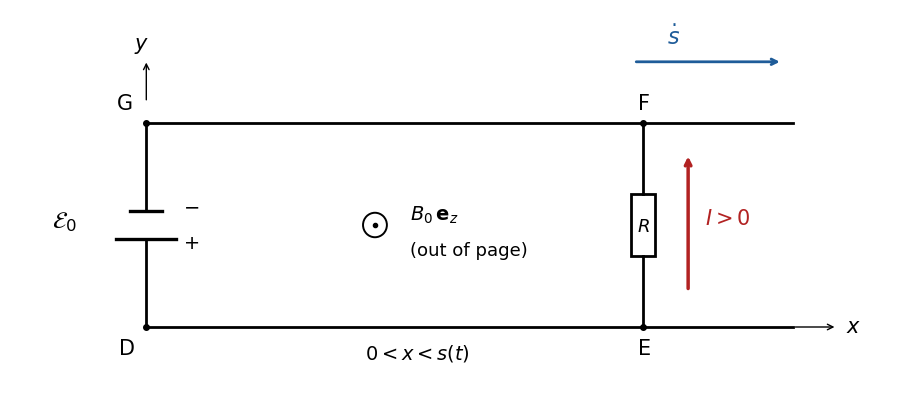

# Paper 3

↑ **Parent:** [Ib](../ib.md)

[https://www.maths.cam.ac.uk/undergrad/pastpapers/files/2016/paperib_3.pdf](https://www.maths.cam.ac.uk/undergrad/pastpapers/files/2016/paperib_3.pdf)

**Table of contents**

- [1E](#1e)
  - [Solution](#1e/solution)
- [2G](#2g)
  - [a](#2g/a)
    - [Solution](#2g/a/solution)
  - [b](#2g/b)
    - [i](#2g/b/i)
      - [Solution](#2g/b/i/solution)
    - [ii](#2g/b/ii)
      - [Solution](#2g/b/ii/solution)
    - [iii](#2g/b/iii)
      - [Solution](#2g/b/iii/solution)
    - [iv](#2g/b/iv)
      - [Solution](#2g/b/iv/solution)
- [3E](#3e)
  - [Solution](#3e/solution)
- [4A](#4a)
  - [Solution](#4a/solution)
- [5F](#5f)
  - [a](#5f/a)
    - [Solution](#5f/a/solution)
  - [b](#5f/b)
    - [Solution](#5f/b/solution)
- [6C](#6c)
  - [Solution](#6c/solution)
- [7A](#7a)
  - [Solution](#7a/solution)
- [8B](#8b)
  - [a](#8b/a)
    - [Solution](#8b/a/solution)
  - [b](#8b/b)
    - [Solution](#8b/b/solution)
- [9H](#9h)
  - [Solution](#9h/solution)
- [10F](#10f)
  - [i](#10f/i)
    - [Solution](#10f/i/solution)
  - [ii](#10f/ii)
    - [Solution](#10f/ii/solution)
  - [iii](#10f/iii)
    - [Solution](#10f/iii/solution)
- [11E](#11e)
  - [a](#11e/a)
    - [Solution](#11e/a/solution)
  - [b](#11e/b)
    - [Solution](#11e/b/solution)
  - [c](#11e/c)
    - [Solution](#11e/c/solution)
- [12G](#12g)
  - [a](#12g/a)
    - [Solution](#12g/a/solution)
  - [b](#12g/b)
    - [Solution](#12g/b/solution)
  - [c](#12g/c)
    - [Solution](#12g/c/solution)
- [13G](#13g)
  - [a](#13g/a)
    - [Solution](#13g/a/solution)
  - [b](#13g/b)
    - [Solution](#13g/b/solution)
  - [c](#13g/c)
    - [Solution](#13g/c/solution)
- [14F](#14f)
  - [a](#14f/a)
    - [Solution](#14f/a/solution)
  - [b](#14f/b)
    - [Solution](#14f/b/solution)
  - [c](#14f/c)
    - [Solution](#14f/c/solution)
- [15B](#15b)
  - [a](#15b/a)
    - [Solution](#15b/a/solution)
  - [b](#15b/b)
    - [Solution](#15b/b/solution)
  - [c](#15b/c)
    - [Solution](#15b/c/solution)
- [16B](#16b)
  - [a](#16b/a)
    - [Solution](#16b/a/solution)
  - [b](#16b/b)
    - [Solution](#16b/b/solution)
- [17D](#17d)
  - [a](#17d/a)
    - [Solution](#17d/a/solution)
  - [b](#17d/b)
    - [i](#17d/b/i)
      - [Solution](#17d/b/i/solution)
    - [ii](#17d/b/ii)
      - [Solution](#17d/b/ii/solution)
    - [iii](#17d/b/iii)
      - [Solution](#17d/b/iii/solution)
    - [iv](#17d/b/iv)
      - [Solution](#17d/b/iv/solution)
    - [v](#17d/b/v)
      - [Solution](#17d/b/v/solution)
- [18C](#18c)
  - [a](#18c/a)
    - [Solution](#18c/a/solution)
  - [b](#18c/b)
    - [Solution](#18c/b/solution)
  - [c](#18c/c)
    - [Solution](#18c/c/solution)
- [19D](#19d)
  - [a](#19d/a)
    - [Solution](#19d/a/solution)
  - [b](#19d/b)
    - [Solution](#19d/b/solution)
  - [c](#19d/c)
    - [Solution](#19d/c/solution)
- [20H](#20h)
  - [a](#20h/a)
    - [Solution](#20h/a/solution)
  - [b](#20h/b)
    - [Solution](#20h/b/solution)
  - [c](#20h/c)
    - [Solution](#20h/c/solution)
- [21H](#21h)
  - [a](#21h/a)
    - [Solution](#21h/a/solution)
  - [b](#21h/b)
    - [Solution](#21h/b/solution)

## 1E

↑ **Parent:** [Paper 3](paper-3.md)

<h3 id="1e/solution">Solution</h3>

↑ **Parent:** [1E](#1e)

A [permutation representation](../../../representation-theory.md#permutation-representation) is a [group homomorphism](../../../group-theory.md#group-homomorphism) $\rho:G\to\operatorname{Sym}(\Omega)$, equivalently a [group action](../../../group-theory.md#group-action) on a set $\Omega$. The [left regular action](../../../group-theory.md#left-regular-action) takes $\Omega=G$ and $\rho(g)(h)=gh$. Each such map is a [bijection](../../../function.md#bijection), and $\rho(g_1g_2)=\rho(g_1)\rho(g_2)$. If $\rho(g)$ is the identity, evaluating at the identity element gives $g=1$. Thus the representation is faithful. Numbering the elements of $G$ identifies $\operatorname{Sym}(G)$ with the [symmetric group](../../../finite-group-theory.md#symmetric-group) $S_n$, proving [Cayley theorem](../../../group-theory.md#cayley-s-theorem):

$$
\boxed{G\cong\rho(G)\leq S_n.}
$$

For a nonabelian [simple group](../../../finite-group-theory.md#simple-group), compose this faithful representation with the [sign of a permutation](../../../finite-group-theory.md#sign-of-a-permutation) homomorphism $S_n\to\{1,-1\}$. Its [kernel](../../../group-theory.md#kernel-of-a-group-homomorphism) is a [normal subgroup](../../../group-theory.md#normal-subgroup) of $G$, hence either trivial or all of $G$. A trivial kernel would embed $G$ in a group of order two, contradicting noncommutativity. Therefore every represented element is even, and **the same representation embeds $G$ in the [alternating group](../../../finite-group-theory.md#alternating-group) $A_n$**.

Finally let $S_3$ act on the two [cosets](../../../group-theory.md#coset) of its [normal subgroup](../../../group-theory.md#normal-subgroup) $A_3$. An even permutation fixes both cosets, whereas an odd permutation exchanges them. This gives $S_3\to S_2$ with **kernel $A_3$**; explicitly, send even permutations to the identity and odd permutations to $(12)$.

## 2G

↑ **Parent:** [Paper 3](paper-3.md)

<h3 id="2g/a">a</h3>

↑ **Parent:** [2G](#2g)

<h4 id="2g/a/solution">Solution</h4>

↑ **Parent:** [A](#2g/a)

The sequence has [uniform convergence](../../../real-analysis.md#uniform-convergence) on $X$ if there is a function $f:X\to\mathbb R$ such that

$$
\boxed{\forall\varepsilon>0\ \exists N\ \forall n\geq N\ \forall x\in X:\quad |f_n(x)-f(x)|<\varepsilon.}
$$

The same $N$ must work for every $x$. Equivalently, the [supremum](../../../real-analysis.md#supremum) of the error over $X$ tends to zero. In [pointwise convergence](../../../real-analysis.md#pointwise-convergence), $N$ is allowed to depend on $x$.

<h3 id="2g/b">b</h3>

↑ **Parent:** [2G](#2g)

<h4 id="2g/b/i">i</h4>

↑ **Parent:** [B](#2g/b)

<h5 id="2g/b/i/solution">Solution</h5>

↑ **Parent:** [I](#2g/b/i)

For each fixed $0<x<1$, $x^n\to0$, so the [pointwise limit](../../../real-analysis.md#pointwise-limit) is $f(x)=1/(1-x)$. However

$$
|f_n(x)-f(x)|=\frac{x^n}{1-x}\longrightarrow\infty\quad\text{as }x\uparrow1
$$

for every fixed $n$. Hence the error has infinite [supremum](../../../real-analysis.md#supremum) on $(0,1)$ and **the convergence is not uniform**. This does not contradict [uniform convergence](../../../real-analysis.md#uniform-convergence) on any smaller closed interval $[0,r]$, $r<1$, where the error is at most $r^n/(1-r)$.

<h4 id="2g/b/ii">ii</h4>

↑ **Parent:** [B](#2g/b)

<h5 id="2g/b/ii/solution">Solution</h5>

↑ **Parent:** [Ii](#2g/b/ii)

For $0<x<1$, $|x^k/k^2|\leq1/k^2$, and the numerical [series](../../../real-analysis.md#series-mathematics) $\sum_{k\geq1}k^{-2}$ converges. The [Weierstrass M-test](../../../probability-and-statistics.md#weierstrass-m-test) therefore gives **uniform convergence** to $f(x)=\sum_{k\geq1}x^k/k^2$. More explicitly,

$$
\sup_{0<x<1}|f(x)-f_n(x)|\leq\sum_{k=n+1}^{\infty}\frac1{k^2}\leq\int_n^\infty\frac{dt}{t^2}=\frac1n\longrightarrow0.
$$

The bound is independent of $x$, including points arbitrarily close to one.

<h4 id="2g/b/iii">iii</h4>

↑ **Parent:** [B](#2g/b)

<h5 id="2g/b/iii/solution">Solution</h5>

↑ **Parent:** [Iii](#2g/b/iii)

For each fixed real $x$, $x/n\to0$, so the [pointwise limit](../../../real-analysis.md#pointwise-limit) is zero. But $\sup_{x\in\mathbb R}|x/n|=\infty$ for every $n$. Alternatively, $x=n$ gives error one whatever $n$ is. Thus **the convergence is not uniform on $\mathbb R$**. It is uniform on each bounded interval, where $|x/n|\leq M/n$.

<h4 id="2g/b/iv">iv</h4>

↑ **Parent:** [B](#2g/b)

<h5 id="2g/b/iv/solution">Solution</h5>

↑ **Parent:** [Iv](#2g/b/iv)

The [pointwise limit](../../../real-analysis.md#pointwise-limit) is zero, including at $x=0$. Differentiation gives

$$
\frac{d}{dx}(xe^{-nx})=e^{-nx}(1-nx),
$$

so the maximum on $[0,\infty)$ is attained at $x=1/n$ and equals $1/(en)$. Therefore

$$
\boxed{\sup_{x\geq0}xe^{-nx}=\frac1{en}\to0,}
$$

and **the convergence is uniform**, even though the domain is unbounded.

## 3E

↑ **Parent:** [Paper 3](paper-3.md)

<h3 id="3e/solution">Solution</h3>

↑ **Parent:** [3E](#3e)

The convention in this question counts a point whenever every open [neighbourhood](../../../topology.md#neighbourhood-mathematics) meets $A$, without excluding the point itself. These are [adherent points](../../../topology.md#adherent-point), whose set is the [closure](../../../topology.md#closure-topology) $\overline A$; they differ from [limit points](../../../topology.md#limit-point) under the convention that requires a different point of $A$ in each neighbourhood.

If $A$ is a [closed set](../../../topology.md#closed-set) and $x\notin A$, the [open set](../../../topology.md#open-set) $X\setminus A$ is a neighbourhood of $x$ disjoint from $A$. Thus every adherent point lies in $A$. Conversely, if every adherent point lies in $A$, each $x\notin A$ has an open neighbourhood disjoint from $A$. Their union is $X\setminus A$, which is open. Hence **$A$ is closed exactly when it contains all the points specified in the question**.

The [interior of a set](../../../topology.md#interior-topology) and [closure](../../../topology.md#closure-topology) are

$$
\boxed{\operatorname{Int}(A)=\bigcup\{U:U\text{ open},\ U\subseteq A\},\qquad
\overline A=\bigcap\{F:F\text{ closed},\ A\subseteq F\}.}
$$

The neighbourhood description of the [closure](../../../topology.md#closure-topology) follows because failure to be adherent is equivalent to lying in an open set disjoint from $A$.

For [closure of a connected set](../../../geometry-and-topology.md#closure-of-a-connected-set), suppose $\overline A=U\sqcup V$ were a separation into two nonempty relatively open sets. Their intersections with the [connected subset](../../../geometry-and-topology.md#connected-subset) $A$ would separate $A$ unless one intersection were empty. Say $A\subseteq U$. Choose $v\in V$ and an open set $O\subseteq X$ with $v\in O$ and $O\cap\overline A\subseteq V$. Since $v\in\overline A$, the set $O$ meets $A$, contradicting $A\subseteq U$. Thus **the closure of a connected set is connected**. The empty-set case holds directly.

## 4A

↑ **Parent:** [Paper 3](paper-3.md)

<h3 id="4a/solution">Solution</h3>

↑ **Parent:** [4A](#4a)

Use [Fourier inversion](../../../fourier-analysis.md#fourier-inversion-theorem) with the stated [Fourier transform](../../../analysis.md#fourier-transform) convention:

$$
f(x)=\frac1{2\pi}\int_{-\infty}^{\infty}\frac{-2ik}{p^2+k^2}e^{ikx}\,dk.
$$

For $x<0$, close the [contour integral](../../../complex-analysis.md#contour-integral) in the lower half-plane, where $|e^{ikx}|=e^{-x\operatorname{Im}k}$ decays. [Jordan lemma](../../../complex-analysis.md#jordan-s-lemma) eliminates the large semicircle. The contour is clockwise, so the [residue theorem](../../../analysis.md#residue-theorem) supplies $-2\pi i$ times the residue at $k=-ip$. That [simple pole](../../../isolated-singularity.md#simple-pole) has

$$
\operatorname{Res}_{k=-ip}\left(\frac{-2ik}{(k-ip)(k+ip)}e^{ikx}\right)
=-ie^{px}.
$$

Consequently

$$
\boxed{f(x)=-e^{px},\qquad x<0.}
$$

The minus sign uses both the clockwise orientation and the residue $-i e^{px}$; it is consistent with the full odd function $\operatorname{sgn}(x)e^{-p|x|}$ away from zero.

## 5F

↑ **Parent:** [Paper 3](paper-3.md)

<h3 id="5f/a">a</h3>

↑ **Parent:** [5F](#5f)

<h4 id="5f/a/solution">Solution</h4>

↑ **Parent:** [A](#5f/a)

For a finite [triangulation of a surface](../../../topology.md#triangulation-of-a-surface) of the [sphere](../../../geometry-and-topology.md#sphere), [Euler formula for a sphere](../../../homology.md#euler-formula-for-a-sphere) is

$$
\boxed{V-E+F=2,}
$$

where $V$, $E$ and $F$ count vertices, edges and triangular faces. Since each face has three edges and each edge borders two faces, also $3F=2E$.

<h3 id="5f/b">b</h3>

↑ **Parent:** [5F](#5f)

<h4 id="5f/b/solution">Solution</h4>

↑ **Parent:** [B](#5f/b)

Let $p$ and $h$ count the pentagonal and hexagonal faces. Counting incidences of edges with vertices and faces gives

$$
3V=2E,\qquad 5p+6h=2E,\qquad F=p+h.
$$

The [Euler formula for a sphere](../../../homology.md#euler-formula-for-a-sphere) also applies to this polygonal decomposition: triangulating a polygon by adding one diagonal increases both $E$ and $F$ by one, preserving $V-E+F$. Substitution gives

$$
2=\frac{2E}{3}-E+p+h=p+h-\frac{5p+6h}{6}=\frac p6.
$$

Thus **there are exactly 12 pentagons**, independently of the number of hexagons.

## 6C

↑ **Parent:** [Paper 3](paper-3.md)

<h3 id="6c/solution">Solution</h3>

↑ **Parent:** [6C](#6c)

Lift the angular coordinate continuously to a real coordinate and write $\Delta z=z_B-z_A$ and $\Delta\phi_m=\phi_B-\phi_A+2\pi m$ for a prescribed winding number $m\in\mathbb Z$. Assume $z_A<z_B$ for the calculation; reversing the endpoints changes no length. The [arc length](../../../riemannian-geometry.md#arc-length) functional on the [circular cylinder](../../../differential-geometry.md#circular-cylinder) is

$$
\mathcal L[\phi]=\int_{z_A}^{z_B}\sqrt{1+R^2\phi'(z)^2}\,dz.
$$

The [Euler-Lagrange equation](../../../analysis.md#euler-lagrange-equation) says $R^2\phi'/\sqrt{1+R^2\phi'^2}$ is constant. This expression is strictly increasing in $\phi'$, so $\phi'$ is constant. The candidate is the [helix](../../../topology.md#helix)

$$
\boxed{\phi(z)=\phi_A+\frac{\Delta\phi_m}{\Delta z}(z-z_A),\qquad
\mathcal L_m=\sqrt{\Delta z^2+R^2\Delta\phi_m^2}.}
$$

It is a global minimum within the chosen winding class: the integrand is strictly [convex](../../../real-analysis.md#convex-function), and [Jensen inequality](../../../real-analysis.md#jensen-s-inequality) bounds the functional below by $(z_B-z_A)\sqrt{1+R^2(\Delta\phi_m/\Delta z)^2}$, with equality only for constant slope. Equivalently, unrolling the cylinder makes the minimizing path a straight segment.

The signed [pitch of a helix](../../../topology.md#pitch-of-a-helix), measured for an increase of $2\pi$ in angle, is

$$
\boxed{P_m=\frac{2\pi\Delta z}{\Delta\phi_m}.}
$$

Its geometric magnitude is $|P_m|$. If only the physical endpoints are fixed, choose the integer $m$ minimizing $|\Delta\phi_m|$; opposite points may give two equally short helices. If the lifted endpoint angles are prescribed, use that winding class. A zero angular increment gives a straight generator, the limiting infinite-pitch case.

## 7A

↑ **Parent:** [Paper 3](paper-3.md)

<h3 id="7a/solution">Solution</h3>

↑ **Parent:** [7A](#7a)

Away from $x=\xi$, a [Green function](../../../analysis.md#green-s-function) for this second-derivative operator is linear in $x$. The left [boundary condition](../../../differential-equation.md#boundary-condition) makes it $ax$ on $x<\xi$, and the right [Neumann boundary condition](../../../differential-equation.md#neumann-boundary-condition) makes it constant $b$ on $x>\xi$. Continuity gives $b=a\xi$. Integrating the distributional equation through the [Dirac delta function](../../../distribution-theory.md#dirac-delta-function) gives the jump $G_x(\xi^+;\xi)-G_x(\xi^-;\xi)=1$, so $a=-1$. Therefore

$$
\boxed{G(x;\xi)=-\min(x,\xi)=
\begin{cases}-x,&x\leq\xi,\\-\xi,&x\geq\xi.\end{cases}}
$$

Apply the [Green function](../../../analysis.md#green-s-function) to the forcing:

$$
y(x)=\int_0^1G(x;\xi)\xi e^{-\xi}\,d\xi
=-\int_0^x\xi^2e^{-\xi}\,d\xi-x\int_x^1\xi e^{-\xi}\,d\xi.
$$

Evaluation yields

$$
\boxed{y(x)=(x+2)e^{-x}+\frac{2x}{e}-2.}
$$

Indeed $y'(x)=-(x+1)e^{-x}+2/e$, so $y''=xe^{-x}$, $y(0)=0$ and $y'(1)=0$. A difference of two solutions is linear with these homogeneous boundary conditions, hence zero; the [boundary value problem](../../../differential-equation.md#boundary-value-problem) has a unique solution.

## 8B

↑ **Parent:** [Paper 3](paper-3.md)

<h3 id="8b/a">a</h3>

↑ **Parent:** [8B](#8b)

<h4 id="8b/a/solution">Solution</h4>

↑ **Parent:** [A](#8b/a)

For a particle of mass $m$, the [probability density](../../../quantum-mechanics.md#probability-density) and one-dimensional [probability current](../../../quantum-mechanics.md#probability-current) are

$$
\boxed{\rho=\psi^*\psi,\qquad
j=\frac{\hbar}{2mi}(\psi^*\psi_x-\psi\psi_x^*)
=\frac{\hbar}{m}\operatorname{Im}(\psi^*\psi_x).}
$$

The [Schrödinger equation](../../../physics.md#schrodinger-equation) and its [complex conjugate](../../../complex-analysis.md#complex-conjugate), for real $V$, give

$$
\rho_t=\psi_t\psi^*+\psi\psi_t^*
=\frac{i\hbar}{2m}(\psi^*\psi_{xx}-\psi\psi_{xx}^*)=-j_x.
$$

The potential terms cancel precisely because $V$ is real. Thus **$\rho_t+j_x=0$**, the [continuity equation](../../../physics.md#continuity-equation) for probability. Integrating over an interval says that its probability changes by the incoming current minus the outgoing current.

<h3 id="8b/b">b</h3>

↑ **Parent:** [8B](#8b)

<h4 id="8b/b/solution">Solution</h4>

↑ **Parent:** [B](#8b/b)

The global time-dependent phase cancels from the [probability current](../../../quantum-mechanics.md#probability-current). Put $\chi=e^{ikx}+Re^{-ikx}$. Direct multiplication gives

$$
\chi^*\chi_x=ik(1-|R|^2)+ik(R^*e^{2ikx}-Re^{-2ikx}).
$$

The second term is real, because the expression in parentheses is purely imaginary. Hence

$$
\boxed{j=\frac{\hbar k}{m}(1-|R|^2).}
$$

The first [plane wave](../../../quantum-mechanics.md#plane-wave) travels to the right with incident current $\hbar k/m$; the second travels to the left with reflected current $-(\hbar k/m)|R|^2$. Their [wave interference](../../../optics.md#interference-wave-propagation) changes the probability density but cancels from the net current. The current vanishes for $|R|=1$, is positive for $|R|<1$, and is negative for $|R|>1$. These plane waves are scattering states, not individually normalizable bound states.

## 9H

↑ **Parent:** [Paper 3](paper-3.md)

<h3 id="9h/solution">Solution</h3>

↑ **Parent:** [9H](#9h)

Let $T_0=0$ and let $T_{r+1}$ be the first visit to $i$ strictly after $T_r$, with $T_{r+1}=\infty$ if there is none. Put $q=\mathbb P_i(T_1<\infty)$. The [Strong Markov property](../../../markov-process.md#strong-markov-property) at each finite [first return time](../../../markov-process.md#first-return-time) gives, by induction,

$$
\mathbb P_i(T_r<\infty)=q^r.
$$

The number of visits, including time zero, is $N=\sum_{r\geq0}\mathbf1_{\{T_r<\infty\}}=\sum_{n\geq0}\mathbf1_{\{X_n=i\}}$. By [Tonelli theorem](../../../measure-theory.md#tonelli-theorem) for nonnegative terms,

$$
\sum_{n=0}^{\infty}\mathbb P_i(X_n=i)=\mathbb E_iN
=\sum_{r=0}^{\infty}q^r.
$$

If $q<1$, this [geometric series](../../../real-analysis.md#geometric-series) is $1/(1-q)$, and $1-q$ is the probability of never returning. If $q=1$, every term of the final series is one and both sides are infinite. Thus

$$
\boxed{\sum_{n=0}^{\infty}\mathbb P_i(X_n=i)=
\frac1{\mathbb P_i(X_n\ne i\text{ for all }n\geq1)},}
$$

with the prescribed infinite-value convention. This covers both [transient states](../../../markov-process.md#transient-state) and [recurrent states](../../../markov-process.md#recurrent-state).

## 10F

↑ **Parent:** [Paper 3](paper-3.md)

<h3 id="10f/i">i</h3>

↑ **Parent:** [10F](#10f)

<h4 id="10f/i/solution">Solution</h4>

↑ **Parent:** [I](#10f/i)

The real and imaginary parts of the operator are uniquely

$$
\alpha_1=\frac{\alpha+\alpha^*}{2},\qquad
\alpha_2=\frac{\alpha-\alpha^*}{2i}.
$$

They are [self-adjoint operators](../../../linear-operator-theory.md#self-adjoint-operator), and $\alpha=\alpha_1+i\alpha_2$. Conversely such a decomposition has $\alpha^*=\alpha_1-i\alpha_2$. Expanding both products gives

$$
\alpha\alpha^*-\alpha^*\alpha=-2i(\alpha_1\alpha_2-\alpha_2\alpha_1).
$$

Consequently **$\alpha$ is a normal operator exactly when its self-adjoint real and imaginary parts commute**.

<h3 id="10f/ii">ii</h3>

↑ **Parent:** [10F](#10f)

<h4 id="10f/ii/solution">Solution</h4>

↑ **Parent:** [Ii](#10f/ii)

We prove the finite-dimensional [spectral theorem for normal operators](../../../hilbert-space.md#spectral-theorem-for-normal-operators) by induction on dimension. A complex [linear operator](../../../vector-space.md#linear-operator) has an [eigenvector](../../../linear-operator-theory.md#eigenvector) $v$ with eigenvalue $\lambda$, by the [fundamental theorem of algebra](../../../algebra.md#fundamental-theorem-of-algebra). For a [normal operator](../../../hilbert-space.md#normal-operator) $T$, the operator $T-\lambda I$ is also normal, and

$$
\|(T-\lambda I)w\|^2=\|(T^*-\overline\lambda I)w\|^2
$$

for every $w$. Applying this to $v$ shows $T^*v=\overline\lambda v$.

Normalize $v$. Its [orthogonal complement](../../../hilbert-space.md#orthogonal-complement) $W=v^\perp$ is invariant under both $T$ and $T^*$: the [adjoint operator](../../../hilbert-space.md#adjoint-operator) identities pair $Tw$ with $v$ through $T^*v$, and $T^*w$ with $v$ through $Tv$. The restricted operator on $W$ remains normal, and its adjoint is the restriction of $T^*$. Induction supplies an [orthonormal eigenbasis](../../../linear-operator-theory.md#orthonormal-eigenbasis) of $W$, which together with $v$ gives one for $V$.

Conversely, in an [orthonormal basis](../../../linear-algebra.md#orthonormal-basis) of eigenvectors, $T$ is diagonal and $T^*$ is the diagonal matrix of the conjugate eigenvalues. The two diagonal operators commute. Thus **normality is equivalent to an orthonormal eigenbasis**. The zero-dimensional case is immediate.

<h3 id="10f/iii">iii</h3>

↑ **Parent:** [10F](#10f)

<h4 id="10f/iii/solution">Solution</h4>

↑ **Parent:** [Iii](#10f/iii)

If $\alpha^*=g(\alpha)$, then $\alpha$ commutes with its adjoint because it commutes with every [polynomial](../../../polynomial.md) in itself. Hence $\alpha$ is a [normal operator](../../../hilbert-space.md#normal-operator).

Conversely let $\lambda_1,\ldots,\lambda_r$ be the distinct [eigenvalues](../../../linear-operator-theory.md#eigenvalue) of a normal $\alpha$. The [orthonormal eigenbasis](../../../linear-operator-theory.md#orthonormal-eigenbasis) from part (ii) reduces the desired identity to $g(\lambda_j)=\overline\lambda_j$. [Lagrange interpolation polynomial](../../../numerical-analysis.md#lagrange-polynomial) provides the polynomial

$$
\boxed{g(z)=\sum_{j=1}^{r}\overline\lambda_j
\prod_{\ell\ne j}\frac{z-\lambda_\ell}{\lambda_j-\lambda_\ell},
\qquad \alpha^*=g(\alpha).}
$$

Repeated eigenvalues cause no difficulty because interpolation uses only distinct values. If $V=\{0\}$, use $g=0$. This proves both directions of the third equivalence.

## 11E

↑ **Parent:** [Paper 3](paper-3.md)

<h3 id="11e/a">a</h3>

↑ **Parent:** [11E](#11e)

<h4 id="11e/a/solution">Solution</h4>

↑ **Parent:** [A](#11e/a)

An [algebraic integer](../../../algebraic-number-theory.md#algebraic-integer) is a complex number satisfying a monic polynomial with integer coefficients. Let $f\in\mathbb Q[x]$ be the monic [minimal polynomial](../../../linear-operator-theory.md#minimal-polynomial) of $\alpha$. It is irreducible over $\mathbb Q$. If $H\in\mathbb Z[x]$ is a monic polynomial vanishing at $\alpha$, then $f$ divides $H$ over $\mathbb Q$. [Gauss lemma for polynomials](../../../commutative-algebra.md#gauss-lemma-for-polynomials) implies that monic rational factors of a monic integer polynomial have integer coefficients. Thus $f\in\mathbb Z[x]$, and its irreducibility over $\mathbb Q$ implies irreducibility in $\mathbb Z[x]$.

For $h\in\mathbb Z[x]$ with $h(\alpha)=0$, division by the monic $f$ works in $\mathbb Z[x]$, giving $h=qf+r$ with $\deg r<\deg f$. Since $r(\alpha)=0$, minimality forces $r=0$. Conversely each multiple of $f$ vanishes at $\alpha$. Therefore

$$
\boxed{I=(f),\qquad\mathbb Z[\alpha]\cong\mathbb Z[x]/(f).}
$$

Writing $n=\deg f$, division by $f$ expresses every element uniquely as $a_0+a_1\alpha+\cdots+a_{n-1}\alpha^{n-1}$ with integer coefficients. A relation among these powers would be a nonzero vanishing polynomial of degree less than $n$. Hence **$1,\alpha,\ldots,\alpha^{n-1}$ form a [basis](../../../vector-space.md#basis) of the [free module](../../../module-theory.md#free-module) over $\mathbb Z$ $\mathbb Z[\alpha]$**.

<h3 id="11e/b">b</h3>

↑ **Parent:** [11E](#11e)

<h4 id="11e/b/solution">Solution</h4>

↑ **Parent:** [B](#11e/b)

The polynomial $f(x)=x^5+2x+2$ satisfies the [Eisenstein criterion](../../../commutative-algebra.md#eisenstein-criterion) at the prime two: every nonleading coefficient is divisible by two, and the constant coefficient is not divisible by four. Thus it is irreducible over $\mathbb Q$ and is the [minimal polynomial](../../../linear-operator-theory.md#minimal-polynomial) of every one of its roots. Part (a) gives

$$
\mathbb Z[\alpha]/(5)\cong\mathbb F_5[x]/(\overline f).
$$

But

$$
f(x)=(x-1)(x^4+x^3+x^2+x+3)+5.
$$

In the quotient, the two nonzero classes of $x-1$ and $x^4+x^3+x^2+x+3$ multiply to zero. They are nonzero because their nonzero representative degrees are less than five. The quotient is not an [integral domain](../../../commutative-algebra.md#integral-domain), so **$(5)$ is not a [prime ideal](../../../commutative-algebra.md#prime-ideal)**.

For [ring homomorphisms](../../../commutative-algebra.md#ring-homomorphism) preserving the identity, an image $\beta$ of $\alpha$ in the [Gaussian integers](../../../commutative-algebra.md#gaussian-integer) would satisfy $f(\beta)=0$. The [minimal polynomial](../../../linear-operator-theory.md#minimal-polynomial) of $\beta$ over $\mathbb Q$ would then be $f$, of degree five. This is impossible because $\beta\in\mathbb Q(i)$ has degree at most two. Thus **there is no unital homomorphism $\mathbb Z[\alpha]\to\mathbb Z[i]$**. If homomorphisms are instead allowed not to preserve the identity, the zero map exists; every nonzero homomorphism into this integral domain is unital, because the image of one is a nonzero idempotent and hence one.

<h3 id="11e/c">c</h3>

↑ **Parent:** [11E](#11e)

<h4 id="11e/c/solution">Solution</h4>

↑ **Parent:** [C](#11e/c)

The multiplicative [field norm](../../../algebraic-number-theory.md#field-norm) on this ring is

$$
N(a+b\sqrt{-5})=(a+b\sqrt{-5})(a-b\sqrt{-5})=a^2+5b^2.
$$

If an element is a [unit](../../../algebra.md#unit-in-a-ring), its positive integer norm has a multiplicative inverse in the positive integers, hence is one. The only integer solutions of $a^2+5b^2=1$ are $(a,b)=(1,0),(-1,0)$. Therefore **the units are exactly $1$ and $-1$**.

The standard failure of [unique factorization](../../../algebra.md#unique-factorization-domain) is

$$
6=2\cdot3=(1+\sqrt{-5})(1-\sqrt{-5}).
$$

There is no element of norm two or three: $b\ne0$ gives norm at least five, while $b=0$ gives a square. An alleged nontrivial factorization of $2$ (norm four), $3$ (norm nine), or $1\pm\sqrt{-5}$ (norm six) would require a factor of norm two or three. Thus all four displayed factors are [irreducible elements](../../../commutative-algebra.md#irreducible-element). No factor in the first factorization is associated to a factor in the second, since associates have the same norm and the norms are respectively four, nine and six. Hence **$\mathbb Z[\sqrt{-5}]$ is not a [unique factorization domain](../../../algebra.md#unique-factorization-domain)**.

## 12G

↑ **Parent:** [Paper 3](paper-3.md)

<h3 id="12g/a">a</h3>

↑ **Parent:** [12G](#12g)

<h4 id="12g/a/solution">Solution</h4>

↑ **Parent:** [A](#12g/a)

For a [metric space](../../../topological-analysis.md#metric-space) $(X,d)$, [uniform continuity](../../../topological-analysis.md#uniform-continuity) means

$$
\forall\varepsilon>0\ \exists\delta>0\ \forall x,y\in X:
\quad d(x,y)<\delta\ \Longrightarrow\ |f(x)-f(y)|<\varepsilon.
$$

The choice of $\delta$ is independent of the points. A [Lipschitz continuous](../../../real-analysis.md#lipschitz-continuity) function satisfies $|f(x)-f(y)|\leq Ld(x,y)$ for one finite constant $L\geq0$. Choosing $\delta=\varepsilon/(L+1)$ proves **Lipschitz continuity implies uniform continuity**.

Let $(x_n)$ be a [Cauchy sequence](../../../real-analysis.md#cauchy-sequence). For a given $\varepsilon>0$, uniform continuity supplies $\delta>0$, and the Cauchy property supplies $N$ with $d(x_m,x_n)<\delta$ for $m,n\geq N$. Then $|f(x_m)-f(x_n)|<\varepsilon$, so $(f(x_n))$ is Cauchy in $\mathbb R$. By [completeness of the real numbers](../../../real-analysis.md#completeness-of-the-real-numbers), **$(f(x_n))$ converges**, even if the original sequence has no limit in $X$.

<h3 id="12g/b">b</h3>

↑ **Parent:** [12G](#12g)

<h4 id="12g/b/solution">Solution</h4>

↑ **Parent:** [B](#12g/b)

Suppose the continuous $f$ were not [uniformly continuous](../../../topological-analysis.md#uniform-continuity). There would be an $\varepsilon_0>0$ and pairs $x_n,y_n\in X$ with $d(x_n,y_n)<1/n$ but $|f(x_n)-f(y_n)|\geq\varepsilon_0$. [Sequential compactness](../../../geometry-and-topology.md#sequentially-compact-space) gives a subsequence $x_{n_j}\to x\in X$. The [triangle inequality](../../../topological-analysis.md#triangle-inequality) gives $y_{n_j}\to x$ as well. [Continuity](../../../calculus.md#continuous-function) at $x$ then gives $f(x_{n_j})-f(y_{n_j})\to0$, a contradiction. Thus **$f$ is uniformly continuous**.

It need not be [Lipschitz continuous](../../../real-analysis.md#lipschitz-continuity). On the sequentially compact interval $[0,1]$, the continuous function $f(x)=\sqrt x$ has

$$
\frac{|f(x)-f(0)|}{|x-0|}=\frac1{\sqrt x}\to\infty\quad(x\downarrow0).
$$

No finite Lipschitz constant exists.

<h3 id="12g/c">c</h3>

↑ **Parent:** [12G](#12g)

<h4 id="12g/c/solution">Solution</h4>

↑ **Parent:** [C](#12g/c)

For each $x\in X$, [density](../../../topology.md#dense-set) of $Y$ allows a sequence $y_n\in Y$ with $d(y_n,x)<1/n$. If $f_1,f_2$ are two continuous extensions, [continuity](../../../calculus.md#continuous-function) gives

$$
f_1(x)=\lim_n g(y_n)=f_2(x).
$$

Thus **a continuous extension is unique if it exists**.

Now assume $g$ is [uniformly continuous](../../../topological-analysis.md#uniform-continuity). Each chosen $y_n\to x$ is a [Cauchy sequence](../../../real-analysis.md#cauchy-sequence), so part (a), applied to $Y$, shows that $g(y_n)$ converges in $\mathbb R$. Define

$$
\boxed{f(x)=\lim_{n\to\infty}g(y_n).}
$$

This is independent of the choice: for another $z_n\to x$ in $Y$, $d(y_n,z_n)\to0$, and uniform continuity gives $g(y_n)-g(z_n)\to0$. At $x\in Y$, comparison with the constant sequence $x$ proves $f(x)=g(x)$.

To prove uniform continuity of the extension, choose $\delta>0$ so that $|g(y)-g(z)|<\varepsilon/2$ whenever $y,z\in Y$ and $d(y,z)<\delta$. If $d(x,x')<\delta/3$, choose sequences $y_n\to x$ and $z_n\to x'$ in $Y$. For large $n$, both approximation distances are less than $\delta/3$, so $d(y_n,z_n)<\delta$. Passing to the limit gives $|f(x)-f(x')|\leq\varepsilon/2<\varepsilon$. The same $\delta/3$ works for all $x,x'$. Therefore **the extension exists and is uniformly continuous**. No completeness of $X$ is needed; completeness of the target $\mathbb R$ is the relevant requirement.

## 13G

↑ **Parent:** [Paper 3](paper-3.md)

<h3 id="13g/a">a</h3>

↑ **Parent:** [13G](#13g)

<h4 id="13g/a/solution">Solution</h4>

↑ **Parent:** [A](#13g/a)

Let $T$ be a closed triangle contained, together with a neighbourhood, in the domain of a [holomorphic function](../../../complex-analysis.md#holomorphic-function) $f$. We prove [Cauchy theorem for a triangle](../../../complex-analysis.md#cauchy-theorem-for-a-triangle) without assuming continuity of $f'$.

Join the edge midpoints to subdivide $T$ into four triangles, each with half its diameter and perimeter. Their positively oriented [contour integrals](../../../complex-analysis.md#contour-integral) sum to the integral around $T$, because the internal edges cancel. At least one subtriangle has integral of modulus at least one quarter of the original. Repeat that choice to obtain nested closed triangles $T_n$ satisfying

$$
\left|\int_{\partial T}f(z)\,dz\right|\leq4^n\left|\int_{\partial T_n}f(z)\,dz\right|,
\quad d_n=2^{-n}d_0,\quad P_n=2^{-n}P_0.
$$

Their intersection is a single point $z_*$, by compactness and shrinking diameter. [complex differentiability at a point](../../../complex-analysis.md#complex-differentiability-at-a-point) at $z_*$ gives

$$
f(z)=f(z_*)+f'(z_*)(z-z_*)+(z-z_*)r(z),\qquad r(z)\to0.
$$

The first two terms have polynomial primitives, hence integrate to zero around each triangle. For sufficiently large $n$, $|r|<\varepsilon$ on $T_n$, so the [complex line integral estimate](../../../complex-analysis.md#complex-line-integral-estimate) gives

$$
\left|\int_{\partial T_n}f(z)\,dz\right|\leq\varepsilon d_nP_n.
$$

Combining the bounds gives $|\int_{\partial T}f(z)\,dz|\leq\varepsilon d_0P_0$. Since $\varepsilon$ is arbitrary,

$$
\boxed{\int_{\partial T}f(z)\,dz=0.}
$$

The orientation can be reversed with no change to the conclusion.

<h3 id="13g/b">b</h3>

↑ **Parent:** [13G](#13g)

<h4 id="13g/b/solution">Solution</h4>

↑ **Parent:** [B](#13g/b)

For a closed piecewise continuously differentiable curve avoiding $a$, its [winding number](../../../complex-analysis.md#winding-number) is

$$
\boxed{I(\gamma,a)=\frac1{2\pi i}\int_\gamma\frac{dz}{z-a}.}
$$

Equivalently, for a parametrization $\gamma:[u,v]\to\mathbb C$, it is $(2\pi i)^{-1}\int_u^v\gamma'(t)/(\gamma(t)-a)\,dt$, summed over the smooth pieces. A continuous choice of the argument of $\gamma(t)-a$ along the parameter interval changes by an integer multiple of $2\pi$ between the endpoints; that integer is the winding number.

<h3 id="13g/c">c</h3>

↑ **Parent:** [13G](#13g)

<h4 id="13g/c/solution">Solution</h4>

↑ **Parent:** [C](#13g/c)

For every closed piecewise smooth curve $\gamma$ in $U$, the [winding number](../../../complex-analysis.md#winding-number) of $f\circ\gamma$ about zero is the integer

$$
m_\gamma=\frac1{2\pi i}\int_\gamma\frac{f'(z)}{f(z)}\,dz.
$$

If $f=g_k^k$ for a holomorphic $k$th root, $g_k$ is nowhere zero, and

$$
m_\gamma=k\frac1{2\pi i}\int_\gamma\frac{g_k'}{g_k}\,dz.
$$

Thus $m_\gamma$ is divisible by every $k$ for which a root exists. An infinite subset of the positive integers is unbounded, so a fixed integer divisible by all those $k$ must be zero. Hence **all periods of the holomorphic function $f'/f$ vanish**.

Fix $z_0\in U$. Since a domain is connected and open, its points can be joined by piecewise smooth paths. Vanishing periods make

$$
H(z)=\int_{z_0}^{z}\frac{f'(w)}{f(w)}\,dw
$$

independent of path. It is a [holomorphic primitive](../../../complex-analysis.md#holomorphic-primitive) with $H'=f'/f$. Differentiating gives $(fe^{-H})'=0$, so $fe^{-H}=f(z_0)$. Choose a complex number $c$ with $e^c=f(z_0)$. Then

$$
\boxed{F=H+c\text{ is holomorphic on }U,\qquad f=e^F.}
$$

This constructs a global [holomorphic logarithm](../../../complex-analysis.md#holomorphic-logarithm) without requiring $U$ to be simply connected.

## 14F

↑ **Parent:** [Paper 3](paper-3.md)

<h3 id="14f/a">a</h3>

↑ **Parent:** [14F](#14f)

<h4 id="14f/a/solution">Solution</h4>

↑ **Parent:** [A](#14f/a)

[Cross-ratio](../../../group-theory.md#cross-ratio) conventions differ by permutations. Use the following ordering, which gives the signs requested in part (c):

$$
\boxed{r=[z_1,z_2,z_3,z_4]
=\frac{(z_1-z_4)(z_2-z_3)}{(z_1-z_2)(z_4-z_3)}.}
$$

Values involving infinity are defined by limits. This is the [cross-ratio with second point mapped to zero](../../../group-theory.md#cross-ratio-with-second-point-mapped-to-zero): the [Möbius transformation](../../../group-theory.md#mobius-transformation)

$$
T(z)=\frac{(z_1-z_4)(z-z_2)}{(z_1-z_2)(z-z_4)}
$$

sends $z_1,z_2,z_4$ to $1,0,\infty$ and sends $z_3$ to $r$.

For $M(z)=(az+b)/(cz+d)$, $ad-bc\ne0$, the identity

$$
M(u)-M(v)=\frac{(ad-bc)(u-v)}{(cu+d)(cv+d)}
$$

shows that all factors cancel in the cross-ratio. This proves [Möbius invariance of the cross-ratio](../../../group-theory.md#mobius-invariance-of-the-cross-ratio), with the cases involving infinity following by limits. Algebraic subtraction also gives

$$
\boxed{[z_2,z_1,z_3,z_4]=1-r
=\frac{(z_1-z_3)(z_2-z_4)}{(z_1-z_2)(z_3-z_4)}.}
$$

The latter expression is another common ordering for the cross-ratio; keeping the convention explicit prevents an incorrect reciprocal or sign.

<h3 id="14f/b">b</h3>

↑ **Parent:** [14F](#14f)

<h4 id="14f/b/solution">Solution</h4>

↑ **Parent:** [B](#14f/b)

With $T$ from part (a), the first, second and fourth points map to $1,0,\infty$. The inverse image of the extended real line under a [Möbius transformation](../../../group-theory.md#mobius-transformation) is a [generalized circle](../../../group-theory.md#generalized-circle-under-a-mobius-transformation), meaning a circle or a line together with infinity. Thus, if $r=T(z_3)$ is real, all four original points lie on that generalized circle.

Conversely, if the four points lie on one [generalized circle](../../../group-theory.md#generalized-circle-under-a-mobius-transformation), its image under $T$ is another generalized circle containing $0,1,\infty$. A generalized circle containing infinity is a line, and the line through zero and one is the real line. Therefore $T(z_3)=r$ is real. Hence **the cross-ratio is real exactly when the four points are concyclic or collinear**.

<h3 id="14f/c">c</h3>

↑ **Parent:** [14F](#14f)

<h4 id="14f/c/solution">Solution</h4>

↑ **Parent:** [C](#14f/c)

Write $z_j=c+Re^{i\theta_j}$ with $\theta_1<\theta_2<\theta_3<\theta_4<\theta_1+2\pi$. In the identity

$$
z_j-z_\ell=2iR e^{i(\theta_j+\theta_\ell)/2}
\sin\frac{\theta_j-\theta_\ell}{2},
$$

the phase factors cancel in the [cross-ratio](../../../group-theory.md#cross-ratio). In our convention the two numerator sine factors are negative, while the denominator factors have opposite signs. Thus **$r<0$**, and the exchanged cross-ratio $1-r$ is **greater than one**. Consequently $|r|+1=1-r=|1-r|$.

Taking absolute values of the two formulas in part (a) gives

$$
|r|=\frac{|z_1-z_4||z_2-z_3|}{|z_1-z_2||z_3-z_4|},\qquad
|1-r|=\frac{|z_1-z_3||z_2-z_4|}{|z_1-z_2||z_3-z_4|}.
$$

Multiplying $|r|+1=|1-r|$ by the common positive denominator proves [Ptolemy theorem](../../../group-theory.md#ptolemy-s-theorem):

$$
\boxed{|z_1-z_3||z_2-z_4|
=|z_1-z_2||z_3-z_4|+|z_1-z_4||z_2-z_3|.}
$$

The product of the diagonals equals the sum of the products of opposite sides.

## 15B

↑ **Parent:** [Paper 3](paper-3.md)

<h3 id="15b/a">a</h3>

↑ **Parent:** [15B](#15b)

<h4 id="15b/a/solution">Solution</h4>

↑ **Parent:** [A](#15b/a)

Use the [Fourier transform](../../../analysis.md#fourier-transform) $\widetilde f(k)=\int_{\mathbb R}f(x)e^{-ikx}\,dx$. For a rapidly decaying smooth function, [integration by parts](../../../calculus.md#integration-by-parts) gives $\widetilde{f'}=ik\widetilde f$, and differentiation under the integral gives $\widetilde{xf}=i\,d\widetilde f/dk$. Both are justified here by Gaussian decay. Since $f'=-2a^2xf$,

$$
ik\widetilde f=-2ia^2\widetilde f',\qquad
\widetilde f'(k)=-\frac{k}{2a^2}\widetilde f(k).
$$

The [Gaussian integral](../../../calculus.md#gaussian-integral) supplied in the hint gives $\widetilde f(0)=\sqrt\pi/a$. Solving this first-order equation yields

$$
\boxed{\widetilde f(k)=\frac{\sqrt\pi}{a}e^{-k^2/(4a^2)}.}
$$

The calculation states the transform normalization and the two differentiation properties explicitly.

<h3 id="15b/b">b</h3>

↑ **Parent:** [15B](#15b)

<h4 id="15b/b/solution">Solution</h4>

↑ **Parent:** [B](#15b/b)

Taking the spatial [Fourier transform](../../../analysis.md#fourier-transform) of the [diffusion equation](../../../diffusion-equation.md) gives $\widetilde\theta_t=-Dk^2\widetilde\theta$ and $\widetilde\theta(k,0)=\widetilde g(k)$. Hence $\widetilde\theta=e^{-Dk^2t}\widetilde g$. [Fourier inversion](../../../fourier-analysis.md#fourier-inversion-theorem) and the Gaussian transform from part (a), or direct evaluation of the inverse Gaussian integral, give the [heat kernel](../../../diffusion-equation.md#heat-kernel)

$$
K_t(x)=\frac1{\sqrt{4\pi Dt}}e^{-x^2/(4Dt)}.
$$

Substituting the integral for $\widetilde g$ and interchanging absolutely integrable terms produces the [convolution](../../../fourier-analysis.md#convolution) solution

$$
\boxed{\theta(x,t)=\frac1{\sqrt{4\pi Dt}}
\int_{\mathbb R}g(\xi)e^{-(x-\xi)^2/(4Dt)}\,d\xi,\qquad t>0.}
$$

For the stated nonnegative compactly supported data, understood to be nonzero on a set of positive measure, the kernel is strictly positive everywhere. Therefore $\theta(x,t)>0$ for every real $x$ and every $t>0$. **Property P holds: diffusion has [infinite propagation speed](../../../diffusion-equation.md#infinite-propagation-speed).** The distant value can be extremely small, but is not zero. For continuous initial data, any nontrivial nonnegative $g$ automatically has the required positive-measure set.

<h3 id="15b/c">c</h3>

↑ **Parent:** [15B](#15b)

<h4 id="15b/c/solution">Solution</h4>

↑ **Parent:** [C](#15b/c)

For the [wave equation](../../../wave-equation.md), introduce characteristic coordinates $\xi=x-ct$, $\eta=x+ct$ when $c\ne0$. The equation becomes $u_{\xi\eta}=0$, so $u=F(x-ct)+G(x+ct)$. The [initial conditions](../../../differential-equation.md#initial-condition) imply $F+G=\phi$ and $-cF'+cG'=0$. Constants can be absorbed into $F,G$, giving the [D'Alembert formula](../../../wave-equation.md#d-alembert-s-formula)

$$
\boxed{u(x,t)=\frac12\bigl[\phi(x-ct)+\phi(x+ct)\bigr].}
$$

If $\phi$ vanishes outside $[-\alpha,\alpha]$, then $u(x,t)=0$ whenever $|x|>\alpha+|c|t$. Thus **Property P fails: the wave equation has [finite propagation speed](../../../wave-equation.md#finite-propagation-speed) $|c|$**. No arbitrarily short time can transmit the disturbance arbitrarily far. If $c=0$, the zero initial velocity instead gives $u(x,t)=\phi(x)$, and the conclusion still holds.

## 16B

↑ **Parent:** [Paper 3](paper-3.md)

<h3 id="16b/a">a</h3>

↑ **Parent:** [16B](#16b)

<h4 id="16b/a/solution">Solution</h4>

↑ **Parent:** [A](#16b/a)

Use the physical [Coulomb bound state](../../../quantum-mechanics.md#coulomb-bound-state) boundary condition: the spherically symmetric wavefunction is regular at the origin and square integrable with measure $4\pi r^2dr$. For $E<0$, set

$$
\boxed{K=\frac{\sqrt{-2mE}}{\hbar}>0.}
$$

At large $r$, the decaying branch behaves exponentially as $e^{-Kr}$. Substituting $\psi=f e^{-Kr}$ into the radial [Schrödinger equation](../../../physics.md#schrodinger-equation) gives

$$
rf''+(2-2Kr)f'+2(\lambda-K)f=0.
$$

The regular solution has a [power series](../../../real-analysis.md#power-series) $f(r)=\sum_{j\geq0}a_jr^j$, with recurrence

$$
\boxed{a_{j+1}=\frac{2[K(j+1)-\lambda]}{(j+1)(j+2)}a_j.}
$$

A nonzero regular solution has $a_0\ne0$. If the series does not terminate, its coefficients eventually have one sign after choosing an overall real phase. For any fixed $0<\delta<1/2$ and sufficiently large $j$, the ratio of consecutive magnitudes is at least $2K(1-\delta)/(j+2)$. The tail therefore grows at least as a positive constant times $e^{2K(1-\delta)r}$ divided by a power of $r$; a finite polynomial of earlier terms cannot cancel it. Multiplication by $e^{-Kr}$ leaves exponential growth, contradicting normalizability.

Thus the series must terminate at degree $N-1$, where $KN=\lambda$ and $N$ is a positive integer. Conversely, termination gives a regular polynomial times $e^{-\lambda r/N}$, which is normalizable. Therefore

$$
\boxed{E_N=-\frac{\hbar^2\lambda^2}{2mN^2}
=-\frac{me^4}{32\pi^2\epsilon_0^2\hbar^2N^2},\qquad N=1,2,\ldots.}
$$

These are the $\ell=0$ members of the hydrogen spectrum. Regularity at the origin is essential: square integrability alone on the punctured radial interval would also admit a singular $1/r$ branch. Such a branch is not a physical eigenfunction of the ordinary three-dimensional Coulomb Hamiltonian; its singularity introduces an inadmissible point-source contribution. In the reduced radial variable $u=r\psi$, the physical condition is $u(0)=0$.

<h3 id="16b/b">b</h3>

↑ **Parent:** [16B](#16b)

<h4 id="16b/b/solution">Solution</h4>

↑ **Parent:** [B](#16b/b)

The agreement is in the **energy levels, not in electron trajectories**. The [Bohr model](../../../physics.md#bohr-model) assumes a particle on a circular orbit, with [orbital angular momentum](../../../quantum-mechanics.md#orbital-angular-momentum) quantized as $N\hbar$. The [Coulomb bound states](../../../quantum-mechanics.md#coulomb-bound-state) here are spatially distributed [wavefunctions](../../../quantum-mechanics.md#wave-function) with no definite classical orbit. Their [probability density](../../../quantum-mechanics.md#probability-density) is spherically symmetric, and their [orbital angular momentum](../../../quantum-mechanics.md#orbital-angular-momentum) is zero because $\ell=0$. Their radial distributions also depend on $N$ and can have nodes. A real radial wavefunction times a global stationary phase has zero [probability current](../../../quantum-mechanics.md#probability-current), unlike the circulating point charge in the Bohr picture.

## 17D

↑ **Parent:** [Paper 3](paper-3.md)

<h3 id="17d/a">a</h3>

↑ **Parent:** [17D](#17d)

<h4 id="17d/a/solution">Solution</h4>

↑ **Parent:** [A](#17d/a)

For a moving closed circuit $C(t)$ bounding an oriented surface $S(t)$, [Faraday's law](../../../electromagnetism.md#faraday-s-law-of-induction) is

$$
\boxed{\mathcal E_{\rm em}(t)=\oint_{C(t)}[\mathbf E+\mathbf v\times\mathbf B]\cdot d\mathbf l
=-\frac{d}{dt}\int_{S(t)}\mathbf B\cdot\mathbf n\,dS.}
$$

Here $\mathbf E$ is the [electric field](../../../electromagnetism.md#electric-field), $\mathbf B$ the [magnetic field](../../../electromagnetism.md#magnetic-field), $\mathbf v$ the local velocity of a circuit element, and $\mathcal E_{\rm em}$ the electromagnetic [electromotive force](../../../electromagnetism.md#electromotive-force) per unit charge around the circuit. The line orientation and normal $\mathbf n$ obey the right-hand rule. The flux derivative is a total derivative and includes both changing field and changing surface. The term $\mathbf v\times\mathbf B$ is the [motional electromotive force](../../../electromagnetism.md#motional-electromotive-force). A battery contributes an additional non-electromagnetic source electromotive force.

<h3 id="17d/b">b</h3>

↑ **Parent:** [17D](#17d)

<h4 id="17d/b/i">i</h4>

↑ **Parent:** [B](#17d/b)

<h5 id="17d/b/i/solution">Solution</h5>

↑ **Parent:** [I](#17d/b/i)

Take positive current around $D\to E\to F\to G\to D$, so it runs upward through the bar. With $\mathbf B=B_0\mathbf e_z$, the oriented [magnetic flux](../../../electromagnetism.md#magnetic-flux) is $B_0Ls(t)$ and the [motional electromotive force](../../../electromagnetism.md#motional-electromotive-force) is $-B_0L\dot s$. [Ohm's law](../../../electromagnetism.md#ohm-s-law) therefore gives

$$
\boxed{I(t)=\frac{\mathcal E_0-B_0L\dot s(t)}R.}
$$

**If $I>0$, the bar current is $E\to F$; if $I<0$, it is $F\to E$.** The induced part opposes the battery for a bar moving to the right when $B_0>0$.

**[Figure 1](#17d/b/i/image-sliding-bar-circuit-with-positive-current-upward-and-magnetic-field-out-of-the-page). Sliding-bar circuit with positive current upward and magnetic field out of the page**.

<h4 id="17d/b/ii">ii</h4>

↑ **Parent:** [B](#17d/b)

<h5 id="17d/b/ii/solution">Solution</h5>

↑ **Parent:** [Ii](#17d/b/ii)

The [Lorentz force](../../../electromagnetism.md#lorentz-force) on the current-carrying bar is

$$
\boxed{\mathbf F=IL\mathbf e_y\times B_0\mathbf e_z
=\frac{B_0L}{R}(\mathcal E_0-B_0L\dot s)\mathbf e_x.}
$$

There is no friction force along the rails. The battery part accelerates the bar rightward for positive $\mathcal E_0B_0$, whereas the induced-current part is the opposing force $-B_0^2L^2\dot s/R$.

<h4 id="17d/b/iii">iii</h4>

↑ **Parent:** [B](#17d/b)

<h5 id="17d/b/iii/solution">Solution</h5>

↑ **Parent:** [Iii](#17d/b/iii)

For $B_0\ne0$, [Newton's second law](../../../classical-mechanics.md#newton-s-second-law) gives

$$
m\ddot s=\frac{B_0L\mathcal E_0}{R}-\frac{B_0^2L^2}{R}\dot s.
$$

Define the [exponential relaxation time](../../../differential-equation.md#exponential-relaxation-time) $\tau=mR/(B_0^2L^2)$ and [terminal velocity](../../../classical-mechanics.md#terminal-velocity) $v_\infty=\mathcal E_0/(B_0L)$. Solving the first-order equation for $v=\dot s$ and then integrating gives

$$
\boxed{\dot s(t)=v_\infty+(v_0-v_\infty)e^{-t/\tau},\qquad
s(t)=s_0+v_\infty t+\tau(v_0-v_\infty)(1-e^{-t/\tau}).}
$$

Both prescribed initial values hold. The current approaches zero as the bar approaches terminal velocity. If $B_0=0$, there is no magnetic force and instead $\dot s=v_0$, $s=s_0+v_0t$; the constant current is $\mathcal E_0/R$.

<h4 id="17d/b/iv">iv</h4>

↑ **Parent:** [B](#17d/b)

<h5 id="17d/b/iv/solution">Solution</h5>

↑ **Parent:** [Iv](#17d/b/iv)

For $\mathcal E_0=0$ and $B_0\ne0$, $v=v_0e^{-t/\tau}$ and $I=-(B_0L/R)v$. The instantaneous [Joule heating](../../../electromagnetism.md#joule-heating) is

$$
RI^2=\frac{B_0^2L^2}{R}v_0^2e^{-2t/\tau}
=\frac{mv_0^2}{\tau}e^{-2t/\tau}.
$$

Hence the energy dissipated up to time $t$ and its infinite-time value are

$$
\boxed{Q(t)=\frac12mv_0^2(1-e^{-2t/\tau}),\qquad
Q(\infty)=\frac12mv_0^2.}
$$

The remaining [kinetic energy](../../../classical-mechanics.md#kinetic-energy) is $\tfrac12mv_0^2e^{-2t/\tau}$, so **kinetic energy plus dissipated heat equals the initial kinetic energy at every time**. The magnetic field redirects charge motion, and the circuit transfers mechanical energy to heat through the electric forces; there is no battery input in this case. If $B_0=0$, no current is induced, no energy is dissipated, and all the initial kinetic energy remains.

<h4 id="17d/b/v">v</h4>

↑ **Parent:** [B](#17d/b)

<h5 id="17d/b/v/solution">Solution</h5>

↑ **Parent:** [V](#17d/b/v)

For motion to the right in $B_0\mathbf e_z$, $B_0>0$, the induced current is clockwise. Its own [magnetic field](../../../electromagnetism.md#magnetic-field) points into the page inside the circuit, opposing the increase in external flux, as required by [Lenz's law](../../../electromagnetism.md#lenz-s-law). As that current changes, its changing flux also produces an electromotive force opposing the change in current: the circuit has [inductance](../../../electromagnetism.md#inductance).

Consequently the algebraic current law used in parts (i)-(iv) must be replaced by a dynamical circuit equation that includes the derivative of the self-flux. The induced current cannot in general adjust instantaneously to the bar velocity. Energy is temporarily stored in the self-field and can later return to the motion or be dissipated; the simple exponential braking law can change. Self-field forces and changes of inductance with circuit geometry may also matter. **The magnetic self-field changes the transient dynamics but does not create energy**: mechanical energy, magnetic-field energy and Joule heat must be included in the conservation balance. A quantitative answer would require the circuit's inductance and its dependence on $s$.

## 18C

↑ **Parent:** [Paper 3](paper-3.md)

<h3 id="18c/a">a</h3>

↑ **Parent:** [18C](#18c)

<h4 id="18c/a/solution">Solution</h4>

↑ **Parent:** [A](#18c/a)

Use the standard ideal-fluid assumptions of [incompressible flow](../../../fluid-mechanics.md#incompressible-flow), [inviscid flow](../../../fluid-mechanics.md#inviscid-flow), gravity $-g\mathbf e_y$, and no surface tension. [Irrotational flow](../../../fluid-mechanics.md#irrotational-flow) gives $\mathbf u_j=\nabla\varphi_j$ in each layer, and incompressibility gives [Laplace equation](../../../partial-differential-equation.md#laplace-equation)

$$
\nabla^2\varphi_1=0\quad(\eta<y<h_1),\qquad
\nabla^2\varphi_2=0\quad(-h_2<y<\eta).
$$

The rigid-wall [boundary conditions](../../../differential-equation.md#boundary-condition) are $\varphi_{1y}=0$ at $y=h_1$ and $\varphi_{2y}=0$ at $y=-h_2$. At the moving interface, each fluid has the same normal velocity as the interface:

$$
\boxed{\eta_t+\varphi_{jx}\eta_x=\varphi_{jy}\quad\text{at }y=\eta,\quad j=1,2.}
$$

The dynamic condition is continuity of pressure, $p_1=p_2$ at $y=\eta$. [Bernoulli equation](../../../fluid-mechanics.md#bernoulli-equation) in each fluid reads $\varphi_{jt}+\tfrac12|\nabla\varphi_j|^2+p_j/\rho_j+gy=C_j(t)$. Choosing the potential gauges to subtract a common reference pressure, the interface condition becomes

$$
\boxed{\rho_1\left(\varphi_{1t}+\tfrac12|\nabla\varphi_1|^2+g\eta\right)
=\rho_2\left(\varphi_{2t}+\tfrac12|\nabla\varphi_2|^2+g\eta\right).}
$$

Tangential velocities need not agree across an inviscid interface.

<h3 id="18c/b">b</h3>

↑ **Parent:** [18C](#18c)

<h4 id="18c/b/solution">Solution</h4>

↑ **Parent:** [B](#18c/b)

Linearize about the flat interface at rest, $\eta=0$, $\varphi_j=0$. Both potentials still satisfy [Laplace equation](../../../partial-differential-equation.md#laplace-equation), now on the fixed strips $0<y<h_1$ and $-h_2<y<0$, with the same rigid-wall conditions. Discarding products of perturbations and evaluating the interface conditions at $y=0$ gives

$$
\boxed{\eta_t=\varphi_{1y}=\varphi_{2y},\qquad
\rho_1\varphi_{1t}-\rho_2\varphi_{2t}=g(\rho_2-\rho_1)\eta
\quad\text{at }y=0.}
$$

For a [normal mode](../../../wave-equation.md#normal-mode) proportional to $e^{i(kx-\omega t)}$, the vertical profiles satisfy $\Phi_j''-k^2\Phi_j=0$, the interface velocity is $-i\omega\eta$, and the wall-normal derivatives vanish. Smallness of the amplitude relative to wavelength and layer depths justifies this [linearization](../../../algebra.md#linearization).

<h3 id="18c/c">c</h3>

↑ **Parent:** [18C](#18c)

<h4 id="18c/c/solution">Solution</h4>

↑ **Parent:** [C](#18c/c)

Put $\kappa=|k|>0$. Profiles satisfying the rigid-wall conditions are

$$
\varphi_1=A_1\cosh[\kappa(y-h_1)]e^{i(kx-\omega t)},\qquad
\varphi_2=A_2\cosh[\kappa(y+h_2)]e^{i(kx-\omega t)}.
$$

The kinematic conditions at zero give

$$
A_1=\frac{i\omega\eta_0}{\kappa\sinh(\kappa h_1)},\qquad
A_2=-\frac{i\omega\eta_0}{\kappa\sinh(\kappa h_2)}.
$$

Consequently $\varphi_{1t}(0)$ has amplitude $\omega^2\eta_0\coth(\kappa h_1)/\kappa$, whereas $\varphi_{2t}(0)$ has amplitude $-\omega^2\eta_0\coth(\kappa h_2)/\kappa$. Substituting into the dynamic condition yields the [dispersion relation for interfacial gravity waves between rigid boundaries](../../../gravity-wave.md#dispersion-relation-for-interfacial-gravity-waves-between-rigid-boundaries):

$$
\boxed{\omega^2=\frac{g(\rho_2-\rho_1)|k|}
{\rho_1\coth(|k|h_1)+\rho_2\coth(|k|h_2)}.}
$$

It is positive because the heavier fluid is below. As $k\to0$, $\omega^2\sim g(\rho_2-\rho_1)k^2/(\rho_1/h_1+\rho_2/h_2)$, while in the deep-layer limit it becomes $g(\rho_2-\rho_1)|k|/(\rho_1+\rho_2)$. The spatially uniform mode has zero restoring frequency.

## 19D

↑ **Parent:** [Paper 3](paper-3.md)

<h3 id="19d/a">a</h3>

↑ **Parent:** [19D](#19d)

<h4 id="19d/a/solution">Solution</h4>

↑ **Parent:** [A](#19d/a)

The [Lagrange interpolation polynomial](../../../numerical-analysis.md#lagrange-polynomial) basis for nodes $0,2,3$ gives

$$
\boxed{a(x)=\frac{(x-2)(x-3)}6,\qquad
b(x)=-\frac{x(x-3)}2,\qquad
c(x)=\frac{x(x-2)}3.}
$$

Each polynomial is one at its own node and zero at the other two. For a polynomial $f$ of degree at most two, the difference between $f$ and this interpolation polynomial has degree at most two and three distinct roots, so it is identically zero. This also proves uniqueness of the quadratic coefficients.

<h3 id="19d/b">b</h3>

↑ **Parent:** [19D](#19d)

<h4 id="19d/b/solution">Solution</h4>

↑ **Parent:** [B](#19d/b)

Evaluating the [Lagrange interpolation polynomial](../../../numerical-analysis.md#lagrange-polynomial) coefficients at five, and their derivatives at one, gives

$$
\boxed{f(5)\approx f(0)-5f(2)+5f(3),\qquad
f'(1)\approx\frac{f(2)-f(0)}2.}
$$

Both rules are exact for every polynomial of degree at most two. For $f(x)=x^3$, the first gives $95$, while the true value is $125$; the second gives $4$, while the true derivative is $3$. Thus **the respective approximation errors, estimate minus true value, are $-30$ and $1$**. There is no contradiction: a cubic lies outside the exactness class. The first formula extrapolates beyond the interpolation nodes, so its error can be substantial.

<h3 id="19d/c">c</h3>

↑ **Parent:** [19D](#19d)

<h4 id="19d/c/solution">Solution</h4>

↑ **Parent:** [C](#19d/c)

The [Peano kernel theorem](../../../numerical-analysis.md#peano-kernel-theorem) says that if a continuous linear error functional $L$ annihilates all polynomials of degree less than $r$ and permits the required interchange with integration, then for $f\in C^r[a,b]$,

$$
L(f)=\int_a^bK(\theta)f^{(r)}(\theta)\,d\theta,\qquad
K(\theta)=L\left[\frac{(x-\theta)_+^{r-1}}{(r-1)!}\right].
$$

It follows by applying $L$ to the integral-remainder [Taylor formula with integral remainder](../../../calculus.md#taylor-formula-with-integral-remainder). Here choose $r=2$ and

$$
L(f)=f(1)-\frac13f(0)-f(2)+\frac13f(3).
$$

This functional annihilates constants and linear functions (indeed quadratics too), and its [Peano kernel](../../../numerical-analysis.md#peano-kernel) is

$$
K(\theta)=(1-\theta)_+-(2-\theta)_++\frac13(3-\theta)_+
=\begin{cases}
-\theta/3,&0\leq\theta\leq1,\\
2\theta/3-1,&1\leq\theta\leq2,\\
1-\theta/3,&2\leq\theta\leq3.
\end{cases}
$$

Thus $\int_0^3|K|\,d\theta=1/2$ and $\max|K|=1/3$. The integral representation gives

$$
\boxed{\alpha_{\min}=\frac12,\qquad\beta_{\min}=\frac13.}
$$

For the first inequality, continuous functions $f''$ with $\|f''\|_\infty\leq1$ can approximate $\operatorname{sgn}K$ away from its zeros, making $L(f)$ arbitrarily close to $\int|K|$. Such derivatives integrate twice to admissible $C^2$ functions, proving no smaller $\alpha$ works. For the second, use continuous $f''$ of $L^1$ norm one concentrated near $\theta=1$ or $2$, where $|K|=1/3$, with the sign of $K$ there. This makes $|L(f)|$ approach $1/3$, proving optimality of $\beta$.

For $f=x^3$, $L(f)=2$, $\max|f''|=18$ and $\|f''\|_1=27$. Both right-hand bounds equal nine, so **both inequalities hold**.

## 20H

↑ **Parent:** [Paper 3](paper-3.md)

<h3 id="20h/a">a</h3>

↑ **Parent:** [20H](#20h)

<h4 id="20h/a/solution">Solution</h4>

↑ **Parent:** [A](#20h/a)

Write $S=\sum_iX_i$. The [likelihood function](../../../statistical-modelling.md#likelihood-function) for the [Poisson distribution](../../../discrete-probability-distribution.md#poisson-distribution) is proportional to $e^{-n\theta}\theta^S$. For $S>0$, differentiation of the [log-likelihood](../../../statistical-modelling.md#log-likelihood) gives $-n+S/\theta=0$, and its second derivative is negative. For $S=0$, the likelihood decreases with $\theta$ and has its maximum at the boundary zero. Hence

$$
\boxed{\widehat\theta=\overline X=\frac Sn.}
$$

The estimator is **unbiased**, since $\mathbb E\widehat\theta=n^{-1}\sum_i\mathbb EX_i=\theta$. Its variance is $\theta/n$. If the parameter space excludes zero, an all-zero sample gives a supremum as $\theta\downarrow0$ rather than an attained maximum.

<h3 id="20h/b">b</h3>

↑ **Parent:** [20H](#20h)

<h4 id="20h/b/solution">Solution</h4>

↑ **Parent:** [B](#20h/b)

For fixed $\theta>0$, the [central limit theorem](../../../convergence-of-random-variables.md#central-limit-theorem) gives

$$
\frac{\sqrt n(\overline X-\theta)}{\sqrt\theta}\ \xrightarrow{d}\ N(0,1).
$$

The [weak law of large numbers](../../../convergence-of-random-variables.md#weak-law-of-large-numbers) gives $\overline X\to\theta$, so [Slutsky theorem](../../../statistical-inference.md#slutsky-theorem) permits replacing $\theta$ in the standard error by $\overline X$. With $z=z_{0.025}\approx1.96$, an approximate 95% [confidence interval](../../../statistical-inference.md#confidence-interval) is

$$
\boxed{\left[\overline X-z\sqrt{\frac{\overline X}{n}},\quad
\overline X+z\sqrt{\frac{\overline X}{n}}\right].}
$$

The lower endpoint may be truncated at zero because the parameter is nonnegative. This is a large-sample normal approximation for fixed positive $\theta$; an all-zero or very sparse sample does not justify the plug-in normal approximation. At the degenerate parameter value zero, every observation is zero almost surely.

<h3 id="20h/c">c</h3>

↑ **Parent:** [20H](#20h)

<h4 id="20h/c/solution">Solution</h4>

↑ **Parent:** [C](#20h/c)

The specified [gamma distribution](../../../continuous-probability-distribution.md#gamma-distribution) uses shape $k$ and rate $\lambda$. Multiplying its density by the Poisson likelihood gives a posterior density proportional to $\theta^{k+S-1}e^{-(\lambda+n)\theta}$. Thus the [conjugate prior](../../../exponential-family.md#conjugate-prior) calculation gives

$$
\boxed{\theta\mid X_1,\ldots,X_n\sim\Gamma(k+S,\lambda+n).}
$$

For [squared-error loss](../../../statistical-inference.md#squared-error-loss), the posterior expected loss is

$$
\mathbb E[(\theta-a)^2\mid X]=\operatorname{Var}(\theta\mid X)
+(a-\mathbb E[\theta\mid X])^2.
$$

It is minimized at the [posterior mean](../../../statistical-inference.md#posterior-mean), so the [Bayes estimator](../../../statistical-inference.md#bayes-estimator) is

$$
\boxed{\widehat\theta_{\rm B}=\frac{k+S}{\lambda+n}.}
$$

For a fresh conditionally independent Poisson observation, the [posterior predictive probability](../../../statistical-inference.md#posterior-predictive-probability) of zero is the posterior expectation of $e^{-\theta}$. Evaluating the gamma integral gives

$$
\boxed{\mathbb P(X_{n+1}=0\mid X_1,\ldots,X_n)
=\left(\frac{\lambda+n}{\lambda+n+1}\right)^{k+S}.}
$$

The samples are independent conditional on $\theta$; integrating out the uncertain common parameter produces the predictive probability above.

## 21H

↑ **Parent:** [Paper 3](paper-3.md)

<h3 id="21h/a">a</h3>

↑ **Parent:** [21H](#21h)

<h4 id="21h/a/solution">Solution</h4>

↑ **Parent:** [A](#21h/a)

For a minimization problem over a domain $D$ with inequality constraints $g_j(x)\leq0$ and equality constraints $h_\ell(x)=0$, let

$$
\mathcal L(x,\lambda,\mu)=f(x)+\sum_j\lambda_jg_j(x)+\sum_\ell\mu_\ell h_\ell(x).
$$

The [Lagrangian sufficiency theorem](../../../mathematical-optimization.md#lagrange-sufficiency-theorem) states: if $x_*$ is feasible, $\lambda_j\geq0$, $\lambda_jg_j(x_*)=0$, and $x_*$ globally minimizes $\mathcal L(\cdot,\lambda,\mu)$ on $D$, then $x_*$ globally minimizes the constrained objective. Equality multipliers have no sign restriction.

For any feasible $x$, the sign of the inequality multipliers gives $\mathcal L(x,\lambda,\mu)\leq f(x)$. Feasibility and [complementary slackness](../../../mathematical-optimization.md#complementary-slackness) give $\mathcal L(x_*,\lambda,\mu)=f(x_*)$. Therefore

$$
\boxed{f(x_*)=\mathcal L(x_*,\lambda,\mu)
\leq\mathcal L(x,\lambda,\mu)\leq f(x).}
$$

This proves the theorem. No convexity is necessary if the global minimization of the Lagrangian is already known. In a differentiable [convex optimization](../../../convex-optimization.md) problem with convex inequalities and affine equalities, a stationary point of this convex Lagrangian is automatically a global minimizer, which gives the familiar sufficiency of the [Karush-Kuhn-Tucker conditions](../../../mathematical-optimization.md#karush-kuhn-tucker-conditions).

<h3 id="21h/b">b</h3>

↑ **Parent:** [21H](#21h)

<h4 id="21h/b/solution">Solution</h4>

↑ **Parent:** [B](#21h/b)

Put $x_0=1$. The constraints are equivalent to $y_i=x_i-x_{i-1}$, so the objective becomes the strictly convex quadratic

$$
J(x_1,\ldots,x_n)=\sum_{i=1}^n\bigl[2(x_i-x_{i-1})^2+x_i^2\bigr].
$$

Its derivative at an interior index gives $5x_i-2x_{i-1}-2x_{i+1}=0$, $1\leq i<n$. The terminal derivative gives $3x_n-2x_{n-1}=0$. The characteristic equation $2r^2-5r+2=0$ has roots $2$ and $1/2$, so

$$
x_i=a2^i+b2^{-i},\qquad
y_i=\frac a2\,2^i-b2^{-i}.
$$

The conditions $x_0=1$ and $3x_n=2x_{n-1}$ give $a+b=1$ and $b=2\cdot4^n a$. Thus

$$
\boxed{a=\frac1{1+2\cdot4^n},\qquad
b=\frac{2\cdot4^n}{1+2\cdot4^n},\qquad
A=\frac1{2(1+2\cdot4^n)},\qquad
B=-\frac{2\cdot4^n}{1+2\cdot4^n}.}
$$

These formulas also cover $n=1$, giving $x_1=2/3$, $y_1=-1/3$.

For a direct application of [Lagrangian sufficiency theorem](../../../mathematical-optimization.md#lagrange-sufficiency-theorem), use equality constraints $h_i=x_i-1-\sum_{k=1}^iy_k$ and multipliers $\mu_i=-2x_i^*$. The Lagrangian derivatives in $x_i$ vanish. Its derivative in $y_j$ is $4y_j^*+2\sum_{i=j}^nx_i^*$, which also vanishes: putting $S_j=2y_j^*+\sum_{i=j}^nx_i^*$, the interior recurrence gives $S_j-S_{j+1}=0$, and the terminal condition gives $S_n=0$. The Lagrangian has positive-definite quadratic part $\sum_i(x_i^2+2y_i^2)$, so this stationary point is its unique global minimum. The candidate is feasible, and the theorem proves **it is the unique constrained optimal solution**. Equivalently, strict convexity of the eliminated objective proves the same global conclusion.

## ↑ Ancestors (8)

1. [Ib](../ib.md)
2. [2016](../../2016.md)
3. [Past exam of the mathematics course of the University of Cambridge](../../../past-exam-of-the-mathematics-course-of-the-university-of-cambridge.md)
4. [Mathematics course of the University of Cambridge](../../../university-of-cambridge.md#mathematics-course-of-the-university-of-cambridge)
5. [Course of the University of Cambridge](../../../university-of-cambridge.md#course-of-the-university-of-cambridge)
6. [University of Cambridge](../../../university-of-cambridge.md)
7. [List of universities](../../../README.md#list-of-universities)
8. [Codex Wiki](../../../README.md)
