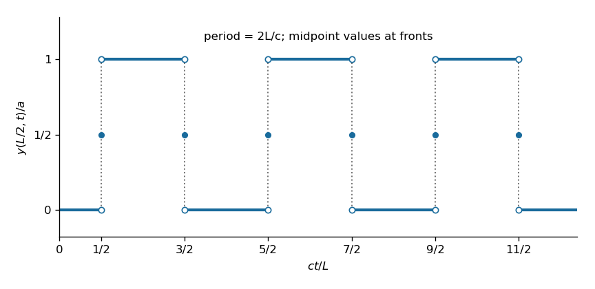

# Paper 4

↑ **Parent:** [Ib](../ib.md)

[https://www.maths.cam.ac.uk/undergrad/pastpapers/files/2016/paperib_4.pdf](https://www.maths.cam.ac.uk/undergrad/pastpapers/files/2016/paperib_4.pdf)

**Table of contents**

- [1F](#1f)
  - [Solution](#1f/solution)
- [2E](#2e)
  - [Solution](#2e/solution)
- [3G](#3g)
  - [a](#3g/a)
    - [Solution](#3g/a/solution)
  - [b](#3g/b)
    - [Solution](#3g/b/solution)
  - [c](#3g/c)
    - [Solution](#3g/c/solution)
- [4G](#4g)
  - [Solution](#4g/solution)
- [5A](#5a)
  - [Solution](#5a/solution)
- [6B](#6b)
  - [a](#6b/a)
    - [Solution](#6b/a/solution)
  - [b](#6b/b)
    - [Solution](#6b/b/solution)
  - [c](#6b/c)
    - [Solution](#6b/c/solution)
  - [d](#6b/d)
    - [Solution](#6b/d/solution)
- [7D](#7d)
  - [a](#7d/a)
    - [Solution](#7d/a/solution)
  - [b](#7d/b)
    - [i](#7d/b/i)
      - [Solution](#7d/b/i/solution)
    - [ii](#7d/b/ii)
      - [Solution](#7d/b/ii/solution)
    - [iii](#7d/b/iii)
      - [Solution](#7d/b/iii/solution)
- [8D](#8d)
  - [a](#8d/a)
    - [Solution](#8d/a/solution)
  - [b](#8d/b)
    - [Solution](#8d/b/solution)
- [9H](#9h)
  - [a](#9h/a)
    - [Solution](#9h/a/solution)
  - [b](#9h/b)
    - [Solution](#9h/b/solution)
- [10F](#10f)
  - [a](#10f/a)
    - [Solution](#10f/a/solution)
  - [b](#10f/b)
    - [Solution](#10f/b/solution)
- [11E](#11e)
  - [a](#11e/a)
    - [Solution](#11e/a/solution)
  - [b](#11e/b)
    - [Solution](#11e/b/solution)
  - [c](#11e/c)
    - [Solution](#11e/c/solution)
- [12G](#12g)
  - [a](#12g/a)
    - [Solution](#12g/a/solution)
  - [b](#12g/b)
    - [Solution](#12g/b/solution)
  - [c](#12g/c)
    - [Solution](#12g/c/solution)
- [13E](#13e)
  - [a](#13e/a)
    - [Solution](#13e/a/solution)
  - [b](#13e/b)
    - [i](#13e/b/i)
      - [Solution](#13e/b/i/solution)
    - [ii](#13e/b/ii)
      - [Solution](#13e/b/ii/solution)
- [14A](#14a)
  - [a](#14a/a)
    - [Solution](#14a/a/solution)
  - [b](#14a/b)
    - [Solution](#14a/b/solution)
  - [c](#14a/c)
    - [i](#14a/c/i)
      - [Solution](#14a/c/i/solution)
    - [ii](#14a/c/ii)
      - [Solution](#14a/c/ii/solution)
    - [iii](#14a/c/iii)
      - [Solution](#14a/c/iii/solution)
- [15F](#15f)
  - [a](#15f/a)
    - [Solution](#15f/a/solution)
  - [b](#15f/b)
    - [Solution](#15f/b/solution)
  - [c](#15f/c)
    - [Solution](#15f/c/solution)
- [16C](#16c)
  - [a](#16c/a)
    - [Solution](#16c/a/solution)
  - [b](#16c/b)
    - [Solution](#16c/b/solution)
  - [c](#16c/c)
    - [Solution](#16c/c/solution)
- [17B](#17b)
  - [a](#17b/a)
    - [Solution](#17b/a/solution)
  - [b](#17b/b)
    - [Solution](#17b/b/solution)
- [18C](#18c)
  - [a](#18c/a)
    - [Solution](#18c/a/solution)
  - [b](#18c/b)
    - [Solution](#18c/b/solution)
  - [c](#18c/c)
    - [Solution](#18c/c/solution)
  - [d](#18c/d)
    - [Solution](#18c/d/solution)
- [19H](#19h)
  - [a](#19h/a)
    - [Solution](#19h/a/solution)
  - [b](#19h/b)
    - [Solution](#19h/b/solution)
- [20H](#20h)
  - [a](#20h/a)
    - [Solution](#20h/a/solution)
  - [b](#20h/b)
    - [Solution](#20h/b/solution)

## 1F

↑ **Parent:** [Paper 4](paper-4.md)

<h3 id="1f/solution">Solution</h3>

↑ **Parent:** [1F](#1f)

Put $q=(1,1,1,1)^{\mathsf T}$ and arrange the four vectors as the columns of $A=(x-1)I+qq^{\mathsf T}$. On the one-dimensional [vector subspace](../../../vector-space.md#vector-subspace) spanned by $q$, the [eigenvalue](../../../linear-operator-theory.md#eigenvalue) is $x+3$. On the three-dimensional [orthogonal complement](../../../hilbert-space.md#orthogonal-complement) $q^\perp=\{v:\sum_i v_i=0\}$, the [eigenvalue](../../../linear-operator-theory.md#eigenvalue) is $x-1$. Thus

$$
\det A=(x+3)(x-1)^3,
$$

and **the vectors fail to be a basis exactly when $x=1$ or $x=-3$.**

For $x=1$, all four columns equal $q$. The [matrix rank](../../../vector-space.md#matrix-rank) is $1$, a [basis](../../../vector-space.md#basis) of their [span](../../../vector-space.md#linear-span) is $\{q\}$, and an extension to a [basis](../../../vector-space.md#basis) of $\mathbb R^4$ is

$$
\boxed{\{q,e_1,e_2,e_3\}.}
$$

The last coordinate first forces the coefficient of $q$ to vanish in any [linear dependence](../../../vector-space.md#linear-dependence), after which the other coefficients vanish.

For $x=-3$, the [matrix rank](../../../vector-space.md#matrix-rank) is $3$ and the [span](../../../vector-space.md#linear-span) is exactly $q^\perp$. A [basis](../../../vector-space.md#basis) consists of the first three original columns,

$$
\boxed{\{(-3,1,1,1),(1,-3,1,1),(1,1,-3,1)\}.}
$$

Indeed, writing them as $q-4e_i$, a vanishing linear combination has coefficient sum zero by its fourth coordinate, and then each coefficient is zero by the first three coordinates. Adjoin $q$ to extend this [basis](../../../vector-space.md#basis) to $\mathbb R^4$, since $q\notin q^\perp$.

## 2E

↑ **Parent:** [Paper 4](paper-4.md)

<h3 id="2e/solution">Solution</h3>

↑ **Parent:** [2E](#2e)

**Eisenstein's criterion.** Let $f(X)=a_nX^n+\cdots+a_0\in\mathbb Z[X]$ be a nonconstant [primitive polynomial](../../../commutative-algebra.md#primitive-polynomial). If a [prime number](../../../number-theory.md#prime-number) $p$ satisfies $p\nmid a_n$, $p\mid a_j$ for $0\leq j<n$, and $p^2\nmid a_0$, then $f$ is an [irreducible polynomial](../../../polynomial.md#irreducible-polynomial) over $\mathbb Q$.

To prove the [Eisenstein criterion](../../../commutative-algebra.md#eisenstein-criterion), suppose a nontrivial factorization exists over $\mathbb Q$. [Gauss lemma for polynomials](../../../commutative-algebra.md#gauss-lemma-for-polynomials) gives $f=gh$ with $g,h\in\mathbb Z[X]$ of positive degree. Their leading coefficients are not divisible by $p$, because their product is $a_n$. Reduction modulo $p$ therefore preserves both degrees, and

$$
\overline g\,\overline h=\overline{a_n}X^n\quad\text{in }\mathbb F_p[X].
$$

Since the only irreducible factor of the right side is $X$, both reduced factors are nonzero monomials of positive degree. Their constant coefficients are consequently divisible by $p$. This would make $p^2\mid g(0)h(0)=a_0$, a contradiction.

For the requested [polynomial](../../../polynomial.md), shift the variable by one. The [binomial theorem](../../../combinatorics.md#binomial-theorem) gives

$$
\Phi_p(X+1)=\frac{(X+1)^p-1}{X}=\sum_{j=1}^p\binom pjX^{j-1}.
$$

It is monic, all coefficients below the leading one are divisible by $p$, and the constant coefficient is $p$, not divisible by $p^2$. The [Eisenstein criterion](../../../commutative-algebra.md#eisenstein-criterion) proves irreducibility of this shifted [polynomial](../../../polynomial.md). The substitution $X\mapsto X+1$ is an [automorphism](../../../algebra.md#automorphism) of $\mathbb Q[X]$, with inverse $X\mapsto X-1$, so it preserves nontrivial factorizations. Hence

$$
\boxed{X^{p-1}+X^{p-2}+\cdots+1\text{ is irreducible over }\mathbb Q.}
$$

This is the [cyclotomic polynomial](../../../galois-theory.md#cyclotomic-polynomial) for a prime index.

## 3G

↑ **Parent:** [Paper 4](paper-4.md)

<h3 id="3g/a">a</h3>

↑ **Parent:** [3G](#3g)

<h4 id="3g/a/solution">Solution</h4>

↑ **Parent:** [A](#3g/a)

A [contraction mapping](../../../analysis.md#contraction-mapping) on a [metric space](../../../topological-analysis.md#metric-space) $(X,d)$ is a map $f:X\to X$ for which there is a single constant $q$ with $0\leq q<1$ such that

$$
\boxed{d(f(x),f(y))\leq q\,d(x,y)\quad\text{for every }x,y\in X.}
$$

The same $q$ must work for every pair. Merely decreasing each nonzero distance strictly does not suffice for this definition.

<h3 id="3g/b">b</h3>

↑ **Parent:** [3G](#3g)

<h4 id="3g/b/solution">Solution</h4>

↑ **Parent:** [B](#3g/b)

The [contraction mapping theorem](../../../analysis.md#contraction-mapping-theorem) states that a [contraction mapping](../../../analysis.md#contraction-mapping) of a **nonempty complete metric space** into itself has a unique [fixed point](../../../function.md#fixed-point) $x_*$. For any starting point $x_0$, the iterates $x_{n+1}=f(x_n)$ converge to $x_*$, with the quantitative estimate

$$
\boxed{d(x_n,x_*)\leq\frac{q^n}{1-q}d(x_1,x_0).}
$$

Completeness and the self-map condition are essential: the geometric estimate makes the iterates a [Cauchy sequence](../../../real-analysis.md#cauchy-sequence), completeness supplies their limit in $X$, and continuity of the [contraction mapping](../../../analysis.md#contraction-mapping) makes that limit a [fixed point](../../../function.md#fixed-point). If two [fixed points](../../../function.md#fixed-point) existed, their distance would be at most $q$ times itself, forcing equality of the points.

<h3 id="3g/c">c</h3>

↑ **Parent:** [3G](#3g)

<h4 id="3g/c/solution">Solution</h4>

↑ **Parent:** [C](#3g/c)

Define $F_i(x)=a_i+\frac16\sum_{j\ne i}\sin x_j$. Solving the system is equivalent to finding a [fixed point](../../../function.md#fixed-point) of $F:\mathbb R^3\to\mathbb R^3$. The [mean value theorem](../../../calculus.md#mean-value-theorem) implies $|\sin u-\sin v|\leq|u-v|$. In the specified metric,

$$
\begin{aligned}
d(F(x),F(y))&\leq\frac16\sum_{i=1}^3\sum_{j\ne i}|x_j-y_j|\\
&=\frac13\sum_{j=1}^3|x_j-y_j|=\frac13d(x,y).
\end{aligned}
$$

Each coordinate difference occurs exactly twice. This metric makes $\mathbb R^3$ a nonempty [complete metric space](../../../topological-analysis.md#complete-metric-space), because a [Cauchy sequence](../../../real-analysis.md#cauchy-sequence) in it is Cauchy in each real coordinate, and coordinate convergence implies convergence in the sum metric. Thus $F$ is a [contraction mapping](../../../analysis.md#contraction-mapping) with constant $1/3$.

**There is exactly one solution for every choice of $(a_1,a_2,a_3)$**, by the [contraction mapping theorem](../../../analysis.md#contraction-mapping-theorem). Iteration of $F$ from any starting vector also constructs it.

## 4G

↑ **Parent:** [Paper 4](paper-4.md)

<h3 id="4g/solution">Solution</h3>

↑ **Parent:** [4G](#4g)

**Rouché's theorem.** Suppose $f,g$ are [holomorphic functions](../../../complex-analysis.md#holomorphic-function) on a neighbourhood of the closure of a bounded domain enclosed by a simple, positively oriented, piecewise smooth curve. If $|g(z)|<|f(z)|$ on the boundary, then $f$ and $f+g$ have the same number of zeros inside, counted with [multiplicity](../../../polynomial.md#multiplicity-mathematics).

Apply [Rouche theorem](../../../complex-analysis.md#rouche-s-theorem) with $f(z)=z^4+3$ and $g(z)=e^{iz}$ on the first-quadrant quarter-disc of radius $R=\sqrt2$. On the two radial segments, $z^4$ is nonnegative real, so $|f|\geq3$, whereas $|g|=e^{-\operatorname{Im}z}\leq1$. On the circular arc,

$$
|f(z)|\geq|z|^4-3=1.
$$

At every arc point with positive imaginary part, $|g|<1$, giving the strict inequality; at the remaining endpoint $z=R$, $|f|=7>1=|g|$. Thus the strict boundary inequality holds everywhere, including the origin.

The four zeros of $f$ have modulus $3^{1/4}$ and arguments $\pi/4,3\pi/4,5\pi/4,7\pi/4$. Exactly one lies inside the chosen domain. [Rouche theorem](../../../complex-analysis.md#rouche-s-theorem) gives exactly one zero of $f+g$ there, counted with [multiplicity](../../../polynomial.md#multiplicity-mathematics), so that zero is simple. Finally any zero in the open first quadrant satisfies

$$
|z|^4=|3+e^{iz}|\leq3+e^{-\operatorname{Im}z}<4.
$$

There can be no additional zero outside the quarter-disc. Hence

$$
\boxed{\text{Exactly one zero lies in the first quadrant, and }|z_0|<\sqrt2.}
$$

## 5A

↑ **Parent:** [Paper 4](paper-4.md)

<h3 id="5a/solution">Solution</h3>

↑ **Parent:** [5A](#5a)

The function is even, so its [Fourier series](../../../fourier-series.md) has $b_n=0$. In the convention $f\sim a_0/2+\sum_{n\geq1}(a_n\cos nx+b_n\sin nx)$,

$$
a_0=\frac2\pi\int_0^\pi x^2\,dx=\frac{2\pi^2}{3}.
$$

Twice applying [integration by parts](../../../calculus.md#integration-by-parts) gives, for $n\geq1$,

$$
\begin{aligned}
\int_0^\pi x^2\cos(nx)\,dx
&=-\frac2n\int_0^\pi x\sin(nx)\,dx\\
&=\frac{2\pi(-1)^n}{n^2},\qquad a_n=\frac{4(-1)^n}{n^2}.
\end{aligned}
$$

Therefore **the periodic Fourier representation is**

$$
\boxed{x^2=\frac{\pi^2}{3}+4\sum_{n=1}^\infty\frac{(-1)^n\cos(nx)}{n^2},\qquad -\pi\leq x\leq\pi,}
$$

with periodic continuation. The periodic extension is continuous, including the identified endpoints, and piecewise smooth, so the [Fourier series](../../../fourier-series.md) converges to it. The coefficients also give [absolute convergence](../../../real-analysis.md#absolute-convergence) and [uniform convergence](../../../real-analysis.md#uniform-convergence) by comparison with $\sum n^{-2}$.

At $x=\pi$, the cosine cancels the alternating coefficient sign; at $x=0$, it is identically one. These evaluations yield

$$
\boxed{\sum_{n=1}^\infty\frac1{n^2}=\frac{\pi^2}{6},\qquad \sum_{n=1}^\infty\frac{(-1)^{n+1}}{n^2}=\frac{\pi^2}{12}.}
$$

The first identity solves the [Basel problem](../../../analytic-number-theory.md#basel-problem).

## 6B

↑ **Parent:** [Paper 4](paper-4.md)

<h3 id="6b/a">a</h3>

↑ **Parent:** [6B](#6b)

<h4 id="6b/a/solution">Solution</h4>

↑ **Parent:** [A](#6b/a)

The [orbital angular momentum](../../../quantum-mechanics.md#orbital-angular-momentum) [linear operator](../../../vector-space.md#linear-operator) is the cross product of the [position operator](../../../quantum-mechanics.md#position-operator) and the [momentum operator](../../../quantum-mechanics.md#momentum-operator):

$$
\boxed{\widehat{\mathbf L}=\widehat{\mathbf r}\times\widehat{\mathbf p},\qquad \widehat L_i=\sum_{j,k}\varepsilon_{ijk}\widehat x_j\widehat p_k.}
$$

In position space, $\widehat{\mathbf p}=-i\hbar\nabla$, so $\widehat{\mathbf L}=-i\hbar\,\mathbf r\times\nabla$. The [Levi-Civita symbol](../../../calculus.md#levi-civita-symbol) gives $\widehat L_1=\widehat x_2\widehat p_3-\widehat x_3\widehat p_2$ and its cyclic analogues.

<h3 id="6b/b">b</h3>

↑ **Parent:** [6B](#6b)

<h4 id="6b/b/solution">Solution</h4>

↑ **Parent:** [B](#6b/b)

Use the [canonical commutation relations](../../../quantum-mechanics.md#canonical-commutation-relation) $[\widehat x_i,\widehat x_j]=[\widehat p_i,\widehat p_j]=0$ and $[\widehat x_i,\widehat p_j]=i\hbar\delta_{ij}I$. For compactness write products without hats in the calculation, on a common domain such as smooth compactly supported wavefunctions. Expanding the [commutator](../../../lie-algebra.md#commutator) gives

$$
[L_1,L_2]=[x_2p_3,x_3p_1]-[x_2p_3,x_1p_3]-[x_3p_2,x_3p_1]+[x_3p_2,x_1p_3].
$$

The middle two [commutators](../../../lie-algebra.md#commutator) vanish because all the relevant indices differ. The first is $-i\hbar x_2p_1$, since $[p_3,x_3]=-i\hbar I$; the last is $i\hbar x_1p_2$, since $[x_3,p_3]=i\hbar I$. Thus

$$
\boxed{[\widehat L_1,\widehat L_2]=i\hbar(\widehat x_1\widehat p_2-\widehat x_2\widehat p_1)=i\hbar\widehat L_3.}
$$

This is one of the [orbital angular momentum commutation relations](../../../quantum-mechanics.md#orbital-angular-momentum-commutation-relations).

<h3 id="6b/c">c</h3>

↑ **Parent:** [6B](#6b)

<h4 id="6b/c/solution">Solution</h4>

↑ **Parent:** [C](#6b/c)

The product rule for a [commutator](../../../lie-algebra.md#commutator) gives $[A,B^2]=[A,B]B+B[A,B]$. Using the permitted cyclic [angular momentum commutation relations](../../../quantum-mechanics.md#angular-momentum-commutation-relations),

$$
\begin{aligned}
[L_1,L_2^2]&=i\hbar(L_3L_2+L_2L_3),\\
[L_1,L_3^2]&=-i\hbar(L_2L_3+L_3L_2),\\
[L_1,L_1^2]&=0.
\end{aligned}
$$

The first two expressions cancel, even though the factors need not commute. Hence

$$
\boxed{[\widehat L_1,\widehat{\mathbf L}^{\,2}]=0.}
$$

The squared [angular momentum operator](../../../quantum-mechanics.md#angular-momentum-operator) commutes with each of its components by the same cyclic calculation.

<h3 id="6b/d">d</h3>

↑ **Parent:** [6B](#6b)

<h4 id="6b/d/solution">Solution</h4>

↑ **Parent:** [D](#6b/d)

Distinct [eigenvalues](../../../linear-operator-theory.md#eigenvalue) of the self-adjoint [angular momentum operator](../../../quantum-mechanics.md#angular-momentum-operator) imply $\langle\psi_1,\psi_2\rangle=0$. The given combination is not normalized: its squared norm is $(\cos^2\omega t+3\sin^2\omega t)/4$, which is always positive. Therefore its properly normalized [expectation value](../../../quantum-mechanics.md#expectation-value) is

$$
\langle L_1\rangle_\psi=\frac{\langle\psi,L_1\psi\rangle}{\langle\psi,\psi\rangle}=\hbar\frac{\cos^2\omega t-3\sin^2\omega t}{\cos^2\omega t+3\sin^2\omega t}.
$$

It vanishes when $\tan^2\omega t=1/3$. The first positive solution has $\omega t=\pi/6$, so

$$
\boxed{t_0=\frac{\pi}{6\omega}.}
$$

Normalization changes the value of the [expectation value](../../../quantum-mechanics.md#expectation-value) away from zero, but not its zero times.

## 7D

↑ **Parent:** [Paper 4](paper-4.md)

<h3 id="7d/a">a</h3>

↑ **Parent:** [7D](#7d)

<h4 id="7d/a/solution">Solution</h4>

↑ **Parent:** [A](#7d/a)

In a charge-free and current-free vacuum, [Maxwell equations](../../../electromagnetism.md#maxwell-equations) give

$$
\nabla\cdot\mathbf E=0,\quad \nabla\cdot\mathbf B=0,\quad \nabla\times\mathbf E=-\partial_t\mathbf B,\quad \nabla\times\mathbf B=\mu_0\epsilon_0\partial_t\mathbf E.
$$

Take the [curl](../../../calculus.md#curl) of [Faraday's law](../../../electromagnetism.md#faraday-s-law-of-induction) and use the [curl of the curl identity](../../../calculus.md#curl-of-the-curl-identity) $\nabla\times(\nabla\times\mathbf E)=\nabla(\nabla\cdot\mathbf E)-\nabla^2\mathbf E$. The [divergence](../../../calculus.md#divergence) term vanishes by [Gauss's law](../../../electromagnetism.md#gauss-s-law), while the time derivative of the magnetic [curl](../../../calculus.md#curl) supplies $-\mu_0\epsilon_0\partial_t^2\mathbf E$. Thus

$$
\boxed{\frac1{c^2}\partial_t^2\mathbf E-\nabla^2\mathbf E=\mathbf0,\quad \nabla\cdot\mathbf E=0,\quad c=(\epsilon_0\mu_0)^{-1/2}.}
$$

This is the transverse [electromagnetic wave equation](../../../electromagnetism.md#electromagnetic-wave-equation).

<h3 id="7d/b">b</h3>

↑ **Parent:** [7D](#7d)

<h4 id="7d/b/i">i</h4>

↑ **Parent:** [B](#7d/b)

<h5 id="7d/b/i/solution">Solution</h5>

↑ **Parent:** [I](#7d/b/i)

The phase has [wavevector](../../../continuum-mechanics.md#wavevector) $\mathbf k=k\mathbf e_z$. The electric field has fixed direction $(\mathbf e_x+\mathbf e_y)/\sqrt2$, so it has [linear polarization](../../../electromagnetism.md#linear-polarization) at $45^\circ$ to the $x$ and $y$ axes, perpendicular to the [wavevector](../../../continuum-mechanics.md#wavevector). Substitution into the [electromagnetic wave equation](../../../electromagnetism.md#electromagnetic-wave-equation) gives

$$
\boxed{\omega^2=c^2k^2.}
$$

For the usual positive-frequency convention, $\omega=c|k|$ and propagation is in the direction $\operatorname{sgn}(k)\mathbf e_z$. If $k>0$, this reduces to $\omega=ck$. The following wave formulas assume the nonconstant case $\omega\ne0$.

<h4 id="7d/b/ii">ii</h4>

↑ **Parent:** [B](#7d/b)

<h5 id="7d/b/ii/solution">Solution</h5>

↑ **Parent:** [Ii](#7d/b/ii)

For the oscillatory magnetic field, [Faraday's law](../../../electromagnetism.md#faraday-s-law-of-induction) gives $\mathbf B=(1/\omega)\mathbf k\times\mathbf E$. Indeed its time derivative equals $-\nabla\times\mathbf E$, and the dispersion relation makes it satisfy the remaining [Maxwell equations](../../../electromagnetism.md#maxwell-equations). Thus

$$
\boxed{\mathbf B(z,t)=\frac{kE_0}{\sqrt2\,\omega}(-1,1,0)\cos(kz-\omega t).}
$$

For $\omega=ck$, its amplitude is $E_0/c$. The [magnetic field](../../../electromagnetism.md#magnetic-field), [electric field](../../../electromagnetism.md#electric-field) and direction of propagation are mutually perpendicular. A constant background magnetic field could be added; the expression above is the wave-associated field.

<h4 id="7d/b/iii">iii</h4>

↑ **Parent:** [B](#7d/b)

<h5 id="7d/b/iii/solution">Solution</h5>

↑ **Parent:** [Iii](#7d/b/iii)

Since $\mathbf E\cdot\mathbf e_z=0$, the [vector triple product](../../../calculus.md#vector-triple-product) yields $\mathbf E\times(\mathbf e_z\times\mathbf E)=|\mathbf E|^2\mathbf e_z$. Consequently the [Poynting vector](../../../electromagnetism.md#poynting-vector) is

$$
\mathbf S=\frac{E_0^2k}{\mu_0\omega}\cos^2(kz-\omega t)\mathbf e_z.
$$

Its average over a full period uses $\langle\cos^2\rangle=1/2$:

$$
\boxed{\langle\mathbf S\rangle=\frac{E_0^2k}{2\mu_0\omega}\mathbf e_z.}
$$

This is the mean electromagnetic energy flux per unit area. For positive frequency it points in the propagation direction and has magnitude $E_0^2/(2\mu_0c)=\epsilon_0cE_0^2/2$.

## 8D

↑ **Parent:** [Paper 4](paper-4.md)

<h3 id="8d/a">a</h3>

↑ **Parent:** [8D](#8d)

<h4 id="8d/a/solution">Solution</h4>

↑ **Parent:** [A](#8d/a)

Apply the numerical method to the scalar test equation $y'=\lambda y$, with $z=h\lambda$. Its [linear stability domain](../../../numerical-analysis.md#linear-stability-domain) consists of those $z\in\mathbb C$ for which the discrete solution stays bounded as the step count tends to infinity. For a one-step method with [stability function](../../../numerical-analysis.md#stability-function) $R$, this is

$$
\boxed{\mathcal S=\{z:|R(z)|\leq1\}.}
$$

If asymptotic decay is required, use $|R(z)|<1$ instead; this only changes the boundary conventions in part (b). A method is [A-stable](../../../numerical-analysis.md#a-stability) if its stability domain contains the left half-plane, so every decaying linear test equation is stable for every positive step size. For a multistep method, the corresponding definition uses the [root condition for a multistep method](../../../numerical-analysis.md#root-condition-for-a-multistep-method) for every characteristic root, including simplicity of unit-modulus roots.

<h3 id="8d/b">b</h3>

↑ **Parent:** [8D](#8d)

<h4 id="8d/b/solution">Solution</h4>

↑ **Parent:** [B](#8d/b)

Expand the second stage by the [Taylor theorem](../../../calculus.md#taylor-theorem), writing $f=f(t_n,y_n)$ and $D_yf$ for the derivative in the state variable:

$$
k_2=f+\frac h2\bigl(f_t+(D_yf)f\bigr)+O(h^2).
$$

The update therefore agrees with the exact solution's [Taylor series](../../../calculus.md#taylor-series):

$$
y_{n+1}=y_n+hf+\frac{h^2}{2}\bigl(f_t+(D_yf)f\bigr)+O(h^3).
$$

Thus the one-step [local truncation error](../../../numerical-analysis.md#local-truncation-error) is $O(h^3)$, and the method has order at least two under the usual smoothness and [Lipschitz continuity](../../../real-analysis.md#lipschitz-continuity) assumptions.

For $f=\lambda y$, the two-stage [Runge-Kutta method](../../../numerical-analysis.md#runge-kutta-method) gives

$$
\boxed{R(z)=1+z+\frac{z^2}{2}.}
$$

On the real axis, $R(z)=\tfrac12(z+1)^2+\tfrac12\geq\tfrac12$, so $|R(z)|\leq1$ is equivalent to $(z+1)^2\leq1$. Hence

$$
\boxed{\mathcal S\cap\mathbb R=[-2,0].}
$$

The decay convention gives $(-2,0)$. Since negative real values such as $z=-3$ lie outside the [linear stability domain](../../../numerical-analysis.md#linear-stability-domain), the method is **not A-stable**. Its order is exactly two, since $R(z)$ lacks the cubic term of $e^z$.

## 9H

↑ **Parent:** [Paper 4](paper-4.md)

<h3 id="9h/a">a</h3>

↑ **Parent:** [9H](#9h)

<h4 id="9h/a/solution">Solution</h4>

↑ **Parent:** [A](#9h/a)

If there are $i$ balls in box A, a ball currently in B is selected with probability $(k-i)/k$, increasing the count, and a ball in A is selected with probability $i/k$, decreasing it. For $k\geq1$,

$$
\boxed{P_{i,i+1}=\frac{k-i}{k}\ (0\leq i<k),\qquad P_{i,i-1}=\frac{i}{k}\ (0<i\leq k),}
$$

with every other transition zero. This is the [Ehrenfest urn model](../../../markov-process.md#ehrenfest-urn-model).

The [stationary distribution](../../../markov-process.md#stationary-distribution) is

$$
\boxed{\pi_i=2^{-k}\binom ki,\qquad 0\leq i\leq k.}
$$

It is normalized by the [binomial theorem](../../../combinatorics.md#binomial-theorem), and it obeys the [detailed balance](../../../markov-process.md#detailed-balance):

$$
\pi_iP_{i,i+1}=2^{-k}\binom ki\frac{k-i}{k}=2^{-k}\binom k{i+1}\frac{i+1}{k}=\pi_{i+1}P_{i+1,i}.
$$

All other pairs have zero flux in both directions. These identities prove stationarity and show that this is a [reversible Markov chain](../../../markov-process.md#reversible-markov-chain) in equilibrium. The finite chain is irreducible and has period two; reversibility does not require aperiodicity.

<h3 id="9h/b">b</h3>

↑ **Parent:** [9H](#9h)

<h4 id="9h/b/solution">Solution</h4>

↑ **Parent:** [B](#9h/b)

A finite [irreducible Markov chain](../../../markov-process.md#irreducible-markov-chain) is positive recurrent. Its [mean recurrence time](../../../markov-process.md#mean-recurrence-time) to state $i$, starting at $i$ and counting the first positive return, is $1/\pi_i$. This identity comes from the long-run fraction of time spent at that state: successive return cycles each contain one visit at their start, so the fraction is the reciprocal of the mean cycle length. It remains valid for a periodic chain.

Here $\pi_0=2^{-k}$, hence

$$
\boxed{\mathbb E_0[T]=2^k\text{ minutes}.}
$$

For $k=1$ the return is deterministically after two minutes, which checks the formula.

## 10F

↑ **Parent:** [Paper 4](paper-4.md)

<h3 id="10f/a">a</h3>

↑ **Parent:** [10F](#10f)

<h4 id="10f/a/solution">Solution</h4>

↑ **Parent:** [A](#10f/a)

The algebraic [dual map](../../../linear-algebra.md#transpose-of-a-linear-map) is $\delta=\alpha^\vee:W^*\to V^*$, defined by $\delta(\varphi)=\varphi\circ\alpha$. The [annihilator of a vector subspace](../../../linear-algebra.md#annihilator-of-a-vector-subspace) $U\subseteq V$ is

$$
U^\circ=\{\lambda\in V^*: \lambda(u)=0\text{ for all }u\in U\}.
$$

Every functional $\varphi\circ\alpha$ vanishes on $\ker\alpha$, so $\operatorname{im}\delta\subseteq(\ker\alpha)^\circ$. Conversely, let $\lambda\in(\ker\alpha)^\circ$. Define a functional on $\operatorname{im}\alpha$ by $\widetilde\lambda(\alpha v)=\lambda(v)$. It is well defined because two preimages differ by an element of $\ker\alpha$. Extend a [basis](../../../vector-space.md#basis) of $\operatorname{im}\alpha$ to one of $W$ and extend the functional arbitrarily, for instance by zero on the extra basis vectors. The resulting $\varphi\in W^*$ satisfies $\delta\varphi=\lambda$.

This is the [dual image and kernel annihilator identity](../../../linear-algebra.md#dual-image-and-kernel-annihilator-identity). Therefore

$$
\boxed{\operatorname{im}\delta=(\ker\alpha)^\circ.}
$$

The [basis extension](../../../vector-space.md#basis-extension) theorem also gives $\dim U^\circ=\dim V-\dim U$. By the [rank-nullity theorem](../../../linear-algebra.md#rank-nullity-theorem),

$$
\boxed{\dim\operatorname{im}\delta=\dim V-\dim\ker\alpha=\dim\operatorname{im}\alpha.}
$$

Apply [rank-nullity theorem](../../../linear-algebra.md#rank-nullity-theorem) to both maps, using $\dim W^*=\dim W$, to obtain

$$
\boxed{\dim\ker\alpha-\dim\ker\delta=\dim V-\dim W.}
$$

Over $\mathbb C$, this is the algebraic dual, without complex conjugation; the [adjoint operator](../../../hilbert-space.md#adjoint-operator) in part (b) uses the inner products instead.

<h3 id="10f/b">b</h3>

↑ **Parent:** [10F](#10f)

<h4 id="10f/b/solution">Solution</h4>

↑ **Parent:** [B](#10f/b)

The [adjoint operator](../../../hilbert-space.md#adjoint-operator) $\alpha^*:W\to V$ is uniquely characterized by

$$
\langle\alpha v,w\rangle_W=\langle v,\alpha^*w\rangle_V\quad\text{for all }v,w.
$$

Let $A=\beta\beta^*+\gamma^*\gamma:V\to V$. Its quadratic form is nonnegative:

$$
\langle Av,v\rangle=\|\beta^*v\|^2+\|\gamma v\|^2.
$$

If $Av=0$, both norms vanish. In particular $v\in\ker\gamma=\operatorname{im}\beta$, while $\beta^*v=0$ means $v$ is orthogonal to $\operatorname{im}\beta$, by the defining [adjoint operator](../../../hilbert-space.md#adjoint-operator) identity. A vector belonging to a [vector subspace](../../../vector-space.md#vector-subspace) and its [orthogonal complement](../../../hilbert-space.md#orthogonal-complement) must be zero. Hence $A$ is injective, and finite dimensionality makes it surjective.

Thus

$$
\boxed{\beta\beta^*+\gamma^*\gamma\text{ is an isomorphism of }V.}
$$

The same calculation shows it is a [positive-definite operator](../../../linear-operator-theory.md#positive-definite-operator) when $V\ne\{0\}$.

## 11E

↑ **Parent:** [Paper 4](paper-4.md)

<h3 id="11e/a">a</h3>

↑ **Parent:** [11E](#11e)

<h4 id="11e/a/solution">Solution</h4>

↑ **Parent:** [A](#11e/a)

Work with the usual commutative unital [Noetherian ring](../../../algebra.md#noetherian-ring) convention. First prove that every [submodule](../../../module-theory.md#submodule) of $R^d$ is a [finitely generated module](../../../module-theory.md#finitely-generated-module). For $d=1$, a [submodule](../../../module-theory.md#submodule) is an [ideal](../../../commutative-algebra.md#ideal), hence finitely generated by Noetherianity. For the induction step, project a submodule $N\subseteq R^d$ onto its last coordinate. Its image is a finitely generated [ideal](../../../commutative-algebra.md#ideal); choose lifts in $N$ of its generators. The projection kernel lies in $R^{d-1}$ and is finitely generated by induction. The kernel generators together with the chosen lifts generate $N$, since subtracting a combination of the lifts leaves an element of the kernel.

Now choose a surjection $R^d\to M$ from a finite generating set of the [module](../../../module-theory.md#module-mathematics) $M$. For any [submodule](../../../module-theory.md#submodule) $U\subseteq M$, its inverse image in $R^d$ is finitely generated by the result just proved. The images of those generators generate $U$.

**Every submodule of $M$ is finitely generated.** In particular $M$ is a [Noetherian module](../../../algebra.md#noetherian-module): the union of an ascending chain is a submodule, and its finite generators all belong to a single member of the chain, forcing eventual stabilization.

<h3 id="11e/b">b</h3>

↑ **Parent:** [11E](#11e)

<h4 id="11e/b/solution">Solution</h4>

↑ **Parent:** [B](#11e/b)

Let $P=\operatorname{Ann}(m)$ be maximal among annihilators of nonzero elements of $M$. It is a proper [ideal](../../../commutative-algebra.md#ideal), since $1m=m\ne0$. Suppose $ab\in P$ and $b\notin P$. Then $bm\ne0$ and

$$
P\subseteq\operatorname{Ann}(bm),\qquad a\in\operatorname{Ann}(bm).
$$

The inclusion holds because every $r\in P$ satisfies $r(bm)=b(rm)=0$. Maximality in the stated set forces $\operatorname{Ann}(bm)=P$, so $a\in P$. This proves the defining implication for a [prime ideal](../../../commutative-algebra.md#prime-ideal):

$$
\boxed{ab\in P\ \Longrightarrow\ a\in P\text{ or }b\in P.}
$$

This is a [maximal annihilator of a module element is prime](../../../module-theory.md#maximal-annihilator-of-a-module-element-is-prime) argument. Maximality among element annihilators is sufficient; $P$ need not be a maximal ideal of $R$.

<h3 id="11e/c">c</h3>

↑ **Parent:** [11E](#11e)

<h4 id="11e/c/solution">Solution</h4>

↑ **Parent:** [C](#11e/c)

If $M=0$, take the empty filtration. Otherwise a nonzero quotient $Q=M/M_i$ is a finitely generated [module](../../../module-theory.md#module-mathematics). Because $R$ has the [ascending chain condition](../../../algebra.md#ascending-chain-condition) on ideals, the nonempty collection of annihilators of nonzero elements of $Q$ has a maximal element. Part (b), applied to $Q$, supplies $q\ne0$ with a [prime ideal](../../../commutative-algebra.md#prime-ideal) $P=\operatorname{Ann}(q)$.

The map $R\to Rq$, $r\mapsto rq$, is surjective with kernel $P$. The [first isomorphism theorem](../../../group-theory.md#first-isomorphism-theorem) gives $Rq\cong R/P$. Let $M_{i+1}$ be the inverse image of $Rq$ under $M\to Q$. Then

$$
M_i\subsetneq M_{i+1},\qquad \boxed{M_{i+1}/M_i\cong R/P.}
$$

Repeat whenever the quotient remains nonzero. An infinite repetition would give a strictly ascending chain of [submodules](../../../module-theory.md#submodule) of the [Noetherian module](../../../algebra.md#noetherian-module) $M$, contradicting part (a). Thus the process stops after finitely many steps, necessarily at $M$.

**This constructs the required [prime filtration](../../../algebra.md#prime-filtration)** $0=M_0\subsetneq\cdots\subsetneq M_l=M$, with each successive quotient $R/P_i$ for a prime $P_i$.

## 12G

↑ **Parent:** [Paper 4](paper-4.md)

<h3 id="12g/a">a</h3>

↑ **Parent:** [12G](#12g)

<h4 id="12g/a/solution">Solution</h4>

↑ **Parent:** [A](#12g/a)

Two [norms](../../../functional-analysis.md#norm) $N_1,N_2$ on the same vector space are [equivalent norms](../../../functional-analysis.md#equivalent-norms), or Lipschitz equivalent, if there are constants $0<c\leq C<\infty$ such that $cN_1(v)\leq N_2(v)\leq CN_1(v)$ for every $v$. The constants are uniform over the whole space.

Let $N$ be any [norm](../../../functional-analysis.md#norm) on $\mathbb R^n$. The [triangle inequality](../../../topological-analysis.md#triangle-inequality) and the [Cauchy-Schwarz inequality](../../../probability-and-statistics.md#cauchy-schwarz-inequality) give

$$
N(x)\leq\sum_i|x_i|N(e_i)\leq\left(\sum_iN(e_i)^2\right)^{1/2}\|x\|_2=C\|x\|_2.
$$

The reverse triangle inequality then gives $|N(x)-N(y)|\leq C\|x-y\|_2$, so $N$ is Euclidean-continuous; this continuity was derived, rather than assumed. On the compact Euclidean unit sphere, $N$ attains a strictly positive minimum $c$, because it vanishes only at zero. Homogeneity yields

$$
\boxed{c\|x\|_2\leq N(x)\leq C\|x\|_2.}
$$

Finally a [linear map](../../../vector-space.md#linear-map) $A:\mathbb R^n\to\mathbb R^m$ satisfies $\|Ax\|_2\leq(\sum_{i,j}|a_{ij}|^2)^{1/2}\|x\|_2$, again by [Cauchy-Schwarz inequality](../../../probability-and-statistics.md#cauchy-schwarz-inequality). The equivalence just proved transfers this bound to any norms on the source and target. Hence **every such linear map is continuous**.

<h3 id="12g/b">b</h3>

↑ **Parent:** [12G](#12g)

<h4 id="12g/b/solution">Solution</h4>

↑ **Parent:** [B](#12g/b)

If $f$ is a [bounded linear operator](../../../topological-vector-space.md#continuous-linear-operator), linearity gives $\|f(u)-f(v)\|\leq C\|u-v\|$. It is therefore Lipschitz and continuous everywhere.

Conversely, suppose $f$ is continuous at zero. There is $\delta>0$ such that $\|u\|<\delta$ implies $\|f(u)\|<1$. For $u\ne0$, apply this to $v=\delta u/(2\|u\|)$ and use homogeneity:

$$
\frac{\delta}{2\|u\|}\|f(u)\|=\|f(v)\|<1.
$$

The value at $u=0$ is zero by linearity. Consequently

$$
\boxed{\|f(u)\|\leq\frac2\delta\|u\|\text{ for every }u.}
$$

Thus **boundedness and continuity are equivalent for linear maps between normed spaces**. No finite dimensionality or completeness is needed for this equivalence.

<h3 id="12g/c">c</h3>

↑ **Parent:** [12G](#12g)

<h4 id="12g/c/solution">Solution</h4>

↑ **Parent:** [C](#12g/c)

First $w\in\ell^2$, since $\sum_{n\geq1}4^{-n}=1/3$. Any finite [linear dependence](../../../vector-space.md#linear-dependence) among $w$ and the $e_m$ has the form $aw+\sum_{m\in F}b_me_m=0$ for a finite index set $F$. At an index outside $F$, its coordinate equals $a2^{-n}$, so $a=0$. Each remaining coordinate then gives $b_m=0$. Therefore the set is [linearly independent](../../../vector-space.md#linear-independence), and the prescribed values define a unique [linear map](../../../vector-space.md#linear-map) on its algebraic [span](../../../vector-space.md#linear-span).

Take the tails

$$
v_N=w-\sum_{m=1}^N2^{-m}e_m.
$$

They belong to $V$, satisfy $f(v_N)=1$, and have

$$
\boxed{\|v_N\|_2^2=\sum_{n>N}4^{-n}=\frac{4^{-N}}3\longrightarrow0.}
$$

Thus $v_N\to0$ while $f(v_N)$ does not approach $f(0)=0$. **The map is not continuous**, and part (b) also shows it is unbounded. This is a [discontinuous functional detected by vanishing sequence tails](../../../linear-algebra.md#discontinuous-functional-detected-by-vanishing-sequence-tails), illustrating why the finite-dimensional conclusion in part (a) cannot be extended to arbitrary normed spaces.

## 13E

↑ **Parent:** [Paper 4](paper-4.md)

<h3 id="13e/a">a</h3>

↑ **Parent:** [13E](#13e)

<h4 id="13e/a/solution">Solution</h4>

↑ **Parent:** [A](#13e/a)

A [quotient topological space](../../../topology.md#quotient-topological-space) of a [topological space](../../../topology.md#topological-space) $X$ is obtained by an [equivalence relation](../../../set-theory.md#equivalence-relation) $\sim$: its points are the classes $X/{\sim}$, and the canonical surjection is $q(x)=[x]$. The [quotient topology](../../../topology.md#quotient-topology) declares a subset $U$ of the quotient open exactly when $q^{-1}(U)$ is open in $X$. More generally a surjection onto a set specifies the same topology by this condition.

For a Hausdorff source with a non-Hausdorff quotient, use $X=\mathbb R$ and $x\sim y$ when $x-y\in\mathbb Q$. Any nonempty open inverse image is a nonempty open subset of $\mathbb R$ invariant under rational translations. It contains an interval $I$, and for every real $t$ there is a rational $r$ with $t-r\in I$; hence it contains every $t$. Thus $\mathbb R/\mathbb Q$ has the [indiscrete topology](../../../topology.md#indiscrete-topology).

It has distinct points, for instance the classes of $0$ and $\sqrt2$, but neither has a proper nonempty open neighbourhood. **The quotient is not Hausdorff**, even though $\mathbb R$ is a [Hausdorff space](../../../topology.md#hausdorff-space).

<h3 id="13e/b">b</h3>

↑ **Parent:** [13E](#13e)

<h4 id="13e/b/i">i</h4>

↑ **Parent:** [B](#13e/b)

<h5 id="13e/b/i/solution">Solution</h5>

↑ **Parent:** [I](#13e/b/i)

For the [torus](../../../topology.md#torus) quotient, a point has the same image as a point of $B(u,r)$ precisely when they differ by an integer lattice vector. Therefore

$$
\boxed{\pi^{-1}(U)=\bigcup_{m\in\mathbb Z^2}B(u+m,r).}
$$

This union is open in $\mathbb R^2$, so $U$ is open by the [quotient topology](../../../topology.md#quotient-topology). Distinct integer lattice vectors are at least distance one apart, whereas $2r<1$. Thus these open balls are disjoint, with a positive gap between any two.

Each ball is connected, since it is convex. It is both open and closed relative to the displayed union: its complement there is the union of all the other open balls. No [connected component](../../../geometry-and-topology.md#connected-component) can meet two such relatively separated pieces. Consequently **the components are exactly the infinitely many balls $B(u+m,r)$**. Translation by $-m$ is a [homeomorphism](../../../topology.md#homeomorphism) from each component onto $B(u,r)$. The statement uses the intended positive radius $0<r<1/2$.

<h4 id="13e/b/ii">ii</h4>

↑ **Parent:** [B](#13e/b)

<h5 id="13e/b/ii/solution">Solution</h5>

↑ **Parent:** [Ii](#13e/b/ii)

Use the elementary irrational-rotation density fact: if $\alpha$ is irrational, $\{n\alpha\bmod1:n\in\mathbb Z\}$ is dense in the circle. One proof uses the [pigeonhole principle](../../../algebra.md#pigeonhole-principle) on fractional parts of $0,\alpha,\ldots,N\alpha$. Two lie within $1/N$; taking their difference and, if needed, its negative yields an integer multiple of $\alpha$ with fractional part $\delta\in(0,1/N)$. The multiples $0,\delta,\ldots,\lfloor1/\delta\rfloor\delta$ form a $1/N$-net of the circle and are themselves integer multiples of $\alpha$ modulo one. Taking $N$ arbitrarily large proves density.

For any target coordinates $(u,v)$ modulo one, points of the line with parameter $t=u+n$ have first coordinate exactly $u$ modulo one and second coordinate $\alpha u+n\alpha$ modulo one. The density fact approximates $v$ arbitrarily well. Since products of small coordinate intervals form a neighbourhood basis of the [torus](../../../topology.md#torus),

$$
\boxed{\overline{\pi(L)}=T^2.}
$$

Nevertheless the point $\pi(0,\alpha/2)$ does not lie in $\pi(L)$. Such an equality would require a line parameter $t=n\in\mathbb Z$ and $\alpha(n-1/2)\in\mathbb Z$, contradicting irrationality. Hence

$$
\boxed{\pi(L)\ne T^2.}
$$

This is the [irrational winding of the torus](../../../differential-geometry.md#irrational-winding-of-the-torus): dense need not mean surjective.

## 14A

↑ **Parent:** [Paper 4](paper-4.md)

<h3 id="14a/a">a</h3>

↑ **Parent:** [14A](#14a)

<h4 id="14a/a/solution">Solution</h4>

↑ **Parent:** [A](#14a/a)

For $a>0$, the [Heaviside step function](../../../analysis.md#heaviside-step-function) vanishes before $a$ and is one afterwards. For $\operatorname{Re}p>0$,

$$
\boxed{\mathcal L[H(t-a)](p)=\int_a^\infty e^{-pt}\,dt=\frac{e^{-ap}}p.}
$$

The value assigned at the single jump point does not affect this [Laplace transform](../../../analysis.md#laplace-transform). The positive real part ensures convergence at infinity.

<h3 id="14a/b">b</h3>

↑ **Parent:** [14A](#14a)

<h4 id="14a/b/solution">Solution</h4>

↑ **Parent:** [B](#14a/b)

Write $F(p)=\mathcal L[f](p)$. Assume $f$ and $f'$ have right limits at zero and sufficient regularity and exponential-order bounds for the following [integration by parts](../../../calculus.md#integration-by-parts); take $\operatorname{Re}p$ large enough to kill the boundary terms at infinity. First,

$$
\mathcal L[f'](p)=[e^{-pt}f(t)]_0^\infty+pF(p)=pF(p)-f(0+).
$$

Apply the same calculation to $f'$:

$$
\boxed{\mathcal L[f''](p)=p^2F(p)-pf(0+)-f'(0+).}
$$

This is the [Laplace transform of a derivative](../../../analysis.md#laplace-transform-of-a-derivative) formula with both initial-data terms retained.

<h3 id="14a/c">c</h3>

↑ **Parent:** [14A](#14a)

<h4 id="14a/c/i">i</h4>

↑ **Parent:** [C](#14a/c)

<h5 id="14a/c/i/solution">Solution</h5>

↑ **Parent:** [I](#14a/c/i)

Transform in time and use the zero interior [initial conditions](../../../differential-equation.md#initial-condition). The [Laplace transform of a derivative](../../../analysis.md#laplace-transform-of-a-derivative) formula turns the [wave equation](../../../wave-equation.md) into $c^2Y_{xx}=p^2Y$. Its transformed endpoint conditions are $Y(0,p)=a/p$ and $Y(L,p)=0$. A [homogeneous solution](../../../differential-equation.md#homogeneous-solution) satisfying the right condition is a multiple of $\sinh[p(L-x)/c]$; the left condition fixes that multiple. Thus, for $\operatorname{Re}p>0$,

$$
\boxed{Y(x,p)=\frac{a\sinh[p(L-x)/c]}{p\sinh(pL/c)}.}
$$

Here $L,c>0$ and the denominator has no zeros in this half-plane. The initial-boundary corner at $(0,0)$ is deliberately discontinuous: the applied step launches propagating fronts, so one should not demand a globally smooth solution across them.

<h4 id="14a/c/ii">ii</h4>

↑ **Parent:** [C](#14a/c)

<h5 id="14a/c/ii/solution">Solution</h5>

↑ **Parent:** [Ii](#14a/c/ii)

Rewrite the ratio of hyperbolic sines as

$$
Y(x,p)=\frac ap\frac{e^{-px/c}-e^{-p(2L-x)/c}}{1-e^{-2pL/c}}.
$$

For $\operatorname{Re}p>0$, expand the denominator by the [geometric series](../../../real-analysis.md#geometric-series). Part (a) inverts each delayed exponential:

$$
\boxed{y(x,t)=a\sum_{m=0}^\infty\left[H\!\left(t-\frac{2mL+x}{c}\right)-H\!\left(t-\frac{(2m+2)L-x}{c}\right)\right].}
$$

At each finite time only finitely many terms are nonzero, so this [reflected-step solution of the wave equation](../../../wave-equation.md#reflected-step-solution-of-the-wave-equation) is locally a finite sum. The first front travels from $x=0$; the second is its sign-reversed reflection from the fixed endpoint, with repeated round trips. At $x=L$ the delays coincide and cancel. At $x=0$ the sum telescopes to $a$ for $t>0$.

An equivalent standing-wave [Fourier series](../../../fourier-series.md) is

$$
y(x,t)=a(1-x/L)-\frac{2a}{\pi}\sum_{n=1}^\infty\frac{\sin(n\pi x/L)}n\cos(n\pi ct/L).
$$

Its static ramp has exactly the sine coefficients $2a/(n\pi)$, so cancellation gives the zero initial displacement in the interior. Both representations solve the equation away from the fronts and in the distributional sense across them; the convention $H(0)=1/2$ agrees with Fourier midpoint values.

<h4 id="14a/c/iii">iii</h4>

↑ **Parent:** [C](#14a/c)

<h5 id="14a/c/iii/solution">Solution</h5>

↑ **Parent:** [Iii](#14a/c/iii)

Introduce $\tau=ct/L$. At the midpoint, the positive fronts arrive at $\tau=2m+1/2$ and the negative fronts at $\tau=2m+3/2$. Hence

$$
\boxed{y(L/2,t)=\begin{cases}a,&2m+\tfrac12<ct/L<2m+\tfrac32\text{ for some }m\geq0,\\0,&\text{otherwise, away from jump times.}\end{cases}}
$$

**The midpoint displacement is a square wave**, initially zero, with period $2L/c$ and a phase delay $L/(2c)$. At a front, choosing $H(0)=1/2$ gives value $a/2$. The dotted vertical segments below denote jumps; they are not continuous changes through intermediate displacements.

**[Figure 1](#14a/c/iii/image-midpoint-displacement-under-repeated-reflections-of-an-applied-step). Midpoint displacement under repeated reflections of an applied step**.

## 15F

↑ **Parent:** [Paper 4](paper-4.md)

<h3 id="15f/a">a</h3>

↑ **Parent:** [15F](#15f)

<h4 id="15f/a/solution">Solution</h4>

↑ **Parent:** [A](#15f/a)

Write derivatives with respect to $u$. The arc-length condition is $f'^2+g'^2=1$. The tangent vectors are

$$
\sigma_u=(f'\cos v,f'\sin v,g'),\qquad \sigma_v=(-f\sin v,f\cos v,0).
$$

Their scalar products give the [first fundamental form](../../../differential-geometry.md#first-fundamental-form)

$$
\boxed{I=du^2+f^2dv^2.}
$$

Choose the unit [normal vector](../../../differential-geometry.md#normal-vector) $N=(-g'\cos v,-g'\sin v,f')$, since $\sigma_u\times\sigma_v=fN$ and $f>0$. Scalar products of $N$ with the second [partial derivatives](../../../calculus.md#partial-derivative) give

$$
\boxed{II=(f'g''-g'f'')\,du^2+fg'\,dv^2.}
$$

The mixed coefficient is zero. Reversing $N$ reverses the [second fundamental form](../../../second-fundamental-form.md) but not the [Gaussian curvature](../../../second-fundamental-form.md#gaussian-curvature). Its formula is

$$
K=\frac{(f'g''-g'f'')fg'}{f^2}=\frac{f'g'g''-g'^2f''}{f}.
$$

Differentiating the arc-length identity gives $f'f''+g'g''=0$. Substitute it directly, without dividing by $g'$ (which may vanish), to obtain

$$
\boxed{K=-\frac{f''}{f}.}
$$

<h3 id="15f/b">b</h3>

↑ **Parent:** [15F](#15f)

<h4 id="15f/b/solution">Solution</h4>

↑ **Parent:** [B](#15f/b)

The generating circle has $f'^2+g'^2=1$, and its revolution is a [torus](../../../topology.md#torus). From part (a), $K=\cos u/(2+\cos u)$ and the [area element of a surface](../../../differential-geometry.md#area-element-of-a-surface) is $dA=f\,du\,dv=(2+\cos u)\,du\,dv$. Therefore

$$
\boxed{\int_S K\,dA=\int_0^{2\pi}\int_0^{2\pi}\cos u\,dv\,du=0.}
$$

The positive [Gaussian curvature](../../../second-fundamental-form.md#gaussian-curvature) on the outer side exactly cancels the negative curvature on the inner side. Equivalently, the [Gauss-Bonnet theorem](../../../differential-geometry.md#gauss-bonnet-theorem) gives $\int_S K\,dA=2\pi\chi(T^2)=0$ because the [Euler characteristic](../../../homology.md#euler-characteristic) of the torus is zero.

<h3 id="15f/c">c</h3>

↑ **Parent:** [15F](#15f)

<h4 id="15f/c/solution">Solution</h4>

↑ **Parent:** [C](#15f/c)

Constant [Gaussian curvature](../../../second-fundamental-form.md#gaussian-curvature) one gives $f''+f=0$, so, after a shift of the arc-length parameter, $f=C\cos u$ with $C>0$ on an interval contained in $(-\pi/2,\pi/2)$. To close the surface by adding only two points, the limiting parallels at both ends must collapse to points on the axis. If an end had limiting radius $f>0$, it would contribute a whole missing circle, which two added points cannot supply. Thus the parameter interval is the full interval between consecutive zeros, and its two ends are $u=\pm\pi/2$.

At a smooth axis point the tangent plane of a [surface of revolution](../../../differential-geometry.md#surface-of-revolution) is invariant under all rotations about the axis, so it must be horizontal. The unit meridian tangent must consequently have $g'\to0$ and $|f'|\to1$ there. But $|f'(\pm\pi/2)|=C$, so smoothness forces **$C=1$**. The arc-length identity also illustrates the alternatives: $C>1$ prevents reaching either zero with real $g'$, while $0<C<1$ gives a nonhorizontal limiting meridian and a conical singularity.

Now $g'^2=1-f'^2=\cos^2u$. On the connected interior, $g'$ has one fixed sign because $\cos u>0$. Therefore $g=g_0\pm\sin u$, and

$$
\boxed{f^2+(g-g_0)^2=\cos^2u+\sin^2u=1.}
$$

The revolved surface is the unit sphere centered at $(0,0,g_0)$, with only its two poles $(0,0,g_0\pm1)$ omitted. Those points are antipodal. This proves the claim using [smooth endpoint criterion for a surface of revolution](../../../differential-geometry.md#smooth-endpoint-criterion-for-a-surface-of-revolution), without integrating a general square root.

## 16C

↑ **Parent:** [Paper 4](paper-4.md)

<h3 id="16c/a">a</h3>

↑ **Parent:** [16C](#16c)

<h4 id="16c/a/solution">Solution</h4>

↑ **Parent:** [A](#16c/a)

Take $T>0$ and a positive prescribed distance $L$; if $L=0$, the zero-speed journey has zero cost. Minimize $E[V]=\int_0^T(aV^2+b\dot V^2)\,dt$ subject to $V(0)=0$ and the [isoperimetric constraint](../../../analysis.md#isoperimetric-constraint) $\int_0^TV\,dt=L$. Introduce a constant [Lagrange multiplier](../../../mathematical-optimization.md#lagrange-multiplier) $\lambda$ and the integrand $aV^2+b\dot V^2-\lambda V$. For a variation $\eta$ with $\eta(0)=0$, [integration by parts](../../../calculus.md#integration-by-parts) gives

$$
\delta E_\lambda=\int_0^T(2aV-\lambda-2b\ddot V)\eta\,dt+2b\dot V(T)\eta(T).
$$

The interior [Euler-Lagrange equation](../../../analysis.md#euler-lagrange-equation) is

$$
\boxed{b\ddot V-aV=-\frac\lambda2.}
$$

When terminal speed is free, the same calculation also imposes the [natural boundary conditions for a free endpoint](../../../analysis.md#natural-boundary-conditions-for-a-free-endpoint):

$$
\boxed{b\dot V(T)=0.}
$$

One cannot drop this boundary term when interpreting an extremal as a genuine minimum. If $b=0<a$, the interior condition makes $V$ constant; with a continuous zero initial speed and $L>0$ it cannot be attained. In that case [Cauchy-Schwarz inequality](../../../probability-and-statistics.md#cauchy-schwarz-inequality) gives the infimum $aL^2/T$, approached by speeds nearly constant except in a short initial layer. For $b>0$, the derivative cost controls such layers and the natural terminal condition matters in parts (b) and (c).

<h3 id="16c/b">b</h3>

↑ **Parent:** [16C](#16c)

<h4 id="16c/b/solution">Solution</h4>

↑ **Parent:** [B](#16c/b)

Put $\kappa=\sqrt{a/b}>0$. Solving the interior [Euler-Lagrange equation](../../../analysis.md#euler-lagrange-equation) and imposing both $V(0)=0$ and $\dot V(0)=0$ yields $V=C(\cosh\kappa t-1)$, with $\lambda=-2aC$. The distance constraint fixes

$$
\boxed{V_{\mathrm{formal}}(t)=\frac{L(\cosh\kappa t-1)}{\sinh(\kappa T)/\kappa-T}.}
$$

The denominator is positive because $\sinh z>z$ for $z>0$. This is the requested solution of the differential equation with the stated initial conditions.

**As a minimum-energy problem with free terminal speed, the printed conditions do not admit a smooth minimizer.** The formal profile has $\dot V(T)=C\kappa\sinh(\kappa T)>0$, violating the natural terminal condition from part (a). Fixing the initial acceleration restricts $\eta'(0)$, but it does not restrict the independently variable $\eta(T)$ and therefore does not remove that condition.

For clarity, without the extra initial-acceleration restriction the actual unique minimizing profile is

$$
\boxed{V_*(t)=\frac{L}{T-\tanh(\kappa T)/\kappa}\left(1-\frac{\cosh[\kappa(T-t)]}{\cosh(\kappa T)}\right).}
$$

It satisfies $V_*(0)=0$, $\dot V_*(T)=0$, the distance constraint and the interior equation, but $\dot V_*(0)>0$. For any perturbation preserving the distance and initial speed, the first variation about $V_*$ is zero, and

$$
E[V_*+\eta]-E[V_*]=\int_0^T(a\eta^2+b\dot\eta^2)\,dt\geq0,
$$

with equality only for $\eta=0$. Its energy is $aL^2/[T-\tanh(\kappa T)/\kappa]$.

This same energy is the unattained infimum under the extra condition $\dot V(0)=0$. Indeed multiply $V_*$ by $1-e^{-t/\varepsilon}$ and rescale by a factor tending to one to restore total distance $L$. These smooth nonnegative profiles have both initial values zero and converge to $V_*$ in value and derivative square integrals as $\varepsilon\downarrow0$. Their energies tend to $E[V_*]$, but uniqueness of $V_*$ precludes attaining it with zero initial acceleration. This is [nonattainment under an initial derivative constraint](../../../analysis.md#nonattainment-under-an-initial-derivative-constraint).

<h3 id="16c/c">c</h3>

↑ **Parent:** [16C](#16c)

<h4 id="16c/c/solution">Solution</h4>

↑ **Parent:** [C](#16c/c)

Here $b>0$ because $a=0$ and the two cost coefficients are not both zero. The interior [Euler-Lagrange equation](../../../analysis.md#euler-lagrange-equation) makes $V$ quadratic. Imposing each displayed pair of endpoint data and the distance constraint gives the following formal profiles and their costs:

$$
\begin{array}{c|c|c}
\text{choice}&V(t)&b\int_0^T\dot V^2\,dt\\ \hline
1&3Lt^2/T^3&12bL^2/T^3\\
2&6Lt(T-t)/T^3&12bL^2/T^3\\
3&3Lt(2T-t)/(2T^3)&3bL^2/T^3
\end{array}
$$

Thus **choice (3) is the best strategy**, and its true minimum cost is

$$
\boxed{E_{\min}=\frac{3bL^2}{T^3}.}
$$

The qualification from part (b) applies to row (1): its formal quadratic is not a minimizer with free terminal speed, since $\dot V(T)\ne0$. Row (2) is a genuine minimizer for its fixed zero terminal speed, and row (3) is the genuine free-terminal-speed minimizer, satisfying its natural condition $\dot V(T)=0$.

A direct lower bound makes the comparison rigorous. For every admissible speed with $V(0)=0$,

$$
L=\int_0^T(T-t)\dot V(t)\,dt,
$$

by [integration by parts](../../../calculus.md#integration-by-parts). The [Cauchy-Schwarz inequality](../../../probability-and-statistics.md#cauchy-schwarz-inequality) gives $L^2\leq(T^3/3)\int_0^T\dot V^2\,dt$. Equality requires $\dot V$ to be proportional to $T-t$, giving exactly row (3). Row (1)'s zero initial acceleration excludes equality; however short initial layers, as in part (b), approach that same infimum. Hence choice (1) has infimum $3bL^2/T^3$ but does not attain it, while choice (3) does. This distinction resolves the boundary-condition issue in the printed minimization request.

## 17B

↑ **Parent:** [Paper 4](paper-4.md)

<h3 id="17b/a">a</h3>

↑ **Parent:** [17B](#17b)

<h4 id="17b/a/solution">Solution</h4>

↑ **Parent:** [A](#17b/a)

With the positive logarithmic fundamental solution used here, a [Dirichlet Green function](../../../analysis.md#dirichlet-green-function) for an interior pole $\mathbf r_0$ satisfies

$$
\nabla_{\mathbf r}^2G(\mathbf r,\mathbf r_0)=\delta(\mathbf r-\mathbf r_0),\qquad G=0\text{ on }\partial\mathcal D.
$$

Equivalently, $G-G_0$ is harmonic near the pole, $G$ is harmonic away from it, and it has the specified logarithmic singularity. Regularity up to the remaining boundary is understood; on an unbounded domain impose the appropriate condition at infinity as well.

Apply [Green second identity](../../../partial-differential-equation.md#green-second-identity) with $f=\psi$ and $g=G$. Since $\psi$ is a [harmonic function](../../../partial-differential-equation.md#harmonic-function), the volume integral is $\int\psi\delta_{\mathbf r_0}\,dA=\psi(\mathbf r_0)$. The term $G\partial_n\psi$ vanishes on the boundary by the [Dirichlet boundary condition](../../../differential-equation.md#dirichlet-boundary-condition). Therefore

$$
\boxed{\psi(\mathbf r_0)=\int_{\partial\mathcal D}\psi(\mathbf r)\,\partial_nG(\mathbf r,\mathbf r_0)\,dl.}
$$

One may equivalently excise a small disc around the pole and take its radius to zero. The sign is positive because this question uses $\nabla^2G=+\delta$, not the alternative negative-Laplacian convention.

<h3 id="17b/b">b</h3>

↑ **Parent:** [17B](#17b)

<h4 id="17b/b/solution">Solution</h4>

↑ **Parent:** [B](#17b/b)

Write the pole as $(x_0,y_0)$ with $x_0,y_0>0$. The [method of images](../../../mathematics.md#method-of-images) uses three reflected poles with signs $-, -, +$. Thus

$$
G(x,y)=\frac1{2\pi}\left[\log|(x,y)-(x_0,y_0)|-\log|(x,y)-(-x_0,y_0)|-\log|(x,y)-(x_0,-y_0)|+\log|(x,y)-(-x_0,-y_0)|\right].
$$

The logarithms cancel in pairs on each axis. Only the original pole is in the interior, so this is the required [Dirichlet Green function in a quadrant](../../../analysis.md#dirichlet-green-function-in-a-quadrant).

On the horizontal boundary $(t,0)$ the outward normal is $-\mathbf e_y$. Differentiating the four logarithms gives

$$
\begin{aligned}
\partial_nG(t,0)&=\frac{y_0}{\pi}\left(\frac1{(t-x_0)^2+y_0^2}-\frac1{(t+x_0)^2+y_0^2}\right)\\
&=\frac{4x_0y_0t}{\pi[(t-x_0)^2+y_0^2][(t+x_0)^2+y_0^2]}.
\end{aligned}
$$

Multiply by the horizontal [Dirichlet boundary condition](../../../differential-equation.md#dirichlet-boundary-condition) $e^{-t^2}$ and integrate to obtain

$$
F(x_0,y_0)=\frac{4x_0y_0}{\pi}\int_0^\infty\frac{te^{-t^2}}{[(t-x_0)^2+y_0^2][(t+x_0)^2+y_0^2]}\,dt.
$$

By exchanging the axes, the vertical boundary contributes $F(y_0,x_0)$. The representation in part (a) consequently gives

$$
\boxed{\phi(x_0,y_0)=F(x_0,y_0)+F(y_0,x_0).}
$$

For the unbounded-domain condition, the same expression is the [Poisson integral](../../../partial-differential-equation.md#poisson-integral) after the conformal [change of variables](../../../calculus.md#change-of-variables-formula) $w=(x+iy)^2$ to the upper half-plane, with real-axis data $e^{-|s|}$. This continuous boundary function tends to zero at both ends. Its [Poisson integral](../../../partial-differential-equation.md#poisson-integral) tends to zero as $|w|\to\infty$: split the data into a compact part, whose kernel integral tends to zero, and a tail uniformly smaller than any prescribed positive number. Hence the constructed function has the required decay, and its two boundary traces agree at the corner. The [maximum principle for harmonic functions](../../../partial-differential-equation.md#maximum-principle-for-harmonic-functions) on expanding quarter-discs proves uniqueness among decaying solutions. The corner value is obtained by continuity as $1$.

## 18C

↑ **Parent:** [Paper 4](paper-4.md)

<h3 id="18c/a">a</h3>

↑ **Parent:** [18C](#18c)

<h4 id="18c/a/solution">Solution</h4>

↑ **Parent:** [A](#18c/a)

By definition the [vorticity](../../../fluid-mechanics.md#vorticity) is $\boldsymbol\omega=\nabla\times\mathbf u$. The [curl of the curl identity](../../../calculus.md#curl-of-the-curl-identity) yields

$$
\nabla\times\boldsymbol\omega=\nabla(\nabla\cdot\mathbf u)-\nabla^2\mathbf u.
$$

For [incompressible flow](../../../fluid-mechanics.md#incompressible-flow), $\nabla\cdot\mathbf u=0$, so

$$
\boxed{\nabla\times\boldsymbol\omega=-\nabla^2\mathbf u.}
$$

<h3 id="18c/b">b</h3>

↑ **Parent:** [18C](#18c)

<h4 id="18c/b/solution">Solution</h4>

↑ **Parent:** [B](#18c/b)

For constant density $\rho$ and constant angular velocity $\boldsymbol\Omega$, the [Euler equations for an inviscid fluid](../../../fluid-mechanics.md#euler-equations-for-an-inviscid-fluid) in the rotating frame is

$$
\partial_t\mathbf u+(\mathbf u\cdot\nabla)\mathbf u+2\boldsymbol\Omega\times\mathbf u=-\frac1\rho\nabla p-\nabla\Phi_g-\boldsymbol\Omega\times(\boldsymbol\Omega\times\mathbf r),\qquad\nabla\cdot\mathbf u=0.
$$

The last two forces are gravity and [centrifugal acceleration](../../../physics.md#centrifugal-acceleration); $2\boldsymbol\Omega\times\mathbf u$ is the [Coriolis force](../../../physics.md#coriolis-force) term on the left. Incorporate both conservative forces into the modified pressure

$$
\Pi=p/\rho+\Phi_g-\tfrac12|\boldsymbol\Omega\times\mathbf r|^2,
$$

so the right side is $-\nabla\Pi$.

At latitude $\lambda$ on a spherical Earth of radius $R$, the outward local vertical component of [centrifugal acceleration](../../../physics.md#centrifugal-acceleration) is $\Omega_E^2R\cos^2\lambda$. Its ratio to gravity is at most $\Omega_E^2R/g\simeq3.5\times10^{-3}$, using $\Omega_E\simeq7.3\times10^{-5}\,\mathrm{s}^{-1}$, $R\simeq6.4\times10^6\,\mathrm m$, and $g\simeq9.8\,\mathrm{m\,s}^{-2}$. Thus this component is small compared with gravity everywhere on Earth.

For a velocity scale $U$ and length scale $\ell$, nonlinear advection scales as $U^2/\ell$, whereas the Coriolis term scales as $2\Omega U$. Their ratio is the [Rossby number](../../../geophysical-fluid-dynamics.md#rossby-number) $U/(2\Omega\ell)$. If it is small, for example by increasing rotation at fixed $U,\ell$, neglect nonlinear advection in perturbations about a fluid at rest. The conservative equilibrium forces have already been absorbed into pressure; with a rotation-timescale unsteady motion the leading equations are

$$
\boxed{\partial_t\mathbf u+2\boldsymbol\Omega\times\mathbf u=-\nabla\Pi',\qquad\nabla\cdot\mathbf u=0.}
$$

These are the linear equations governing [inertial waves](../../../geophysical-fluid-dynamics.md#inertial-wave).

<h3 id="18c/c">c</h3>

↑ **Parent:** [18C](#18c)

<h4 id="18c/c/solution">Solution</h4>

↑ **Parent:** [C](#18c/c)

Take the [curl](../../../calculus.md#curl) of the linear momentum equation. For constant $\boldsymbol\Omega$ and zero [divergence](../../../calculus.md#divergence), $\nabla\times(\boldsymbol\Omega\times\mathbf u)=-(\boldsymbol\Omega\cdot\nabla)\mathbf u$. With $\boldsymbol\Omega=\Omega\mathbf e_z$, this gives

$$
\partial_t\boldsymbol\omega=2\Omega\partial_z\mathbf u.
$$

Take another [curl](../../../calculus.md#curl) and use part (a): $-\partial_t\nabla^2\mathbf u=2\Omega\partial_z\boldsymbol\omega$. Differentiate in time and substitute the previous equation:

$$
-\partial_t^2\nabla^2\mathbf u=4\Omega^2\partial_z^2\mathbf u.
$$

Consequently

$$
\boxed{\partial_t^2\nabla^2\mathbf u+4\Omega^2\partial_z^2\mathbf u=\mathbf0.}
$$

The two curl operations remove the pressure gradient while retaining the rotational restoring force.

<h3 id="18c/d">d</h3>

↑ **Parent:** [18C](#18c)

<h4 id="18c/d/solution">Solution</h4>

↑ **Parent:** [D](#18c/d)

For a nonzero [wavevector](../../../continuum-mechanics.md#wavevector) $\mathbf k$, substitute the [plane wave](../../../quantum-mechanics.md#plane-wave) into part (c). Each time derivative contributes $-i\omega$, each Laplacian contributes $-|\mathbf k|^2$, and each second $z$ derivative contributes $-k_z^2$. A nonzero amplitude therefore requires

$$
\omega^2|\mathbf k|^2-4\Omega^2k_z^2=0.
$$

If $\theta$ is the angle between the [wavevector](../../../continuum-mechanics.md#wavevector) and the rotation axis, $\cos\theta=k_z/|\mathbf k|$, and

$$
\boxed{\omega=\pm2\Omega\cos\theta.}
$$

This is the [inertial wave](../../../geophysical-fluid-dynamics.md#inertial-wave) dispersion relation. Incompressibility also requires $\mathbf k\cdot\mathbf U_0=0$; the original first-order equations select the corresponding transverse polarizations. A horizontal wavevector gives the zero-frequency geostrophic case.

## 19H

↑ **Parent:** [Paper 4](paper-4.md)

<h3 id="19h/a">a</h3>

↑ **Parent:** [19H](#19h)

<h4 id="19h/a/solution">Solution</h4>

↑ **Parent:** [A](#19h/a)

Let $Q=\sum_i x_i^2>0$. Under the usual nondegenerate regression assumption $n>2$, maximizing the normal likelihood is equivalent to minimizing the [residual sum of squares](../../../linear-regression.md#residual-sum-of-squares). The normal equations and $\sum_i x_i=0$ give the [maximum-likelihood estimators](../../../statistical-modelling.md#maximum-likelihood-estimator)

$$
\boxed{\widehat\alpha=\overline Y,\qquad\widehat\beta=\frac{\sum_i x_iY_i}{Q}.}
$$

Write $A=\overline\varepsilon$ and $B=\sum_i x_i\varepsilon_i/Q$. Then $\widehat\alpha=\alpha+A$, $\widehat\beta=\beta+B$, and the residual is $r_i=\varepsilon_i-A-x_iB$. Independence of the errors gives

$$
\operatorname{Var}(A)=\sigma^2/n,\quad\operatorname{Var}(B)=\sigma^2/Q,\quad\operatorname{Cov}(A,B)=\frac{\sigma^2\sum_i x_i}{nQ}=0.
$$

For each $i$,

$$
\operatorname{Cov}(A,r_i)=\sigma^2/n-\sigma^2/n=0,\qquad\operatorname{Cov}(B,r_i)=\sigma^2x_i/Q-x_i\sigma^2/Q=0.
$$

Thus the three requested variables are pairwise uncorrelated.

They are linear functions of the jointly normal error vector. More strongly, the whole vector $(A,B,r_1,\ldots,r_n)$ has a [multivariate normal distribution](../../../probability-and-statistics.md#multivariate-normal-distribution), and its block covariances show that $A$, $B$ and the residual vector are independent, by [uncorrelated jointly normal variables are independent](../../../probability-and-statistics.md#uncorrelated-jointly-normal-variables-are-independent). Independence is preserved when applying a measurable function to the residual block. Hence

$$
\boxed{\widehat\alpha,\ \widehat\beta,\ \sum_i r_i^2\text{ are mutually independent}.}
$$

The residual projection is $I-\mathbf1\mathbf1^{\mathsf T}/n-xx^{\mathsf T}/Q$, of rank $n-2$, so additionally $\sum_i r_i^2/\sigma^2\sim\chi^2_{n-2}$. This is the [orthogonal projection of a Gaussian vector](../../../probability-and-statistics.md#orthogonal-projection-of-a-gaussian-vector) interpretation of the same result. The printed design conditions alone allow $n=2$; then the fit is exact, the positive-variance likelihood has no finite maximizer, and the residual test in part (b) is undefined. The standard testing question therefore needs $n>2$.

<h3 id="19h/b">b</h3>

↑ **Parent:** [19H](#19h)

<h4 id="19h/b/solution">Solution</h4>

↑ **Parent:** [B](#19h/b)

Put $\mathrm{RSS}_1=\sum_i(Y_i-\widehat\alpha-\widehat\beta x_i)^2$ for the unrestricted fit. Under $H_0$, the best slope is still $\widehat\beta$ because the design is centered. Orthogonality of the residuals to the constant vector gives

$$
\mathrm{RSS}_0=\sum_i(Y_i-\widehat\beta x_i)^2=\mathrm{RSS}_1+n\overline Y^2.
$$

At either fitted mean, the [maximum-likelihood estimator](../../../statistical-modelling.md#maximum-likelihood-estimator) of variance is $\mathrm{RSS}/n$. The ratio used by the [generalized likelihood-ratio test](../../../statistical-modelling.md#generalized-likelihood-ratio-test) is consequently

$$
\Lambda=\left(\frac{\mathrm{RSS}_1}{\mathrm{RSS}_0}\right)^{n/2}=\left(1+\frac{T_n^2}{n-2}\right)^{-n/2},\qquad T_n=\frac{\sqrt n\,\overline Y}{\sqrt{\mathrm{RSS}_1/(n-2)}}.
$$

Small likelihood ratios correspond to large $|T_n|$. Under $H_0$, part (a) gives independent $\sqrt n\,\overline Y/\sigma\sim N(0,1)$ and $\mathrm{RSS}_1/\sigma^2\sim\chi^2_{n-2}$. Thus $T_n$ has the [Student's t-distribution](../../../continuous-probability-distribution.md#student-s-t-distribution) with $n-2$ degrees of freedom. **The exact size-5% critical region is**

$$
\boxed{|T_n|>t_{n-2,\,0.975},}
$$

where $t_{\nu,0.975}$ is the 97.5th percentile of that distribution. The denominator uses the unbiased residual variance estimate, not the likelihood variance denominator $n$.

Under an alternative, the same statistic has the representation

$$
T_n=\frac{Z+\sqrt n\,\alpha/\sigma}{\sqrt{W/(n-2)}},\qquad Z\sim N(0,1),\quad W\sim\chi^2_{n-2},\quad Z\perp W.
$$

The joint law of $Z,W$ is parameter-free, and $\beta$ has disappeared. Therefore

$$
\boxed{w(\alpha,\beta,\sigma^2)=g(\alpha/\sigma),}
$$

where $g(d)=\mathbb P(|(Z+\sqrt n d)/\sqrt{W/(n-2)}|>t_{n-2,0.975})$. This is also the [noncentral t-distribution](../../../continuous-probability-distribution.md#noncentral-t-distribution) description of the power. As explained in part (a), an exact residual-based test requires $n>2$.

## 20H

↑ **Parent:** [Paper 4](paper-4.md)

<h3 id="20h/a">a</h3>

↑ **Parent:** [20H](#20h)

<h4 id="20h/a/solution">Solution</h4>

↑ **Parent:** [A](#20h/a)

A [maximum flow](../../../graph-theory.md#maximum-flow-problem) problem specifies a finite directed [flow network](../../../graph-theory.md#flow-network), a source $s$, a sink $t$, and nonnegative arc capacities. A feasible flow assigns $0\leq f_e\leq c_e$ to each arc, with incoming flow equal to outgoing flow at each vertex other than $s,t$. The objective is to maximize the net flow leaving $s$, equivalently entering $t$.

The [Ford-Fulkerson algorithm](../../../graph-theory.md#ford-fulkerson-algorithm) starts with zero flow. Its [residual network](../../../graph-theory.md#residual-network) has a forward arc of capacity $c_e-f_e$ and a reverse arc of capacity $f_e$ for each original arc. If an $s$–$t$ path has positive residual capacities, augment by their minimum: increase flow along forward arcs and decrease it along reverse arcs. This preserves capacity bounds and conservation, and increases the flow value by that positive bottleneck. Repeat until there is no augmenting path.

For rational capacities, choose a positive integer $D$ clearing every denominator. Initially all flows and residual capacities are integer multiples of $1/D$, and augmentation preserves that property. Every augmentation therefore increases the flow value by at least $1/D$. The flow value is bounded above by the sum of capacities of arcs leaving $s$. Thus only finitely many augmentations can occur, independently of how the augmenting paths are chosen.

To see why termination supplies a maximum, let $S$ consist of vertices reachable from $s$ in the final residual network. The sink is not in $S$. Each original arc from $S$ to its complement is saturated; each original arc entering $S$ has zero flow, since otherwise its reverse residual arc would leave $S$. The resulting flow value equals the capacity of this cut. No feasible flow exceeds a cut capacity. Hence **the algorithm terminates at a maximum flow for rational capacities**, proving the relevant [max-flow min-cut theorem](../../../graph-theory.md#max-flow-min-cut-theorem) conclusion as well.

<h3 id="20h/b">b</h3>

↑ **Parent:** [20H](#20h)

<h4 id="20h/b/solution">Solution</h4>

↑ **Parent:** [B](#20h/b)

An [extreme point](../../../mathematical-optimization.md#extreme-point) of a [convex set](../../../mathematical-optimization.md#convex-set) cannot be written as a nontrivial convex combination of two distinct members. If a [permutation matrix](../../../vector-space.md#permutation-matrix) $P=\theta B+(1-\theta)C$ with $0<\theta<1$ and $B,C$ doubly stochastic, each zero entry of $P$ forces the corresponding entries of $B,C$ to be zero by nonnegativity. The unique possible nonzero entry in each row must then be one by the row sum. Thus $B=C=P$, proving that every [permutation matrix](../../../vector-space.md#permutation-matrix) is extreme.

Conversely, let $A$ be a [doubly stochastic matrix](../../../vector-space.md#doubly-stochastic-matrix) that is not a [permutation matrix](../../../vector-space.md#permutation-matrix). At least one entry lies strictly between zero and one. Form a [bipartite graph](../../../graph-theory.md#bipartite-graph) whose two vertex classes are rows and columns, with edges precisely at these fractional entries. Every incident row has at least two fractional entries: a single fractional entry, with all other entries zero or one, could not give row sum one. The same holds for columns.

A finite nonempty graph whose incident vertices all have degree at least two contains a cycle. In a [bipartite graph](../../../graph-theory.md#bipartite-graph) that cycle has even length. Assign alternating signs $+1,-1$ to its entries, giving a nonzero matrix $D$ with every row and column sum zero. Choose $\varepsilon>0$ smaller than the distance of each cycle entry from both zero and one. Then $A+\varepsilon D$ and $A-\varepsilon D$ remain [doubly stochastic matrices](../../../vector-space.md#doubly-stochastic-matrix), are distinct, and satisfy

$$
A=\tfrac12(A+\varepsilon D)+\tfrac12(A-\varepsilon D).
$$

So $A$ is not extreme. Therefore

$$
\boxed{\operatorname{Ext}(\mathcal C)=\{\text{permutation matrices}\}.}
$$

This [alternating-cycle perturbation of a doubly stochastic matrix](../../../vector-space.md#alternating-cycle-perturbation-of-a-doubly-stochastic-matrix) proves the extreme-point part of the [Birkhoff-von Neumann theorem](../../../vector-space.md#birkhoff-von-neumann-theorem) directly.

## ↑ Ancestors (8)

1. [Ib](../ib.md)
2. [2016](../../2016.md)
3. [Past exam of the mathematics course of the University of Cambridge](../../../past-exam-of-the-mathematics-course-of-the-university-of-cambridge.md)
4. [Mathematics course of the University of Cambridge](../../../university-of-cambridge.md#mathematics-course-of-the-university-of-cambridge)
5. [Course of the University of Cambridge](../../../university-of-cambridge.md#course-of-the-university-of-cambridge)
6. [University of Cambridge](../../../university-of-cambridge.md)
7. [List of universities](../../../README.md#list-of-universities)
8. [Codex Wiki](../../../README.md)
